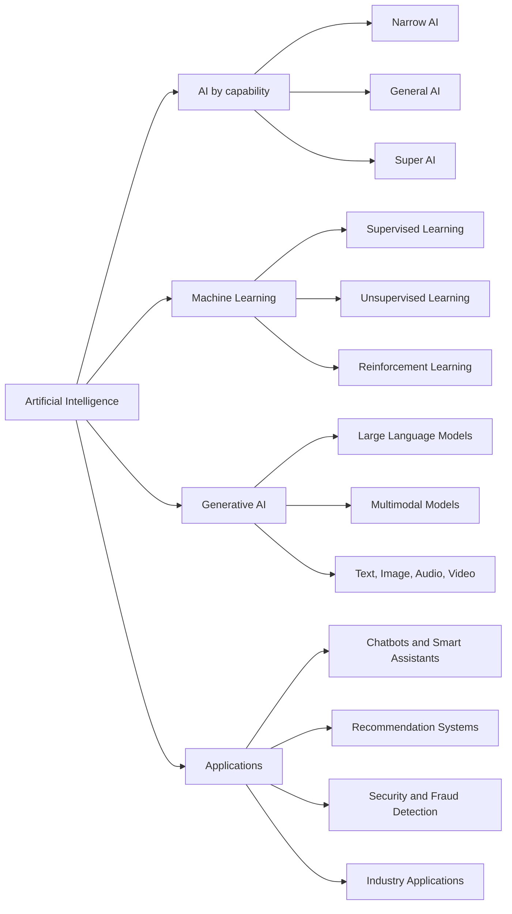

# Introduction and Applications of AI

## Table of Contents

- [Status](#status)
- [Learning Objectives](#learning-objectives)
- [Concept Map](#concept-map)
- [Core Concepts](#core-concepts)
- [Practical Application](#practical-application)
- [Labs and Activities](#labs-and-activities)
- [Quiz Review](#quiz-review)
- [Questions to Revisit](#questions-to-revisit)
- [Final Summary](#final-summary)

## Status

- [x] Complete
- [x] Reviewed

## Learning Objectives

1. Explain the fundamental concepts and applications of artificial intelligence (AI) in various
   domains.
2. Apply knowledge of generative AI to identify its practical use cases across industries.
3. Classify AI systems into narrow, general, and superintelligent categories based on their
   capabilities.
4. Compare traditional AI and generative AI to understand their functional differences and
   evolution.
5. Identify and describe applications of AI that enhance everyday personal and professional tasks.
6. Explain the role of AI in enabling the functionality of chatbots and smart assistants.
7. Describe the definition, purpose, and functioning of a chatbot in digital interactions.
8. Identify how AI is applied across various industries to improve processes and decision-making.
9. Explain common use cases of AI and machine learning in routine personal and commercial
   activities.
10. Demonstrate the ability to use generative AI tools to generate relevant outputs from input
    prompts.

## Concept Map

AI is the broad field. Machine learning provides ways for systems to learn from data, while
generative AI focuses on producing new content. AI applications range from narrow task-specific
systems to conversational assistants, recommendation systems, security tools, and industry-specific
solutions.

## Core Concepts

### Artificial Intelligence and Augmented Intelligence

#### Definition

Artificial intelligence refers to computer systems capable of performing tasks associated with human
intelligence, including reasoning, problem-solving, interpreting information, understanding
language, recognizing patterns, and making predictions.

The course also emphasizes AI as **augmented intelligence**: technology that can extend human
capabilities rather than simply replace people.

#### In my own words

AI gives software the ability to perform tasks that would normally require some form of human
intelligence. Augmented intelligence specifically focuses on using those capabilities to help humans
work more effectively while preserving human judgment.

#### Why it matters

- AI can automate or support complex tasks.
- Augmented intelligence can improve human decision-making.
- Human oversight remains important when decisions have significant consequences.

#### Example

A loan officer can use an AI system to analyze financial data and identify risk patterns while
retaining responsibility for the final lending decision.

#### Common mistake

AI and augmented intelligence should not automatically be treated as synonyms. AI is the broader
field, while augmented intelligence describes an approach in which AI enhances human capabilities.

### AI Types Based on Capability

#### Definition

AI can be classified according to the breadth of tasks it can perform:

- **Artificial Narrow Intelligence (ANI):** Designed for specific tasks or domains.
- **Artificial General Intelligence (AGI):** Hypothetical AI capable of performing diverse and
  unrelated intellectual tasks with broad adaptability.
- **Artificial Superintelligence (ASI):** Hypothetical AI that would surpass human intelligence
  across essentially all domains.

#### In my own words

Narrow AI specializes. General AI would adapt across many unrelated tasks. Super AI would exceed
human intellectual capability.

#### Why it matters

- It prevents overstating what today's AI systems can do.
- It provides a vocabulary for discussing future AI development.
- It distinguishes current systems from hypothetical forms of AI.

#### Example

A productivity assistant that only manages reminders and calendar events is Narrow AI because its
capabilities are limited to a specific domain.

#### Common mistake

A sophisticated generative AI system is not automatically AGI. Broad conversational ability does not
by itself demonstrate general human-level intelligence.

### Generative AI

#### Definition

Generative AI is a type of AI that learns patterns from data and generates new content such as text,
images, audio, video, and other digital outputs.

Large language models (LLMs) are neural-network-based models designed to process and generate
language.

#### In my own words

Traditional AI often focuses on analyzing existing information, while generative AI can use learned
patterns to produce something new in response to an instruction or prompt.

#### Why it matters

- It enables rapid content creation.
- It supports conversational interfaces.
- It can assist with creative, analytical, and professional tasks.
- It can augment existing datasets with synthetic data.

#### Example

ChatGPT can generate text, image-generation models can create visual content, and generative audio
tools can produce speech or music.

#### Common mistake

Generated content is not automatically correct or reliable. Output quality depends on the model,
prompt, context, and underlying data.

### Traditional AI and the Evolution Toward Generative AI

#### Definition

Earlier AI systems often relied on explicitly programmed rules. Machine learning enabled systems to
learn patterns from data, deep learning expanded the complexity of those learned representations,
and modern generative models use large neural networks and large datasets to generate new outputs.

#### In my own words

The progression can be summarized as:

`Hand-written rules -> Machine learning -> Deep learning -> Large generative models`

#### Why it matters

Understanding this evolution explains why modern AI systems can handle more flexible tasks than
traditional rule-based software.

#### Example

A traditional rule-based chatbot follows predefined conversation paths, while a generative AI
chatbot can produce context-dependent responses dynamically.

#### Common mistake

Generative AI did not replace all traditional AI. Predictive, classification, recommendation,
optimization, and rule-based systems remain useful for many tasks.

### AI Chatbots and Smart Assistants

#### Definition

AI chatbots and smart assistants are software systems designed to understand user requests, provide
information, generate responses, and sometimes perform actions.

#### In my own words

A chatbot creates a conversational interface between a person and software. Modern AI allows these
conversations to become more flexible, contextual, personalized, and natural.

#### Why it matters

Benefits can include:

- 24/7 availability
- Scalability
- Personalized interactions
- Natural-language communication
- Multilingual support
- Automation of repetitive requests

#### Example

AI chatbots can support customer service, e-commerce, healthcare, education, HR, and IT support.

#### Common mistake

Not every chatbot uses generative AI. Some chatbots still rely primarily on rules or predefined
responses.

### AI in Everyday Life and Industry

#### Definition

AI is integrated into consumer products, digital platforms, business processes, and industrial
systems to automate tasks, recognize patterns, personalize experiences, and support decisions.

#### In my own words

Many people already interact with AI without consciously thinking about it because it is embedded in
services they use every day.

#### Why it matters

Examples include:

- Recommendation systems
- Smart-home automation
- Virtual assistants
- Biometric authentication
- Fraud detection
- Image recognition
- Predictive analytics
- Customer engagement

#### Example

Industry applications include:

- **Manufacturing:** Robotics and defect detection with image recognition
- **Healthcare:** Medical imaging and predictive analytics
- **Finance:** Customer service and investment analysis
- **Retail:** Recommendations, inventory management, marketing, and automated stores

#### Common mistake

AI is not limited to chatbots or generative AI. Many important AI applications analyze, classify,
predict, recommend, or optimize rather than generate content.

### Multimodal AI

#### Definition

A multimodal AI model can process and combine multiple forms of information, such as text, images,
and audio.

#### In my own words

Instead of being restricted to one data format, a multimodal system can reason across several types
of input within the same task.

#### Why it matters

Real-world information rarely exists in only one format.

#### Example

An AI system could analyze interview transcripts, photographs, and audio recordings and use them
together to generate a report.

#### Common mistake

Multimodal means working with multiple data modalities; it does not simply mean producing several
different types of output.

## Practical Application

### Nawa Cocoa Cooperative: Augmented Intelligence in Cooperative Work

The Nawa Cocoa Cooperative is a fictional organization near Soubré. Member producers deliver cocoa
lots while field agents, quality technicians, warehouse staff, and an operations manager maintain
field, intake, quality, and traceability records.

- **Narrow AI:** classifies field reports and flags incomplete lot records.
- **Generative AI:** drafts a producer notice or summarizes collection and warehouse information.
- **Multimodal AI:** helps interpret a lot label, bean photo, or document image for human review.
- **Augmented intelligence:** presents evidence and recommendations while cooperative staff retain
  the decision.
- **Continuity:** the application records essential events locally and synchronizes pending updates
  after connectivity returns.

The assistant does not diagnose crop disease, reject a lot, assign a quality grade, determine a
producer payment, or submit an official certificate.

## Labs and Activities

### AI Assistant-User Conversations

- Practiced interacting with a **financial AI advisor**.
- Practiced interacting with a **health AI assistant**.
- Observed how conversational systems can respond to domain-specific user requests.
- Reinforced the importance of human oversight when AI is used in sensitive areas.

### Generative AI Tools in Action

#### Google Gemini

- Used generative AI to learn a new game.
- Used it to help create a blog post about the revival of board games.

#### ChatGPT

- Practiced text summarization.
- Used conversational prompting to plan a weekend trip.

#### Microsoft Copilot

- Used generative AI to develop the plot of a fictional story.

### Main lesson from the labs

The usefulness of generative AI depends heavily on the clarity of the request, the context supplied
to the system, and human evaluation of the generated response.

## Quiz Review

### Key takeaways

- **General or strong AI** refers to hypothetical AI capable of performing diverse and unrelated
  tasks.
- AI involves capabilities such as logical reasoning, problem-solving, sensory interpretation, and
  language understanding.
- Generative AI uses learned patterns from large datasets and deep-learning techniques to generate
  new data or content.
- **Recommendation systems** analyze user and behavioral data to provide personalized suggestions.
- **Image recognition** can be used in manufacturing to identify product defects.
- A task-specific productivity assistant is an example of **Narrow AI**.
- Smart-home systems can learn user patterns to automate settings such as lighting and temperature.
- LLMs enable conversational applications to generate context-sensitive responses.
- **Electronic Health Records (EHRs)** can provide historical clinical information for predictive
  healthcare applications.
- **Multimodal models** can process multiple forms of input such as text, images, and audio.
- Poorly curated or unrepresentative data can reduce the quality and relevance of generative AI
  outputs.

### Course-specific details

- The course identifies Amazon Titan as an Amazon large language model.
- AIVA is presented as a generative AI tool for music composition.
- In the course's comparison with traditional analytics workflows, prompting and tuning are
  presented as mechanisms for adapting general-purpose LLMs to specific business contexts.

## Questions to Revisit

- What are the major technical challenges companies face when deploying AI chatbots in
  customer-facing roles?
- Where should the boundary between autonomous AI decision-making and human oversight be placed in
  high-stakes applications?
- What practical criteria should be used to determine whether an AI system is genuinely augmenting
  human intelligence rather than merely automating a task?

## Final Summary

Artificial intelligence enables computer systems to perform tasks associated with human
intelligence, including reasoning, language understanding, pattern recognition, prediction, and
problem-solving. Most AI available today is Narrow AI, while General AI and Super AI remain
hypothetical concepts. Machine learning allows AI systems to learn patterns from data, and
generative AI extends these capabilities by generating new text, images, audio, video, and other
content.

AI already affects everyday life through recommendation systems, smart assistants, smart-home
devices, biometric authentication, fraud detection, and generative AI tools. In industry, it
supports applications ranging from manufacturing quality control and healthcare analytics to
financial services and retail personalization.

Generative AI and LLMs have made conversational systems substantially more flexible by enabling
context-aware content generation. However, their outputs still depend on the quality of their
training data, prompts, context, and human oversight. The most useful perspective is therefore not
simply to view AI as a replacement for human capability, but also as a technology that can augment
people by helping them analyze information, generate ideas, automate routine work, and make
better-informed decisions.
