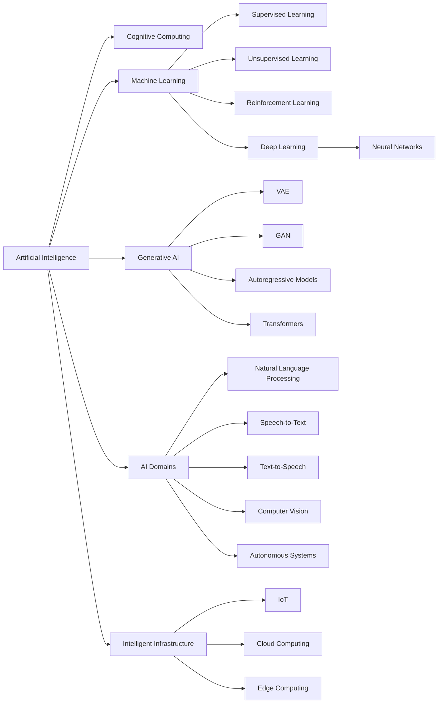

# AI Concepts, Terminology, and Application Domains

## Table of Contents

- [Status](#status)
- [Learning Objectives](#learning-objectives)
- [Concept Map](#concept-map)
- [Core Concepts](#core-concepts)
- [Practical Application](#practical-application)
- [Labs and Activities](#labs-and-activities)
- [Quiz Review](#quiz-review)
- [Questions to Revisit](#questions-to-revisit)
- [Final Summary](#final-summary)

## Status

- [x] Complete
- [x] Reviewed

## Learning Objectives

1. Explain how cognitive computing systems simulate human thought processes to enhance
   decision-making in complex scenarios.
2. Define key AI terminologies, such as machine learning, deep learning, and neural networks, and
   describe their interrelationships.
3. Summarize the fundamental principles of machine learning and distinguish between supervised,
   unsupervised, and reinforcement learning.
4. Apply appropriate machine learning techniques to a given dataset by selecting suitable algorithms
   and training methods based on data characteristics.
5. Describe the structure and function of deep learning models, emphasizing the role of multiple
   neural network layers in feature extraction and pattern recognition.
6. Explain the components and operation of a basic neural network, including neurons, weights,
   biases, activation functions, and the learning process.
7. Compare and contrast machine learning and deep learning approaches in terms of data requirements,
   feature engineering, and computational complexity.
8. Explain the concept of generative AI models and their ability to produce new content by learning
   patterns from existing data.
9. Describe the architecture and capabilities of large language models in processing and generating
   human-like text.
10. Analyze real-world applications of AI in daily life, evaluating their impact on efficiency and
    decision-making.
11. Differentiate between machine learning, deep learning, and foundation models, highlighting their
    unique characteristics and use cases.
12. Explain how AI techniques are applied in natural language processing, speech recognition, and
    computer vision to interpret and generate human-like interactions.
13. Define natural language processing and describe its role in enabling machines to understand and
    respond to human language.
14. Analyze the integration of AI technologies in autonomous vehicles, focusing on how machine
    learning and sensor data contribute to navigation and safety.
15. Describe how AI, cloud computing, edge computing, and the Internet of Things (IoT) work together
    to create scalable and responsive applications.

## Concept Map

Machine learning is a subset of AI that learns from data. Deep learning is a machine learning
approach based on multilayer neural networks. Generative AI uses architectures such as VAEs, GANs,
autoregressive models, and Transformers to generate new content. AI techniques are then applied
through domains such as NLP, speech, computer vision, autonomous systems, and connected IoT
environments.

## Core Concepts

### Cognitive Computing

#### Definition

Cognitive computing refers to technology designed to mimic aspects of human cognitive processes such
as thinking, reasoning, learning, and problem-solving.

#### In my own words

Cognitive computing attempts to help computers process complex information in ways that resemble how
people analyze situations and reach conclusions.

#### Why it matters

- It can support decision-making in complex environments.
- It can identify patterns that may be difficult for humans to detect manually.
- It can augment human analysis rather than simply automate fixed rules.

#### Example

A banking system can analyze transactions and help identify patterns associated with possible fraud.

#### Common mistake

Cognitive computing does not mean that a computer literally thinks like a human. It models selected
cognitive capabilities computationally.

### Machine Learning

#### Definition

Machine learning is a subset of AI in which algorithms learn patterns from data and use those
patterns to make predictions, classifications, or decisions without every rule being explicitly
programmed.

#### In my own words

Instead of specifying every possible rule, developers provide data and a learning process so the
system can discover useful patterns.

#### Why it matters

Machine learning enables AI systems to adapt to data and solve problems that would be difficult to
express entirely through hand-written rules.

#### Example

A recommendation system can learn from historical user behavior to suggest products or content.

#### Common mistake

Machine learning is not synonymous with AI. It is one major approach within the broader field of
artificial intelligence.

### Types of Machine Learning

#### Supervised Learning

Supervised learning trains a model using labeled examples.

Typical applications include:

- **Regression:** Predicting continuous numerical values.
- **Classification:** Assigning inputs to discrete categories.

The model learns the relationship between known inputs and known outputs and applies that
relationship to new data.

#### Unsupervised Learning

Unsupervised learning works with unlabeled data and attempts to discover structure or patterns
within it.

Common applications include:

- Clustering similar data points
- Detecting anomalies
- Discovering hidden groupings

#### Reinforcement Learning

Reinforcement learning trains an agent through interaction with an environment.

The agent receives:

- Rewards for desirable actions
- Penalties for undesirable actions

Its objective is to learn behavior that maximizes cumulative rewards.

#### Example

A self-driving system learning to stay within lanes by receiving rewards and penalties illustrates
reinforcement learning.

#### Common mistake

The three approaches differ mainly in the type of feedback available to the learning process; they
should not be treated as interchangeable training techniques.

### Training, Validation, and Test Data

#### Definition

A machine learning dataset is commonly divided into separate subsets:

- **Training set:** Used to train the model.
- **Validation set:** Used to evaluate and tune the model during development.
- **Test set:** Used to evaluate final model performance on data not used for training.

#### In my own words

The model should not be evaluated only on the same data it learned from. Separate data helps
determine whether it can generalize to new examples.

#### Why it matters

This separation reduces the risk of mistaking memorization of training data for genuine model
performance.

### Neural Networks

#### Definition

A neural network is a computational model composed of interconnected processing units called neurons
or nodes.

A basic neural network contains:

1. An input layer
2. One or more hidden layers
3. An output layer

The course introduces neural-network families including:

- Perceptrons
- Feed-forward networks
- Deep feed-forward networks
- Modular networks
- Convolutional neural networks
- Recurrent neural networks

#### In my own words

A neural network passes information through connected layers, progressively transforming the input
until it produces an output.

#### Example

A deep feed-forward neural network can identify complex relationships in structured data for tasks
such as recommendations, fraud detection, and classification.

#### Common mistake

A neural network is a mathematical computational model inspired by biological neural systems; it is
not a literal artificial brain.

### Deep Learning

#### Definition

Deep learning is a specialized form of machine learning that uses neural networks with multiple
layers to learn complex patterns and representations from data.

#### In my own words

Deep learning allows a model to learn useful features automatically through multiple processing
layers instead of relying as heavily on humans to manually define those features.

#### Why it matters

Deep learning is particularly effective with complex and high-dimensional data.

Applications introduced in the course include:

- Image captioning
- Voice recognition
- Facial recognition
- Medical imaging
- Language translation
- Driverless vehicles

#### Example

Deep learning can analyze large image datasets and automatically identify relevant visual patterns
that previously required manual feature selection.

#### Common mistake

Deep learning and machine learning are not separate fields at the same level. Deep learning is a
subset of machine learning.

### Convolutional Neural Networks

#### Definition

A convolutional neural network (CNN) processes information through multiple layers, with convolution
operations applied successively to representations produced by earlier layers.

#### Example

CNNs are widely associated with image-processing and computer-vision tasks.

### Generative AI Model Architectures

Generative AI can be implemented using several model architectures.

#### Variational Autoencoders

A variational autoencoder (VAE) contains:

- **Encoder:** Converts input into a latent representation.
- **Latent space:** Captures important characteristics of the data.
- **Decoder:** Generates output from the latent representation.

#### Generative Adversarial Networks

A generative adversarial network (GAN) contains two competing components:

- **Generator:** Creates new samples.
- **Discriminator:** Evaluates generated samples and distinguishes them from real data.

#### Autoregressive Models

Autoregressive models generate data sequentially while taking previously generated context into
account.

#### Transformers

Transformers are architectures capable of processing relationships within sequences and are widely
used for language generation and translation.

#### Why it matters

Different architectures provide different approaches to learning and generating data.

### Foundation Models and Large Language Models

#### Foundation Models

Foundation models are large models trained on broad amounts of mostly unstructured data and designed
to serve as a reusable base for many downstream tasks.

Instead of training a completely separate model for every application, a foundation model can be
adapted to different purposes.

Two important adaptation approaches introduced in the course are:

- **Prompting:** Giving the model instructions or examples through its input without changing the
  model itself.
- **Tuning:** Updating or adapting the model so it performs a particular task more effectively.

#### Large Language Models

Large language models (LLMs) are foundation models specialized in processing and generating
language.

At a basic level, an LLM learns statistical patterns in language and predicts likely continuations
based on preceding context.

Because LLMs are trained on very large datasets, they can support many language tasks, including:

- Question answering
- Text generation
- Classification
- Sentiment analysis
- Translation
- Summarization
- Creative writing

#### Advantages of Foundation Models

- Broad reusable capabilities
- Strong performance across multiple tasks
- Reduced need for large labeled datasets for every new task
- Faster adaptation through prompting or tuning

#### Limitations

- High computational cost
- Expensive training and inference
- Possible bias or harmful material inherited from training data
- Limited transparency regarding training data
- Trustworthiness and reliability concerns

#### Relationship Between the Main Concepts

The hierarchy can be summarized as:

`AI -> Machine Learning -> Deep Learning -> Foundation Models -> Large Language Models`

Generative AI describes systems designed to generate new content. Many modern generative AI systems
are built using foundation models, and LLMs are one important type of foundation model.

#### Common mistake

An LLM is not synonymous with generative AI. LLMs focus primarily on language, while generative AI
also includes image, audio, video, scientific, and other generative models.

### Unimodal and Multimodal Models

The course distinguishes AI models according to the modalities of information they process.

- **Unimodal systems** operate within a single type of data modality.
- **Multimodal systems** work across multiple forms of information, such as text, images, audio, or
  other data types.

Multimodal capabilities allow AI applications to combine information that would otherwise need to be
processed independently.

### Natural Language Processing

#### Definition

Natural language processing (NLP) is an AI domain that enables computers to process, interpret, and
generate human language.

It uses machine learning and deep learning techniques to analyze aspects of language such as:

- Grammar
- Relationships between words
- Structure
- Semantic meaning
- Context

#### In my own words

NLP provides the bridge between human language and computational systems.

#### Example

Chatbots, translation systems, text classification, and language-generation systems rely on NLP
capabilities.

### Speech Technologies

#### Speech-to-Text

Speech-to-text (STT) converts spoken language into written text.

#### Text-to-Speech

Text-to-speech (TTS) converts written text into spoken audio.

#### Example

A virtual assistant that reads a typed weather request aloud uses text-to-speech technology to
generate the spoken response.

### Computer Vision

#### Definition

Computer vision enables machines to analyze images and videos, identify meaningful information, and
use that information to support decisions.

#### Applications

Examples include:

- Facial recognition
- Medical imaging
- Manufacturing inspection
- Autonomous navigation

### AI in Autonomous Systems

Autonomous systems combine AI with sensor information and machine learning to perceive their
environment, make decisions, and perform actions with reduced direct human control.

Examples include:

- Self-driving vehicles
- Drones
- Intelligent transportation systems

These systems can potentially improve transportation and logistics while introducing issues
involving safety, cybersecurity, regulation, privacy, accountability, and human oversight.

### IoT, Cloud Computing, and Edge Computing

#### Internet of Things

The Internet of Things (IoT) consists of physical devices connected to networks that collect and
exchange data.

#### Cloud Computing

Cloud computing provides computing resources, storage, applications, and services over a network
such as the internet.

#### Edge Computing

Edge computing processes data closer to where that data is generated rather than sending everything
to a centralized data center first.

#### How they work together

Combining AI, IoT, cloud computing, and edge computing enables intelligent applications that can
collect data, process it, make decisions, and respond in near real time.

Applications introduced in the course include:

- Smart traffic lights
- Smart public transportation
- Smart agriculture
- Smart buildings

## Practical Application

### Intelligent Traffic Management in Abidjan

- **Situation:** Urban traffic systems generate continuous information from cameras, connected
  sensors, vehicles, and traffic infrastructure.
- **Action:** IoT devices can collect data, edge computing can process time-sensitive information
  close to intersections, cloud infrastructure can support larger-scale storage and analysis, and AI
  can identify traffic patterns and support adaptive traffic-control decisions.
- **Result:** A system built on these technologies could potentially respond more quickly to
  changing traffic conditions and support more efficient transportation management.

This example illustrates that a real-world AI application often depends on an entire technical
ecosystem rather than an AI model alone.

## Labs and Activities

### AI Integration in Everyday Life

Reviewed how AI powers familiar intelligent systems:

- Smart assistants
- Smart thermostats
- Recommendation systems
- Facial recognition systems
- ChatGPT
- Fraud detection systems

The activity reinforced that different applications may use different AI techniques even though they
are all described broadly as AI systems.

### AI Trivia Activity

Reviewed how different intelligent systems connect to machine learning, deep learning, generative
AI, and other AI concepts.

### AI-Driven Autonomous Systems

Explored the potential societal effects of:

- Self-driving vehicles
- Drones
- Autonomous transportation
- AI-assisted electric vehicles

The activity highlighted potential benefits such as improved efficiency and safety while also
identifying concerns involving regulation, cybersecurity, privacy, employment, responsibility, and
human oversight.

## Quiz Review

### Key takeaways

- Cognitive computing can assist with tasks such as detecting fraudulent banking transactions.
- General AI describes hypothetical systems capable of adapting across many unrelated tasks.
- CNNs process information through successive convolutional layers.
- Deep learning is a specialized subset of machine learning based on multilayer neural networks.
- Deep feed-forward networks can learn complex layered patterns in structured data.
- In a GAN, the **generator** produces samples while the **discriminator** attempts to distinguish
  generated samples from real data.
- IoT devices collect and transmit data that can be analyzed for patterns and anomalies.
- Reinforcement learning improves behavior through interaction, rewards, and penalties.
- Deep learning reduces the amount of manual feature engineering required for many complex datasets.
- TTS converts written text into generated speech.

## Questions to Revisit

- Which supervised-learning technique should be used to assign predefined sentiment labels such as
  positive, neutral, or negative?
- Why is edge computing particularly suitable when sensor data requires low-latency processing and
  reduced network congestion?
- Which neural-network component introduces the nonlinearity required to learn complex
  relationships?
- What are the precise distinctions between traditional machine learning models, deep learning
  models, and foundation models?
- How should the capabilities of unimodal and multimodal models be described consistently across
  different AI architectures?

## Final Summary

Machine learning is a subset of artificial intelligence that enables systems to learn patterns from
data rather than depending entirely on explicitly programmed rules. Its main learning approaches are
supervised learning, unsupervised learning, and reinforcement learning. Reliable machine learning
development also requires separating data into training, validation, and test sets so that models
can be trained, tuned, and evaluated appropriately.

Deep learning is a specialized form of machine learning based on multilayer neural networks. These
networks can automatically learn complex representations from data and are used in areas such as
image recognition, speech processing, medical imaging, language translation, recommendation systems,
and autonomous vehicles.

Generative AI extends these capabilities through architectures such as VAEs, GANs, autoregressive
models, and Transformers. These architectures make it possible to generate new data and content,
while multimodal systems extend AI across multiple forms of information.

AI is also applied through major domains such as natural language processing, speech technologies,
and computer vision. In real-world intelligent systems, AI often works together with IoT devices,
cloud computing, and edge computing. This combination enables connected systems to collect
information, process it at appropriate locations, analyze patterns, and respond intelligently in
applications such as transportation, agriculture, buildings, and autonomous systems.
