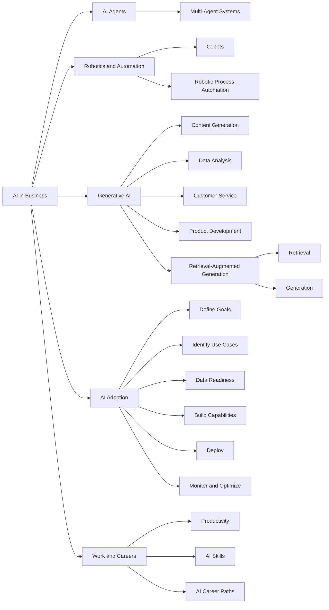

# Business and Career Transformation Through AI

## Table of Contents

- [Status](#status)
- [Learning Objectives](#learning-objectives)
- [Concept Map](#concept-map)
- [Core Concepts](#core-concepts)
- [Practical Application](#practical-application)
- [Labs and Activities](#labs-and-activities)
- [Quiz Review](#quiz-review)
- [Questions to Revisit](#questions-to-revisit)
- [Final Summary](#final-summary)

## Status

- [x] Complete
- [x] Reviewed

## Learning Objectives

1. Explain the role of AI agents in automating tasks and enhancing decision-making processes within
   various business contexts.
2. Describe the characteristics and functionalities of AI agents.
3. Summarize how robotics and automation integrate with AI technologies to improve efficiency and
   productivity in industrial and commercial applications.
4. Analyze how AI technologies can be applied to transform business operations, enhance customer
   experiences, and drive innovation across various industries.
5. Explain the emergence of generative AI technologies and their potential impact on content
   creation, product development, and business strategy.
6. Apply generative AI tools in a simulated business scenario to identify opportunities for
   innovation and process improvement.
7. Describe how individuals can leverage generative AI to create value in their professional roles
   by enhancing creativity, efficiency, and problem-solving capabilities.
8. Explain the concept of retrieval-augmented generation (RAG) and how it combines information
   retrieval with generative models to produce more accurate and contextually relevant outputs.
9. Develop a strategic plan for integrating AI technologies into business operations, considering
   factors such as readiness, resource allocation, and potential challenges.
10. Identify and describe various frameworks that guide organizations in effectively adopting and
    implementing AI solutions.
11. Compare and contrast the AI adoption strategies employed by Amazon, OpenAI, and Facebook,
    highlighting key approaches and lessons learned.

## Concept Map



AI can transform organizations through autonomous agents, robotics, automation, generative AI, and
data-driven decision support. Successful adoption requires more than choosing a model: organizations
must define business goals, prepare data, build workforce capabilities, deploy solutions, and
continuously monitor them.

## Core Concepts

### AI Agents

#### Definition

AI agents are software programs that interact with an environment, collect and process information,
make decisions, and perform tasks autonomously in pursuit of human-defined goals.

#### In my own words

An AI agent does more than produce a response. It observes what is happening, decides what action is
appropriate, acts, and may adapt based on new information or experience.

#### Main characteristics

The course identifies four important agent characteristics:

- **Social ability:** Communicating and cooperating with people or other agents.
- **Autonomy:** Acting and making decisions with limited direct human intervention.
- **Reactiveness:** Responding to changes in the environment.
- **Proactiveness:** Taking initiative to pursue goals.

#### Example

A self-driving vehicle gathers information from cameras and radar, interprets its surroundings,
decides how to respond, controls the vehicle, and can improve its behavior through machine learning.

#### Common mistake

An AI agent is not simply another name for a chatbot. Agents are defined by their ability to
interact with an environment and act toward goals.

### Multi-Agent Systems

#### Definition

A multi-agent system contains multiple autonomous agents that interact or cooperate to achieve
individual and shared objectives.

#### Why it matters

Multi-agent systems support:

- Distributed problem-solving
- Coordinated decision-making
- Resource management
- Complex simulations
- Collaboration between autonomous systems

#### Examples

The course discusses:

- Buyer and seller agents in online marketplaces
- Robot teams in warehouse or search-and-rescue work
- Autonomous vehicles coordinating in traffic-management systems

### Robotics, Cobots, and Automation

#### Robotics

Robotics involves designing, constructing, and operating machines that can perform physical tasks
with or without direct human involvement.

#### Collaborative Robots

Cobots are robots specifically designed to work alongside humans.

They use sensors and AI capabilities to coordinate tasks that require human-machine collaboration.

#### Robotic Process Automation

Robotic process automation (RPA) automates repetitive digital tasks through software-based virtual
robots.

#### Why it matters

Robotics and automation can increase productivity by shifting repetitive or highly structured work
away from employees and allowing people to focus on more creative, analytical, or strategic tasks.

### AI for Business Transformation

#### Definition

AI can transform business operations by automating work, analyzing large volumes of data,
identifying patterns, improving predictions, personalizing experiences, and supporting innovation.

#### Major business benefits

The module emphasizes:

- Increased operational efficiency
- Faster data analysis
- Improved decision-making
- Better customer service
- Reduced repetitive work
- Enhanced innovation
- More personalized customer experiences

#### Example

AI can analyze historical demand to help a supply-chain manager predict which products may sell
quickly and reduce both stockouts and excess inventory.

#### Common mistake

AI adoption should begin with a business problem or objective, not simply with the desire to use AI
technology.

### Generative AI for Business

#### Definition

Generative AI allows organizations to create or transform content and information based on patterns
learned from existing data.

#### Major areas of contribution

##### Content Generation

Generative AI can analyze existing material and audience information to support the creation of new
content.

##### Data Analysis

Generative AI can help analyze complex datasets and produce understandable reports or insights.

##### Customer Service

Generative AI can support fast and personalized responses to customer requests.

##### Product Development

Generative AI can generate multiple design alternatives, helping teams iterate and prototype more
quickly.

#### Example

A marketing team can use generative AI to analyze customer information and suggest promotional
language intended to improve engagement.

### Retrieval-Augmented Generation

#### Definition

Retrieval-augmented generation (RAG) combines information retrieval with a generative model so that
generated responses can use relevant information retrieved from an external source.

#### Core process

```text
Question -> Retrieval -> Relevant Information -> Generation -> Response
```

The source distinguishes two main components:

- **Retrieval component:** Finds relevant information.
- **Generation component:** Uses the retrieved information together with the request to generate a
  response.

#### Why it matters

RAG is intended to provide a generative model with additional context instead of relying exclusively
on what the model learned during training.

This can help produce responses that are more relevant to a particular information source or
business context.

#### Example

A business could connect an LLM to its own documents so that responses are generated using
information retrieved from those documents.

#### Common mistake

RAG does not mean retraining the underlying model every time business information changes. Retrieval
supplies relevant external context at response time.

### AI Adoption in Business

The course presents a general sequence for adopting AI:

1. **Define business goals:** Identify the problems to solve and establish clear objectives.
2. **Identify suitable use cases:** Determine where AI can create practical value.
3. **Prepare the data:** Collect, clean, organize, and validate relevant data.
4. **Build AI capabilities:** Develop infrastructure and upskill employees.
5. **Deploy AI solutions:** Integrate AI into existing workflows and systems.
6. **Monitor and optimize:** Track performance and improve the system over time.

#### Why it matters

An AI initiative depends on organizational readiness, suitable data, employee capability,
integration, and ongoing management—not only model quality.

### AI Adoption Frameworks

The course compares AI implementation approaches associated with Amazon, OpenAI, and Facebook.

#### Amazon AI Services Framework

1. Data preparation
2. Model development
3. Deployment
4. Optimization

#### OpenAI Framework

1. Data preparation
2. Model development
3. Model deployment
4. Continuous improvement

#### Facebook AI Integration Framework

1. Data integration
2. AI model development
3. AI model deployment
4. Continuous improvement

#### Main comparison

Although the terminology differs, the three approaches share a similar lifecycle:

`Prepare data -> Develop the model/system -> Deploy -> Improve`

The main lesson is that AI implementation is iterative rather than a one-time deployment.

### AI in the Workplace

AI tools can help professionals perform repetitive, analytical, communication, and creative work
more efficiently.

Examples introduced in the module include:

- **ChatGPT and Gemini:** General generative AI applications
- **Copy.ai, Jasper, and Synthesia:** Marketing and content creation
- **Grammarly and QuillBot:** Writing and communication
- **Duolingo, Google Translate, and Babel:** Language learning and translation
- **Zendesk and LivePerson:** Customer-service assistance
- **Tableau and Power BI:** Data analysis and visualization
- **GitHub Copilot:** Software-development assistance
- **Todoist, Microsoft To Do, and Evernote:** Task management

#### Main principle

AI can augment professional capabilities by reducing repetitive work and helping employees focus on
higher-value tasks.

### Human and AI Decision-Making

AI can process large amounts of information rapidly and support predictions or recommendations, but
this does not mean every decision should be delegated to AI.

The appropriate division of responsibility depends on the consequences of the decision, the quality
of available data, the reliability of the system, and the need for human judgment.

This distinction reinforces the concept of augmented intelligence: AI can enhance human capabilities
while people remain responsible for important judgments.

### AI Careers and Workforce Transformation

Professionals entering AI-related work do not all need the same technical background.

The module recommends:

1. Identify existing transferable skills.
2. Learn core AI concepts.
3. Apply those skills through practical work.
4. Stay current with developments.
5. Specialize progressively.

Examples of AI-related roles include:

- **AI ethicist:** Focuses on ethical and societal implications.
- **AI product manager:** Oversees development of AI-enabled products.
- **AI strategist:** Aligns AI initiatives with long-term business goals.
- **AI marketing specialist:** Uses AI to analyze customers and optimize marketing.

#### Generative AI literacy

As organizations adopt generative AI, employees need more than basic familiarity with AI tools. They
need the ability to apply them effectively within their professional domain and understand where
human review remains necessary.

### Generative AI Literacy and the Workforce Skills Gap

Organizations increasingly need employees who can use generative AI effectively, but the supply of
workers with practical generative AI literacy has not kept pace with adoption.

The gap exists partly because generative AI is evolving faster than many educational programs,
corporate training systems, and job roles can adapt.

Generative AI literacy involves more than knowing how to open a chatbot. Employees need to
understand:

- How to write effective prompts
- How to evaluate and verify AI-generated output
- How to protect confidential and sensitive information
- When generative AI is appropriate for a task
- How to integrate AI into existing workflows
- How to combine AI capabilities with domain expertise
- When human judgment and review remain necessary

Organizations can address the skills gap by developing their existing workforce through:

- Role-specific AI training
- Hands-on workshops
- Approved AI tools and safe experimentation environments
- Prompt-engineering practice
- Responsible-AI and privacy education
- Real workplace projects
- Internal AI champions who support other employees

The goal is not simply to make employees AI-tool users, but to help them become capable of applying
generative AI responsibly and productively within their professional domains.

## Practical Application

### AI-Enhanced Operations for an Ivorian Business

- **Situation:** A growing business in Côte d'Ivoire manages customer inquiries, marketing content,
  inventory decisions, and administrative work manually.
- **Action:** Identify specific use cases before adopting AI. Generative AI can support marketing
  and customer communication, predictive techniques can support demand forecasting, and automation
  can reduce repetitive administrative work. Employees should be trained to use and supervise these
  systems.
- **Result:** The organization can potentially improve productivity and customer responsiveness
  while keeping human judgment involved in important business decisions.

This follows the module's adoption principle: start from business goals, prepare the organization
and its data, deploy appropriate AI solutions, then monitor and optimize them.

## Labs and Activities

### Generative AI for Business Transformation

#### Marketing and Technology Trends

Practiced using generative AI in a business-oriented marketing scenario and explored how AI can
support idea generation and analysis.

#### AI-Driven Dynamic Pricing

Explored a business scenario involving the application of AI to pricing decisions.

#### Main lesson

Generative AI creates the most value when applied to a clearly defined business objective rather
than used without a specific purpose.

### Using Generative AI for Your Work

#### Resume and Cover-Letter Work

- Generated a resume template.
- Adapted resume content to a job description.
- Generated supporting cover-letter content.

#### Email Drafting

Practiced using generative AI to draft and refine professional email communication.

#### Skills Development

Explored ways generative AI can support learning and professional skill development.

#### Main lesson

Generative AI can augment professional productivity across communication, career development,
learning, and knowledge work, but generated output should still be reviewed and adapted by the user.

## Quiz Review

### Key takeaways

- AI agents interact with their environments and act autonomously toward human-defined goals.
- Sensors allow robots to collect real-time information about their surroundings.
- Cobots are designed to collaborate with humans.
- AI can forecast product demand to reduce stockouts and excess inventory.
- Generative AI can produce multiple design alternatives and accelerate prototyping.
- Computer vision is widely used for manufacturing tasks such as quality control and defect
  detection.
- Effective AI adoption includes defining problems, preparing data, and upskilling employees.
- Generative AI can personalize marketing and customer-service communication.
- Zendesk and LivePerson are presented as AI-assisted customer-service tools.
- Grammarly and QuillBot support writing and communication work.
- An AI strategist aligns AI initiatives with long-term organizational goals.

## Questions to Revisit

- What criteria should determine when a business decision can be automated and when human approval
  should remain mandatory?
- How should RAG systems measure whether retrieved information is genuinely relevant to a user's
  question?
- How do the Amazon, OpenAI, and Facebook adoption frameworks differ beyond their high-level
  lifecycle stages?
- Which organizational metrics best demonstrate that an AI implementation is creating business
  value?
- How should organizations measure generative AI literacy across different job roles?
- What combination of technical and domain knowledge is most valuable for my own transition from
  full-stack software development into AI engineering?

## Final Summary

AI can transform businesses through agents, robotics, automation, data analysis, generative AI, and
intelligent decision support. AI agents interact with their environments and act toward defined
goals, while multi-agent systems coordinate several autonomous agents. Robotics, cobots, and RPA
extend automation across both physical and digital work.

For businesses, AI can increase efficiency, improve predictions, enhance customer service, support
innovation, and reduce repetitive work. Generative AI expands these capabilities through content
generation, data analysis, personalized communication, and rapid product-design iteration.
Retrieval-augmented generation further connects generative models with externally retrieved
information so responses can use context relevant to a particular task or organization.

Successful AI adoption requires more than acquiring technology. Organizations must define business
objectives, choose suitable use cases, prepare their data, build employee capabilities, integrate
solutions, and continuously monitor and improve them. The Amazon, OpenAI, and Facebook frameworks
presented in the course all reflect this iterative lifecycle.

AI is also changing individual work and career paths. Professionals can use AI tools to support
communication, analysis, software development, content creation, customer service, and learning. The
greatest value comes from combining AI capabilities with existing professional expertise and human
judgment rather than treating AI as a universal replacement for people.
