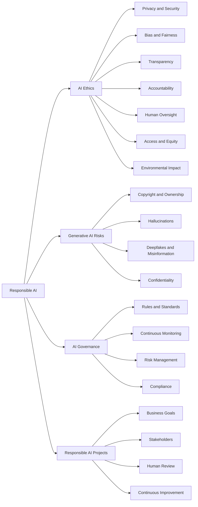

# Issues, Concerns, and Ethical Considerations

## Table of Contents

- [Status](#status)
- [Learning Objectives](#learning-objectives)
- [Concept Map](#concept-map)
- [Core Concepts](#core-concepts)
- [Practical Application](#practical-application)
- [Labs and Activities](#labs-and-activities)
- [Quiz Review](#quiz-review)
- [Questions to Revisit](#questions-to-revisit)
- [Final Summary](#final-summary)

## Status

- [x] Complete
- [x] Reviewed

## Learning Objectives

1. Explain key ethical principles in AI, such as fairness, transparency, and accountability, and how
   they guide responsible AI development and deployment.
2. Identify ethical challenges specific to generative AI, including content authenticity, bias, and
   misuse, and discuss strategies to address them.
3. Describe the reasons behind hallucinations in large language models and their implications for AI
   reliability and user trust.
4. Explain the role of AI governance frameworks in ensuring ethical compliance and mitigating risks
   associated with AI technologies.
5. Apply principles of responsible AI use to workplace scenarios, evaluating decisions for ethical
   alignment and potential impacts.
6. Develop a plan to integrate ethical considerations into AI project workflows, including
   stakeholder engagement and continuous monitoring.
7. Design a generative AI-driven solution to transform a specific organizational function by
   analyzing current challenges and aligning AI capabilities with business goals.

## Concept Map

Responsible AI requires more than model performance. Ethical AI systems must consider privacy,
fairness, transparency, accountability, human oversight, accessibility, and broader societal impacts
throughout their lifecycle.

## Core Concepts

### AI Ethics and Responsible Use

#### Definition

AI ethics refers to principles, practices, and guidelines intended to ensure that AI systems are
developed, deployed, and used in ways that are fair, beneficial, responsible, and respectful of
human rights and societal values.

#### In my own words

Responsible AI means asking not only whether an AI system can perform a task, but also whether it
should perform it, who could be affected, what risks exist, and who remains accountable for the
outcome.

#### Why it matters

AI systems can influence important areas such as:

- Employment
- Finance
- Healthcare
- Education
- Transportation
- Law enforcement
- Access to services

Poorly designed systems can reproduce or amplify existing problems at scale.

#### Common mistake

Technical accuracy alone does not make an AI system ethical.

### Data Privacy and Security

#### Definition

AI systems frequently rely on large datasets that can contain personal, confidential, or otherwise
sensitive information.

Responsible use requires protecting that information against:

- Unauthorized access
- Data breaches
- Misuse
- Inappropriate collection
- Unnecessary disclosure

#### In my own words

The fact that data can improve an AI system does not automatically mean an organization has the
right to collect or use it.

#### Example

The course discusses facial-recognition systems that collected images without clear user consent as
an example of the privacy concerns AI can create.

#### Common mistake

Removing a person's name from a dataset does not automatically eliminate all privacy risks.

### Bias and Fairness

#### Definition

Bias can occur when an AI system learns or reproduces patterns that unfairly disadvantage particular
individuals or groups.

#### Causes discussed in the course

- Biased historical data
- Non-representative datasets
- Human-generated data containing hidden biases
- Poorly designed evaluation processes

#### Responsible practices

- Use diverse and representative datasets.
- Test outcomes across relevant groups.
- Monitor deployed systems for biased behavior.
- Correct unfair patterns when identified.

#### Example

The course discusses an AI recruiting system that learned gender-related bias from historical hiring
data.

#### Common mistake

AI is not automatically objective simply because its decisions are produced by an algorithm.

### Transparency and Accountability

#### Transparency

Transparency means providing meaningful information about how an AI system works, what information
it uses, and how its outputs or decisions are produced.

#### Accountability

Accountability means establishing who is responsible for:

- AI decisions
- Errors
- Harm
- Monitoring
- Corrective action

#### Why it matters

People affected by important AI-supported decisions need to understand the basis of those decisions
and know where responsibility lies.

#### Example

In healthcare, doctors and patients should be able to understand relevant aspects of an AI-supported
diagnosis rather than blindly trusting an unexplained output.

### Human Oversight

#### Definition

Human oversight means keeping people meaningfully involved in the operation, review, or approval of
AI-supported decisions.

#### In my own words

The more serious the consequences of an AI decision, the stronger the case for retaining human
judgment and intervention.

#### High-stakes examples

- Healthcare
- Transportation
- Finance
- Military applications
- Employment decisions

#### Common mistake

Autonomy does not eliminate organizational or human responsibility.

### Access and Equity

#### Definition

Access and equity concern whether different groups have meaningful opportunities to benefit from AI
technologies.

#### Why it matters

Unequal access to:

- Digital infrastructure
- AI tools
- Education
- Connectivity
- Technical skills

can cause AI to widen existing social and economic inequalities.

#### Example

An educational AI initiative aimed at underserved communities should ensure that students can
actually access and use the technology regardless of socioeconomic circumstances.

### Environmental Impact

Large AI systems can require significant computational resources and energy.

Responsible AI development can therefore include:

- More efficient algorithms
- Efficient hardware
- Reduced unnecessary computation
- Renewable energy use in infrastructure

Environmental responsibility is part of evaluating the broader impact of AI systems.

### Generative AI-Specific Concerns

Generative AI introduces additional ethical and operational concerns because it can create realistic
new content at scale.

Important areas include:

- Copyright and ownership
- Privacy and confidentiality
- Hallucinations
- Deepfakes
- Misinformation
- Bias
- Misuse
- Computational cost

### Copyright and Content Ownership

#### Definition

Generative AI creates new content based on patterns learned from existing information, raising
questions about intellectual property, ownership, attribution, and permitted use.

#### In my own words

AI-generated content creates difficult questions about who owns the result and whether the data used
to produce it was legally or ethically obtained.

#### Common mistake

AI-generated content should not automatically be assumed to be free of copyright or licensing
concerns.

### Hallucinations

#### Definition

A hallucination occurs when a generative AI model produces information that appears plausible but is
inaccurate, unsupported, or fabricated.

#### Why it matters

Hallucinations can undermine:

- Reliability
- User trust
- Decision-making
- Legal or professional work
- Published information

#### Example

The course describes a legal case in which fabricated judicial references generated by ChatGPT were
submitted without adequate verification.

#### Types of Hallucination

The course identifies several forms of hallucination:

- **Sentence contradiction:** The model contradicts something it previously stated.
- **Prompt contradiction:** The response conflicts with the user's instructions or requested
  context.
- **Factual error:** The model presents incorrect information as fact.
- **Nonsensical or irrelevant output:** The model introduces information that does not logically
  belong in the response.

#### Why Hallucinations Happen

Several factors can contribute to hallucinations:

- **Training-data quality:** Large datasets can contain errors, inconsistencies, biases, or
  unreliable information.
- **Incomplete knowledge:** Training data cannot contain every fact or cover every possible future
  question.
- **Generation strategy:** Techniques used to select output tokens involve trade-offs between
  creativity, fluency, and factual precision.
- **Insufficient context:** Ambiguous, incomplete, or contradictory prompts can lead the model
  toward an incorrect interpretation.
- **Probabilistic generation:** LLMs generate likely continuations rather than directly retrieving
  guaranteed facts from a database.

#### Mitigation

The course emphasizes:

- Verifying generated information
- Fact-checking important claims
- Giving clear and specific prompts
- Supplying sufficient context
- Improving data quality
- Using relevant organizational information
- Implementing validation processes
- Maintaining human review
- Using examples or multi-shot prompting when useful
- Reducing randomness for tasks where factual consistency matters

#### Common mistake

Fluent or confident language is not evidence that an AI-generated statement is true.

### Deepfakes and Misinformation

#### Definition

Deepfakes are synthetic or manipulated images, audio, or video designed to appear authentic.

#### Risks

They can potentially be used for:

- False information
- Impersonation
- Fraud
- Harassment
- Blackmail
- Fake identity documents
- Manipulation

#### Why it matters

As synthetic media becomes more realistic, determining authenticity becomes increasingly important.

### Private and Confidential AI Use

The course introduces private AI environments as one approach organizations can use when working
with sensitive business information.

The main principle is that organizations should avoid exposing confidential data unnecessarily and
should combine technical safeguards with legal and organizational policies.

### Perspectives on Responsible AI

The course compares responsible-AI approaches from several organizations.

#### IBM

The course presents IBM's pillars of trust as:

- Explainability
- Fairness
- Robustness
- Transparency
- Privacy

#### Microsoft

The course highlights practices including:

- Human-in-the-loop systems
- Continuous monitoring
- Audits
- Internal review
- Responsible AI standards

#### Google

The course emphasizes principles related to:

- Social benefit
- Fairness
- Accountability
- Scientific excellence

#### Main lesson

Organizations may express responsible-AI principles differently, but recurring themes include
fairness, transparency, accountability, reliability, privacy, and ongoing monitoring.

### AI Governance

#### Definition

AI governance refers to the rules, standards, processes, responsibilities, and controls used to
ensure that AI systems are developed and operated responsibly.

#### In my own words

AI ethics defines important principles; governance turns those principles into organizational
processes and controls.

#### Why it matters

Without governance, responsible-AI principles can remain abstract intentions rather than operational
requirements.

#### Governance activities can include

- Risk assessment
- Documentation
- Human-review requirements
- Model evaluation
- Monitoring
- Auditing
- Compliance checks
- Incident management

### Major AI Governance Risks

#### Bias

Models may reproduce hidden bias present in human-generated or historical data.

#### Privacy and Copyright

Training or operational data can expose private or copyrighted information.

#### Lack of Transparency

Highly complex or black-box systems can make decisions difficult to understand or explain.

#### Model Deterioration

A model's performance can decline when real-world conditions or incoming data change over time.

#### Premature Deployment

Deploying AI before adequate validation can create:

- Reputational risk
- Financial risk
- Operational failures
- Harm to users

### Continuous Monitoring

AI governance continues after deployment.

Organizations should monitor systems to detect:

- Performance deterioration
- Changes in input data
- Unexpected outputs
- Bias
- Reliability issues
- New risks

#### Main principle

Responsible AI is a continuous lifecycle rather than a one-time compliance exercise.

### Implementing AI Ethics in Practice

Responsible-AI principles need to be converted into concrete design and operational practices.

#### Establish Ethical Guidelines

The course proposes starting with explicit principles such as:

1. AI should support people rather than unnecessarily displace human judgment.
2. Data ownership and user rights should be respected.
3. AI systems should be transparent and explainable enough for their context of use.

#### Dichotomy Mapping

Dichotomy mapping is presented as a design-thinking activity for examining an AI solution from both
positive and negative perspectives.

For each feature, consider:

- What benefit is the feature intended to provide?
- Who benefits?
- Could the feature cause harm?
- Is personal data being used appropriately?
- Is the system secure?
- Are people with different abilities and backgrounds included?

#### Establish Guardrails

Guardrails are explicit constraints that define what an AI system or organization should and should
not do.

An example could be:

> Customer data must not be sold to advertisers.

Guardrails turn broad ethical intentions into enforceable operational boundaries.

#### Evaluate Data and Bias

Training and operational data should be evaluated for diversity and representativeness.

The course mentions tools such as **IBM AI Fairness 360** as examples of software that can help
identify and mitigate bias in machine learning systems.

Other tools and controls can address:

- Privacy
- Model uncertainty
- Security
- Fairness
- Explainability

#### Main principle

Ethics should be integrated into AI design from the beginning rather than evaluated only after
deployment.

### Regulation and Risk Frameworks

The course introduces examples of external AI governance mechanisms including:

- NIST AI Risk Management Framework
- EU AI Act

The main lesson is that organizations increasingly need to align internal AI governance with
applicable standards, regulations, and legal requirements.

## Practical Application

### Nawa Cocoa Cooperative: Responsible AI for Traceability and Quality Support

The cooperative’s data may include member identities, farm locations, field observations, lot
weights, quality results, and payment records. Their use creates privacy, security, fairness, and
accountability risks.

- Collect only data needed for a defined purpose and restrict access by role.
- Test whether alerts work consistently across farm sizes, locations, seasons, and record quality.
- Show the source records behind a recommendation in language staff and members can question.
- Log corrections, monitor recurring errors, and provide a manual process when the assistant is
  unavailable.
- Keep generated notices separate from official certificates and verified inspection results.

The assistant may organize evidence, but authorized people accept lots, assign grades, approve
payments, and submit official documents. Consequential decisions require human review and a clearly
accountable person.

## Labs and Activities

### Responsible Use of AI at Work

The activity applied AI ethics to workplace situations and emphasized evaluating AI use according
to:

- Fairness
- Privacy
- Transparency
- Accountability
- Human oversight
- Potential impact on stakeholders

#### Main lesson

Responsible AI decisions require looking beyond immediate productivity gains and considering who
could be affected by the technology.

### Final Project: Transforming Organizational Functions with Generative AI

The final project applied generative AI to several organizational functions.

#### Transforming Business Functions

Analyzed how generative AI capabilities could address existing business challenges.

#### Personalizing Customer Experience

Explored how generative AI could support more personalized customer interactions.

#### Supplier Performance Analysis

Considered how AI could help analyze supplier information and support business decisions.

#### Demand Prediction

Explored the use of AI to anticipate demand and improve planning.

#### Improving Customer Support

Applied generative AI to customer-service scenarios.

#### Main lesson

AI solutions should begin with a clearly defined organizational problem and connect AI capabilities
to specific business goals while considering responsible use and human oversight.

## Quiz Review

### Key takeaways

- **Access and equity** address whether people have fair opportunities to benefit from AI.
- Responsible AI requires attention to privacy, confidentiality, transparency, accountability,
  fairness, and societal impact.
- Generative AI deployment introduces concerns involving regulation, data privacy, computational
  requirements, and interpretability.
- Deep learning uses multilayer neural networks to learn complex patterns from large datasets.
- AI can analyze consumer behavior to support targeted marketing.
- NLP engineers specialize in systems that process and interpret human language.
- Transparency and accountability are especially important when people need to understand
  consequential AI-supported decisions.
- AI-generated information should be validated and fact-checked to reduce hallucination risks.
- Intellectual-property rights around AI-generated content remain a complex area.
- Cognitive computing involves capabilities such as perception, learning, and reasoning.
- More labeled examples can improve supervised-learning performance by providing more information
  from which to learn patterns.
- CNNs use convolutional layers to detect spatial patterns in images.
- AI-powered robots can improve manufacturing efficiency, reduce downtime, and support consistent
  production quality.

## Questions to Revisit

- What technical mechanisms cause LLM hallucinations?
- Which hallucination-mitigation techniques are most effective for production generative AI
  applications?
- How should organizations determine the appropriate level of human oversight for different AI risk
  levels?
- How can fairness be measured quantitatively across different demographic groups?
- How should AI systems be audited after deployment?
- What practical governance controls should be implemented when building RAG systems and AI agents?
- How do AI governance requirements differ between Côte d'Ivoire, the EU, and other jurisdictions
  relevant to an international software product?
- How should intellectual-property and licensing risks be evaluated when using generative AI in
  commercial software?

## Final Summary

Artificial intelligence can provide major benefits, but those benefits come with ethical,
operational, and societal responsibilities. Responsible AI requires attention to data privacy and
security, bias and fairness, transparency, accountability, human oversight, equitable access, and
environmental impact.

Generative AI introduces additional concerns because it can create realistic new content at scale.
Important risks include hallucinations, deepfakes, misinformation, privacy breaches, copyright
uncertainty, and misuse. AI-generated information should therefore be treated as output requiring
appropriate evaluation rather than assumed to be correct simply because it appears convincing.

AI governance converts ethical principles into operational practices. Governance includes
establishing responsibilities, evaluating risks, documenting systems, monitoring performance,
auditing outcomes, complying with applicable rules, and responding when problems occur. Continuous
monitoring is essential because AI systems and the environments in which they operate can change
over time.

The central lesson is that responsible AI cannot be separated from AI engineering. Ethical
considerations should be incorporated throughout the lifecycle of an AI system—from defining the
problem and selecting data through development, deployment, monitoring, and eventual improvement or
retirement.
