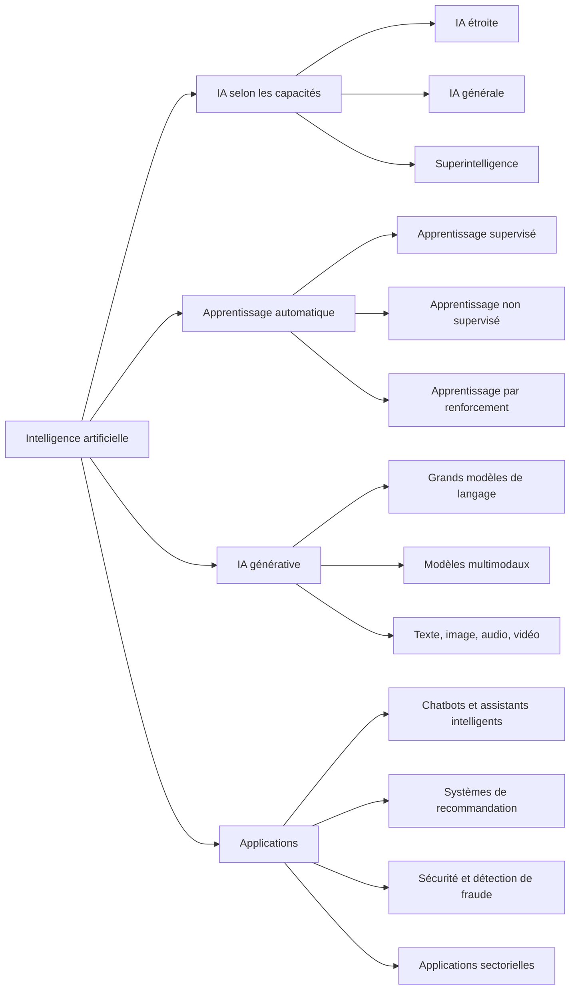

# Introduction et applications de l’IA

## Table des matières

- [Statut](#statut)
- [Objectifs d’apprentissage](#objectifs-dapprentissage)
- [Carte conceptuelle](#carte-conceptuelle)
- [Concepts clés](#concepts-clés)
- [Application pratique](#application-pratique)
- [Travaux pratiques et activités](#travaux-pratiques-et-activités)
- [Révision du quiz](#révision-du-quiz)
- [Questions à revoir](#questions-à-revoir)
- [Synthèse finale](#synthèse-finale)

## Statut

- [x] Adaptation française rédigée à partir des notes canoniques anglaises.
- [ ] Révision personnelle de l’adaptation terminée.

La réussite du cours est documentée séparément dans le registre des certificats.

## Objectifs d’apprentissage

1. Expliquer les concepts fondamentaux et les applications de l’intelligence artificielle (IA) dans différents domaines.
2. Utiliser les connaissances sur l’IA générative pour identifier ses applications pratiques dans plusieurs secteurs.
3. Classer les systèmes d’IA en IA étroite, générale et superintelligente selon leurs capacités.
4. Comparer l’IA traditionnelle et l’IA générative pour comprendre leurs différences fonctionnelles et leur évolution.
5. Identifier et décrire les applications de l’IA qui facilitent les tâches personnelles et professionnelles quotidiennes.
6. Expliquer comment l’IA permet le fonctionnement des chatbots et des assistants intelligents.
7. Décrire la définition, le rôle et le fonctionnement d’un chatbot dans les interactions numériques.
8. Identifier les usages de l’IA qui améliorent les processus et les décisions dans différents secteurs.
9. Expliquer les usages courants de l’IA et de l’apprentissage automatique dans les activités personnelles et commerciales.
10. Utiliser des outils d’IA générative pour produire des résultats pertinents à partir de prompts.

## Carte conceptuelle

L’IA est le domaine général. L’apprentissage automatique permet aux systèmes d’apprendre à partir de données, tandis que l’IA générative produit de nouveaux contenus. Les applications vont des systèmes spécialisés aux assistants conversationnels, aux recommandations, aux outils de sécurité et aux solutions sectorielles.

## Concepts clés

### Intelligence artificielle et intelligence augmentée

#### Définition

L’intelligence artificielle désigne des systèmes informatiques capables d’effectuer des tâches associées à l’intelligence humaine : raisonnement, résolution de problèmes, interprétation d’informations, compréhension du langage, reconnaissance de motifs et prédiction.

Le cours insiste également sur l’**intelligence augmentée** : une technologie qui étend les capacités humaines au lieu de simplement remplacer les personnes.

#### Avec mes propres mots

L’IA donne au logiciel la capacité d’exécuter des tâches qui demanderaient habituellement une forme d’intelligence humaine. L’intelligence augmentée utilise ces capacités pour aider les personnes à travailler plus efficacement en préservant leur jugement.

#### Pourquoi c’est important

- L’IA peut automatiser des tâches complexes ou en faciliter l’exécution.
- L’intelligence augmentée peut améliorer les décisions humaines.
- Une supervision humaine reste importante lorsque les décisions ont des conséquences significatives.

#### Exemple

Un chargé de crédit utilise l’IA pour analyser des données financières et détecter des profils de risque, tout en restant responsable de la décision finale d’accorder le prêt.

#### Erreur fréquente

IA et intelligence augmentée ne sont pas automatiquement synonymes. L’IA est le domaine général ; l’intelligence augmentée décrit une approche où l’IA renforce les capacités humaines.

### Types d’IA selon les capacités

#### Définition

On peut classer l’IA selon l’étendue des tâches qu’elle peut effectuer :

- **Intelligence artificielle étroite (ANI) :** conçue pour des tâches ou des domaines précis.
- **Intelligence artificielle générale (AGI) :** forme hypothétique capable d’effectuer des tâches intellectuelles diverses et sans lien entre elles, avec une grande adaptabilité.
- **Superintelligence artificielle (ASI) :** forme hypothétique qui dépasserait l’intelligence humaine dans pratiquement tous les domaines.

#### Avec mes propres mots

L’IA étroite se spécialise. L’IA générale s’adapterait à de nombreuses tâches sans rapport entre elles. La superintelligence dépasserait les capacités intellectuelles humaines.

#### Pourquoi c’est important

- Éviter de surestimer les capacités des systèmes actuels.
- Disposer d’un vocabulaire pour discuter des évolutions futures.
- Distinguer les systèmes existants des formes hypothétiques d’IA.

#### Exemple

Un assistant de productivité qui gère uniquement des rappels et des événements de calendrier relève de l’IA étroite, car ses capacités se limitent à un domaine précis.

#### Erreur fréquente

Un système d’IA générative sophistiqué n’est pas automatiquement une AGI. Une grande aisance conversationnelle ne démontre pas, à elle seule, une intelligence générale de niveau humain.

### IA générative

#### Définition

L’IA générative apprend des motifs dans les données et produit de nouveaux contenus : texte, images, audio, vidéo et autres résultats numériques.

Les grands modèles de langage, ou LLM, reposent sur des réseaux de neurones et sont conçus pour traiter et générer du langage.

#### Avec mes propres mots

L’IA traditionnelle analyse souvent des informations existantes. L’IA générative peut utiliser les motifs appris pour produire quelque chose de nouveau en réponse à une instruction ou à un prompt.

#### Pourquoi c’est important

- Accélérer la création de contenus.
- Permettre des interfaces conversationnelles.
- Aider aux tâches créatives, analytiques et professionnelles.
- Enrichir des jeux de données avec des données synthétiques.

#### Exemple

ChatGPT peut produire du texte ; des modèles de génération d’images créent des visuels ; des outils audio génératifs produisent de la parole ou de la musique.

#### Erreur fréquente

Un contenu généré n’est pas automatiquement exact ou fiable. Sa qualité dépend du modèle, du prompt, du contexte et des données sous-jacentes.

### De l’IA traditionnelle à l’IA générative

#### Définition

Les premiers systèmes reposaient souvent sur des règles explicitement programmées. L’apprentissage automatique a permis d’apprendre des motifs à partir des données. L’apprentissage profond a accru la complexité de ces représentations. Les modèles génératifs modernes utilisent de grands réseaux de neurones et de vastes jeux de données pour produire de nouveaux résultats.

#### Avec mes propres mots

La progression se résume ainsi :

`Règles écrites à la main -> Apprentissage automatique -> Apprentissage profond -> Grands modèles génératifs`

#### Pourquoi c’est important

Cette évolution explique pourquoi l’IA moderne peut traiter des tâches plus flexibles que les logiciels traditionnels à base de règles.

#### Exemple

Un chatbot à base de règles suit des parcours prédéfinis. Un chatbot génératif produit dynamiquement des réponses adaptées au contexte.

#### Erreur fréquente

L’IA générative n’a pas remplacé toutes les autres formes d’IA. Prédiction, classification, recommandation, optimisation et systèmes à règles restent utiles.

### Chatbots et assistants intelligents

#### Définition

Les chatbots et assistants intelligents sont des logiciels qui comprennent des demandes, fournissent des informations, génèrent des réponses et peuvent parfois effectuer des actions.

#### Avec mes propres mots

Un chatbot crée une interface conversationnelle entre une personne et un logiciel. L’IA moderne rend ces échanges plus flexibles, contextuels, personnalisés et naturels.

#### Pourquoi c’est important

Les bénéfices possibles comprennent :

- Une disponibilité permanente, 24 heures sur 24 et 7 jours sur 7.
- La capacité à traiter un volume croissant de demandes.
- Des interactions personnalisées.
- La communication en langage naturel.
- La prise en charge de plusieurs langues.
- L’automatisation des demandes répétitives.

#### Exemple

Les chatbots peuvent intervenir dans le service client, le commerce électronique, la santé, l’éducation, les ressources humaines et l’assistance informatique.

#### Erreur fréquente

Tous les chatbots n’utilisent pas l’IA générative. Certains reposent principalement sur des règles ou des réponses prédéfinies.

### L’IA au quotidien et dans les secteurs d’activité

#### Définition

L’IA est intégrée aux produits grand public, plateformes numériques, processus métiers et systèmes industriels pour automatiser des tâches, reconnaître des motifs, personnaliser des expériences et aider à décider.

#### Avec mes propres mots

Beaucoup de personnes utilisent déjà l’IA sans y penser, parce qu’elle est intégrée aux services du quotidien.

#### Pourquoi c’est important

Exemples :

- Systèmes de recommandation.
- Domotique.
- Assistants virtuels.
- Authentification biométrique.
- Détection de fraude.
- Reconnaissance d’images.
- Analyse prédictive.
- Relation client.

#### Exemple

Applications sectorielles :

- **Industrie manufacturière :** robotique et détection de défauts par reconnaissance d’images.
- **Santé :** imagerie médicale et analyse prédictive.
- **Finance :** service client et analyse d’investissements.
- **Commerce de détail :** recommandations, stocks, marketing et magasins automatisés.

#### Erreur fréquente

L’IA ne se limite pas aux chatbots et à la génération. De nombreuses applications analysent, classent, prédisent, recommandent ou optimisent.

### IA multimodale

#### Définition

Un modèle multimodal traite et combine plusieurs formes d’information, comme le texte, les images et l’audio.

#### Avec mes propres mots

Au lieu de se limiter à un format, le système exploite plusieurs types d’entrées dans une même tâche.

#### Pourquoi c’est important

Les informations du monde réel existent rarement dans un seul format.

#### Exemple

Un système pourrait analyser des transcriptions d’entretiens, des photographies et des enregistrements audio, puis les combiner pour produire un rapport.

#### Erreur fréquente

Multimodal signifie travailler avec plusieurs modalités de données, pas simplement produire plusieurs types de résultats.

## Application pratique

### Coopérative Cacao Nawa : intelligence augmentée dans le travail coopératif

La Coopérative Cacao Nawa est une organisation fictive située près de Soubré. Les producteurs
membres livrent des lots de cacao, tandis que les agents de terrain, techniciens qualité,
magasiniers et responsables des opérations tiennent les données de terrain, de réception, de
qualité et de traçabilité.

- **IA étroite :** classer les rapports de terrain et signaler les dossiers de lot incomplets.
- **IA générative :** rédiger un avis destiné aux producteurs ou résumer les informations de
  collecte et d’entrepôt.
- **IA multimodale :** aider à interpréter une étiquette de lot, une photo de fèves ou un document
  pour validation humaine.
- **Intelligence augmentée :** présenter éléments et recommandations tout en laissant la décision
  au personnel de la coopérative.
- **Continuité :** enregistrer les événements essentiels localement puis synchroniser les mises à
  jour en attente au retour de la connexion.

L’assistant ne diagnostique pas une maladie, ne rejette pas un lot, n’attribue pas de grade qualité,
ne détermine pas le paiement d’un producteur et ne soumet pas de certificat officiel.

## Travaux pratiques et activités

### Conversations avec des assistants IA

- Échanges avec un **conseiller financier IA**.
- Échanges avec un **assistant de santé IA**.
- Observation des réponses à des demandes propres à un domaine.
- Rappel de l’importance de la supervision humaine dans les usages sensibles.

### Outils d’IA générative en action

#### Google Gemini

- Utilisation pour apprendre un nouveau jeu.
- Aide à la rédaction d’un article de blog sur le retour des jeux de société.

#### ChatGPT

- Pratique du résumé de texte.
- Planification d’un voyage de fin de semaine avec des prompts conversationnels.

#### Microsoft Copilot

- Développement de l’intrigue d’une histoire fictive.

### Principal enseignement des travaux pratiques

L’utilité de l’IA générative dépend fortement de la clarté de la demande, du contexte fourni et de l’évaluation humaine de la réponse.

## Révision du quiz

### Points à retenir

- L’**IA générale ou forte** désigne une forme hypothétique capable de tâches diverses et sans lien entre elles.
- L’IA mobilise notamment le raisonnement logique, la résolution de problèmes, l’interprétation sensorielle et la compréhension du langage.
- L’IA générative utilise des motifs appris dans de vastes jeux de données et des techniques d’apprentissage profond pour produire des données ou contenus nouveaux.
- Les **systèmes de recommandation** analysent les données des utilisateurs et de leurs comportements pour personnaliser les suggestions.
- La **reconnaissance d’images** peut détecter des défauts de fabrication.
- Un assistant de productivité spécialisé relève de l’**IA étroite**.
- La domotique peut apprendre les habitudes pour automatiser l’éclairage et la température.
- Les LLM permettent de produire des réponses conversationnelles adaptées au contexte.
- Les **dossiers de santé électroniques (EHR)** peuvent fournir un historique clinique pour des applications prédictives.
- Les **modèles multimodaux** traitent notamment du texte, des images et de l’audio.
- Des données mal sélectionnées ou peu représentatives peuvent réduire la qualité et la pertinence des résultats génératifs.

### Précisions propres au cours

- Le cours présente Amazon Titan comme un grand modèle de langage d’Amazon.
- AIVA est présenté comme un outil de composition musicale générative.
- Dans la comparaison avec les processus analytiques traditionnels, le prompting et l’ajustement sont présentés comme des moyens d’adapter des LLM généralistes à des contextes métiers précis.

## Questions à revoir

- Quels sont les principaux défis techniques du déploiement de chatbots en relation client ?
- Où placer la limite entre décision autonome et supervision humaine dans les applications à forts enjeux ?
- Quels critères permettent de déterminer qu’un système augmente réellement l’intelligence humaine plutôt que de simplement automatiser une tâche ?

## Synthèse finale

L’IA permet aux systèmes informatiques d’effectuer des tâches associées à l’intelligence humaine : raisonnement, langage, reconnaissance de motifs, prédiction et résolution de problèmes. La plupart des systèmes actuels sont des IA étroites ; l’IA générale et la superintelligence restent hypothétiques. L’apprentissage automatique apprend des motifs dans les données ; l’IA générative utilise ces capacités pour produire du texte, des images, de l’audio, de la vidéo et d’autres contenus.

L’IA intervient déjà dans les recommandations, les assistants, la domotique, la biométrie et la détection de fraude. Dans les secteurs professionnels, ses usages vont du contrôle qualité et de l’analyse médicale aux services financiers et à la personnalisation commerciale.

L’IA générative et les LLM ont rendu les conversations plus flexibles grâce à la génération contextuelle. La qualité des données, des prompts, du contexte et de la supervision humaine reste déterminante. L’IA peut ainsi augmenter les capacités humaines : analyser l’information, produire des idées, automatiser les tâches courantes et prendre des décisions mieux informées.
