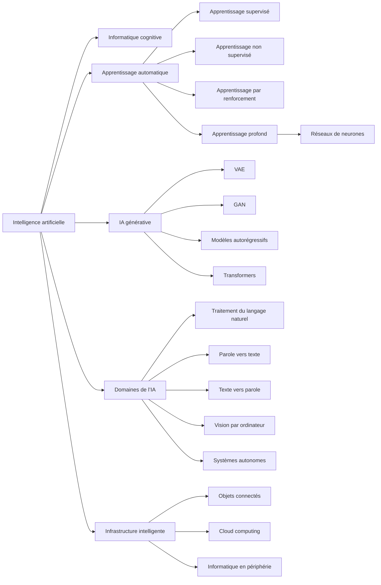

# Concepts, terminologie et domaines d’application de l’IA

## Table des matières

- [Statut](#statut)
- [Objectifs d’apprentissage](#objectifs-dapprentissage)
- [Carte conceptuelle](#carte-conceptuelle)
- [Concepts clés](#concepts-clés)
- [Application pratique](#application-pratique)
- [Travaux pratiques et activités](#travaux-pratiques-et-activités)
- [Révision du quiz](#révision-du-quiz)
- [Questions à revoir](#questions-à-revoir)
- [Synthèse finale](#synthèse-finale)

## Statut

- [x] Adaptation française rédigée à partir des notes canoniques anglaises.
- [ ] Révision personnelle de l’adaptation terminée.

La réussite du cours est documentée séparément dans le registre des certificats.

## Objectifs d’apprentissage

1. Expliquer comment l’informatique cognitive simule certaines capacités cognitives pour soutenir les décisions complexes.
2. Définir l’apprentissage automatique, l’apprentissage profond et les réseaux de neurones, ainsi que leurs relations.
3. Distinguer les apprentissages supervisé, non supervisé et par renforcement.
4. Choisir une technique d’apprentissage selon les données et la tâche.
5. Décrire le rôle des couches d’un réseau profond dans l’extraction de caractéristiques.
6. Expliquer les neurones, poids, biais, fonctions d’activation et mécanismes d’apprentissage.
7. Comparer apprentissage automatique et apprentissage profond selon les données, les caractéristiques et le coût de calcul.
8. Expliquer comment les modèles génératifs apprennent des régularités pour produire du contenu.
9. Décrire l’architecture et les capacités des grands modèles de langage.
10. Analyser les effets de l’IA quotidienne sur l’efficacité et les décisions.
11. Distinguer apprentissage automatique, apprentissage profond et modèles de fondation.
12. Relier l’IA au traitement du langage, à la reconnaissance vocale et à la vision par ordinateur.
13. Définir le traitement automatique du langage naturel.
14. Expliquer comment les véhicules autonomes combinent apprentissage et données de capteurs.
15. Décrire la complémentarité entre IA, cloud, informatique en périphérie et objets connectés.

## Carte conceptuelle

L’apprentissage automatique est une approche de l’IA fondée sur les données ; l’apprentissage profond utilise des réseaux multicouches. Les architectures génératives produisent du contenu. Ces techniques alimentent le langage, la parole, la vision, les systèmes autonomes et les environnements connectés.

## Concepts clés

### Informatique cognitive

L’informatique cognitive modélise certaines capacités humaines : raisonnement, apprentissage et résolution de problèmes. Elle aide à traiter des informations complexes, repérer des régularités et soutenir une décision. Une banque peut ainsi rechercher des indices de fraude parmi ses transactions.

Elle augmente l’analyse humaine ; elle ne signifie pas qu’un ordinateur pense littéralement comme une personne.

### Apprentissage automatique

L’apprentissage automatique est un sous-ensemble de l’IA dans lequel les algorithmes apprennent des régularités à partir de données pour prédire, classer ou décider. Au lieu de coder chaque règle, on fournit des données et une procédure d’apprentissage. Un système de recommandation peut exploiter l’historique des utilisateurs pour proposer des produits.

L’apprentissage automatique constitue une approche importante de l’IA, sans être synonyme de toute l’IA.

### Types d’apprentissage automatique

- **Supervisé :** apprentissage à partir d’exemples étiquetés. La régression prédit une valeur numérique continue ; la classification attribue une catégorie. Le modèle applique aux nouvelles données la relation apprise entre entrées et sorties connues.
- **Non supervisé :** recherche de structure dans des données sans étiquettes, notamment des groupes, des anomalies et des regroupements cachés.
- **Par renforcement :** un agent agit dans un environnement, reçoit des récompenses ou pénalités et apprend à maximiser la récompense cumulée. Un système apprenant à rester dans sa voie illustre ce mécanisme.

La distinction essentielle porte sur le retour disponible pendant l’apprentissage : ces techniques ne sont pas interchangeables.

### Données d’entraînement, de validation et de test

L’ensemble d’entraînement sert à apprendre ; celui de validation sert à évaluer et ajuster le modèle pendant le développement ; celui de test sert à mesurer les performances finales sur des données non utilisées pour l’entraînement. Cette séparation permet de distinguer mémorisation et généralisation.

### Réseaux de neurones

Un réseau de neurones est un modèle mathématique composé de nœuds reliés. Une couche d’entrée, une ou plusieurs couches cachées et une couche de sortie transforment progressivement l’information.

Le cours présente les perceptrons, réseaux à propagation avant, réseaux profonds à propagation avant, réseaux modulaires, réseaux convolutifs et réseaux récurrents. Un réseau profond à propagation avant peut détecter des relations complexes dans des données structurées, pour recommander, classer ou détecter une fraude. Il s’inspire des systèmes biologiques, sans constituer un cerveau artificiel littéral.

### Apprentissage profond

L’apprentissage profond utilise plusieurs couches de réseaux de neurones pour apprendre des représentations complexes. Les couches apprennent automatiquement des caractéristiques, réduisant certains besoins de conception manuelle.

Il convient notamment aux données complexes et de grande dimension : légendage d’images, reconnaissance vocale et faciale, imagerie médicale, traduction et véhicules sans conducteur. Il s’agit d’un sous-ensemble de l’apprentissage automatique, et non d’un domaine parallèle.

### Réseaux de neurones convolutifs

Un réseau convolutif, ou CNN, applique successivement des opérations de convolution aux représentations produites par les couches précédentes. Il est particulièrement associé au traitement d’images et à la vision par ordinateur.

### Architectures de l’IA générative

- **Autoencodeur variationnel, VAE :** l’encodeur transforme l’entrée en représentation latente ; l’espace latent capture des caractéristiques ; le décodeur génère une sortie à partir de cette représentation.
- **Réseau antagoniste génératif, GAN :** le générateur crée des échantillons tandis que le discriminateur tente de distinguer les données réelles des données générées.
- **Modèle autorégressif :** il génère une séquence en tenant compte du contexte déjà produit.
- **Transformer :** il modélise les relations au sein des séquences et sert notamment à la génération de texte et à la traduction.

Ces architectures offrent différentes façons d’apprendre et de générer des données.

### Modèles de fondation et grands modèles de langage

Les modèles de fondation sont entraînés sur de vastes corpus, souvent non structurés, et servent de base réutilisable à plusieurs tâches. Le **prompting** fournit des instructions ou exemples en entrée sans modifier le modèle ; le **tuning** adapte ou met à jour le modèle pour une tâche.

Les grands modèles de langage, ou LLM, se spécialisent dans le traitement et la génération du langage. Ils apprennent des régularités statistiques et prédisent des continuations à partir du contexte. Ils peuvent répondre à des questions, rédiger, classer, analyser des sentiments, traduire, résumer et soutenir l’écriture créative.

Leurs atouts sont la réutilisation, la polyvalence, le moindre besoin d’étiquettes propres à chaque tâche et l’adaptation rapide. Leurs limites incluent le coût de calcul, de formation et d’inférence, les biais ou contenus nuisibles hérités des données, le manque de transparence et les problèmes de fiabilité.

La chaîne pédagogique utilisée dans les notes anglaises est : `IA → apprentissage automatique → apprentissage profond → modèles de fondation → grands modèles de langage`. Elle situe les modèles de langage modernes dans ces familles. L’IA générative désigne la production de contenu ; elle comprend aussi des modèles d’image, d’audio, de vidéo ou scientifiques. Un LLM n’est donc pas synonyme de toute l’IA générative.

### Modèles unimodaux et multimodaux

Un modèle unimodal traite une seule modalité ; un modèle multimodal combine plusieurs formes d’information, par exemple texte, images et audio. Cette combinaison permet de relier des informations qui seraient autrement traitées séparément.

### Traitement automatique du langage naturel

Le traitement automatique du langage naturel, ou NLP, permet de traiter, interpréter et générer le langage humain. Il mobilise l’apprentissage automatique et profond pour analyser grammaire, relations entre mots, structure, sens et contexte. Les chatbots, traducteurs, classificateurs de texte et générateurs de langage l’utilisent.

### Technologies vocales

La reconnaissance **parole vers texte**, ou STT, transcrit la parole. La synthèse **texte vers parole**, ou TTS, produit une voix à partir d’un texte. Un assistant qui lit à voix haute la réponse à une demande météo utilise la synthèse vocale.

### Vision par ordinateur

La vision par ordinateur extrait des informations utiles des images et vidéos pour soutenir des décisions. Ses applications comprennent la reconnaissance faciale, l’imagerie médicale, l’inspection industrielle et la navigation autonome.

### IA et systèmes autonomes

Ces systèmes combinent IA, capteurs et apprentissage pour percevoir, décider et agir avec moins de contrôle humain direct. Véhicules autonomes, drones et transports intelligents illustrent ce domaine. Les bénéfices possibles pour les transports et la logistique s’accompagnent d’enjeux de sécurité, cybersécurité, réglementation, vie privée, responsabilité et supervision humaine.

### Objets connectés, cloud et informatique en périphérie

- **IoT :** objets physiques connectés qui collectent et échangent des données.
- **Cloud :** ressources de calcul, stockage, applications et services accessibles par réseau.
- **Edge computing :** traitement au plus près de la production des données, sans tout envoyer d’abord à un centre distant.

Combinées avec l’IA, ces technologies permettent de collecter, traiter, décider et réagir presque en temps réel. Le cours évoque feux de circulation, transports publics, agriculture et bâtiments intelligents.

## Application pratique

### Gestion intelligente de la circulation à Abidjan

- **Situation :** caméras, capteurs, véhicules et infrastructures produisent un flux continu de données.
- **Action :** l’IoT collecte ; le traitement en périphérie gère les informations urgentes aux intersections ; le cloud conserve et analyse à grande échelle ; l’IA repère les tendances et soutient l’adaptation des feux.
- **Résultat envisagé :** réponse plus rapide aux changements et gestion plus efficace des déplacements.

Cet exemple décrit une possibilité, pas un déploiement réalisé. Une application d’IA dépend d’un écosystème technique complet.

## Travaux pratiques et activités

### Intégration de l’IA dans la vie quotidienne

Les notes sources passent en revue assistants, thermostats, recommandations, reconnaissance faciale, ChatGPT et détection de fraude. Ces systèmes emploient des techniques différentes malgré l’étiquette commune « IA ».

### Activité de révision des notions d’IA

L’activité relie les systèmes intelligents à l’apprentissage automatique, à l’apprentissage profond et à l’IA générative.

### Systèmes autonomes fondés sur l’IA

L’exploration couvre véhicules sans conducteur, drones, transports autonomes et véhicules électriques assistés par IA. Elle met en balance efficacité et sécurité potentielles avec réglementation, cybersécurité, vie privée, emploi, responsabilité et supervision humaine.

## Révision du quiz

- L’informatique cognitive peut soutenir la détection de fraude bancaire.
- L’IA générale reste une notion de système capable de s’adapter à de nombreuses tâches différentes.
- Un CNN utilise des couches successives de convolution.
- L’apprentissage profond repose sur des réseaux multicouches ; la propagation avant peut apprendre des relations complexes dans les données structurées.
- Dans un GAN, le générateur produit et le discriminateur distingue réel et généré.
- Les objets connectés collectent et transmettent les données nécessaires à l’analyse de tendances et d’anomalies.
- Le renforcement apprend par interaction, récompenses et pénalités.
- L’apprentissage profond réduit certains besoins d’extraction manuelle de caractéristiques.
- TTS signifie conversion du texte en parole.

## Questions à revoir

- Quelle technique supervisée attribue des sentiments prédéfinis : positif, neutre ou négatif ?
- Pourquoi traiter les capteurs en périphérie lorsque latence et congestion réseau sont critiques ?
- Quel composant du réseau introduit la non-linéarité ?
- Quelles distinctions précises séparent modèles traditionnels, modèles profonds et modèles de fondation ?
- Comment décrire uniformément les capacités unimodales et multimodales des différentes architectures ?

## Synthèse finale

L’apprentissage automatique apprend des régularités plutôt que d’exécuter uniquement des règles codées. Le type de retour distingue apprentissage supervisé, non supervisé et par renforcement ; la séparation entraînement, validation et test sert à apprécier la généralisation.

Les réseaux profonds apprennent des représentations complexes. Les VAE, GAN, modèles autorégressifs et Transformers permettent différentes formes de génération, étendues à plusieurs modalités. Le langage, la parole, la vision et l’autonomie constituent des domaines d’application majeurs.

Dans les systèmes réels, IA, objets connectés, cloud et traitement en périphérie se complètent pour collecter, analyser et exploiter les données au bon endroit et au bon moment.
