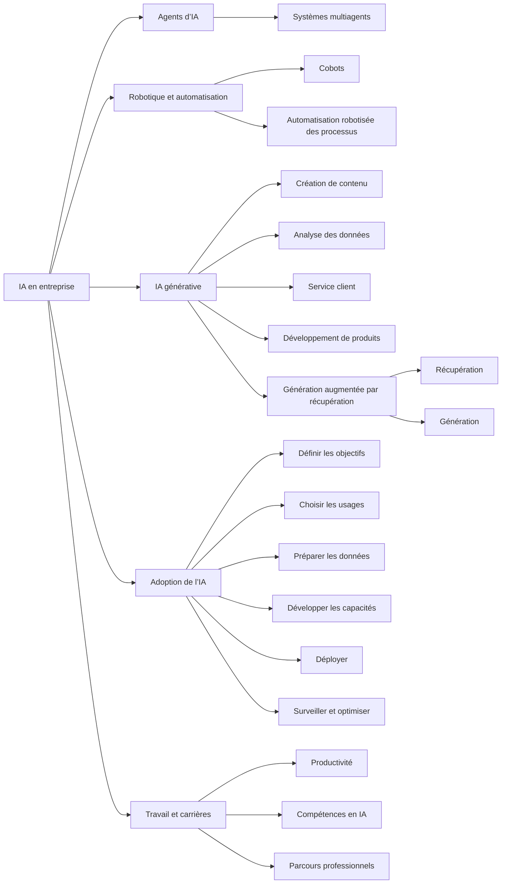

# Transformation des entreprises et des carrières par l’IA

## Table des matières

- [Statut](#statut)
- [Objectifs d’apprentissage](#objectifs-dapprentissage)
- [Carte conceptuelle](#carte-conceptuelle)
- [Concepts clés](#concepts-clés)
- [Application pratique](#application-pratique)
- [Travaux pratiques et activités](#travaux-pratiques-et-activités)
- [Révision du quiz](#révision-du-quiz)
- [Questions à revoir](#questions-à-revoir)
- [Synthèse finale](#synthèse-finale)

## Statut

- [x] Adaptation française rédigée à partir des notes canoniques anglaises.
- [ ] Révision personnelle de l’adaptation terminée.

La réussite du cours est documentée séparément dans le registre des certificats.

## Objectifs d’apprentissage

1. Expliquer le rôle des agents dans l’automatisation et l’aide à la décision.
2. Décrire les caractéristiques et les fonctions d’un agent d’IA.
3. Relier robotique, automatisation et gains de productivité.
4. Analyser la transformation des opérations, de l’expérience client et de l’innovation.
5. Expliquer les effets possibles de l’IA générative sur les contenus, produits et stratégies.
6. Appliquer des outils génératifs à un scénario d’entreprise simulé.
7. Identifier leur valeur pour la créativité, l’efficacité et la résolution de problèmes au travail.
8. Expliquer la génération augmentée par récupération, ou RAG.
9. Planifier une adoption selon la préparation, les ressources et les difficultés de l’organisation.
10. Identifier les cadres d’adoption présentés dans le cours.
11. Comparer les approches associées à Amazon, OpenAI et Facebook dans les supports étudiés.

## Carte conceptuelle



Les agents, la robotique, l’automatisation et la génération soutiennent la transformation des organisations. Leur adoption suppose des objectifs, des données adaptées, des compétences, une intégration et un suivi continu, au-delà du seul choix d’un modèle.

## Concepts clés

### Agents d’IA

Un agent est un programme qui interagit avec un environnement, traite des informations, décide et agit vers des objectifs définis par l’humain. Il observe, choisit une action, agit et peut s’adapter aux nouvelles informations.

Le cours retient quatre caractéristiques : **capacité sociale** pour communiquer et coopérer, **autonomie**, **réactivité** aux changements et **proactivité** dans la poursuite des objectifs. Un véhicule autonome reçoit des données de caméras et de radar, interprète la situation et commande le véhicule. Un agent ne se réduit pas à un chatbot : sa capacité d’action dans un environnement est déterminante.

### Systèmes multiagents

Plusieurs agents autonomes coopèrent ou interagissent pour des objectifs individuels et communs. Ils permettent résolution distribuée, coordination, gestion de ressources et simulations complexes. Exemples étudiés : acheteurs et vendeurs virtuels, équipes de robots en entrepôt ou en recherche et sauvetage, véhicules coordonnés dans la circulation.

### Robotique, cobots et automatisation

La robotique conçoit et exploite des machines réalisant des tâches physiques. Les **cobots** travaillent aux côtés des humains avec des capteurs et des fonctions d’IA. La **RPA** automatise des tâches numériques répétitives par des robots logiciels. Ces approches peuvent libérer du temps pour des travaux créatifs, analytiques et stratégiques.

### Transformation des entreprises

L’IA peut automatiser, analyser de grands volumes, repérer des tendances, améliorer les prévisions et personnaliser les expériences. Les bénéfices envisagés sont efficacité opérationnelle, analyse rapide, meilleures décisions, service client, innovation et réduction du travail répétitif.

Une prévision de demande peut réduire ruptures et surstocks. Le point de départ doit être un problème ou un objectif métier précis, et non le simple souhait d’utiliser une technologie.

### IA générative en entreprise

Elle crée ou transforme des contenus à partir des régularités apprises. Les usages étudiés concernent la rédaction adaptée au public, l’analyse et la synthèse de données, les réponses personnalisées aux clients et la proposition de variantes de produits pour accélérer les prototypes. Une équipe marketing peut s’en servir pour proposer des messages promotionnels à partir d’informations clients.

### Génération augmentée par récupération

Le RAG combine recherche d’informations externes et génération. Le composant de récupération trouve les éléments pertinents ; celui de génération les utilise avec la demande pour construire une réponse.

```text
Question -> Retrieval -> Relevant Information -> Generation -> Response
```

Ce schéma conserve les termes de l’exemple anglais. La récupération apporte du contexte au moment de la réponse, par exemple des documents internes. Elle peut améliorer la pertinence métier sans réentraîner le modèle à chaque mise à jour documentaire.

### Adoption de l’IA en entreprise

1. Définir les problèmes et objectifs métier.
2. Choisir les usages susceptibles de créer de la valeur.
3. Collecter, nettoyer, organiser et valider les données.
4. Préparer l’infrastructure et former les collaborateurs.
5. Intégrer les solutions dans les systèmes et processus.
6. Mesurer les performances et améliorer régulièrement.

La qualité du modèle ne suffit pas : préparation organisationnelle, données, compétences, intégration et gestion continue sont nécessaires.

### Cadres d’adoption présentés dans le cours

Les notes sources associent à **Amazon** préparation des données, développement, déploiement et optimisation ; à **OpenAI**, préparation, développement, déploiement et amélioration continue ; à **Facebook**, intégration des données, développement, déploiement et amélioration continue.

Il s’agit du rapprochement pédagogique rapporté dans le cours, pas d’une vérification actuelle des pratiques de ces entreprises. Le point commun est un cycle itératif : préparer les données, développer le système, déployer, puis améliorer.

### IA dans le travail quotidien

Les exemples cités par le module sont ChatGPT et Gemini pour la génération générale ; Copy.ai, Jasper et Synthesia pour le marketing ; Grammarly et QuillBot pour la rédaction ; Duolingo, Google Translate et Babel pour les langues ; Zendesk et LivePerson pour le service client ; Tableau et Power BI pour l’analyse ; GitHub Copilot pour le développement ; Todoist, Microsoft To Do et Evernote pour l’organisation.

Ces noms illustrent les supports étudiés et ne constituent pas une comparaison actuelle des produits. Le principe est d’augmenter les capacités professionnelles en réduisant certaines tâches répétitives.

### Décisions humaines et décisions assistées

L’IA traite rapidement les données et peut recommander des actions. La délégation dépend néanmoins des conséquences, de la qualité des données, de la fiabilité et du besoin de jugement. L’intelligence augmentée maintient la responsabilité humaine pour les décisions importantes.

### Carrières et transformation des compétences

Le parcours conseillé consiste à identifier ses compétences transférables, acquérir les notions essentielles, pratiquer, rester informé et se spécialiser progressivement. Les rôles cités comprennent éthicien de l’IA, chef de produit IA, stratège IA et spécialiste du marketing assisté par IA.

La maîtrise de l’IA générative ne se limite pas à ouvrir un chatbot. Elle inclut formulation des prompts, évaluation et vérification des sorties, protection des informations confidentielles, choix des tâches appropriées, intégration aux processus et association avec l’expertise métier.

### Écart entre adoption et formation

Les outils évoluent plus rapidement que de nombreux programmes de formation et fonctions professionnelles. Pour développer les compétences, les organisations peuvent proposer formations par métier, ateliers pratiques, outils approuvés, environnements d’expérimentation adaptés, exercices de prompting, sensibilisation à la confidentialité et projets réels. Des référents internes peuvent accompagner leurs collègues.

L’objectif est un usage productif et responsable dans le domaine professionnel, avec un jugement humain conservé.

## Application pratique

### Coopérative Cacao Nawa : adoption de l’IA et évolution du travail

La coopérative commence par deux objectifs définis : améliorer la complétude des données de
traçabilité et préparer les plans de collecte avec moins de rapprochements manuels.

- Un assistant de tâches pourrait préparer un point quotidien à partir des visites de terrain, des
  réceptions de lots, des mouvements d’entrepôt et des contrôles non résolus.
- La génération augmentée par récupération pourrait fonder les réponses sur les procédures
  approuvées, les supports de formation et les exigences documentaires actuelles.
- Des techniques prédictives pourraient soutenir la planification de la collecte, tandis que l’IA
  générative rédigerait des communications pour le personnel ou les producteurs.
- Agents de terrain, techniciens qualité et responsables devraient être formés à la vérification des
  preuves, à la confidentialité, à l’escalade et aux limites des sorties générées.

Le cycle d’adoption comprend objectif, préparation des données, petit pilote, formation, usage
surveillé et ajustement. Les mesures proposées sont dossiers incomplets, temps de rapprochement,
erreur de prévision et part des brouillons acceptés après examen. Aucun résultat n’est supposé avant
un pilote mesuré.

## Travaux pratiques et activités

### Transformation des entreprises par l’IA générative

Les notes anglaises rapportent une pratique autour du marketing et des tendances technologiques, ainsi qu’une exploration de la tarification dynamique. La leçon est de relier chaque usage à un objectif explicite.

### Utilisation professionnelle de l’IA générative

Les activités consignées comprennent création d’un modèle de CV, adaptation à une offre, lettre de motivation, rédaction et amélioration de courriels, et développement de compétences. Ces activités soutiennent communication, carrière et apprentissage ; leurs résultats nécessitent une révision et une adaptation personnelles.

## Révision du quiz

- Les agents interagissent avec un environnement et poursuivent des objectifs humains.
- Les capteurs fournissent aux robots des informations en temps réel ; les cobots collaborent avec les humains.
- Les prévisions peuvent limiter ruptures et surstocks.
- La génération de variantes accélère l’exploration de prototypes.
- La vision sert notamment au contrôle qualité et à la détection de défauts.
- Adoption réussie : définir le problème, préparer les données et développer les compétences.
- La génération peut personnaliser marketing et service client.
- Zendesk et LivePerson illustrent le service client ; Grammarly et QuillBot, la rédaction.
- Le stratège IA relie les initiatives aux objectifs de long terme.

## Questions à revoir

- Quels critères déterminent l’automatisation d’une décision ou le maintien d’une approbation humaine ?
- Comment mesurer la pertinence des informations récupérées par un RAG ?
- Quelles différences distinguent les trois cadres au-delà de leurs grandes étapes ?
- Quelles mesures montrent une valeur métier réelle ?
- Comment évaluer la maîtrise de l’IA générative selon les fonctions ?
- Quelle combinaison de connaissances techniques et métier soutient le mieux une transition du développement full-stack à l’ingénierie de l’IA ?

## Synthèse finale

Agents, systèmes multiagents, robots, cobots et RPA étendent l’automatisation au travail physique et numérique. La génération soutient contenus, analyses, communication et conception ; le RAG apporte un contexte documentaire externe.

Une adoption durable commence par les objectifs et la préparation, puis exige formation, intégration et amélioration continue. La valeur professionnelle vient de l’association entre capacités de l’IA, expertise métier et jugement humain.
