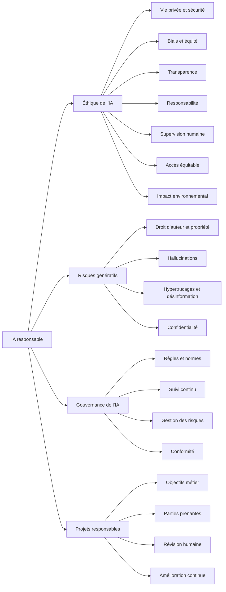

# Enjeux, préoccupations et considérations éthiques

## Table des matières

- [Statut](#statut)
- [Objectifs d’apprentissage](#objectifs-dapprentissage)
- [Carte conceptuelle](#carte-conceptuelle)
- [Concepts clés](#concepts-clés)
- [Application pratique](#application-pratique)
- [Travaux pratiques et activités](#travaux-pratiques-et-activités)
- [Révision du quiz](#révision-du-quiz)
- [Questions à revoir](#questions-à-revoir)
- [Synthèse finale](#synthèse-finale)

## Statut

- [x] Adaptation française rédigée à partir des notes canoniques anglaises.
- [ ] Révision personnelle de l’adaptation terminée.

La réussite du cours est documentée séparément dans le registre des certificats. Les références réglementaires ci-dessous décrivent les supports étudiés, sans actualisation juridique.

## Objectifs d’apprentissage

1. Expliquer équité, transparence et responsabilité dans le développement et le déploiement de l’IA.
2. Identifier les risques propres à la génération : authenticité, biais et détournements.
3. Expliquer les hallucinations des LLM et leurs conséquences sur la confiance.
4. Décrire le rôle des cadres de gouvernance dans la maîtrise des risques.
5. Appliquer les principes d’usage responsable à des situations professionnelles.
6. Intégrer parties prenantes, éthique et suivi continu dans un projet.
7. Concevoir une solution générative alignée sur un problème et un objectif organisationnels.

## Carte conceptuelle

La performance du modèle ne suffit pas. La vie privée, l’équité, la transparence, la responsabilité, la supervision, l’accessibilité et les conséquences sociales doivent être considérées pendant tout le cycle de vie.

## Concepts clés

### Éthique et usage responsable

L’éthique de l’IA regroupe principes et pratiques pour développer, déployer et utiliser des systèmes respectueux des personnes et des valeurs sociales. Elle interroge la pertinence d’un usage, ses bénéficiaires, les personnes affectées, les risques et les responsabilités.

L’emploi, la finance, la santé, l’éducation, les transports, les forces de l’ordre et l’accès aux services peuvent être concernés. Un système mal conçu peut amplifier un problème à grande échelle. Une bonne précision technique ne garantit pas un comportement éthique.

### Vie privée et sécurité des données

Les données personnelles, confidentielles ou sensibles doivent être protégées contre accès non autorisé, fuites, usages détournés, collecte inappropriée et divulgation inutile. Leur utilité pour un modèle ne suffit pas à justifier leur collecte.

Le cours évoque des images recueillies sans consentement clair pour la reconnaissance faciale. Retirer un nom ne supprime pas automatiquement les risques de réidentification ou d’atteinte à la vie privée.

### Biais et équité

Un système peut reproduire des régularités qui désavantagent injustement certains groupes. Les causes discutées sont données historiques biaisées, échantillons non représentatifs, biais humains cachés et évaluations inadéquates.

Les pratiques proposées : diversifier les données, tester les résultats selon les groupes, surveiller le système déployé et corriger les écarts injustes. Un recrutement biaisé par les données historiques illustre le problème. Un résultat algorithmique n’est pas automatiquement objectif.

### Transparence et responsabilité

La transparence fournit des informations utiles sur le fonctionnement, les données et les sorties du système. La responsabilité identifie qui répond des décisions, erreurs, dommages, contrôles et corrections. Une décision médicale assistée doit pouvoir être discutée par les professionnels et les patients au lieu d’être acceptée sans explication.

### Supervision humaine

Des personnes doivent pouvoir examiner, approuver ou intervenir dans les décisions. L’importance de ce contrôle augmente avec les conséquences possibles, notamment en santé, transport, finance, applications militaires et emploi. L’autonomie technique n’efface pas les responsabilités humaines et organisationnelles.

### Accès et équité

Les bénéfices de l’IA dépendent de l’accès aux infrastructures, outils, formations, connexions et compétences. Leur répartition inégale peut accroître les inégalités. Un projet éducatif destiné à des communautés mal desservies doit vérifier que les élèves peuvent effectivement utiliser le service.

### Impact environnemental

Les grands systèmes consomment des ressources de calcul et de l’énergie. Le cours propose de considérer efficacité des algorithmes et matériels, réduction des calculs inutiles et approvisionnement énergétique. Cet impact fait partie de l’évaluation globale d’un système.

### Risques propres à l’IA générative

La création massive de contenus réalistes soulève des enjeux de propriété intellectuelle, confidentialité, hallucinations, hypertrucages, désinformation, biais, détournement et coût de calcul.

### Droit d’auteur et propriété des contenus

Les notes soulèvent les questions d’origine des données, d’attribution, de propriété du résultat et d’usages autorisés. Un contenu généré n’est pas automatiquement exempt de droits ou de contraintes de licence. Ce constat pédagogique ne détermine pas le régime juridique applicable à un cas particulier.

### Hallucinations

Une hallucination est une sortie plausible mais inexacte, non étayée ou inventée. Elle menace la fiabilité, la confiance, les décisions et les publications. Le cours évoque des références judiciaires fabriquées puis utilisées sans vérification suffisante.

Les formes étudiées sont contradiction avec une phrase précédente, contradiction avec le prompt, erreur factuelle et contenu incohérent ou hors sujet. Les causes possibles incluent défauts des données, connaissances incomplètes, compromis de génération, contexte insuffisant et nature probabiliste de la prédiction.

Les mesures abordées sont vérification des affirmations, prompts précis, contexte suffisant, amélioration des données, recours à des informations pertinentes de l’organisation, procédures de validation, supervision, exemples multiples et réduction de l’aléa lorsque la cohérence factuelle importe. Aucune de ces mesures ne transforme une réponse fluide en preuve de vérité.

### Hypertrucages et désinformation

Les deepfakes sont des images, sons ou vidéos synthétiques ou manipulés qui semblent authentiques. Les risques comprennent fausses informations, usurpation, fraude, harcèlement, chantage, faux documents et manipulation. L’évaluation de l’authenticité devient essentielle.

### Utilisation privée et confidentielle

Les environnements d’IA privés constituent une approche présentée pour les données sensibles. Ils doivent s’accompagner de garanties techniques et de règles organisationnelles et juridiques ; leur objectif est d’éviter une exposition inutile des informations.

### Perspectives organisationnelles étudiées

Le cours associe à IBM explicabilité, équité, robustesse, transparence et confidentialité ; à Microsoft supervision humaine, suivi, audits, revues internes et standards responsables ; à Google bénéfice social, équité, responsabilité et excellence scientifique.

Ces descriptions restituent le cours, sans vérifier les politiques actuelles de ces entreprises. Les thèmes récurrents restent équité, transparence, responsabilité, fiabilité, confidentialité et suivi.

### Gouvernance de l’IA

La gouvernance transforme les principes en règles, responsabilités, processus et contrôles opérationnels : évaluation des risques, documentation, révision humaine, évaluation des modèles, surveillance, audits, vérification de conformité et gestion des incidents.

Les risques à suivre incluent biais, vie privée et droits sur les données, opacité, dégradation des performances lorsque l’environnement change, et déploiement prématuré. Un lancement insuffisamment validé peut entraîner préjudices, incidents opérationnels et pertes financières ou de réputation.

### Suivi continu

Après déploiement, il faut détecter dérive des performances et des entrées, sorties inattendues, biais, problèmes de fiabilité et nouveaux risques. L’IA responsable est un cycle continu, pas une vérification unique.

### Mise en pratique de l’éthique

Les principes proposés sont de soutenir les personnes, respecter droits et propriété des données, et fournir une transparence adaptée à l’usage.

La **cartographie des dichotomies** examine bénéfices et effets négatifs de chaque fonction : qui bénéficie, qui peut subir un dommage, les données sont-elles utilisées correctement, le système est-il sûr et accessible à des personnes différentes ?

Des **garde-fous** traduisent ces intentions en limites explicites, par exemple l’interdiction de vendre les données clients à des annonceurs. Les données doivent être évaluées pour leur diversité et leur représentativité. IBM AI Fairness 360 est cité comme exemple d’outil d’analyse des biais ; d’autres contrôles concernent confidentialité, incertitude, sécurité et explicabilité.

L’éthique doit intervenir dès la conception.

### Réglementation et cadres de gestion des risques

Le module cite le NIST AI Risk Management Framework et l’EU AI Act pour illustrer les cadres externes. L’idée à retenir est l’articulation entre gouvernance interne et exigences applicables. Les détails locaux et leur actualité restent à examiner pour chaque projet.

## Application pratique

### Service financier ivoirien utilisant l’IA

- **Situation envisagée :** analyser les informations clients, détecter des fraudes et soutenir des décisions de crédit.
- **Action :** protéger les données, évaluer les biais, documenter les recommandations, attribuer les responsabilités, surveiller les performances et maintenir une révision humaine pour les décisions importantes.
- **Résultat recherché :** augmenter les capacités d’analyse en réduisant décisions opaques, discriminatoires ou sans responsable identifié.

Ce scénario pédagogique montre une intégration de la responsabilité dès la conception ; il ne constitue pas une validation d’un produit financier.

## Travaux pratiques et activités

### Usage responsable au travail

L’activité consignée applique équité, confidentialité, transparence, responsabilité, supervision et analyse des effets sur les parties prenantes à des situations professionnelles. Le gain de productivité ne constitue qu’un critère parmi d’autres.

### Projet final : transformation de fonctions organisationnelles

Les notes anglaises rapportent une analyse de fonctions métier, de personnalisation client, de performances fournisseurs, de prévision de demande et de support client. La leçon est de relier capacités de l’IA et objectifs explicites tout en prévoyant usage responsable et supervision.

## Révision du quiz

- L’accès équitable concerne la possibilité réelle de bénéficier de l’IA.
- Confidentialité, transparence, responsabilité, équité et impact social complètent la performance.
- Les déploiements génératifs posent des questions de réglementation, données, calcul et interprétabilité.
- L’apprentissage profond utilise des réseaux multicouches ; les CNN détectent des motifs spatiaux par convolution.
- L’analyse du comportement des consommateurs peut soutenir le marketing ciblé.
- Les spécialistes du NLP développent des systèmes de traitement du langage.
- Les décisions importantes exigent une compréhension des résultats et des responsabilités.
- Les informations générées demandent validation et vérification factuelle.
- La propriété intellectuelle des contenus générés reste une question complexe.
- L’informatique cognitive modélise perception, apprentissage et raisonnement.
- Davantage d’exemples étiquetés peuvent aider l’apprentissage supervisé.
- Les robots peuvent soutenir efficacité, disponibilité et qualité industrielle.

## Questions à revoir

- Quels mécanismes techniques expliquent les hallucinations des LLM ?
- Quelles méthodes de réduction sont les plus efficaces en production ?
- Comment adapter la supervision au risque ?
- Comment mesurer quantitativement l’équité entre groupes ?
- Comment auditer après déploiement ?
- Quels contrôles concrets appliquer aux RAG et aux agents ?
- Comment comparer les exigences de Côte d’Ivoire, de l’Union européenne et des autres territoires concernés ?
- Comment évaluer droits et licences dans un logiciel commercial utilisant l’IA générative ?

## Synthèse finale

Les bénéfices de l’IA s’accompagnent de responsabilités concernant données, équité, transparence, supervision, accès et environnement. La génération ajoute risques d’hallucination, de manipulation et de contenus dont l’origine ou les droits sont incertains.

La gouvernance rend les principes opérationnels par des responsabilités, évaluations, documents, contrôles et réponses aux incidents. Elle doit accompagner tout le cycle de vie, de la définition du problème jusqu’à l’amélioration ou au retrait du système.
