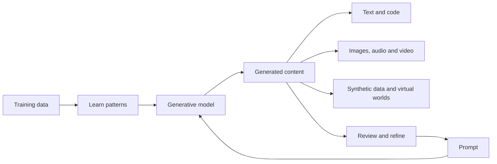

# Introduction and Capabilities of Generative AI

## Table of Contents

- [Status](#status)
- [Learning Objectives](#learning-objectives)
- [Concept Map](#concept-map)
- [Core Concepts](#core-concepts)
- [Practical Application](#practical-application)
- [Labs and Activities](#labs-and-activities)
- [Quiz Review](#quiz-review)
- [Questions to Revisit](#questions-to-revisit)
- [Final Summary](#final-summary)

## Status

- [ ] Complete
- [ ] Reviewed

## Learning Objectives

1. Describe generative AI and its evolution.
2. Contrast generative AI with discriminative AI.
3. Describe common capabilities of generative AI for generating text, images, audio, video, virtual
   worlds, code, and data.
4. Demonstrate use cases of generative AI for text generation.

## Concept Map



Training supplies the patterns a generative model learns; a prompt then guides the content it
produces. The outputs span the seven capability areas introduced in the course. Reviewing an output
and refining the request are part of using the model, as the text-generation lab shows. The diagram
separates training from prompting; it does not imply that every prompt retrains the model.

## Core Concepts

### Course Context and Source Basis

This module introduces generative AI for enthusiasts, students, professionals, and managers. The
recorded course requires no AI or programming background. Its emphasis is recognizing capabilities
and trying accessible tools, with factual review and responsible use.

The course progression is:

1. **Introduction and capabilities:** definitions, evolution, output types, and text generation.
2. **Applications and tools:** industry uses and tools for text, images, code, audio, and video.
3. **Quiz, project, and wrap-up:** glossary, conceptual assessment, and a project using text,
   images, and code. The recorded overview describes the project as optional.

Learning resources include videos, readings, labs, expert viewpoints, practice and graded quizzes,
discussion forums, summaries, and AI-assisted podcasts, role plays, and dialogues. Source estimates
for self-paced study are not a classroom schedule.

These notes synthesize the supplied Module 01 material: “Course Overview,” “Introduction to
Generative AI,” “Capabilities of Generative AI,” the text-generation lab, expert viewpoints, podcast
recaps, and recorded quiz/dialogue feedback. References below use these lesson titles. They describe
the recorded course, not a current product survey. No external update is incorporated.

The specialization overview places this course in several IBM learning routes. The detailed examples
cover generative AI fundamentals, applied AI with Python and APIs, data-science tasks, and
software-development tasks. The broader fundamentals route extends into prompt engineering,
foundation models/platforms, ethical impacts, and business/career implications; those are not
additional lessons to invent for this module. The source also lists routes for analysts, engineers,
cybersecurity, customer support, project/product management, and BI. Program availability and
“Coming Soon” labels are historical source context, not verified enrolment information.

### Generative AI and Discriminative AI

**Generative AI** learns patterns in training data and uses those patterns to produce content. A
prompt supplies the request or context for the desired output. A model may generate text from text,
an image from text, or another supported input/output combination.

In my own words: the model uses learned patterns to construct an output suited to a request. The
course compares this with creativity because the output can be a story, image, or other newly
generated example.

**Discriminative AI**, in the course's contrast, distinguishes categories or predicts a result from
an input. The spam-filter example illustrates deciding whether an existing email is spam.

| Comparison                       | Discriminative task                              | Generative task                                   |
| -------------------------------- | ------------------------------------------------ | ------------------------------------------------- |
| Main question                    | Which category or prediction fits this input?    | What content can be produced for this request?    |
| Email example                    | Classify an email as spam or legitimate          | Generate an example email                         |
| Image example                    | Decide whether an image depicts a nest or an egg | Generate an image of a nest containing three eggs |
| Typical result in these examples | Label, score, or probability                     | Text, image, or other generated content           |

The recorded dialogue adds a mathematical distinction: `P(X)` describes a distribution over data
`X`, and `P(X, Y)` describes data and labels together; `P(Y|X)` describes a label `Y` conditional on
an input `X`. It uses these to contrast learning a data distribution with predicting a label. For
example, producing an email differs from assigning an existing email a spam probability. This
notation supplements the plain-language distinction; it is not a programming prerequisite.

**Why it matters:** identify the task and output before choosing a capability. A recognizable
product name alone does not explain what the system is doing. The expert material also describes
LLMs used for classification, so these task examples should not become a rule that a generative
model can only ever be used to generate creative content.

**Source qualification:** the introductory transcript says discriminative AI cannot understand
context and presents both approaches through deep learning. Its broad wording needs clarification;
this comparison retains the task distinction without making those universal claims. References:
“Introduction to Generative AI,” “Expert Viewpoints: Generative AI Capabilities,” and the final
dialogue.

### Evolution and Model Families

The source describes a broad progression from early AI and statistical methods to neural networks,
deep learning, and models capable of producing increasingly coherent content. It attributes progress
to model development, larger datasets, and greater computing capacity.

| Source milestone                | What the recorded material emphasizes                                                                                                                    |
| ------------------------------- | -------------------------------------------------------------------------------------------------------------------------------------------------------- |
| 1950s–1960s                     | The introductory video traces roots to early machine learning; the history podcast uses the rule-based ELIZA chatbot as an early conversational example. |
| 1980s–1990s                     | Growing use of neural networks, with early limits in data and capacity.                                                                                  |
| 2000s–early 2010s               | Deeper networks, data, and computing; the podcast also mentions IBM Watson's 2011 Jeopardy appearance as AI context.                                     |
| 2014                            | The introduction and quiz feedback attribute GANs to Ian Goodfellow and colleagues.                                                                      |
| 2015                            | The podcast identifies diffusion models and explains adding and reversing noise.                                                                         |
| 2017–2018                       | The expert discussion cites “Attention Is All You Need”; the introduction identifies the first GPT model in 2018.                                        |
| 2020–2023                       | The podcast cites GPT-3 in 2020, then Gemini and watsonx in 2023.                                                                                        |
| Later examples in the recording | GPT-4o, Gemini 1.5, multimodality, agentic AI, and Llama/Mistral are discussed without a usable date for “this past year.”                               |

This is a summary of the supplied chronology, not an independently verified history. In particular,
the expert transcript's GAN-to-LSTM ordering and the quiz's “first framework” characterization need
verification before being presented as historical conclusions. Early conversational AI examples
should not be treated as proof that every system used the same generative-model approach.

| Family or term                       | Introductory explanation supported by the source                                                                               |
| ------------------------------------ | ------------------------------------------------------------------------------------------------------------------------------ |
| Generative adversarial network (GAN) | Two networks compete: one generates examples and the other distinguishes generated examples from real ones.                    |
| Variational autoencoder (VAE)        | Learns patterns that support generating similar examples; the source does not develop its mathematics here.                    |
| Transformer                          | A model family associated with the course's modern language-model examples.                                                    |
| Diffusion model                      | The podcast explains a process of adding noise and learning to reverse it to produce an image.                                 |
| Autoregressive model                 | Produces a sequence step by step, as described in the expert discussion.                                                       |
| Foundation model                     | A broadly capable model that can be adapted for more specific uses.                                                            |
| Large language model (LLM)           | A model trained on extensive language data to generate and work with text; presented as an important kind of foundation model. |

The expert discussion also mentions supervised, semi-supervised, and reinforcement learning,
pre-training, and fine-tuning. Here they provide background for how AI systems develop and adapt;
this module does not supply a model-training implementation.

### Seven Capability Areas

Reference: “Capabilities of Generative AI,” the lesson summary, and the recorded dialogue. The
dialogue concentrates on five content types; the full lesson also includes synthetic data and
virtual worlds.

| Capability                       | What the source describes                                                                                          | Example uses                                                                        |
| -------------------------------- | ------------------------------------------------------------------------------------------------------------------ | ----------------------------------------------------------------------------------- |
| Text                             | Completion, conversation, explanation, summarization, translation, and question answering                          | Drafting content, chatbots, virtual assistants, and language support                |
| Images                           | Creating images and transforming visual input or style                                                             | Art, design, games, training data, medical imaging, and scientific visualization    |
| Audio                            | Music composition, speech synthesis, synthetic voices, voice modification, noise reduction, and enhancement        | Media, education, games, accessibility, and virtual reality                         |
| Video                            | Creating or modifying moving scenes, completion/editing, and style transfer; maintaining consistency across frames | Entertainment, education, simulation, medicine, and research                        |
| Code                             | Generating, completing, fixing, explaining, testing, and documenting code                                          | Software/web development, data science, robotics, automation, games, and AR/VR      |
| Data generation and augmentation | Producing synthetic samples to add diversity to existing data                                                      | Images, text, speech, tabular/statistical data, time series, and financial datasets |
| Virtual worlds                   | Environments, objects, textures, sounds, avatars, and digital personalities                                        | Games, immersive learning, AR/VR, digital influencers, and personalized experiences |

The source links augmentation to improving datasets and model performance; the lab's review
principle still applies rather than treating a generated sample or a realistic appearance as proof
of usefulness or accuracy. Virtual characters may be given behavior or personality traits:
generating those behaviors differs from analyzing a person's existing behavior.

### Models and Tools Named in the Source

This list preserves lesson terminology and associations. It does not verify present availability,
pricing, licensing, supported interfaces, or comparative performance.

| Source association              | Names recorded in this module                                                                            |
| ------------------------------- | -------------------------------------------------------------------------------------------------------- |
| Language models and text tools  | GPT, GPT-3, GPT-4, ChatGPT, Gemini, PaLM, and Llama                                                      |
| Image models and tools          | DALL-E/DALL-E 2, Stable Diffusion, StyleGAN, DeepArt, and MidJourney                                     |
| Audio examples                  | WaveGAN, MuseNet, Tacotron 2, and Mozilla TTS                                                            |
| Video and avatar examples       | VideoGPT and Synthesia                                                                                   |
| Code examples                   | GitHub Copilot, IBM Watson Code Assistant, and AlphaCode                                                 |
| Broader program/podcast context | IBM Granite, watsonx, GPT-4o, Gemini 1.5, Mistral, Hugging Face, watsonx Prompt Lab, Spellbook, and Dust |

The capabilities reading pairs StyleGAN with generated faces/animals/scenes, DeepArt with visual
transformation, DALL-E with image descriptions, and the audio examples with waveforms, music, and
speech. It presents VideoGPT as accepting text prompts; that specific association is unresolved. The
introduction spells Pathways Language Model as “POM,” while the capabilities lesson uses “PaLM.” The
latter spelling is used in the table, with the discrepancy retained here rather than silently
correcting the source record.

### Value and Responsible Use

The expert viewpoints emphasize content creation, summarizing and extracting information,
classification, code, and generating patterns, configurations, or settings. Suggested benefits
include reducing repetitive work, producing design alternatives, supporting personalization, and
creating training simulations. Examples span marketing, customer service, design/prototyping,
finance, pharmaceuticals, healthcare, and aviation.

The source mentions retrieval-augmented generation (RAG) in a discussion of synthetic data and
access to private documents. It does not clearly explain the relationship between those ideas.
Retain RAG as an expert-mentioned topic needing clarification, not as a definition of synthetic data
or a demonstrated privacy guarantee.

Other expert claims about recommendations, fraud detection, medicines, and privacy through synthesis
also need the particular generative contribution made explicit. These are recorded perspectives, not
documented deployment results in these notes.

The course's practical instruction is to validate factual responses and use generated content
ethically and responsibly. The history podcast highlights privacy, misuse, safety, ethics, and
governance. The broader specialization orientation flags hallucinations, deepfakes, bias, security,
copyright, workforce effects, and environmental impacts for further study. Its predictions about
on-device models and safer open alternatives remain forecasts, not established guarantees.

## Practical Application

The following are synthesized from the recorded “Exploring What Generative AI Can Do” dialogue, not
new KRAAK services or claims of completed work.

| Situation                                    | Capability and possible output                                                                                                                             | Important distinction                                                                                                                        |
| -------------------------------------------- | ---------------------------------------------------------------------------------------------------------------------------------------------------------- | -------------------------------------------------------------------------------------------------------------------------------------------- |
| A small business needs social-media material | Text for captions, descriptions, hashtags, and promotions; images for product visuals; editing for backgrounds/lighting; video for short promotional clips | Match each requested artifact to its capability; the dialogue supplies a scenario, not measured marketing results.                           |
| A student is stuck on a function             | An explanation, approach, code snippet or function, comments, examples, and debugging suggestions                                                          | The recorded response emphasizes understanding and improving the solution rather than simply copying it.                                     |
| A podcaster needs background music           | Audio/music generation guided by mood, genre, tempo, and duration                                                                                          | The required output is sound, not a written description. The recorded response explicitly makes reuse subject to the tool's licensing terms. |

**Observed result:** no generated artifacts or measured outcomes are supplied for these scenarios.
They support reasoning about capabilities, not a claim of successful execution.

## Labs and Activities

### Recorded Lab: Generate Text Using Generative AI

**Purpose:** explore text generation, write a contextual prompt, and convert or modify the output.
The source uses IBM Generative AI Classroom with language models; it does not specify a mandatory
model for this Module 01 lab. The interface labels below reproduce the recorded workflow, not a
live-verified description of the current classroom.

#### 1. Generate Text for a Context

1. Choose the desired context and enter a specific request in **Type your message**. The source
   begins with:

   ```plaintext
   Write a short poem about the moon.
   ```

2. For this introductory exercise, the source says to leave the separate **Prompt Instructions**
   field aside and include the context in the message itself.
3. Select **Start chat** and inspect the response in the right-hand pane.
4. If needed, use **Regenerate response**, then review the revised output.
5. Copy and adapt the text as required.

#### 2. Convert and Summarize in the Same Conversation

Continue from the poem in the same chat:

```plaintext
Convert this poem into a short story.
```

Then request:

```plaintext
Create a summary of this story.
```

The exercise demonstrates follow-up requests based on previously generated responses. Compare the
requested form at each stage: poem, story, and summary. The source's reference to the “same Step 2
example” is inconsistent with the preceding step; this sequence explicitly follows the poem from
Step 1. Its later use of “Start chat field” for entering text also needs UI clarification.

#### 3. Try Other Contexts

The source proposes five further requests:

- Ask for a fact about space.
- Ask how a bicycle works.
- Ask for three well-known poems by William Wordsworth.
- Request a retail fashion brand's marketing campaign.
- Draft a job description for an instructional designer.

Validate factual responses and adapt the output to the intended context. The supplied material
contains instructions rather than this learner's generated poem, story, summary, or practice
outputs, so lab completion and results are not asserted.

### Recorded Dialogue: Explain and Match Capabilities

The dialogue moves from the generative/discriminative distinction to content types and then to
business, coding, and music scenarios. Its responses contribute the probability notation and
practical examples above. It expands the examples to 3D models, animation, and synthetic data. The
essential learning task is to explain what would be produced and why that output fits the need.

## Quiz Review

### Recorded Misunderstanding: Behavior Analysis and Virtual Characters

**Feedback recorded:** the virtual-character question marks a response incorrect and contrasts
behavior analysis with synthesizing behavior for digital characters. The selected option itself is
not separately recorded.

**Reasoning to retain:** analyzing observed behavior is different from generating an avatar's
responses, expressions, gestures, or personality-driven actions in a virtual environment.

**Memory cue:** distinguish observing an existing behavior from creating a character's behavior.

### Other Concepts Reinforced by Feedback

- Generative models learn statistical patterns to produce content; the output type distinguishes the
  course's generative and discriminative examples.
- LLMs generate language, including conversational replies and summaries. Summarization transforms
  the supplied content into a shorter form.
- Descriptive prompts specify the subject, attributes, and intended output. The feedback emphasizes
  specificity; it does not remove the lab's requirement to verify factual accuracy.
- The history questions emphasize GANs and 2014; the stronger “first framework” claim remains
  unresolved in the source chronology.
- The avatar/video example connects a supplied script with audio and visual presentation; the named
  tool's current capabilities have not been verified here.

The practice and graded-quiz material has been condensed into concept review rather than retained as
an answer bank. Individual feedback does not establish an overall quiz score or course pass.

## Questions to Revisit

### Source Clarifications

- Does the original introduction intend a narrower meaning for its claim that discriminative AI
  cannot understand context, and for the scope it gives deep learning?
- What is the intended chronology in the expert passage placing LSTMs after GANs? What evidence
  supports the quiz's stronger “first framework” claim?
- Does the original lesson name PaLM where the transcript says “POM,” and does its VideoGPT example
  really describe text-conditioned generation?
- How should the expert material distinguish synthetic data, RAG, and access to private documents?
  What generative task underlies its fraud-detection, recommendation, and privacy examples?
- What content was in the “Helpful Tips for Course Completion” image? The supplied notes contain
  only a temporary signed URL, so its instructional contents cannot be reconstructed.
- Which period does “this past year” refer to in the podcast? What sources support the introductory
  Bloomberg projection of $1.3 trillion by 2032, the McKinsey “trillions” claim, and demographic
  statements? These remain attributed, unverified source claims rather than current facts.

### Learning Follow-up

- Can I explain the distinction using a new input/output example without relying on tool names?
- Can I identify all seven capability areas, including synthetic data and virtual worlds?
- When I perform the lab, what changes between the poem, story, and summary, and what needs
  checking?
- Which examples require further clarification before they could support a reliable demonstration?

## Final Summary

Generative AI learns patterns from training data and produces content in response to a prompt. This
module contrasts that task with classification and prediction, introduces the evolution and model
families behind generation, and covers text, images, audio, video, code, synthetic data, and virtual
worlds. The text lab demonstrates generation followed by conversion and summarization in one
conversation. Selecting the right output type, describing the context, and reviewing the result are
the practical takeaways. Historical/product ambiguities and missing evidence remain explicit; no
assessment completion or current-tool verification is implied.
