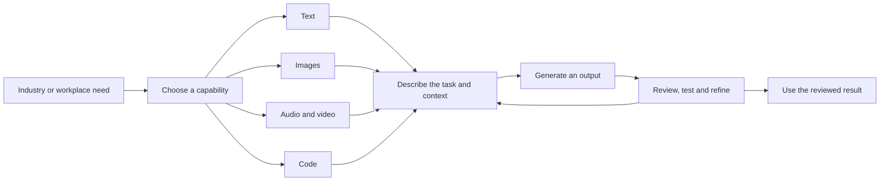

# Applications and Tools of Generative AI

## Table of Contents

- [Status](#status)
- [Learning Objectives](#learning-objectives)
- [Concept Map](#concept-map)
- [Core Concepts](#core-concepts)
- [Practical Application](#practical-application)
- [Labs and Activities](#labs-and-activities)
- [Quiz Review](#quiz-review)
- [Questions to Revisit](#questions-to-revisit)
- [Final Summary](#final-summary)

## Status

- [ ] Complete
- [ ] Reviewed

## Learning Objectives

1. Identify the applications of generative AI in different sectors and industries.
2. Explore common generative AI models and tools for generating text, code, image, audio, and video.
3. Demonstrate the application of generative AI tools for text, image, and code generation.

## Concept Map



The module connects an application to the type of content needed, then explores tools through
prompts and review. Text, image, and code labs make that process concrete; audio and video are
introduced through examples. The diagram summarizes that progression without implying that every
tool or industry task uses the same model or that generated output is automatically reliable.

## Core Concepts

### Source Basis and Scope

These notes synthesize the supplied “Applications of Generative AI,” “Economic Potential of
Generative AI,” text/image/audio/video/code tool lessons and labs, expert viewpoints, “Generative
versus Agentic AI,” summaries, role play, workplace reflection, and quiz feedback.

Tool names, model associations, UI labels, numerical claims, and deployment examples below describe
the recorded material. They have not been externally verified or updated. Course-derived
explanations, recorded activity responses, and personal experience are distinguished. No new
facilitator activity or completed lab result is added.

### Applications Across Industries

A capability is what an AI system can produce or do; an application places it in a particular
workflow. In my own words: generating text is a capability, while drafting an HR job posting is an
application of that capability.

The source explicitly notes that some tools combine generative and discriminative models. Identify
the task and output rather than assuming every prediction, classification, or automation in the
following examples is itself generative.

| Domain                  | Applications described in the lesson                                                                                                                                                                             | Named examples in the source                                                                   |
| ----------------------- | ---------------------------------------------------------------------------------------------------------------------------------------------------------------------------------------------------------------- | ---------------------------------------------------------------------------------------------- |
| IT and DevOps           | Code generation/review, synthetic test cases and data, monitoring/log analysis, troubleshooting, documentation, CI/CD support, natural-language interfaces, infrastructure management and predictive maintenance | GitHub Copilot, Snyk DeepCode, Applitools, Testim, Watson AIOps, Moogsoft AIOps and GitLab Duo |
| Entertainment           | Music, scripts, stories, videos, games, animation, translation/localization, personalized content, virtual influencers and avatars                                                                               | SideFX Houdini                                                                                 |
| Education               | Content generation, translation, simulations, feedback, assessment and personalized learning paths; knowledge tracing and inclusive learning                                                                     | NOLEJ and Duolingo                                                                             |
| Banking and finance     | Synthetic fraud/risk scenarios, credit analysis, sentiment analysis, customer conversations, compliance, forecasting, portfolio support, anti-money laundering and trading                                       | KAIGPT, DataRobot, Personetics, AIO Logic and Bloomberg GPT                                    |
| Medicine and healthcare | Synthetic medical images and rare-condition data, molecule generation, research/training, conversational support, health-record management and fraud detection                                                   | Rasa is named for patient conversations                                                        |
| Human resources         | Job postings, recruitment/screening, scheduling, onboarding, engagement, performance documents, training, analytics and policy processes                                                                         | watsonx Orchestrate, Talentaria, Leena AI and Macorva                                          |

**Why it matters:** a useful application connects a need, an output, and a way to assess that
output. The course presents potential productivity and personalization benefits across these
domains; it does not supply evidence that every named tool performs every task in its row.

**Qualifications to retain:** claims about identifying learning disabilities, clinical advice,
credit decisions, and risk detection require clarification of the generative contribution and the
specific tool's role. These notes record examples, not clinical, financial, or employment guidance.
The source's “first” claim for KAIGPT is also unverified.

### Economic Potential and Business Value

The economic-potential reading attributes three opportunity groups to Gartner:

1. **Revenue:** new products and revenue channels.
2. **Cost and productivity:** assistance with drafting/editing and with developing and refining
   ideas, projects, processes, services, and collaboration.
3. **Risk mitigation:** insights into transactions, code, and other data that may help identify
   risks.

It distinguishes changes to core industry processes from support functions such as marketing,
design, communications, training, and software engineering. Its industry list also includes
manufacturing, architecture/interior design, engineering, automotive, aerospace/defense,
electronics, and energy, alongside media and pharmaceutical/medical work.

The supplied reading links to
[Gartner's generative AI topic page](https://www.gartner.com/en/topics/generative-ai). This is a
retained source reference, not a current verification of the page.

The applications lesson attributes these projections to McKinsey:

- Generative AI **and other technologies** could automate activities accounting for 60–70% of
  employees' time.
- Half of work activities could be automated between 2030 and 2060.
- Language-related capabilities could affect knowledge work, including highly educated occupations.

The named report is _The economic potential of generative AI: The next productivity frontier_. The
supplied reading omits its promised report link. Preserve the scope as work activities and multiple
technologies; do not reinterpret the figures as a percentage of jobs eliminated or as an observed
result. The projections remain attributed source claims needing verification.

### Text Generation Tools

The text lesson describes LLMs as learning language patterns and relationships that support
contextual text, conversations, and transformations. Its examples include a continuing discussion
about generative AI and storytelling, presentation outlines, translation, digital-marketing ideas,
news summaries, calculations, and coding assistance.

| Task family in the source                                           | Examples named                       |
| ------------------------------------------------------------------- | ------------------------------------ |
| General conversation, drafting, explanation, translation and coding | ChatGPT and Google Gemini            |
| Marketing and brand-oriented writing                                | Jasper, Rytr, Copy.ai and WriteSonic |
| Summarization                                                       | Resoomer                             |
| Classification                                                      | uClassify                            |
| Sentiment-related analysis                                          | Brand24 and Reputate                 |
| Translation                                                         | LanguageWeaver and Yandex            |
| Local/privacy-oriented options discussed                            | GPT4ALL, H2O.ai and PrivateGPT       |
| Additional expert-mentioned text tools                              | Frase.io and Microsoft Copilot       |

The source compares ChatGPT's conversational strengths with Gemini's information access, then later
summaries discuss images, voice, long documents, creative options and Google-app integration. Those
comparisons are not current rankings. The text lab describes Gemini through PaLM, whereas the tool
lesson describes Gemini models; this inconsistency is unresolved.

The privacy discussion warns about sensitive input and also presents local/open alternatives. Its
blanket claims about open-source tools collecting data, running without an internet connection or
graphics card, and protecting privacy need product-specific clarification. These labels alone are
not evidence about the behavior of a particular installation.

### Image Generation and Transformation

Reference: “Tools for Image Generation.” The lesson distinguishes producing a new image from
changing an existing visual.

| Technique                  | Source explanation and examples                                                                                  |
| -------------------------- | ---------------------------------------------------------------------------------------------------------------- |
| Text-to-image              | Describe a subject, setting and style, then generate an image; the video uses a boat on a calm lake at sunset.   |
| Image-to-image translation | Transform an input while retaining relevant content; examples include sketches/photos and satellite images/maps. |
| Style transfer and fusion  | Apply or combine visual styles.                                                                                  |
| Inpainting                 | Fill or replace an area within an image, including restoration or removing an unwanted object.                   |
| Outpainting                | Extend the image beyond its existing borders, such as a wider composition or panorama.                           |

The source names DALL-E, Stable Diffusion, StyleGAN, Midjourney, Bing Image Creator and Adobe
Firefly. It associates StyleGAN with controls over content/style, Firefly with Creative Cloud, and
Bing Image Creator with DALL-E. It also discusses API integration, training-data sources, language
support and free access. These specific product claims remain unverified.

The transcript uses “FreePic,” “Crayon,” “Pixar” and “DALI,” while quiz feedback uses “Freepik.”
Those are recorded naming ambiguities, not silently normalized product recommendations. The
classroom lab specifically names **GPT Image 2**; keep that source identity distinct from the
video's examples until the classroom configuration is verified.

### Audio, Video and Virtual Worlds

The audio/video lesson groups audio tools into three purposes:

| Purpose           | What the lesson describes                                                                                                        | Source examples                                        |
| ----------------- | -------------------------------------------------------------------------------------------------------------------------------- | ------------------------------------------------------ |
| Speech generation | Text-to-speech, voice selection/cloning, and control of pronunciation, pace, tone or emotion; accessibility and language support | LOVO, Synthesia, Murf.ai and “Listenr”                 |
| Music creation    | Melodies, instruments, songs and soundtracks; mixing/mastering and distribution are also discussed                               | AudioCraft, Amper, AIVA, Soundful, Magenta and WavTool |
| Audio enhancement | Noise removal, recording cleanup and sound effects                                                                               | Descript and Audo AI                                   |

For video, the lesson associates **Runway Gen-1** with changing the style of existing clips and
**Gen-2** with generation from text, images or video. It discusses EaseUS and Synthesia for video
workflows, narration, format changes and avatars. Its city-tree documentary scenario illustrates
combining media tasks. It also attributes a role in _Everything Everywhere All at Once_ to Runway;
that attribution has not been checked here.

Virtual-world examples include landscapes, 3D objects and avatars with distinctive behavior. The
source names The Sandbox for game creation/sharing and Scenario AI for mobile-game assets. No audio,
video or virtual-world construction lab is supplied in this module.

The quoted music-market magnitude, AudioCraft training-hours figure, voice/language options, WavTool
model association and other specific features remain recorded claims. They are not verified
forecasts, licensing permissions or current capabilities.

### Code Generation Tools and Limits

The code lesson covers generation from natural-language requirements, completion, correction,
optimization/refactoring, translation between languages, documentation/comments, and suggestions for
algorithms or data structures. It also discusses generating code from image inputs.

| Source example                             | Role described in the lesson                                                                                      |
| ------------------------------------------ | ----------------------------------------------------------------------------------------------------------------- |
| ChatGPT and Gemini                         | Generate/explain simple code, help debug, translate languages and support learning.                               |
| GitHub Copilot                             | Editor-integrated, context-based code suggestions; the source associates it with OpenAI Codex.                    |
| PolyCoder                                  | Described as GPT-2-based, trained on GitHub code in 12 languages, with strength in C and template-related claims. |
| IBM Watson Code Assistant                  | Suggestions, completion, restructuring and project/code analysis, linked by the source to watsonx.ai models.      |
| Amazon CodeWhisperer, “Tab9” and “Repl.It” | Additional examples of suggestions, completion and interactive coding.                                            |

The source distinguishes syntactically plausible code from code that behaves as intended. It
encourages testing, reviewing generated code and considering security, harmful output and bias. The
expert discussion treats output as a starting point that needs refinement; specialized music or 3D
work may require more iteration than text/code in those experts' experience.

The source's GPT-3.5/September 2021 cutoff and broader statements that complex programs cannot be
generated are time- and model-dependent claims, not universal limits applied to every present tool.
Likewise, claims of built-in best practices or standards do not replace the lab's execution checks.
The expert discussion mentions fine-tuning with organizational data; it does not provide a training
procedure or establish that little data/compute suffices in every case.

### Expert Application Perspectives

“Exploring Generative AI Applications Across Domains” adds these recorded examples:

- **Education:** generating feedback against a rubric and using the Skills Network assistant Ty for
  questions, lab errors and review, with scalability offered as a motivation.
- **Healthcare/research:** synthetic medical images for training, molecule/protein/genome work,
  DeepMind and Insilico Medicine examples, and a claimed NVIDIA/King's College London MRI project.
- **Finance:** document analysis attributed to JPMorgan's COIN and market prediction attributed to
  Goldman Sachs, alongside conversational support and fraud-related examples.

The source does not consistently separate prediction from generation, and its privacy and outcome
claims are broad. Preserve these as expert perspectives requiring source clarification rather than
proof of clinical benefit, privacy protection, financial performance or deployed functionality.

### Generative and Agentic AI

The recorded lesson contrasts a prompted content-generation interaction with a system pursuing a
goal through several actions.

| Aspect               | Generative interaction in the lesson                                 | Agentic system in the lesson                                                                            |
| -------------------- | -------------------------------------------------------------------- | ------------------------------------------------------------------------------------------------------- |
| Starting point       | A request for text, an image, code or audio                          | A goal that requires multiple steps                                                                     |
| Sequence             | Generate an output; a person reviews and asks for the next change    | Observe the environment, decide, act and repeat using feedback                                          |
| Example              | Help a creator review a script, suggest a thumbnail or develop music | Search shopping sites, monitor prices and arrange later steps; or plan a conference by exploring venues |
| Human role described | Make choices and refine outputs at each stage                        | Provide the goal and intervene when needed                                                              |

LLMs are presented as supporting both kinds of system. The lesson calls breaking a problem into
steps “chain-of-thought reasoning” and illustrates it through conference planning. This is the
course's conceptual description; it is not a specification for building agents, a claim that all
agents use one reasoning method, or authorization for autonomous purchases. The source's future
vision of systems that both create and act remains a forecast.

## Practical Application

### Nawa Cocoa Cooperative: Matching a Generative Tool to the Output

Suppose the cooperative has approved a training campaign on complete lot-intake records.

- A text model could draft a concise French notice using only the approved procedure.
- An image model could propose a training poster, with staff checking labels, symbols, sequence, and
  misleading details before publication.
- An audio tool could create a spoken briefing when the chosen service supports the required
  language and permits the intended use.
- A code assistant could help build a record-completeness report, followed by tests with known data.

The tool follows the required output and evidence, not novelty. Member records, payment details, and
unpublished inspection data stay outside public models unless an approved process protects them.

### Recorded Role Play: Capabilities That Drive Results

**Scenario:** act as an innovation lead in a text-chat meeting with senior executive Duncan
Campbell. Explain **three core capabilities** and **two real-world cases with measurable outcomes**,
using non-technical language and building rapport.

The recorded response organizes its explanation into:

1. **Content generation:** drafts of messages, reports, code and visual/audio material.
2. **Information synthesis/transformation:** summaries, translation, comparison, reorganization and
   explanations suited to a different audience.
3. **Task assistance/workflow automation:** assistance with multi-step knowledge work when connected
   to appropriate business systems, leaving more time for human judgment.

It then supplies the following case claims. They belong to the recorded activity response with
external citations; they are not automatically IBM-authored case evidence or independently verified
results of this note-taking step.

| Case                 | Measurements stated in the response                                                                                                                                                                                             | Qualification retained                                                                                               |
| -------------------- | ------------------------------------------------------------------------------------------------------------------------------------------------------------------------------------------------------------------------------- | -------------------------------------------------------------------------------------------------------------------- |
| Klarna assistant     | First month: 2.3 million conversations, approximately two-thirds of chats; resolution time from 11 minutes to under 2; repeat inquiries down 25%; comparable satisfaction; estimated $40 million profit improvement during 2024 | An attributed first-month account and a forecast, not verified current performance or a guaranteed result elsewhere. |
| GitHub Copilot study | 95 professional developers; a JavaScript task completed about 55% faster; 1 hour 11 minutes versus 2 hours 41 minutes; completion rates 78% versus 70%                                                                          | A stated controlled task comparison, not an unconditional productivity multiplier for all software work.             |

Retained references from the response:

- [Klarna's first-month assistant announcement](https://www.klarna.com/international/press/klarna-ai-assistant-handles-two-thirds-of-customer-service-chats-in-its-first-month/).
- [GitHub's developer-productivity research article](https://github.blog/news-insights/research/research-quantifying-github-copilots-impact-on-developer-productivity-and-happiness/).

The response proposes treating results as benchmarks and measuring a targeted pilot rather than
promising the same return. **Recorded improvement feedback:** introduce yourself as the innovation
lead and acknowledge the executive's role before explaining the capabilities. No overall activity
score or completed business deployment is supplied.

### Personal Reflection: Generative AI in My Work

This is a synthesis of my recorded workplace reflection, not a new product claim:

- As a developer and student working independently, I use AI across coding, documentation,
  communication and study tasks.
- On KRAAK Consulting work, I have used it to review Angular/NestJS code, investigate i18n issues,
  identify potentially unnecessary code during audits, suggest tests and interpret lint, type-check
  and build results.
- I also use it for social-media campaign drafts, carousel structures and clearer technical reports.
- In my studies, I use it to organize notes, clarify concepts, develop examples, prepare
  presentation content and adapt lessons into revision audio scripts.
- I inspect suggested code changes and run appropriate tests, linting, type checks and builds. I
  compare factual or educational material with course sources, official documentation or reliable
  references.
- The benefit I recorded is less time blocked or spent on repetitive work; responsibility for
  validating the final result remains mine.

The mention of past revision scripts does not add audio/script deliverables to this course workflow.

## Labs and Activities

### Recorded Workflow and Evidence Boundary

The following preserves the supplied exercise sequence and requirements. Accounts, UI labels and
model choices are source descriptions requiring confirmation before a live demonstration. Repeated
signup walkthroughs and screenshot links have been condensed; no missing screenshot is
reconstructed. No generated email, image, program output or execution result is supplied as
completion evidence.

### Text Lab: Email Generation

1. Launch ChatGPT and follow the recorded sign-in workflow. The source destination is
   [ChatGPT](https://chat.openai.com/); access and account terms have not been rechecked.
2. Describe a customer-support representative at **XYZ Inc.** following up after a support
   interaction, and request a feedback email. Include the relevant subject and context.
3. Submit the message, inspect the response, and copy/adapt its details. Continue the conversation
   if refinement is needed.
4. Practise the five supplied variants: a professor meeting request, a job-application follow-up, an
   employee event invitation, a reminder about delayed project updates, and a customer product
   launch announcement.
5. Validate factual details, context, tone and grammar, and use the output responsibly.

### Text Lab: Unit Conversion

1. In ChatGPT, describe a recipe with **500 grams of flour** and a scale using ounces.
2. Request conversion to ounces with the appropriate conversion factor.
3. Review the factor and result before using it; a fluent calculation is not its own validation.
4. Try the three supplied practice types: triangle area, the average of five random numbers, and
   simple interest for a principal and interest rate.

No numeric answer or successful calculation is fabricated here. The source requires factual review.

### Optional Text Lab: Gemini Summarization

The source marks this exercise optional because of possible country availability. Optional status is
retained without asserting current regional access.

1. Follow the recorded account workflow at [Gemini](https://gemini.google.com/?hl=en).
2. Ask for a short-paragraph summary of the supplied
   [IBM watsonx Assistant article](https://www.ibm.com/blog/ibm-watsonx-assistant-transforms-content-into-conversational-answers-with-generative-ai/).
3. Review the summary against the article. The source describes a redo option, copying/sharing or
   exporting the response, and adapting it further.
4. Try other articles, blog posts, research papers or reports, checking the generated summary.

The article's text is not supplied in these notes, so no article summary is invented. The lab's
PaLM/Gemini description remains a source inconsistency, as noted above.

### Classroom Image Lab

**Recorded model:** GPT Image 2 in Generative AI Classroom. The source asks for English text prompts
and notes that results may vary even for the same prompt. The first exercise starts at “Step 2”; its
missing setup step remains a gap rather than a silently invented instruction.

#### 1. Solar-System Image

Request a scientifically accurate image of the solar system, including the sun and planets. The
recorded steps are to enter the message, select **Start chat**, inspect the image in the right-hand
pane, use **Regenerate response** if needed, and save via **Save image as**. A request for accuracy
is not evidence that the resulting image achieved it.

#### 2. Two Commercial Scenarios

- **Organic soap packaging:** the source explicitly selects GPT Image 2 from the top-right dropdown,
  then requests packaging ideas for skin-friendly, colorful organic soaps. Generate, inspect,
  regenerate if needed and save.
- **Beverage marketing:** create and name a new chat with the plus control, select the same model,
  then request people enjoying a cold beverage in a garden with colorful flowers, blue sky and white
  clouds. Generate, inspect, refine and save.

#### 3. Independent Practice

Retain the three supplied scenarios: a water-conservation poster, a boat in a river with natural
surroundings, and an F1 racing banner. No output images are supplied or generated by these notes.

### Optional Copilot and Designer Image Lab

The source marks these exercises optional because they involve account access. Elsewhere it says
Copilot sign-in is not mandatory; retain that access inconsistency for verification. The claims of
unlimited free image generation and particular underlying models are not confirmed here.

#### 1. Captions with Microsoft Copilot

1. Choose an image and open [Microsoft Copilot](https://copilot.microsoft.com/).
2. Follow the recorded Microsoft-account workflow, using a personal account as the source requests.
3. Use **Add an image** in **Message Copilot**, request a caption and submit.
4. Request regeneration if needed. The source connects captions with accessibility and understanding
   visual content.
5. Practise captions for **three images of your choice**.

#### 2. Thumbnails with Microsoft Copilot

1. Reuse the recorded access setup and request a thumbnail for a video about the importance of IBM
   certification.
2. Submit, inspect and download the generated image.
3. Practise generating **three thumbnails**. The lesson frames thumbnails as visual previews for
   larger content, with navigation and communication uses.

#### 3. Social Posts with Microsoft Designer

1. Open [Microsoft Designer](https://designer.microsoft.com/) using the same account as the previous
   exercises, as described in the source.
2. Select **Social Posts**, describe a post about the significance of IBM certification, choose
   **Landscape** under size, and select **Create**.
3. The source also allows uploading your own images. Review the resulting post.
4. Practise generating **three social posts**.

### Code Lab: Generate a C Greeting

This lab is framed as a beginner demonstration; it does not assume programming proficiency.

1. Use the recorded ChatGPT access workflow and request simple **C** code that prints:

   ```plaintext
   Hello and welcome to the generative AI world!
   ```

2. Submit and review the code and its explanation.
3. The source uses **CodeTester**: select **Run Some Code** or its runner page, select C, remove the
   editor's default code and paste the generated code.
4. Select **Run** and inspect the output. The source permits another accessible compiler, but no
   substitute is chosen in these notes.
5. Further code/functions may be explored, with accuracy and responsible-use checks.

The supplied text names CodeTester without retaining its destination or the referenced screenshots.
The general testing sequence is available; exact access remains unresolved. No C program or test
result is invented.

### Code Lab: JavaScript to Python

1. In a new ChatGPT conversation, request JavaScript that generates a random number between **1 and
   100**.
2. In the same conversation, request conversion of the preceding code into **Python**.
3. The source names **Programiz Python Online Compiler** for testing: remove the default code, paste
   the generated Python, run it, inspect the result, then run again to observe another result.
4. Review and test further generated code as needed. The source does not provide the Programiz
   destination or an observed output here; neither is fabricated.

The repeated claim about 2021 libraries and inability to generate complex programs remains a
model/time-dependent source claim, not a reason to omit testing or a verified current limitation.

## Quiz Review

### Concepts Identified for Further Review

The supplied graded feedback repeatedly points back to the image, audio/video, code and applications
lessons. Some entries include variants or only a “review the video” message. The selected answers,
attempt sequence and overall score are not recorded, so a specific personal error is not inferred.

| Concept to revisit                           | Reasoning retained from the feedback                                                                                                                                       |
| -------------------------------------------- | -------------------------------------------------------------------------------------------------------------------------------------------------------------------------- |
| Text and presentation support                | A tool may suggest titles, content and visuals; this is not proof of a completed presentation.                                                                             |
| Code generation, translation and explanation | Distinguish generating code, converting languages, explaining execution and offering editor completions.                                                                   |
| Image techniques                             | Distinguish prompt-based creation, variations, artistic styles and extending borders; verify uncertain tool associations separately.                                       |
| Video techniques                             | The source contrasts Gen-1 style transformation with Gen-2 generation from supplied inputs.                                                                                |
| Industry use                                 | Synthetic scenarios may support risk assessment; HR examples cover recruiting and onboarding; medical examples mix generation and prediction and need careful attribution. |
| Economic projections                         | Preserve the distinction between work activities, employees' time and jobs, and between forecasts and observed results.                                                    |
| LLM text                                     | Language patterns learned during training underpin the course's explanation of context-based text generation.                                                              |

**Memory cues:** identify the requested output, distinguish creating from transforming, and review
what was produced before using it. Tool names and rankings in feedback are course-record examples,
not up-to-date recommendations. The role-play rapport feedback is preserved under Practical
Application.

## Questions to Revisit

### Source Gaps and Conflicts

- What is the missing McKinsey report destination and date? What exactly underlies the automation
  projections? Verify the linked Klarna and Copilot cases before presenting their metrics as
  evidence.
- The audio lesson records 229 million in 2022, 28.6% growth and “2,000,660 million” by 2032. Is the
  final figure a transcription or unit error? The intended value is unresolved.
- Which Gemini model and interface did each text lesson describe? Do its Search/Scholar claims,
  regional availability and comparative rankings match the intended source period?
- What do “FreePic,” “Crayon,” “Pixar,” “DALI,” “Listenr,” “Tab9” and “Repl.It” refer to in the
  original lessons? Which API, model, training-data, language-count and free-access claims are
  supported?
- What is missing from the first classroom image exercise's setup? Which current classroom
  configuration corresponds to the recorded GPT Image 2 selection?
- Which account/sign-in requirements apply to the optional Copilot exercises? The source's account
  guidance and free/unlimited claims need reconciliation before live practice.
- Where are the missing CodeTester/Programiz destinations and essential screenshots? Do not
  reconstruct absent outputs or promote interface descriptions to current instructions without
  checking.
- What supports the source's general privacy/local-running claims and PolyCoder template claims?
  Which parts of the industry examples are generation, prediction, or conventional automation?
- What primary evidence supports the expert deployment examples, their claimed outcomes and the
  clinical/privacy/financial interpretations? Keep those claims distinct from demonstrated results.
- Does the agentic lesson intend chain-of-thought as one explanation or a universal mechanism? The
  recorded overview does not establish a full agent architecture.

### Learning Follow-up

- Can I connect an industry need to an output and a concrete review step?
- Can I explain the difference between inpainting and outpainting without naming a product?
- Can I preserve context during rewriting, summarization and code conversion?
- When I perform the labs, what did I request, what changed during refinement, and what did I
  verify?
- Can I introduce my role, acknowledge my audience and qualify case-study evidence in a business
  discussion?

## Final Summary

This module connects generative AI capabilities with industry and workplace applications, introduces
text, image, audio/video and code tool families, and contrasts prompted generation with multistep
agentic behavior. Its labs practise email drafting, conversion and summarization, image generation
and optional design tasks, then C generation and JavaScript-to-Python conversion with execution
checks. The role play emphasizes clear business communication and qualified evidence; my workplace
reflection emphasizes personal validation. The central habit is to match the task to an output,
provide context, review the result and refine it. Source uncertainties, missing evidence and
assessment status remain explicit.
