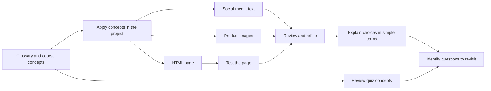

# Course Quiz, Project, and Wrap-up

## Table of Contents

- [Status](#status)
- [Learning Objectives](#learning-objectives)
- [Concept Map](#concept-map)
- [Core Concepts](#core-concepts)
- [Practical Application](#practical-application)
- [Labs and Activities](#labs-and-activities)
- [Quiz Review](#quiz-review)
- [Questions to Revisit](#questions-to-revisit)
- [Final Summary](#final-summary)

## Status

- [ ] Complete
- [ ] Reviewed

## Learning Objectives

1. Demonstrate understanding of the course concepts through a project and graded quiz.
2. Plan for the next steps in your learning journey.

## Concept Map



The glossary supports the three project tasks and course review. Text and image requests are refined
through the conversation, while the HTML task also includes running and inspecting the page. The
explanatory dialogue and quiz review help identify what needs further study. This is a map of the
module's learning tasks, not evidence that the project or assessment was completed.

## Core Concepts

### Source Basis and Module Role

This module consolidates the course through a glossary, “Final Project: Generating Text, Images, and
Code,” “Dialogue: Explaining Generative AI in Simple Terms,” and final graded-quiz feedback. It
applies earlier concepts rather than introducing another full lecture on AI tools.

The recorded course overview in
[Module 01](./01-introduction-and-capabilities-of-generative-ai.md#course-context-and-source-basis)
describes the project as optional. These notes preserve its instructions and distinguish them from
completion evidence. The separately agreed teaching format is facilitator demonstration with
optional learner practice; that delivery choice does not alter the original course assessment.

Model names, UI labels, limits and product associations below are recorded-source descriptions. They
have not been externally verified or updated. The supplied material contains no official marking
rubric, submission specification, passing threshold, completed project artifacts or overall quiz
score. The two closing headings have no supplied body text.

### Course Glossary

The following condenses all 19 supplied glossary entries in their original order. It is a reference
for the project and review, not a set of additional lessons.

| Term                                     | Meaning retained from the supplied glossary                                                                                                                         |
| ---------------------------------------- | ------------------------------------------------------------------------------------------------------------------------------------------------------------------- |
| Data augmentation                        | Increasing the amount and diversity of training data.                                                                                                               |
| Deep learning                            | A subset of machine learning that uses artificial neural networks to learn from data.                                                                               |
| Diffusion model                          | A generative model associated with high-quality sample/image generation; training adds noise and learns to remove it.                                               |
| Discriminative AI                        | AI focused on distinguishing classes of data.                                                                                                                       |
| Discriminative AI models                 | Models that learn patterns for identifying/classifying data, commonly used for prediction and classification.                                                       |
| Foundation models                        | Broadly capable models that can be adapted to specialized uses.                                                                                                     |
| Generative adversarial network (GAN)     | A generator produces samples while a discriminator tries to distinguish real from generated samples.                                                                |
| Generative AI                            | AI that creates content such as text, images, audio and video.                                                                                                      |
| Generative AI models                     | Models that learn patterns and underlying data structure to generate content, including automated content creation and interactive communication.                   |
| Generative pre-trained transformer (GPT) | OpenAI's family of Transformer-based language models pre-trained on extensive data to work with and generate language.                                              |
| Large language models (LLMs)             | Deep-learning models trained on extensive text to learn language patterns; glossary examples include generation, translation, summarization and sentiment analysis. |
| Machine learning                         | Algorithms and models that learn from data to make predictions or decisions.                                                                                        |
| Multimodal AI                            | Systems that process different input types, such as text, images, audio and video, and produce one or more output formats.                                          |
| Natural language processing (NLP)        | The AI field concerned with working with, interpreting and generating human language.                                                                               |
| Neural networks                          | Computational models inspired by the brain's structure/function, foundational to deep learning and AI.                                                              |
| Prompt                                   | Input such as instructions, a question, an image or audio that guides generation.                                                                                   |
| Training data                            | Examples, generally organized into datasets, used to teach a machine-learning model.                                                                                |
| Transformers                             | A deep-learning architecture using self-attention to process sequences, underlying many language and other generative models.                                       |
| Variational autoencoder (VAE)            | A generative neural network that encodes data into a compact latent representation and decodes it to reconstruct or generate data.                                  |

### Applying the Concepts

The project connects a prompt and its context to three output types:

- **Text:** social-media copy for a product announcement.
- **Images:** bottle imagery and related visuals for a fictitious cleaning-product organization.
- **Code:** a simple HTML page with a specified heading, followed by a browser-based test.

The source encourages trying prompts, refining requests and exploring the results. For social posts
it emphasizes audience, message, platform, value, engagement, visuals and a call to action. Those
are considerations for the exercise, not evidence that a generated post achieved engagement or that
a generated product visual proves a product claim.

## Practical Application

### Recorded Dialogue: Explain Generative AI to a Colleague

The dialogue asks for a plain-language explanation, an analogy, workplace examples and tools a
beginner might explore. The recorded responses can be summarized as follows:

1. **Explain the distinction:** generative AI learns patterns to create content in response to a
   prompt, rather than only recognizing or classifying existing information. Examples include an
   email, product image or explanation.
2. **Use the cooking analogy:** studying many recipes reveals patterns in ingredients and methods;
   those patterns can support creating a new recipe. The analogy illustrates learning patterns and
   producing a new example, not literal human learning or understanding by the model.
3. **Connect to work:** drafting emails/reports, summarizing documents or meetings, presentations,
   translation, marketing copy, customer-feedback analysis and brainstorming. Technical examples
   include code, error explanations, test cases and documentation.
4. **Keep the benefit qualified:** the response emphasizes reducing repetitive or first-draft work
   so people can spend more attention on review and decisions; it supplies no measured outcome.

The recorded tool response proposes **ChatGPT** for brainstorming, drafting, rewriting and images,
then **Canva** for turning material into visual designs. It includes these references:

- [Recorded OpenAI image-generation reference](https://openai.com/academy/image-generation/).
- [Recorded Canva writing-assistant reference](https://www.canva.com/features/ai-writing-assistant/).

These are retained citations from an activity response, not externally verified current
recommendations or proof that the course requires either tool for its final project.

**Feedback to retain:** tailor explanations more closely to a particular role, such as a marketing
manager versus a project manager. No overall dialogue score is supplied.

## Labs and Activities

### Recorded Final Project: Text, Images and Code

**Purpose:** practise text generation for content marketing, photorealistic image generation, and
code generation for a simple web page using Generative AI Classroom.

The source names **GPT-5 Nano** for text/code and **GPT Image 2** for images. It describes a daily
image-output limit and a wait of 24 hours or the period shown in the notification. The numerical
quota itself is not supplied, and neither access nor reset behavior has been checked live. Plan
actual use from the platform's applicable notification rather than treating these notes as a current
entitlement guarantee.

The workflow below preserves the recorded labels and task order. Referenced screenshots and sample
outputs are not present in the supplied Markdown. No generated output, successful test or completed
exercise is invented here.

### Exercise 1: Generate Social-Media Posts

#### Set Up the Text Conversation

1. Use the pencil control in the classroom to name the chat **Text Generation**.
2. Select **GPT-5 Nano** using the model dropdown.
3. In **Prompt Instructions**, provide the source scenario: a mobile range named **MobiZ10** is due
   to launch by the end of the month, and the team wants a tweet creating excitement. The source's
   promotional language is part of the scenario, not an established product result.
4. The source says these instructions lock once the chat starts. Retain this distinction between
   initial instructions and later messages; current behavior remains unverified.

#### Generate and Refine the Text

Use **Type your message** to ask:

```plaintext
What's a catchy way to share this news on Twitter?
```

Select **Start chat**, review the response for the scenario, then copy and adapt details as needed.
Use **Regenerate response** if dissatisfied and refine later messages with more product context. The
source allows continuing the conversation to explore alternatives.

#### Independent Text Practice

Retain both supplied variants:

- An **Instagram post** promoting a festival contest for the product line.
- A **Facebook announcement** for employees about an internal company event.

Validate factual content and use generated material ethically and responsibly. The platform labels
Twitter, Instagram and Facebook are retained from the source; no post is published by this task.

### Exercise 2: Generate Realistic Images

#### Set Up the Image Conversation

1. Create a new chat with the plus control and name it **Image generation**.
2. Select **GPT Image 2**.
3. Describe the fictitious small organization launching plant-based cleaning products. The source
   scenario has marketing and product-development staff working with graphic-design, packaging and
   branding experts to decide how the bottles should look.

#### Generate the Bottle Image and Infographic

1. Request bottle photos with **vibrant labels featuring plants and leaves**, against **sparkling,
   clean surfaces**. Preserve these visual requirements when refining the brief.
2. Select **Start chat** and inspect the generated image.
3. In the same chat, request an infographic depicting benefits of plant-based cleaning products and
   send the message.
4. Inspect the second result. The source supplies the request but no list of substantiated benefits
   or actual infographic; do not invent product efficacy claims to fill that gap.

#### Independent Image Practice

Retain both supplied variants:

- **User-manual visuals:** key steps for setting up and using the plant-based cleaning product.
- **Website imagery:** high-quality product images for website product pages.

The request for manual images does not supply actual setup/use instructions. This is a fictitious
visual-design exercise; a real product manual would need those source details.

### Exercise 3: Generate and Test HTML

#### Set Up the Code Conversation

1. Create a new chat with the plus control and name it **Code generation**.
2. Select **GPT-5 Nano**.
3. Enter the source's short initial instruction:

   ```plaintext
   Simple HTML webpage creation
   ```

4. In **Type your message**, request a simple HTML page with a heading that says **Welcome to My
   Page.** Then select **Start chat**.

#### Test the Generated Page

The source uses **JSFiddle** and also permits an accessible alternative testing tool. No alternative
is selected here. The supplied material names JSFiddle but does not preserve a destination link.

1. Open the testing environment. The recorded layout has HTML, CSS and JavaScript panes and a result
   pane; it describes HTML at upper left, CSS at upper right, JavaScript at lower left, and results
   at lower right. These positions are not a live UI verification.
2. Copy the generated HTML from the classroom and paste it into the HTML pane.
3. Select **Run** and inspect the result, including the requested heading.
4. Explore other code/functions if desired, as the source suggests.

The requirement is a simple page and a test of its output. No generated HTML, screenshot or test
result is supplied, and no backend, deployment or full application is required.

## Quiz Review

### Concepts Reinforced by the Recorded Feedback

| Concept                             | Reasoning to retain                                                                                                                                                                                         |
| ----------------------------------- | ----------------------------------------------------------------------------------------------------------------------------------------------------------------------------------------------------------- |
| Code assistance                     | Distinguish generating/refining code, explaining it and producing HTML/CSS/JavaScript. The feedback names Copilot and AlphaCode; it does not establish exclusive or current tool capabilities.              |
| Product visualization               | A text prompt can request an image of a proposed product; realism is not evidence that the product exists or performs as depicted.                                                                          |
| IT monitoring and education         | Feedback names anomaly/log analysis and adapting learning to learner needs. As in Module 02, the specific generative contribution is not clearly separated from prediction or other automation.             |
| Code limitations                    | The feedback contrasts debugging with difficulty generating large/complex programs. Its categorical limitation is retained as a source claim requiring model/version context, not a universal current rule. |
| Outpainting                         | Extending the composition beyond an image's existing borders; distinguish it from simply using a higher-resolution image. The feedback also mentions resolution, leaving its exact relationship to clarify. |
| Generative versus discriminative AI | Contrast producing content from learned patterns with distinguishing data classes.                                                                                                                          |
| Capability range                    | Remember text, images, audio/music, video, code, data augmentation and virtual worlds.                                                                                                                      |
| Marketing tools                     | The final item only directs the learner to “Tools for Text Generation”; no selected answer or explanation is supplied for that item.                                                                        |

This is conceptual review rather than a reproduced quiz-answer bank. The feedback does not identify
all selected answers, an overall score, a passing result or a specific personal misunderstanding.
Completion and review status therefore remain unchecked.

## Questions to Revisit

### Missing Source Material and Verification Needs

- **Closing material:** “Congratulations and Next Steps” and “Thanks from the Course Team” have
  headings only. Obtain their missing text if a faithful account of the course's recommended next
  steps or acknowledgements is needed; do not fabricate a course-team message.
- **Project access:** confirm the classroom model choices, locked-instruction behavior, image quota
  and reset notification before a live demonstration. No exact image allowance is supplied.
- **Exercise evidence:** obtain any indispensable missing setup screenshots or destination links
  before reproducing the UI workflow. The actual generated text, images, HTML and results are
  absent.
- **Product context:** the cleaning-product scenario supplies neither substantiated benefit claims
  nor a real manual's setup/use instructions. Do not convert the fictitious brief into factual
  claims.
- **Assessment:** no official rubric, submission requirements, pass threshold or overall results are
  supplied. Instructions and feedback alone do not establish completion.
- **Tool claims:** the dialogue's ChatGPT/Canva recommendation and final quiz's product/limitation
  claims need separate dated verification before being presented as current advice.
- **Outpainting:** what does the original feedback intend by linking border extension and enhanced
  resolution? Retain the border-extension distinction while leaving that wording unresolved.

### Learning Follow-up

- Can I explain the generative/discriminative distinction using the project outputs?
- Can I describe the difference between training data, a prompt and a generated result?
- How would I adapt the cooking analogy and workplace examples for a marketing or project manager?
- When I perform the exercises, what changed after refinement, and how did I review each result?
- Can I test the requested HTML behavior rather than assuming code-shaped text is correct?
- Which unanswered questions from Modules 01 and 02 should I revisit before choosing further study?

These are reflection prompts derived from the supplied tasks and feedback, not a replacement for the
missing official next-steps lesson or a newly prescribed course sequence.

## Final Summary

The final module uses the glossary to support application and review: create social-media text,
request product images and an infographic, then generate and test a simple HTML page. The dialogue
practises explaining generative AI with an analogy and role-relevant examples. Quiz feedback
revisits capabilities, applications and limits. The value of the project is in relating a request to
an output, refining it and reviewing what was produced. Missing closing text, source ambiguities and
unrecorded results remain explicit; no course pass, project completion or certificate is implied.
