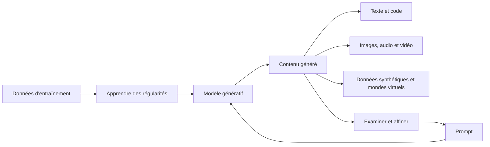

# Introduction et capacités de l’IA générative

## Table des matières

- [Statut](#statut)
- [Objectifs d’apprentissage](#objectifs-dapprentissage)
- [Carte conceptuelle](#carte-conceptuelle)
- [Concepts clés](#concepts-clés)
- [Application pratique](#application-pratique)
- [Travaux pratiques et activités](#travaux-pratiques-et-activités)
- [Révision du quiz](#révision-du-quiz)
- [Questions à revoir](#questions-à-revoir)
- [Synthèse finale](#synthèse-finale)

## Statut

- [x] Adaptation française rédigée à partir des notes canoniques anglaises.
- [ ] Révision personnelle de l’adaptation terminée.

La réussite du cours est documentée dans le registre des certificats. Elle ne constitue pas une preuve d’exécution de chaque activité décrite ci-dessous.

## Objectifs d’apprentissage

1. Décrire l’IA générative et son évolution.
2. La distinguer de l’IA discriminative.
3. Identifier les capacités de génération de texte, images, audio, vidéo, mondes virtuels, code et données.
4. Illustrer des usages de génération de texte.

## Carte conceptuelle



L’entraînement apprend les régularités ; le prompt oriente une sortie. L’examen du résultat permet d’affiner la demande. Le schéma distingue entraînement et prompting : chaque demande ne réentraîne pas le modèle.

## Concepts clés

### Contexte du cours et sources

Le cours enregistré s’adresse aux curieux, étudiants, professionnels et responsables, sans prérequis en programmation ou en IA. Il aborde successivement capacités, applications et outils, puis quiz, projet et bilan. Le projet est présenté comme facultatif dans la vue d’ensemble fournie.

Vidéos, lectures, laboratoires, points de vue d’experts, quiz, forums, synthèses, podcasts, jeux de rôle et dialogues servent de supports. Les estimations de travail autonome ne définissent pas un horaire de classe.

Les notes anglaises synthétisent « Course Overview », « Introduction to Generative AI », « Capabilities of Generative AI », le laboratoire de texte, les experts et les retours enregistrés. Elles décrivent ces supports, sans actualisation externe des produits.

L’orientation situe ce cours dans plusieurs parcours IBM : fondamentaux, IA appliquée avec Python et API, science des données et développement logiciel, ainsi que d’autres métiers. Les mentions de disponibilité ou « Coming Soon » appartiennent au contexte historique. Les autres sujets du parcours, tels que plateformes, éthique et carrières, ne deviennent pas pour autant des leçons supplémentaires de ce module.

### IA générative et IA discriminative

L’IA générative apprend des régularités pour produire du contenu guidé par une demande. Dans le contraste pédagogique du cours, une tâche discriminative attribue une catégorie ou prédit un résultat à partir d’une entrée.

| Comparaison | Tâche discriminative                        | Tâche générative                    |
| ----------- | ------------------------------------------- | ----------------------------------- |
| Question    | Quelle catégorie ou prédiction correspond ? | Quel contenu produire ?             |
| Courriel    | Classer en spam ou message légitime         | Générer un exemple de courriel      |
| Image       | Reconnaître un nid ou un œuf                | Générer un nid contenant trois œufs |
| Sortie      | Étiquette, score ou probabilité             | Texte, image ou autre contenu       |

Le dialogue utilise `P(X)` pour une distribution de données, `P(X, Y)` pour données et étiquettes, et `P(Y|X)` pour une étiquette conditionnée par l’entrée. Cette notation complète la distinction sans constituer un prérequis de programmation.

Il faut partir de la tâche et de la sortie, pas du nom du produit. Les experts évoquent aussi l’utilisation des LLM pour classer : un modèle génératif n’est pas limité à la création artistique. La formulation du cours selon laquelle l’IA discriminative ne comprendrait pas le contexte et dépendrait toujours du deep learning reste à clarifier ; elle n’est pas retenue comme règle universelle.

### Évolution et familles de modèles

Les supports attribuent les progrès aux modèles, aux volumes de données et au calcul.

| Repère dans la source  | Élément présenté                                                               |
| ---------------------- | ------------------------------------------------------------------------------ |
| Années 1950–1960       | Premiers apprentissages et exemple conversationnel à règles ELIZA              |
| Années 1980–1990       | Développement des réseaux de neurones, encore limités par les ressources       |
| Années 2000–début 2010 | Réseaux profonds, données et calcul ; Watson à Jeopardy en 2011 comme contexte |
| 2014                   | GAN attribués à Ian Goodfellow et ses collègues                                |
| 2015                   | Modèles de diffusion et inversion du bruit dans le podcast                     |
| 2017–2018              | « Attention Is All You Need », puis premier GPT en 2018                        |
| 2020–2023              | GPT-3, puis Gemini et watsonx                                                  |
| Exemples ultérieurs    | GPT-4o, Gemini 1.5, multimodalité, agents, Llama et Mistral                    |

Cette chronologie restitue les supports sans vérification historique indépendante. L’ordre GAN puis LSTM dans un passage expert, la qualification de « premier framework » dans un quiz et la date de « cette dernière année » restent incertains. Les premiers chatbots ne relevaient pas tous d’une même approche générative.

| Famille ou terme    | Explication introductive                                                           |
| ------------------- | ---------------------------------------------------------------------------------- |
| GAN                 | Un générateur et un discriminateur apprennent en opposition                        |
| VAE                 | Apprend des représentations permettant de générer des exemples similaires          |
| Transformer         | Famille associée aux modèles de langage modernes du cours                          |
| Diffusion           | Apprentissage d’une inversion progressive du bruit                                 |
| Autorégressif       | Production séquentielle, étape par étape                                           |
| Modèle de fondation | Base polyvalente adaptable à différents usages                                     |
| LLM                 | Modèle entraîné sur le langage, présenté comme une famille de modèles de fondation |

Les experts mentionnent aussi apprentissage supervisé, semi-supervisé, renforcement, préentraînement et ajustement. Aucune implémentation d’entraînement n’est fournie ici.

### Sept domaines de capacité

| Capacité                | Opérations décrites                                                        | Exemples d’usage                                                    |
| ----------------------- | -------------------------------------------------------------------------- | ------------------------------------------------------------------- |
| Texte                   | Compléter, dialoguer, expliquer, résumer, traduire, répondre               | Rédaction, assistants et soutien linguistique                       |
| Images                  | Créer et transformer des visuels ou styles                                 | Art, conception, jeux, imagerie et recherche                        |
| Audio                   | Composer, synthétiser la voix, modifier et améliorer le son                | Médias, éducation, accessibilité et réalité virtuelle               |
| Vidéo                   | Créer, éditer, compléter et transférer un style en maintenant la cohérence | Formation, simulation, divertissement et recherche                  |
| Code                    | Générer, compléter, corriger, expliquer, tester et documenter              | Développement, données, robotique, automatisation, jeux et AR/VR    |
| Données et augmentation | Produire des échantillons synthétiques diversifiés                         | Images, texte, parole, tableaux, séries temporelles et finance      |
| Mondes virtuels         | Environnements, objets, textures, sons et personnages                      | Jeux, apprentissage immersif, avatars et expériences personnalisées |

Une apparence réaliste ne prouve ni l’utilité ni l’exactitude d’un échantillon. Générer le comportement d’un personnage virtuel diffère de l’analyse du comportement existant d’une personne.

### Modèles et outils cités

| Association dans la source | Noms enregistrés                                                                                     |
| -------------------------- | ---------------------------------------------------------------------------------------------------- |
| Texte et langage           | GPT, GPT-3, GPT-4, ChatGPT, Gemini, PaLM, Llama                                                      |
| Images                     | DALL-E/DALL-E 2, Stable Diffusion, StyleGAN, DeepArt, MidJourney                                     |
| Audio                      | WaveGAN, MuseNet, Tacotron 2, Mozilla TTS                                                            |
| Vidéo et avatars           | VideoGPT, Synthesia                                                                                  |
| Code                       | GitHub Copilot, IBM Watson Code Assistant, AlphaCode                                                 |
| Contexte élargi            | IBM Granite, watsonx, GPT-4o, Gemini 1.5, Mistral, Hugging Face, watsonx Prompt Lab, Spellbook, Dust |

Ces associations ne vérifient ni disponibilité, ni tarifs, ni licence, ni performances actuelles. StyleGAN est associé aux images synthétiques, DeepArt au transfert visuel, DALL-E aux descriptions, et les outils audio à la musique ou à la parole. La présentation de VideoGPT comme outil piloté par texte reste à vérifier. « POM » dans une transcription semble diverger de « PaLM » dans la leçon ; la divergence reste signalée.

### Valeur et usage responsable

Les experts abordent création, résumé, extraction, classification, code et génération de configurations. Les bénéfices envisagés sont réduction des répétitions, variantes de conception, personnalisation et simulations dans plusieurs secteurs.

Le rapprochement entre RAG, données synthétiques et documents privés n’est pas suffisamment expliqué dans la source. Il ne démontre pas une garantie de confidentialité. Les exemples de fraude, recommandations et médicaments nécessitent aussi une clarification du rôle exact de la génération.

Le principe pratique reste de vérifier les faits et les usages. Vie privée, détournements, sécurité, biais, deepfakes, droits, emploi et environnement constituent des sujets de vigilance. Les prévisions concernant les modèles locaux ou les alternatives ouvertes restent des prévisions.

## Application pratique

| Situation du dialogue                     | Sortie possible                                                 | Distinction à conserver                                                   |
| ----------------------------------------- | --------------------------------------------------------------- | ------------------------------------------------------------------------- |
| Petite entreprise sur les réseaux sociaux | Textes, légendes, visuels et courtes vidéos                     | Associer chaque besoin à une capacité ; aucun résultat marketing mesuré   |
| Étudiant bloqué sur une fonction          | Explication, démarche, code, commentaires et pistes de débogage | Comprendre et améliorer au lieu de copier sans examen                     |
| Podcast nécessitant une musique           | Audio décrit par ambiance, genre, tempo et durée                | La sortie demandée est sonore ; réutilisation selon la licence de l’outil |

Aucun artefact produit ni résultat mesuré n’est fourni pour ces scénarios. Ils ne décrivent pas de nouveaux services KRAAK ou des travaux réalisés.

## Travaux pratiques et activités

### Laboratoire enregistré : génération de texte

L’exercice utilise IBM Generative AI Classroom sans imposer ici un modèle. Les libellés d’interface rapportent le support enregistré et ne garantissent pas l’interface actuelle. Les prompts restent en anglais pour préserver les exemples d’origine.

1. Saisir une demande contextualisée dans **Type your message** :

   ```plaintext
   Write a short poem about the moon.
   ```

2. Pour cet exercice d’introduction, laisser le champ séparé **Prompt Instructions** de côté.
3. Choisir **Start chat**, puis examiner la réponse à droite.
4. Utiliser au besoin **Regenerate response**, relire et adapter.

Dans la même conversation, transformer le poème :

```plaintext
Convert this poem into a short story.
```

Puis demander une synthèse :

```plaintext
Create a summary of this story.
```

Comparer les trois formes : poème, récit, résumé. La source renvoie de manière incohérente à « Step 2 » et nomme ensuite « Start chat field » comme champ de saisie ; ces ambiguïtés d’interface restent à clarifier.

Les cinq autres propositions portent sur un fait spatial, le fonctionnement d’un vélo, trois poèmes connus de William Wordsworth, une campagne de mode et une fiche de poste de concepteur pédagogique. Les réponses factuelles doivent être vérifiées. Les sorties personnelles du laboratoire ne sont pas fournies : aucune exécution n’est revendiquée ici.

### Dialogue enregistré : expliquer les capacités

Le dialogue relie distinction génératif/discriminatif, modalités et scénarios métier, code et musique. Il ajoute modèles 3D, animation et données synthétiques. L’exercice consiste à expliquer ce qui serait produit et pourquoi cela répond au besoin.

## Révision du quiz

Le retour sur les personnages virtuels distingue l’analyse d’un comportement observé de la synthèse de réponses, gestes, expressions ou traits d’un avatar. Une réponse est signalée incorrecte, mais le choix sélectionné n’est pas conservé séparément.

Les autres notions renforcées sont apprentissage statistique, génération de langage et résumés, précision des descriptions, GAN et repère 2014, et conversion d’un script en présentation audiovisuelle. La prétention historique de « premier framework » et les capacités actuelles de l’outil vidéo restent non vérifiées.

La révision conserve les concepts sans banque de réponses. Les retours individuels ne prouvent ni score global ni réussite du cours ; celle-ci est documentée séparément par le certificat.

## Questions à revoir

### Clarifications des sources

- Quelle portée donner aux affirmations sur le contexte et l’apprentissage profond ?
- Comment corriger l’ordre historique GAN/LSTM et évaluer la formule « premier framework » ?
- Faut-il lire PaLM plutôt que « POM », et VideoGPT est-il bien conditionné par texte dans l’exemple ?
- Comment distinguer données synthétiques, RAG et accès documentaire privé ? Quel rôle génératif jouent les exemples de fraude et recommandations ?
- Que contenait l’image « Helpful Tips for Course Completion », dont seul un lien temporaire était fourni ?
- Quelle période vise « cette dernière année » ? Quelles sources soutiennent les projections Bloomberg de 1 300 milliards de dollars en 2032, McKinsey et les affirmations démographiques ?

### Approfondissement personnel

- Puis-je expliquer la distinction avec un nouvel exemple d’entrée et de sortie ?
- Puis-je retrouver les sept domaines, y compris données synthétiques et mondes virtuels ?
- Lors de l’exécution du laboratoire, que vérifier entre poème, histoire et résumé ?
- Quels exemples restent trop ambigus pour une démonstration fiable ?

## Synthèse finale

L’IA générative produit du contenu à partir de régularités apprises et d’une demande. Le module la compare aux tâches de classification et de prédiction, présente familles de modèles et sept domaines de sortie, puis propose génération, transformation et résumé dans une conversation.

Choisir la bonne sortie, préciser le contexte et examiner le résultat sont les acquis pratiques. Les ambiguïtés historiques, commerciales et documentaires sont conservées explicitement ; elles ne sont pas remplacées par des affirmations actuelles ou des résultats inventés.
