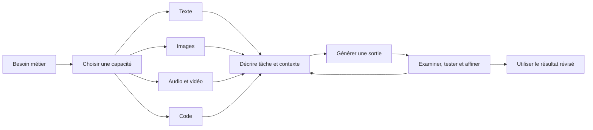

# Applications et outils de l’IA générative

## Table des matières

- [Statut](#statut)
- [Objectifs d’apprentissage](#objectifs-dapprentissage)
- [Carte conceptuelle](#carte-conceptuelle)
- [Concepts clés](#concepts-clés)
- [Application pratique](#application-pratique)
- [Travaux pratiques et activités](#travaux-pratiques-et-activités)
- [Révision du quiz](#révision-du-quiz)
- [Questions à revoir](#questions-à-revoir)
- [Synthèse finale](#synthèse-finale)

## Statut

- [x] Adaptation française rédigée à partir des notes canoniques anglaises.
- [ ] Révision personnelle de l’adaptation terminée.

La réussite du cours figure dans le registre des certificats. Les activités décrites sans sorties conservées ne sont pas présentées comme des exécutions vérifiées.

## Objectifs d’apprentissage

1. Identifier les applications de l’IA générative dans différents secteurs.
2. Explorer les familles de modèles et outils pour texte, code, image, audio et vidéo.
3. Illustrer l’usage d’outils de génération de texte, d’images et de code.

## Carte conceptuelle



Le besoin détermine le contenu attendu ; les prompts et la révision encadrent son obtention. Les laboratoires portent sur texte, image et code ; audio et vidéo sont introduits par des exemples. Les outils n’utilisent pas nécessairement le même modèle et aucune sortie n’est automatiquement fiable.

## Concepts clés

### Sources et périmètre

Les notes synthétisent les leçons sur applications, potentiel économique, outils et laboratoires, les experts, la comparaison génératif/agentique, le jeu de rôle, la réflexion professionnelle et les retours de quiz. Noms de produits, interfaces, chiffres et exemples restituent le cours enregistré, sans actualisation externe. Explications du cours, réponses d’activité et expérience personnelle sont distinguées.

### Applications sectorielles

Une **capacité** décrit ce que produit un système ; une **application** l’insère dans un processus. Générer du texte est une capacité ; rédiger une offre d’emploi est une application. Certains outils combinent génération, classification, prédiction et automatisation.

| Domaine                | Applications décrites                                                                                                 | Exemples cités                                                                              |
| ---------------------- | --------------------------------------------------------------------------------------------------------------------- | ------------------------------------------------------------------------------------------- |
| Informatique et DevOps | Code, tests et données synthétiques, logs, dépannage, documentation, CI/CD, interfaces, infrastructure et maintenance | GitHub Copilot, Snyk DeepCode, Applitools, Testim, Watson AIOps, Moogsoft AIOps, GitLab Duo |
| Divertissement         | Musique, récits, scripts, vidéos, jeux, animation, localisation et avatars                                            | SideFX Houdini                                                                              |
| Éducation              | Contenus, traduction, simulation, retours, évaluation et parcours adaptés                                             | NOLEJ, Duolingo                                                                             |
| Banque et finance      | Scénarios de fraude et risque, crédit, sentiments, conversations, conformité, prévisions et portefeuilles             | KAIGPT, DataRobot, Personetics, AIO Logic, Bloomberg GPT                                    |
| Santé et médecine      | Images et cas rares synthétiques, molécules, recherche, conversations, dossiers et fraude                             | Rasa pour les conversations                                                                 |
| Ressources humaines    | Offres, recrutement, planification, intégration, engagement, performance, formation et politiques                     | watsonx Orchestrate, Talentaria, Leena AI, Macorva                                          |

Chaque usage doit relier besoin, sortie et méthode d’évaluation. Le tableau ne prouve pas que chaque produit réalise toutes les tâches de sa ligne. Les exemples cliniques, de crédit, de handicap et de recrutement nécessitent une clarification de leur contribution générative ; ils ne constituent pas des recommandations professionnelles. La qualification de « premier » pour KAIGPT reste non vérifiée.

### Potentiel économique

La lecture attribue à Gartner trois groupes : **revenus** par de nouveaux produits et canaux, **coûts et productivité** par l’aide aux contenus et processus, et **réduction des risques** par l’analyse des transactions, du code ou d’autres données. Elle distingue processus sectoriels et fonctions transversales : marketing, conception, communication, formation et logiciel. Elle cite aussi industrie, architecture, ingénierie, automobile, aéronautique, défense, électronique et énergie.

Le [lien Gartner conservé](https://www.gartner.com/en/topics/generative-ai) est une référence de la source, sans vérification actuelle. Les projections attribuées à McKinsey concernent l’IA générative **et d’autres technologies** : activités représentant 60–70 % du temps des employés, et automatisation possible de la moitié des activités entre 2030 et 2060. Elles ne décrivent ni une proportion d’emplois supprimés ni un résultat observé. Le rapport nommé est _The economic potential of generative AI: The next productivity frontier_ ; son lien annoncé manque dans le support.

### Outils textuels

Les LLM apprennent des régularités linguistiques permettant conversations, transformations et textes contextualisés. Le cours évoque récit, plan de présentation, traduction, marketing, résumé, calcul et code.

| Famille de tâches                            | Exemples cités                    |
| -------------------------------------------- | --------------------------------- |
| Conversation, rédaction, explication et code | ChatGPT, Google Gemini            |
| Marketing                                    | Jasper, Rytr, Copy.ai, WriteSonic |
| Résumé                                       | Resoomer                          |
| Classification                               | uClassify                         |
| Analyse de sentiments                        | Brand24, Reputate                 |
| Traduction                                   | LanguageWeaver, Yandex            |
| Options locales ou orientées confidentialité | GPT4ALL, H2O.ai, PrivateGPT       |
| Autres exemples des experts                  | Frase.io, Microsoft Copilot       |

Les comparaisons ChatGPT/Gemini ne sont pas des classements actuels. La description de Gemini par PaLM dans un laboratoire diverge de celle des modèles Gemini ailleurs. Les affirmations générales sur collecte, fonctionnement hors ligne, absence de carte graphique et confidentialité des outils ouverts demandent une vérification propre à chaque installation.

### Génération et transformation d’images

| Technique                    | Description du cours                                                             |
| ---------------------------- | -------------------------------------------------------------------------------- |
| Texte vers image             | Décrire sujet, décor et style ; exemple du bateau au coucher du soleil           |
| Image vers image             | Transformer en conservant le contenu pertinent : dessin/photo ou satellite/carte |
| Transfert et fusion de style | Appliquer ou combiner des styles                                                 |
| Inpainting                   | Remplir ou remplacer une zone interne                                            |
| Outpainting                  | Étendre l’image au-delà de ses bords                                             |

DALL-E, Stable Diffusion, StyleGAN, Midjourney, Bing Image Creator et Adobe Firefly sont cités. Les liens avec modèles, API, Creative Cloud, données d’entraînement, langues et accès gratuit restent des affirmations des supports. Les transcriptions « FreePic », « Crayon », « Pixar », « DALI » et le nom Freepik dans un quiz restent à rapprocher des originaux. Le laboratoire nomme **GPT Image 2** : cette identité est conservée séparément des exemples vidéo.

### Audio, vidéo et mondes virtuels

| Finalité audio | Opérations décrites                                                       | Exemples cités                                      |
| -------------- | ------------------------------------------------------------------------- | --------------------------------------------------- |
| Parole         | Synthèse, choix ou clonage de voix, prononciation, rythme, ton et émotion | LOVO, Synthesia, Murf.ai, « Listenr »               |
| Musique        | Mélodies, instruments, morceaux, mixage et distribution                   | AudioCraft, Amper, AIVA, Soundful, Magenta, WavTool |
| Amélioration   | Réduction du bruit, nettoyage et effets                                   | Descript, Audo AI                                   |

La leçon associe Runway Gen-1 à la transformation stylistique et Gen-2 à la génération depuis texte, image ou vidéo. EaseUS et Synthesia illustrent montage, narration, formats et avatars. Le scénario documentaire sur les arbres urbains combine plusieurs médias. L’attribution à Runway d’un rôle dans _Everything Everywhere All at Once_ reste non vérifiée.

The Sandbox illustre les jeux partagés ; Scenario AI, les ressources de jeux mobiles. Aucun laboratoire de construction de monde, d’audio ou de vidéo n’est fourni. Chiffres de marché, heures d’entraînement d’AudioCraft, options vocales, langues et association de WavTool à un modèle restent des données rapportées, sans garantie actuelle ni autorisation de réutilisation.

### Code : outils et limites

Le cours couvre génération depuis une demande, complétion, correction, optimisation, refactorisation, conversion de langage, documentation, algorithmes et parfois images en entrée.

| Exemple                              | Rôle décrit                                                                        |
| ------------------------------------ | ---------------------------------------------------------------------------------- |
| ChatGPT et Gemini                    | Générer, expliquer, déboguer, convertir et aider à apprendre                       |
| GitHub Copilot                       | Suggestions contextualisées dans l’éditeur, associées à Codex par la source        |
| PolyCoder                            | Modèle présenté comme dérivé de GPT-2, entraîné sur douze langages, notamment le C |
| IBM Watson Code Assistant            | Suggestions, complétion, restructuration et analyse, associées à watsonx.ai        |
| CodeWhisperer, « Tab9 », « Repl.It » | Autres exemples de suggestion et de codage interactif                              |

Un code syntaxiquement plausible n’est pas nécessairement correct. Il faut exécuter, tester, réviser et examiner sécurité, biais et effets nuisibles. Les affirmations sur GPT-3.5, septembre 2021 ou l’impossibilité de programmes complexes dépendent du modèle et de l’époque. Les promesses de bonnes pratiques ne remplacent pas les tests. L’ajustement avec des données d’entreprise est mentionné sans procédure ni garantie de faibles besoins de calcul.

### Perspectives des experts

Les experts citent retours pédagogiques selon une grille, assistant Ty de Skills Network, images médicales synthétiques, molécules et protéines, exemples DeepMind et Insilico Medicine, et projet IRM attribué à NVIDIA/King’s College London. En finance apparaissent COIN de JPMorgan, prédictions attribuées à Goldman Sachs, conversations et fraude.

Le rôle précis de la génération n’est pas toujours séparé de la prédiction. Ces témoignages ne prouvent pas bénéfice clinique, confidentialité, résultat financier ou fonctionnalité déployée.

### IA générative et IA agentique

| Aspect      | Interaction générative                      | Système agentique décrit                                    |
| ----------- | ------------------------------------------- | ----------------------------------------------------------- |
| Départ      | Demande de contenu                          | Objectif nécessitant plusieurs étapes                       |
| Séquence    | Génération, examen humain, nouvelle demande | Observer, décider, agir et utiliser le retour               |
| Exemple     | Script, miniature ou musique                | Rechercher des produits et prix, ou préparer une conférence |
| Rôle humain | Choisir et affiner à chaque étape           | Fournir l’objectif et intervenir au besoin                  |

Les LLM peuvent participer aux deux systèmes. Le terme « chain-of-thought » sert dans la leçon à illustrer une décomposition, sans spécifier une architecture universelle ni autoriser un achat autonome. La convergence future entre création et action reste une perspective.

## Application pratique

### Jeu de rôle enregistré : capacités et résultats

Le scénario demande de jouer un responsable de l’innovation face au dirigeant Duncan Campbell, d’expliquer **trois capacités** et **deux cas mesurables**, en langage accessible. La réponse enregistrée organise le propos autour de création de contenu, synthèse/transformation de l’information, puis assistance aux tâches et aux processus.

| Cas rapporté         | Mesures citées dans la réponse                                                                                                                                                                               | Limite conservée                                                                           |
| -------------------- | ------------------------------------------------------------------------------------------------------------------------------------------------------------------------------------------------------------ | ------------------------------------------------------------------------------------------ |
| Assistant Klarna     | Premier mois : 2,3 millions de conversations, environ deux tiers des échanges ; 11 minutes à moins de 2 ; demandes répétées −25 % ; satisfaction comparable ; projection de 40 millions de dollars pour 2024 | Compte rendu attribué et projection, sans vérification actuelle ni promesse de réplication |
| Étude GitHub Copilot | 95 développeurs ; tâche JavaScript environ 55 % plus rapide ; 1 h 11 contre 2 h 41 ; achèvement 78 % contre 70 %                                                                                             | Comparaison sur une tâche contrôlée, pas multiplicateur universel                          |

Références conservées : [annonce Klarna](https://www.klarna.com/international/press/klarna-ai-assistant-handles-two-thirds-of-customer-service-chats-in-its-first-month/) et [étude GitHub](https://github.blog/news-insights/research/research-quantifying-github-copilots-impact-on-developer-productivity-and-happiness/). Elles proviennent de la réponse d’activité, pas automatiquement de cas validés par IBM.

La réponse propose un pilote ciblé et mesuré. Le retour demande de se présenter et de reconnaître le rôle du dirigeant avant l’explication. Aucun score global ni déploiement achevé n’est fourni.

### Réflexion professionnelle consignée

La réflexion anglaise décrit les usages de l’auteur, développeur et étudiant indépendant : révision Angular/NestJS pour KRAAK Consulting, recherche de problèmes i18n, audits de code, suggestions de tests, lecture des résultats de lint, typage et compilation ; campagnes et carrousels ; rapports ; structuration de notes, exemples, présentations et scripts de révision audio.

L’auteur rapporte moins de temps bloqué et de répétitions, tout en conservant la responsabilité des tests et de la vérification des contenus contre les sources et documents fiables. Les anciens scripts audio ne créent pas de nouveaux livrables audio dans ce dépôt.

## Travaux pratiques et activités

### Limite des preuves

Les étapes suivantes conservent les exercices fournis. Comptes, interfaces et modèles restent à confirmer pour une démonstration actuelle. Les procédures d’inscription répétées sont condensées ; aucune capture manquante ni sortie personnelle n’est reconstruite.

### Texte : courriel

Utiliser le parcours d’accès enregistré à [ChatGPT](https://chat.openai.com/), demander un courriel de suivi après assistance pour un représentant de **XYZ Inc.**, préciser sujet et contexte, puis relire et affiner. Les cinq variantes sont rendez-vous avec un professeur, suivi de candidature, invitation à un événement interne, rappel de mise à jour de projet et annonce de produit. Vérifier faits, ton, grammaire et destinataire.

### Texte : conversion

Décrire une recette avec **500 grammes de farine** et une balance en onces. Demander facteur et conversion, puis vérifier les deux. Les variantes portent sur aire d’un triangle, moyenne de cinq nombres aléatoires et intérêt simple. Aucun résultat numérique personnel n’est fourni.

### Résumé avec Gemini, facultatif

Le support justifie le caractère facultatif par une disponibilité régionale possible. Suivre son parcours [Gemini](https://gemini.google.com/?hl=en), demander un paragraphe résumant [l’article IBM watsonx Assistant](https://www.ibm.com/blog/ibm-watsonx-assistant-transforms-content-into-conversational-answers-with-generative-ai/), puis comparer au texte, refaire et adapter au besoin. L’article n’est pas fourni dans les notes : aucun résumé n’est inventé. L’incohérence PaLM/Gemini demeure.

### Images dans Generative AI Classroom

Le modèle enregistré est **GPT Image 2**, avec prompts anglais et sorties variables. Le premier exercice commence à « Step 2 » ; la préparation manquante n’est pas reconstituée.

1. Demander une image scientifiquement exacte du système solaire avec soleil et planètes ; utiliser **Start chat**, examiner, régénérer et enregistrer. La demande d’exactitude ne prouve pas le résultat.
2. Pour des savons biologiques colorés et doux pour la peau, choisir le modèle et demander des emballages ; examiner et sauvegarder.
3. Dans une nouvelle conversation nommée, demander des personnes buvant une boisson froide dans un jardin fleuri sous ciel bleu avec nuages blancs ; examiner et affiner.
4. Pratiquer les trois scénarios supplémentaires : affiche d’économie d’eau, bateau sur une rivière et bannière de Formule 1.

### Copilot et Designer, facultatifs

Le support évoque l’accès par compte, mais contient une contradiction sur le caractère obligatoire de la connexion Copilot. Gratuité illimitée et modèles sous-jacents ne sont pas confirmés.

- **Légendes :** dans [Copilot](https://copilot.microsoft.com/), suivre l’accès personnel décrit, joindre une image via **Add an image** dans **Message Copilot**, demander une légende et réviser. Pratiquer avec **trois images** ; le lien pédagogique concerne accessibilité et compréhension.
- **Miniatures :** demander une miniature sur l’importance d’une certification IBM, examiner et télécharger ; pratiquer avec **trois miniatures**.
- **Publications :** dans [Designer](https://designer.microsoft.com/), choisir **Social Posts**, décrire une publication sur la certification IBM, format **Landscape**, puis **Create**. Les images personnelles sont permises dans l’exercice ; pratiquer avec **trois publications**.

### Code : salutation en C

Demander un programme C simple affichant exactement :

```plaintext
Hello and welcome to the generative AI world!
```

Lire le code et l’explication. Le cours utilise CodeTester : **Run Some Code**, choisir C, remplacer le code initial, exécuter et observer. Un autre compilateur accessible est permis par la source, sans sélection nouvelle ici. Destination et captures CodeTester manquent ; aucun programme ou résultat exécuté n’est inventé.

### Code : JavaScript vers Python

Dans une nouvelle conversation, demander du JavaScript produisant un nombre aléatoire entre **1 et 100**, puis convertir ce code en **Python** dans le même fil. Le support nomme Programiz Python Online Compiler : remplacer le code initial, exécuter, observer, puis réexécuter. Il ne fournit ici ni lien ni sortie observée. Les affirmations datées sur les bibliothèques de 2021 ne remplacent pas les tests.

## Révision du quiz

Les retours renvoient aux leçons sans conserver systématiquement choix, ordre des tentatives ou score global. Aucune erreur personnelle précise n’est inférée.

| Notion                 | Raisonnement à conserver                                             |
| ---------------------- | -------------------------------------------------------------------- |
| Texte et présentations | Une suggestion de plan ne prouve pas une présentation finalisée      |
| Code                   | Distinguer génération, traduction, explication et complétion         |
| Image                  | Distinguer création, variation, style et extension des bords         |
| Vidéo                  | Contraste enregistré entre transformation Gen-1 et génération Gen-2  |
| Secteurs               | Distinguer synthèse, prédiction et automatisation dans les scénarios |
| Économie               | Séparer activités, temps et emplois ; projections et observations    |
| Texte des LLM          | Relier sortie contextuelle et régularités apprises                   |

Identifier la sortie, distinguer création et transformation, puis examiner le résultat constitue le fil conducteur.

## Questions à revoir

### Lacunes et contradictions

- Retrouver date et lien du rapport McKinsey ; vérifier les cas Klarna et Copilot avant usage probant.
- Clarifier la série audio « 229 millions en 2022 », « 28,6 % » et « 2 000 660 millions en 2032 » : unité ou transcription incertaine.
- Identifier modèles et interfaces Gemini, accès régional et portée des comparaisons Search/Scholar.
- Vérifier les noms ambigus, API, données, langues, modèles et gratuité évoqués.
- Retrouver la préparation manquante du laboratoire d’images et la configuration correspondant à GPT Image 2.
- Réconcilier connexion et gratuité Copilot ; retrouver destinations et captures CodeTester/Programiz.
- Vérifier les assertions de confidentialité et d’exécution locale, ainsi que celles sur PolyCoder.
- Distinguer génération, prédiction et automatisation dans chaque cas sectoriel et chercher les preuves primaires des résultats attribués.
- Déterminer si la décomposition décrite dans la leçon agentique est un exemple ou une prétention universelle.

### Approfondissement

- Puis-je relier besoin, sortie et vérification concrète ?
- Puis-je distinguer inpainting et outpainting sans citer de produit ?
- Puis-je conserver le contexte pendant une réécriture, un résumé ou une conversion de code ?
- Lors d’une exécution, que demander, affiner et vérifier ?
- Puis-je présenter mon rôle, reconnaître mon public et qualifier les preuves d’un cas métier ?

## Synthèse finale

Ce module associe capacités génératives et besoins sectoriels, présente les familles d’outils et distingue interaction de génération et poursuite d’un objectif en plusieurs actions. Les laboratoires couvrent texte, conversions, résumé, images, design facultatif et code avec exécution.

La communication métier demande des preuves qualifiées ; la pratique professionnelle demande une validation personnelle. Le cycle commun consiste à définir la sortie, donner le contexte, produire, vérifier et affiner, en laissant visibles les incertitudes et les éléments manquants.
