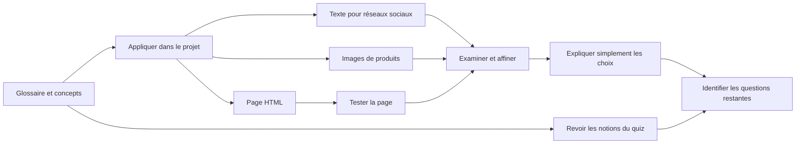

# Quiz, projet et bilan du cours

## Table des matières

- [Statut](#statut)
- [Objectifs d’apprentissage](#objectifs-dapprentissage)
- [Carte conceptuelle](#carte-conceptuelle)
- [Concepts clés](#concepts-clés)
- [Application pratique](#application-pratique)
- [Travaux pratiques et activités](#travaux-pratiques-et-activités)
- [Révision du quiz](#révision-du-quiz)
- [Questions à revoir](#questions-à-revoir)
- [Synthèse finale](#synthèse-finale)

## Statut

- [x] Adaptation française rédigée à partir des notes canoniques anglaises.
- [ ] Révision personnelle de l’adaptation terminée.

Le certificat documente séparément la réussite du cours. Les notes historiques ne fournissent pas les résultats de chaque exercice ni le score global du quiz.

## Objectifs d’apprentissage

1. Mobiliser les concepts du cours dans un projet et un quiz noté.
2. Préparer les prochaines étapes d’apprentissage.

## Carte conceptuelle



Le glossaire soutient les trois tâches du projet. Texte et images sont affinés ; le HTML est aussi exécuté et inspecté. Dialogue et quiz permettent d’identifier les points à approfondir. Cette carte décrit le travail proposé, sans prouver son exécution.

## Concepts clés

### Sources et rôle du module

Ce bilan rassemble glossaire, « Final Project: Generating Text, Images, and Code », dialogue d’explication simple et retours du quiz final. Le [contexte du module 01](./01-introduction-and-capabilities-of-generative-ai.md#contexte-du-cours-et-sources) présente le projet comme facultatif. Les choix antérieurs de démonstration par un animateur avec pratique facultative appartiennent au contexte pédagogique source et ne changent pas l’évaluation Coursera.

Modèles, interfaces, quotas et produits restent des descriptions enregistrées. Les supports ne fournissent ni grille officielle, ni modalités de soumission, ni seuil de réussite, ni artefacts achevés, ni score global. Les deux rubriques de clôture n’ont pas de contenu fourni.

### Glossaire du cours

| Terme                     | Sens retenu                                                                                               |
| ------------------------- | --------------------------------------------------------------------------------------------------------- |
| Augmentation des données  | Accroître quantité et diversité des données d’entraînement                                                |
| Apprentissage profond     | Sous-ensemble de l’apprentissage automatique utilisant des réseaux de neurones                            |
| Modèle de diffusion       | Apprend à retirer du bruit pour produire des échantillons, notamment des images                           |
| IA discriminative         | Distingue des classes de données                                                                          |
| Modèles discriminatifs    | Apprennent des régularités pour identifier, classer ou prédire                                            |
| Modèles de fondation      | Bases polyvalentes adaptables à des usages spécialisés                                                    |
| GAN                       | Générateur d’échantillons et discriminateur opposant réel et généré                                       |
| IA générative             | Produit texte, images, audio, vidéo et autres contenus                                                    |
| Modèles génératifs        | Apprennent régularités et structure des données pour générer                                              |
| GPT                       | Famille de modèles de langage OpenAI préentraînés fondés sur les Transformers                             |
| LLM                       | Modèles profonds entraînés sur de vastes textes ; génération, traduction, résumé et analyse de sentiments |
| Apprentissage automatique | Apprend à partir de données pour prédire ou décider                                                       |
| IA multimodale            | Traite plusieurs types d’entrées et produit un ou plusieurs formats                                       |
| NLP                       | Traitement, interprétation et génération du langage humain                                                |
| Réseaux de neurones       | Modèles computationnels inspirés des systèmes neuronaux                                                   |
| Prompt                    | Instruction, question, image, audio ou autre entrée guidant la génération                                 |
| Données d’entraînement    | Exemples utilisés pour apprendre un modèle                                                                |
| Transformers              | Architecture à auto-attention pour traiter des séquences                                                  |
| VAE                       | Encode les données dans un espace latent puis les reconstruit ou en génère                                |

Les dix-neuf entrées conservent l’ordre du glossaire source. Elles servent de référence, sans ajouter des leçons.

### Application des concepts

Le projet relie contexte et prompt à un texte d’annonce, à des images de bouteilles pour une entreprise fictive de nettoyage et à une page HTML testée dans un navigateur. Public, message, plateforme, valeur, engagement, visuels et appel à l’action guident le texte. Une demande de réalisme ou d’engagement ne démontre pas un produit existant ni un résultat marketing.

## Application pratique

### Dialogue : expliquer l’IA générative à un collègue

La réponse enregistrée présente la création de contenus à partir de régularités, puis l’analogie culinaire : étudier des recettes permet d’identifier des combinaisons pour en proposer une nouvelle. Cette analogie ne suppose pas une compréhension humaine du modèle.

Les exemples professionnels sont courriels, rapports, résumés, présentations, traduction, marketing, retours clients, idées, code, explication d’erreurs, tests et documentation. Le bénéfice envisagé porte sur premières versions et répétitions, sans mesure fournie.

La réponse suggère ChatGPT pour idées, rédaction, réécriture et images, puis Canva pour la mise en forme visuelle. Elle conserve une [référence OpenAI sur les images](https://openai.com/academy/image-generation/) et une [référence Canva sur la rédaction](https://www.canva.com/features/ai-writing-assistant/). Ces liens proviennent de l’activité ; ils ne prouvent ni actualité ni obligation d’outil dans le projet.

Le retour demande de mieux adapter les exemples au métier, par exemple responsable marketing ou chef de projet. Aucun score global n’est conservé.

## Travaux pratiques et activités

### Projet enregistré : texte, images et code

Le support nomme **GPT-5 Nano** pour texte/code et **GPT Image 2** pour les images dans Generative AI Classroom. Il évoque une limite quotidienne et une attente de 24 heures ou du délai affiché, sans quota chiffré. Accès et remise à zéro ne sont pas vérifiés ; l’interface applicable doit guider une exécution réelle.

Captures, exemples produits et résultats sont absents. Les prompts littéraux sont conservés en anglais.

### Exercice 1 : publications sociales

1. Nommer la conversation **Text Generation** avec le contrôle crayon.
2. Choisir **GPT-5 Nano**.
3. Dans **Prompt Instructions**, présenter la gamme mobile fictive **MobiZ10**, annoncée avant la fin du mois, et le souhait d’un tweet suscitant de l’intérêt.
4. Le support indique que ces instructions deviennent verrouillées après le démarrage ; le comportement actuel reste à confirmer.

Dans **Type your message**, saisir :

```plaintext
What's a catchy way to share this news on Twitter?
```

Choisir **Start chat**, examiner, adapter et éventuellement **Regenerate response** ; enrichir ensuite le contexte dans la conversation. Les deux variantes sont une publication **Instagram** pour un concours de festival et une annonce **Facebook** aux employés pour un événement interne. Vérifier les faits et l’usage ; aucune publication n’est effectuée par ces notes.

### Exercice 2 : images réalistes

Créer **Image generation**, sélectionner **GPT Image 2** et décrire une petite organisation fictive lançant des nettoyants à base de plantes. Marketing et développement collaborent avec conception graphique, emballage et marque.

Demander des bouteilles avec **étiquettes colorées ornées de plantes et feuilles**, devant des **surfaces propres et brillantes**. Lancer, inspecter, puis demander dans le même fil une infographie sur les bénéfices des nettoyants à base de plantes. La source ne fournit aucun bénéfice étayé ni infographie : aucune efficacité produit n’est inventée.

Les variantes portent sur visuels de manuel d’utilisation et images pour pages produit. Les véritables étapes de préparation et d’utilisation manquent ; un manuel réel demanderait ces informations.

### Exercice 3 : générer et tester du HTML

Créer **Code generation**, choisir **GPT-5 Nano**, puis utiliser l’instruction initiale :

```plaintext
Simple HTML webpage creation
```

Demander ensuite une page simple dont le titre visible est **Welcome to My Page.**, puis démarrer. Le support nomme JSFiddle, sans lien conservé, et autorise un autre environnement accessible sans en choisir un ici.

Copier le HTML dans le volet correspondant, exécuter **Run** et inspecter le résultat, notamment le titre. La disposition enregistrée comporte HTML, CSS, JavaScript et résultat ; elle n’est pas une vérification de l’interface actuelle. Aucun backend, déploiement ou système complet n’est demandé. Aucun code exécuté ni capture réussie n’est fourni.

## Révision du quiz

| Notion                    | Raisonnement à conserver                                                                                                  |
| ------------------------- | ------------------------------------------------------------------------------------------------------------------------- |
| Assistance au code        | Distinguer génération, affinage, explication et langages ; les noms Copilot/AlphaCode ne définissent pas des exclusivités |
| Visualisation produit     | Le réalisme d’une image ne prouve ni existence ni performance                                                             |
| Informatique et éducation | Distinguer génération, analyse d’anomalies et adaptation pédagogique                                                      |
| Limites du code           | Les affirmations sur les programmes complexes nécessitent modèle et version                                               |
| Outpainting               | Étend les bords ; ne se confond pas avec une simple hausse de résolution                                                  |
| Génératif/discriminatif   | Produire du contenu ou distinguer des classes                                                                             |
| Étendue des capacités     | Texte, image, audio, vidéo, code, augmentation et mondes virtuels                                                         |
| Outils marketing          | Le dernier retour renvoie seulement à la leçon de texte, sans choix ni explication                                        |

Il s’agit d’une révision conceptuelle, pas d’une banque de réponses. Les supports historiques ne permettent pas de reconstruire score, choix ou erreur personnelle ; le certificat de cours est une preuve distincte.

## Questions à revoir

### Éléments manquants

- Retrouver le texte de « Congratulations and Next Steps » et « Thanks from the Course Team », au lieu d’inventer leurs recommandations.
- Vérifier choix de modèles, verrouillage des instructions, quota et notification avant une démonstration.
- Retrouver les captures et destinations indispensables ; distinguer les consignes des résultats absents.
- Obtenir bénéfices étayés et instructions réelles avant toute adaptation du scénario produit à un cas concret.
- Retrouver grille, modalités et seuils d’évaluation si nécessaires ; les retours seuls ne suffisent pas.
- Vérifier séparément les recommandations de produits et les limites annoncées avant de les présenter comme actuelles.
- Clarifier le lien proposé par le quiz entre outpainting et résolution.

### Approfondissement

- Puis-je expliquer génératif/discriminatif avec les sorties du projet ?
- Puis-je distinguer données d’entraînement, prompt et résultat ?
- Comment adapter l’analogie culinaire au rôle du public ?
- Lors d’une exécution, quels changements et vérifications consigner ?
- Puis-je tester le comportement HTML demandé ?
- Quelles questions des modules précédents reprendre avant de poursuivre ?

Ces questions ne remplacent pas la leçon officielle de clôture manquante.

## Synthèse finale

Le glossaire soutient un projet de texte social, d’images et d’infographie, puis de HTML avec test. Le dialogue entraîne une explication accessible et adaptée au métier ; le quiz reprend capacités, usages et limites.

L’intérêt réside dans la relation entre demande et sortie, l’itération et la vérification. Les lacunes documentaires et les résultats non conservés restent visibles. La preuve de réussite du cours est fournie séparément par le certificat importé.
