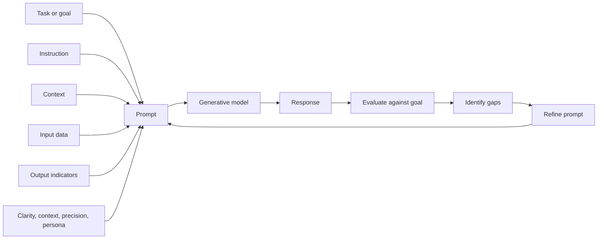

# Prompt Engineering for Generative AI

## Table of Contents

- [Status](#status)
- [Learning Objectives](#learning-objectives)
- [Concept Map](#concept-map)
- [Core Concepts](#core-concepts)
- [Practical Application](#practical-application)
- [Labs and Activities](#labs-and-activities)
- [Quiz Review](#quiz-review)
- [Questions to Revisit](#questions-to-revisit)
- [Final Summary](#final-summary)

## Status

- [ ] Complete
- [ ] Reviewed

## Learning Objectives

1. Define prompts and identify instruction, context, input data, and output indicators as core
   prompt building blocks.
2. Explain prompt engineering as an iterative process for improving model responses without
   retraining the model.
3. Apply clarity, context, precision, and role or persona when designing prompts.
4. Compare naive prompts with more deliberately engineered prompts, including prompts that use
   examples, constraints, and output requirements.
5. Describe the purpose of prompt engineering tools and apply basic prompting workflows in the
   recorded Generative AI Classroom labs.

## Concept Map



Prompt engineering starts with a task or goal, turns that goal into a structured prompt, evaluates
the model's response, and then refines the prompt when the result does not meet the intended
requirements. The four prompt building blocks help specify what the model should do and what the
response should look like, while prompt-writing practices such as clarity and precision reduce
ambiguity.

## Core Concepts

### Course Context and Source Basis

This module introduces prompt engineering for learners who want to work more deliberately with
Generative AI systems. The recorded course presents itself as suitable for professionals, students,
managers, practitioners, enthusiasts, and other learners without requiring a programming background
or college degree.

The recorded course has three modules:

1. **Prompt Engineering for Generative AI:** prompts, prompt structure, prompt-writing practices,
   and common prompt engineering tools.
2. **Prompt Engineering: Techniques and Approaches:** approaches such as the Interview Pattern,
   Chain-of-Thought, and Tree-of-Thought, plus techniques such as zero-shot and few-shot prompting.
3. **Course Quiz, Project, and Wrap-Up:** a final project, graded quiz, glossary material, guidance
   on next learning steps, and optional topics related to text-to-image prompting and IBM watsonx.

The course materials include videos, readings, labs, expert viewpoints, podcasts, role-play
activities, discussion prompts, practice quizzes, and graded assessment. The source gives several
self-paced timing suggestions, including roughly one to two hours per module and a possible
one-module-per-week cadence. These are recorded-course estimates, not a fixed classroom schedule.

These notes synthesize the supplied Module 1 material, including the course introduction, prompt and
prompt-engineering lessons, lab instructions, expert viewpoints, podcast recap, lesson summary,
practice and graded quiz feedback, and learner dialogue/reflection material. Product names, model
names, interface details, and feature descriptions below reflect the supplied course recording
unless explicitly marked otherwise; they are not a current product survey.

### Prompts and Prompt Engineering

A **prompt** is input supplied to a generative model to guide it toward a desired output. The source
uses prompts for tasks such as writing text, creating code, generating images, translating content,
summarizing information, and answering questions.

A prompt may be:

- a direct question,
- an instruction,
- a statement that the model should continue or act on,
- background information plus a task,
- examples that show the desired response pattern, or
- a sequence of instructions that develops over a conversation.

The source contrasts a minimal or **naive prompt** with a more deliberately specified prompt. For
example, a vague request for a story about a rich person from a small town does not establish the
character, transformation, timespan, or desired form. A stronger request specifies that the subject
is a farmer, that the transformation occurs over ten years, and that the model should write a short
story about the person's struggles and achievements.

**Prompt engineering** is the process of designing and refining prompts so a generative model is
more likely to produce useful responses aligned with a particular goal. In the source, prompt
engineering combines clear goal-setting, careful wording, context, examples or constraints when
useful, testing, and iterative revision.

Prompt engineering does not guarantee that an output is correct. The model response still needs to
be reviewed against the intended task, especially when accuracy, safety, business impact, or other
high-stakes considerations matter.

### Four Building Blocks of a Prompt

The course identifies four building blocks for a well-structured prompt.

| Building block        | Purpose                                                                            | Source-style example                                                                                  |
| --------------------- | ---------------------------------------------------------------------------------- | ----------------------------------------------------------------------------------------------------- |
| **Instruction**       | States what the model should do.                                                   | Write an essay analyzing the effects of global warming on marine life.                                |
| **Context**           | Supplies background that helps the model interpret the task.                       | Explain that recent climate changes have affected marine environments before requesting the analysis. |
| **Input data**        | Provides material or facts the model should operate on.                            | Supply temperature and sea-level records from the Pacific Ocean for the requested analysis.           |
| **Output indicators** | Defines expected form, tone, length, organization, or other response requirements. | Request a 600-word essay, a table, bullet points, a specific tone, or a fixed number of items.        |

The building blocks do not need to appear in a rigid order. Their purpose is to make the task and
the expected response easier for the model to interpret.

**In my own words:** the prompt should tell the model what job it is performing, what situation or
information matters, what material it should use, and what a satisfactory answer should look like.

### From Naive Prompts to Engineered Prompts

A naive prompt can still produce a plausible response, but it often leaves important decisions to
the model. Prompt engineering reduces that ambiguity by making requirements explicit.

The ship-captain example in the source illustrates the difference. A request such as "What's the
weather?" is insufficient for navigation because weather depends on location, time, route, and the
conditions relevant to the voyage. A more useful prompt can specify:

- the route or geographic area,
- the forecast period,
- wind speed and direction,
- wave height,
- visibility,
- precipitation or storms,
- a compact table for rapid scanning, and
- a short summary of navigation risks.

The important lesson is not the maritime domain itself. The lesson is that a complex task becomes
more usable when the prompt identifies the decision context and the response format needed by the
user.

### Iterative Prompt Refinement

The source presents prompt engineering as a repeated cycle rather than a one-time act of writing.

1. **Define the goal.** Decide what the model should produce and why.
2. **Draft the initial prompt.** State the task in a question, instruction, statement, or scenario.
3. **Test the prompt.** Generate a response.
4. **Evaluate the response.** Compare the output with the original goal.
5. **Identify gaps.** Determine what is missing, unclear, too broad, poorly formatted, or otherwise
   misaligned.
6. **Refine and repeat.** Change the relevant parts of the prompt and test again.

The source's automobile-industry example begins with a broad request for an article about benefits
and risks of AI in cars. The prompt is then expanded to request positive and negative effects,
ethical issues, examples such as autonomous driving and traffic analysis, technical complexity,
cybersecurity, and implications for vehicle safety.

A key principle from the learner dialogue is to **evaluate the previous response before rewriting
the prompt**. Refinement should address observed gaps rather than changing the prompt blindly.

### Four Prompt-Writing Practices

The module emphasizes four dimensions for improving prompts: **clarity, context, precision, and role
or persona**.

#### Clarity

Use direct language and make the requested task understandable. Avoid unnecessarily complicated
terms when simpler wording expresses the same requirement.

The source contrasts an opaque description of photosynthesis with a direct request to explain
photosynthesis and the roles of chlorophyll, sunlight, carbon dioxide, and water.

#### Context

Give background that helps the model understand the situation, audience, purpose, or domain of the
request. Context can include people, places, events, conditions, or why the response will be used.

A historical prompt, for example, becomes more focused when it names the period, events of interest,
and the relationship the learner wants explained rather than asking generally what happened.

#### Precision

Specify the information or form you actually need. Useful precision can include:

- the number of items,
- required topics,
- examples,
- a word or character limit,
- expected sections,
- tone or style,
- a table or bullet format, and
- explicit exclusions or constraints.

Precision is especially useful when a plausible but generic answer would not satisfy the task.

#### Role or Persona

A persona asks the model to respond from a particular professional or stylistic perspective. The
source uses personas such as a fitness expert, product manager, customer-service representative, and
other roles.

A persona can help shape vocabulary, tone, priorities, and response structure. It does **not** prove
that the model possesses the qualifications, current knowledge, or reliability of a real
professional. The output still requires review.

### Prompt Formats and Output Constraints

The experimentation lab demonstrates that prompts can be expressed as questions, statements, or
instructions.

Source examples include:

```plaintext
What are the benefits of water reservoirs in a detailed paragraph?
```

```plaintext
Discuss the benefits of utilizing water reservoirs.
```

```plaintext
List the top five benefits of water reservoirs.
```

The recorded material associates these formats with different task styles, but the broader lesson is
to select wording that makes the desired operation explicit rather than assuming one grammatical
form always maps to one task.

Output indicators can also constrain the response. For example:

```plaintext
Create an announcement for starting a new job at ABCTech company as a lead data scientist in a tweet-length message.
```

The source also includes exercises involving a 280-character social-media constraint and other tasks
where response length matters.

### Persona Pattern and Naive Prompting

The persona lab compares a minimal question with a role-based version.

Naive prompt:

```plaintext
What is the best way to get fit?
```

Role-based prompt:

```plaintext
Acting as a fitness expert, tell me the best way to get fit.
```

The lab then adds persistent prompt instructions that define a persona, a qualification, and a
desired response style:

```plaintext
You will act as a fitness expert who is current with the latest research data and provide very detailed step-by-step instructions in reply to my queries.
```

The source uses this to generate a workout plan for an out-of-shape beginner. It also points out a
limitation: the response is still generic unless the prompt includes relevant personal constraints
such as age, mobility, or other needs.

The important pattern is:

1. establish the role or perspective,
2. add task-relevant qualifiers or context,
3. specify the response format or level of detail, and
4. provide the actual task.

The lab also demonstrates using multiple contrasting personas to obtain differently framed
responses. The instructional point is that persona choices can influence framing and emphasis; the
model's output should not be treated as an authoritative representation of a real person or group
merely because a persona was requested.

### Examples, Zero-Shot, One-Shot, and Few-Shot Prompting

The expert material introduces several prompt patterns that are developed further later in the
course.

- **Zero-shot prompting:** ask the model to perform the task without giving an example of the
  desired response.
- **One-shot prompting:** provide one example that demonstrates the expected structure or style.
- **Few-shot prompting:** provide a small number of examples to establish a pattern for the model to
  follow.

The recorded expert discussion says examples can be useful for showing format and that more examples
can help guide the model. It also makes the stronger claim that example correctness is less
important than format in some few-shot situations. That claim should be treated as source material
to revisit, not as a general rule for tasks where factual accuracy matters.

The same expert discussion previews **chain-of-thought prompting** as a way to structure complex
tasks through steps. Module 2 develops that topic in detail, so Module 1 only needs the forward
reference.

### Prompt Instructions and Per-Message Prompts

The recorded Generative AI Classroom interface separates a **Prompt Instructions** field from the
message sent in the current turn.

The source describes prompt instructions as conversation-level guidance that can persist across
multiple questions. For example:

```plaintext
Sound extra cheerful in your replies.
```

A user can then send a separate request such as:

```plaintext
List 10 people who contributed to the development of LLMs.
```

The lab explains that an instruction could instead be embedded directly in a single prompt. The
separate field is useful when the same guidance should apply repeatedly; putting the instruction in
a single message is useful when it should affect only that request. In the recorded interface,
resetting a chat removes the visible questions and answers while leaving that chat's Prompt
Instructions in place; deleting the chat is described separately.

This distinction reflects the recorded classroom interface. Current interfaces and persistence
behavior should be verified before being documented as present-day product behavior.

### Prompt Engineering Tools

The source describes prompt engineering tools as environments or resources that can help users
draft, test, compare, refine, organize, or reuse prompts. Recorded feature categories include:

- prompt suggestions,
- context and structure support,
- iterative refinement,
- domain-specific assistance,
- prompt libraries or templates,
- bias-related guidance, and
- testing prompts against different models or configurations.

Tools and resources named in the supplied material include:

| Recorded name         | How the source describes it                                                                                                                                             |
| --------------------- | ----------------------------------------------------------------------------------------------------------------------------------------------------------------------- |
| **IBM watsonx.ai**    | A platform described as providing tools to train, tune, deploy, and manage foundation models.                                                                           |
| **Prompt Lab**        | A watsonx.ai environment described as supporting prompt experimentation and sample prompts for tasks such as summarization, classification, generation, and extraction. |
| **Spellbook**         | A prompt-development environment described as supporting tasks such as generation, extraction, classification, question answering, autocompletion, and summarization.   |
| **Dust**              | A web interface described as supporting prompt chains, versions, processing of model outputs, and integrations.                                                         |
| **PromptPerfect**     | A prompt-optimization tool described as supporting multiple text and image model families and refinement options.                                                       |
| **GitHub resources**  | Repositories containing prompt-engineering guides, examples, and tools.                                                                                                 |
| **OpenAI Playground** | Named as a web environment for experimenting with model prompts.                                                                                                        |
| **LangChain**         | Named as a Python library that can be used to build workflows involving prompts.                                                                                        |
| **PromptBase**        | Described as a marketplace for buying and selling prompts.                                                                                                              |

These are **recorded-course descriptions**. Product ownership, availability, interfaces, supported
models, pricing, exact feature sets, and some model/tool associations can change and are not
verified by these notes.

### Additional Expert Observations

The expert viewpoints add several practical recommendations:

- state the task clearly,
- give context about how the answer will be used,
- describe required features of the response,
- experiment with prompt length and wording,
- use examples when they clarify the desired pattern,
- assign an appropriate role when perspective matters,
- add constraints to control content or length,
- give feedback and refine the prompt across turns, and
- adapt prompts to the conventions of the model or tool being used.

The source also mentions model controls such as **temperature**, **top-k**, and **top-p** as ways to
influence creativity or restriction. Module 1 does not define these controls technically, so their
precise behavior remains a topic to revisit rather than a concept to expand beyond the supplied
material.

The expert discussion also names OpenAI and Microsoft Copilot as resources for prompt guidance and
uses **Llama2** as an example of a model that may require a particular prompt format. It further
makes broad statements about newer models retaining more conversational context. These are recorded
expert claims, not universal or current specifications, and should be verified for the specific
model or tool in use.

One expert transcript uses the phrase **"fusion learning"** while discussing the use of examples in
prompts. Elsewhere, the course uses the clearer terminology **one-shot** and **few-shot** prompting.
The relationship between the phrase "fusion learning" and those established terms is not explained
in the supplied source and should be verified before treating it as a formal prompt-engineering
term.

## Practical Application

### Nawa Cocoa Cooperative: Engineering a Traceability Follow-Up

An initial request such as “Ask for the missing information” lacks the facts and constraints needed
for safe use. A more deliberate prompt separates them:

```plaintext
Role: You assist the cooperative traceability team.
Task: Draft a French message to the field agent about an incomplete lot record.
Confirmed facts:
- Lot NC-014 has a producer ID and recorded weight.
- The warehouse receipt time is missing.
Requirements:
- Ask the agent to verify and supply the receipt time.
- Use no more than 70 words and a respectful tone.
Constraints:
- Do not invent an inspection, grade, certification, or payment status.
```

Authorized staff evaluate factual accuracy, tone, length, and the absence of invented details. A
later refinement may improve clarity without weakening the evidence constraints.

### Customer-Service Response: Design, Evaluate, Refine

A learner dialogue applies the module's principles to a small online business responding to a
customer whose shipment is five days late.

An engineered prompt can specify the role, situation, required actions, tone, constraints, and
output format:

```plaintext
Act as a customer service representative for a small online business. Write a professional and empathetic response to a customer whose shipment is five days late. Apologize for the delay, acknowledge their frustration, explain that the order is still in transit, and offer to provide updated tracking information. Keep the message concise, polite, and reassuring, and do not make promises about an exact delivery date unless confirmed. Format the response as a customer email of about 100–150 words.
```

This prompt contains:

- **Role:** customer-service representative.
- **Context:** a delayed shipment for a small online business.
- **Required actions:** acknowledge the issue, apologize, explain the status, and offer tracking
  help.
- **Tone:** professional, empathetic, polite, and reassuring.
- **Constraint:** do not invent an exact delivery date.
- **Output indicator:** a 100–150-word customer email.

If the resulting email is technically correct but sounds too robotic, the next step is not to
discard the whole task. Evaluate the mismatch and refine the prompt. The learner dialogue adds
requirements such as "warm," "natural," "human and caring," and explicitly asks the model to avoid
stiff, overly formal, or scripted language.

This example demonstrates the full cycle:

**goal → prompt → response → evaluation → identified tone problem → targeted refinement → retest**.

### Everyday Chatbot Reflection

A learner reflection uses an e-commerce support chatbot as an example of prompt engineering in daily
life. The imagined behind-the-scenes guidance includes being helpful and polite, recognizing
customer frustration, avoiding invented delivery dates, requesting an order number when needed, and
providing a clear next step.

This is a learner-authored application of the module concepts, not a documented implementation of a
specific retailer's chatbot. Its value is demonstrating how instructions, constraints, tone, and
next steps can be encoded into Prompt Instructions or a per-message prompt.

## Labs and Activities

### Lab 1: Getting to Know the Generative AI Classroom

**Purpose:** become familiar with the recorded prompt interface and observe how conversation-level
instructions affect responses.

#### Recorded interface elements

The source describes:

- editable chat titles,
- a chat-history menu,
- model selection,
- new-chat, reset, and duplicate controls,
- a Prompt Instructions field, and
- a message field for the current prompt.

The recorded interface defaults or offers **GPT-5 Nano** in the lab. That is historical lab context;
current model availability is not established by this source.

#### Activity

1. Enter a conversation-level instruction such as:

   ```plaintext
   Sound extra cheerful in your replies.
   ```

2. Send a prompt such as:

   ```plaintext
   List 10 people who contributed to the development of LLMs.
   ```

3. Observe how the response reflects the persistent instruction.
4. Reset or delete the conversation and create a new chat.
5. Experiment with a different instruction, for example:

   ```plaintext
   Talk to me like I'm a 5-year-old.
   ```

6. Ask a more difficult question and compare how the instruction changes the style of the answer.

**Key observation:** persistent prompt instructions and per-message prompts serve different scopes
in the recorded interface.

### Lab 2: Experimenting with Prompts

**Purpose:** practice prompt structure, contextual specificity, different prompt forms, and output
constraints.

The lab asks learners to determine the task before writing the prompt. Example task categories
include generation, summarization, and classification.

#### Exercise 1: Prompt Structure

The source proposes this compact structure:

```plaintext
[Description of task] [Data on which task needs to operate] [Optional-sample example of response]
```

The translation exercise then combines a task, source text, and example into one prompt.

**Lesson:** structure helps ensure that the operation and the material it applies to are both
explicit.

#### Exercise 2: Add Context

The learner requests information about generative AI applications in content marketing and then
makes the prompt more context-specific:

```plaintext
Explain the key applications of generative AI in the content marketing sector
```

The source instructs learners to compare the initial and revised outputs, but the extracted material
does not preserve the initial prompt text. The revised prompt above is therefore retained without
reconstructing the missing initial version.

#### Exercise 3: Change the Prompt Form

Learners compare question, statement, and instruction formats using the water-reservoir examples
shown earlier in this module.

**Lesson:** wording can change how directly the requested operation is expressed. Evaluate the
actual response rather than assuming a format is automatically superior.

#### Exercise 4: Limit the Output

Learners specify response length or quantity for tasks such as social-media announcements.

**Lesson:** length, count, and presentation requirements belong in the prompt when they are part of
the success criteria.

### Lab 3: Naive Prompting and Persona Pattern

**Purpose:** compare generic prompts with persona-based prompts and evaluate changes in tone,
detail, and task relevance.

The source starts with the naive fitness prompt and then adds a fitness-expert persona. It later
adds conversation-level instructions for detailed, research-oriented, step-by-step responses and
applies those instructions to a workout-plan request.

The lab also uses a marketing example in which a persona is added to a request for article titles.
The instructional comparison is between generic wording and a more strongly framed perspective.

#### Evaluation questions

When comparing outputs, ask:

- Did the persona make the answer more relevant to the task?
- Did the tone or structure change?
- Did important context remain missing?
- Did the output become more specific without becoming less accurate?
- What additional constraints would make the response more useful?

A persona can improve alignment with a desired voice or professional frame, but it is still
necessary to validate the content.

## Quiz Review

### Practice Quiz: Concepts Tested

The recorded practice quiz checks whether the learner can recognize:

1. a prompt as input or instructions that guide a generative model,
2. the purpose of refining prompts,
3. characteristics of effective prompt writing,
4. the meaning of assigning a role or persona, and
5. how prompt engineering tools support iterative improvement.

The supplied notes contain feedback confirming the intended concepts but do not preserve the
complete answer choices for every question. These notes therefore do not reconstruct an answer key
that is not present in the source.

### Graded Quiz: Concepts Tested

The recorded graded-quiz feedback covers:

- designing a prompt for focused creative marketing ideas,
- using personas to guide voice and viewpoint,
- adding examples to show expected style or structure,
- using domain-oriented prompt structures,
- combining role and examples for consistent product descriptions,
- explaining why effective prompts matter,
- identifying context as a prompt building block,
- testing prompts before refinement,
- recognizing common prompt-engineering-tool functionality, and
- asking a model how information should be structured when the user is uncertain how to prompt it.

Again, the source provides concept feedback rather than a complete preserved set of options, so
these notes retain the tested concepts without inventing missing choices.

### Concept I Initially Misunderstood

A model response can be relevant and still be inadequate. The next step is not simply to ask the
same question again or rewrite the prompt at random. First compare the response against the goal,
identify the specific missing or misaligned aspects, and then revise the prompt to address those
gaps.

## Questions to Revisit

1. What exact product names, ownership, availability, and feature sets currently apply to watsonx
   Prompt Lab, Spellbook, Dust, PromptPerfect, OpenAI Playground, LangChain, and PromptBase?
2. Does the current Generative AI Classroom still expose the same chat controls, Prompt Instructions
   field, and model-selection behavior described in the recording?
3. Is **GPT-5 Nano** still available in that classroom, and was it the intended model for every lab
   or only the recorded exercise?
4. What does the expert transcript mean by **"fusion learning"**, and is that intended to refer to
   one-shot/few-shot prompting or something else?
5. Under what conditions is the source's claim that examples may be useful even when not factually
   correct defensible, and when would inaccurate examples instead damage the task?
6. How do temperature, top-k, and top-p differ technically, and which current model APIs actually
   expose those controls?
7. Which prompt-engineering practices improve response consistency without implying that prompt
   design alone guarantees factual accuracy or safety?
8. Which model- or tool-specific prompt formats are required by current systems, rather than merely
   recommended by the recorded course?
9. How should the source's claim that prompt engineering can enhance security or prevent harmful
   content be scoped? The recording presents this as a benefit, but prompt design alone should not
   be treated as a safety or security guarantee without additional evidence.

10. The source associates OpenAI Playground with using text prompts to generate Stable Diffusion
    images. Verify that recorded association before teaching it, and do not present it as a current
    product capability without separate evidence.

## Final Summary

- A **prompt** is input or instruction used to guide a generative model toward a desired output.
- The course organizes prompt structure around **instruction, context, input data, and output
  indicators**.
- **Prompt engineering** is an iterative process: define a goal, draft a prompt, test it, evaluate
  the response, identify gaps, refine the prompt, and repeat.
- Effective prompts emphasize **clarity, context, precision, and role or persona** while adding
  constraints, examples, tone, length, and formatting requirements when they are relevant to the
  task.
- Naive prompts can produce acceptable but generic responses. More deliberate prompts reduce
  ambiguity and make success criteria explicit.
- Personas can guide framing, vocabulary, tone, and structure, but they do not turn the model into a
  qualified human expert or guarantee correctness.
- Questions, statements, instructions, examples, persistent prompt instructions, and output
  constraints are all mechanisms for shaping model behavior.
- Zero-shot, one-shot, and few-shot prompting use different amounts of example guidance; Module 2
  develops more advanced approaches such as Chain-of-Thought and Tree-of-Thought.
- Prompt engineering tools can support drafting, experimentation, organization, and refinement, but
  the product descriptions in this module reflect the supplied recording and require current
  verification before being treated as present-day specifications.
- The central skill is not producing a complicated prompt. It is expressing the task clearly,
  evaluating what the model actually returned, and making targeted revisions based on the gap
  between the response and the intended result.
