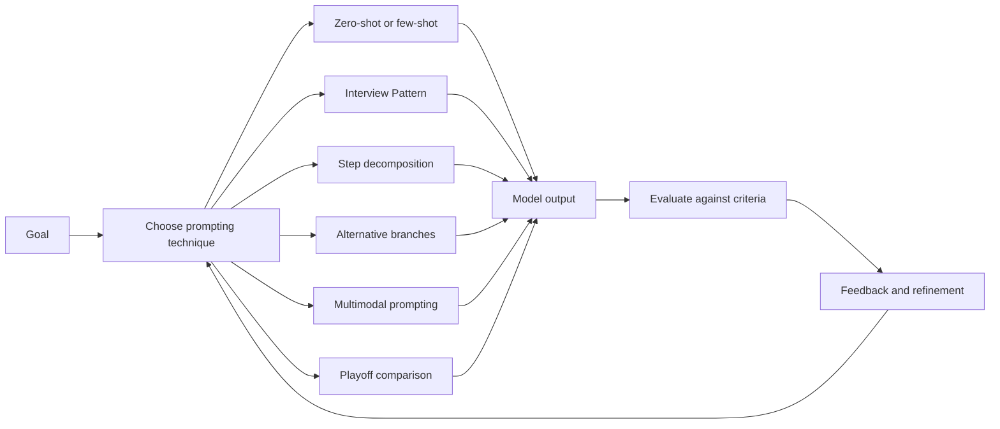

# Prompt Engineering: Techniques and Approaches

## Table of Contents

- [Status](#status)
- [Learning Objectives](#learning-objectives)
- [Concept Map](#concept-map)
- [Core Concepts](#core-concepts)
- [Practical Application](#practical-application)
- [Labs and Activities](#labs-and-activities)
- [Quiz Review](#quiz-review)
- [Questions to Revisit](#questions-to-revisit)
- [Final Summary](#final-summary)

## Status

- [ ] Complete
- [ ] Reviewed

## Learning Objectives

1. Apply text-to-text prompting techniques such as task specification, contextual guidance, framing,
   examples, and iterative feedback.
2. Distinguish zero-shot and few-shot prompting by the presence or absence of demonstrations in the
   prompt.
3. Apply the Interview Pattern to gather missing context through a structured, multi-turn exchange.
4. Compare Chain-of-Thought-style step decomposition with Tree-of-Thought-style exploration of
   multiple alternatives while recognizing the limits of model-generated reasoning.
5. Use multimodal prompts to work with combinations of text, images, and document content.
6. Apply the recorded Playoff Method to compare multiple candidate responses against explicit
   evaluation criteria.

## Concept Map



The technique should follow the task rather than the other way around. A direct task may need only a
clear prompt, while an underspecified task may benefit from an interview, a task with examples may
benefit from few-shot prompting, and a decision with several plausible alternatives may benefit from
structured comparison. In every case, the output still needs evaluation and refinement.

## Core Concepts

### Module Context and Source Basis

This module develops the prompt-engineering concepts introduced in Module 1 by focusing on
techniques and interaction patterns for producing more targeted outputs. The supplied source
includes recorded videos, hands-on labs, a dialogue, expert viewpoints, readings, a podcast recap,
practice and graded quiz feedback, a role-play activity, and learner-written responses.

The main techniques covered are:

1. text-to-text prompt techniques, including zero-shot and few-shot prompting;
2. the Interview Pattern;
3. Chain-of-Thought-style decomposition;
4. Tree-of-Thought-style exploration;
5. multimodal prompting; and
6. the Playoff Method described in the course reading.

Product names, model names, interfaces, and feature descriptions in these notes reflect the supplied
course material. They are not a current survey of product availability or capabilities.

Several source statements are broader than the evidence provided. In particular, the source connects
prompting with reliability, explainability, ethical alignment, bias mitigation, security, and trust.
Prompt design can influence the form and focus of a response, but it does not by itself guarantee
factual accuracy, fairness, security, transparency, or trustworthy behavior. Those claims are
therefore retained as course context with explicit qualification.

### Text-to-Text Prompt Techniques

The source describes a **text prompt** as an instruction or request that guides a language model
toward a desired output. It emphasizes that output quality depends both on the prompt and on the
capabilities and limitations of the model.

The course identifies the following techniques:

| Technique               | Purpose in the source                       | Example pattern                                                              |
| ----------------------- | ------------------------------------------- | ---------------------------------------------------------------------------- |
| **Task specification**  | State exactly what the model should do.     | Translate a supplied English sentence into French.                           |
| **Contextual guidance** | Narrow the subject or situation.            | Write about New York City while focusing on iconic landmarks.                |
| **Domain expertise**    | Identify the relevant field or perspective. | Ask for a medical explanation of hypothyroidism.                             |
| **Bias mitigation**     | Ask for balanced treatment of a topic.      | Request leadership examples without favoring one gender.                     |
| **Framing and limits**  | Constrain length, focus, or structure.      | Summarize an article in 100 words and focus on findings and recommendations. |
| **User feedback loop**  | Refine the result after seeing an output.   | Ask for a poem, then request a more humorous revision.                       |

These techniques shape the model's response but do not validate the underlying facts. A prompt that
asks for domain expertise does not make the model a licensed expert, and a request for neutrality
does not prove that bias has been eliminated.

### Zero-Shot and Few-Shot Prompting

The module distinguishes techniques according to whether demonstrations are included in the prompt.

**Zero-shot prompting** gives the task without providing an example of the desired input-output
pattern. The source uses a simple adjective-identification task as an example.

```plaintext
Select the adjective in this sentence:
Anita bakes the best cakes in the neighborhood.
```

In this context, **zero-shot** means that no demonstration is supplied in the prompt. It does not
mean that the underlying model was never pretrained.

**Few-shot prompting** supplies a small number of demonstrations or examples to show the pattern the
model should follow. The source uses seasonal travel recommendations to illustrate the idea.

The useful distinction is:

| Prompting mode | Demonstrations included in the prompt? | Typical reason to use it                                                    |
| -------------- | -------------------------------------- | --------------------------------------------------------------------------- |
| Zero-shot      | No                                     | The task is straightforward enough to state directly.                       |
| Few-shot       | Yes                                    | The desired pattern, format, or mapping is easier to show than to describe. |

The module describes few-shot prompting as a form of in-context learning: the demonstrations appear
inside the interaction and guide the current task rather than retraining the model.

### The Interview Pattern

The **Interview Pattern** turns an underspecified request into a structured conversation. Instead of
forcing the user to provide every relevant detail in the first message, the prompt tells the model
to ask follow-up questions before producing its final response.

A typical pattern is:

1. assign an appropriate role or task;
2. tell the model to gather the information it needs;
3. ask questions one at a time or in a controlled sequence;
4. answer those questions with useful details; and
5. ask the model to synthesize the collected information into the requested output.

The source uses travel planning, fitness planning, gift selection, dinner planning, and blog writing
to illustrate this pattern.

A representative instruction is:

```plaintext
Ask me a series of questions, one by one, to gather all the information you need to give a proper response.
```

The source often combines the Interview Pattern with a persona. For example, it asks the model to
act as a fitness expert and interview the user before creating a workout program.

The main advantage is not that interviewing is universally better than direct prompting. It is that
interviewing can be useful when the original request lacks important context and the user can supply
that context interactively.

**Common mistake:** giving weak answers during the interview and then assuming that the pattern
itself will create a highly personalized result. The final response can only use the information
actually available to the model.

### Choosing a Prompting Approach

The expert-viewpoint material emphasizes starting from the goal:

- What output is needed?
- What information does the model require?
- How much context is available?
- Does the task need examples?
- Does the user need clarification before the model can answer?
- Is one path enough, or are several alternatives worth comparing?
- What output structure, limits, or features matter?

The source repeatedly returns to three prompt qualities: **clarity, context, and requested
features**. It also recommends testing and adjusting the prompt based on the response. The
expert-viewpoint transcript uses the term **AI hallucination** while warning that vague prompts can
produce generic or incorrect answers. These notes retain that recorded terminology without implying
that prompt specificity alone prevents unsupported or incorrect model output.

A practical selection guide is:

| Situation                                               | Candidate approach                            |
| ------------------------------------------------------- | --------------------------------------------- |
| Clear, direct task                                      | Zero-shot or a conventional structured prompt |
| Desired format is difficult to describe                 | Few-shot demonstrations                       |
| User has not supplied enough information                | Interview Pattern                             |
| Task benefits from explicit decomposition into stages   | Structured step decomposition                 |
| Several plausible alternatives should be explored       | Tree-style branching and comparison           |
| Input combines text with an image or document           | Multimodal prompt                             |
| Several candidate outputs must be ranked using criteria | Playoff-style pairwise comparison             |

No approach guarantees correctness. The technique should make the task easier to specify, inspect,
or compare.

### Chain-of-Thought-Style Step Decomposition

The supplied course describes **Chain-of-Thought (CoT)** as breaking a complex task into smaller,
ordered steps. It presents two forms:

- **Few-shot CoT:** demonstrations show a worked sequence before a related task.
- **Zero-shot CoT:** the prompt asks the model to work through the task step by step without a
  worked demonstration.

The course uses arithmetic and optimization examples, such as promotional pricing and fixed-budget
shopping, to illustrate the idea.

The lab attributes a simple zero-shot step cue to **Kojima et al.** These notes preserve the
course's attribution but do not independently verify the cited research here. A source example is:

```plaintext
Let's think step by step.
```

The recorded lab also presents a longer cue:

```plaintext
Let's work this out in a step-by-step way to be sure we have the right answer.
```

These phrases are prompt cues, not guarantees. The source itself notes an example where adding a
step-by-step cue still produced an incorrect answer with the recorded model.

For maintained notes, the useful lesson is to ask for a **structured explanation, intermediate
results, or a concise justification that can be checked** when a task benefits from decomposition.
The model's visible explanation should not be treated as direct access to its private internal
reasoning, and a detailed explanation can still contain errors.

The source identifies several limitations:

- additional steps can make responses slower or longer;
- a simple task can become unnecessarily complicated;
- an early mistake can propagate through later steps; and
- a convincing explanation does not prove that the conclusion is correct.

### Structured Decomposition for Broad Topics

The lab expands the same idea beyond arithmetic. Instead of asking a very broad question such as:

```plaintext
What is space exploration?
```

the user can require coverage of a predefined set of subtopics. The source's list includes
historical missions, the Moon landing, satellites, Mars, extraterrestrial life, tourism, debris,
international collaboration, rocket technology, interstellar travel, and private-sector involvement.

This is useful because the user defines the dimensions that should be covered. The trade-off is that
the user must know enough about the subject to propose a useful decomposition.

For broad analysis, the transferable pattern is:

```plaintext
Address each of the following dimensions:
- [dimension 1]
- [dimension 2]
- [dimension 3]

For each dimension, explain the important points and connect them to the overall question.
Finish with a concise synthesis.
```

### Tree-of-Thought-Style Exploration

The source describes the **Tree-of-Thought (ToT)** approach as exploring several candidate paths,
comparing them, and developing the stronger options rather than following only one linear route.

The course uses examples such as:

- diagnosing a decline in online sales;
- evaluating career-change paths;
- choosing a fundraising event;
- selecting a family meal-plan strategy;
- developing a plot twist;
- diagnosing falling customer satisfaction; and
- planning a gap year.

A common pattern is:

1. generate several alternatives;
2. evaluate each against defined criteria;
3. compare their strengths, weaknesses, risks, and requirements; and
4. select or synthesize the option that best fits the stated goal.

For example:

```plaintext
Propose three distinct strategies.

For each strategy:
- list the main benefits;
- list the likely challenges;
- identify the resources required.

Compare the three strategies using the same criteria and recommend the strongest option.
```

The source presents this as tree-like reasoning. In practice, the important observable behavior is
that the output contains multiple alternatives and a structured comparison. The generated branches
remain model outputs and can all be based on weak assumptions, so the user should validate the
premises and evidence before accepting a recommendation.

### Chain-of-Thought and Tree-of-Thought Compared

The supplied dialogue contrasts a single ordered path with multiple candidate paths.

| Dimension              | Chain-style decomposition               | Tree-style exploration                         |
| ---------------------- | --------------------------------------- | ---------------------------------------------- |
| Structure              | One main sequence of steps              | Several candidate branches                     |
| Best fit in the source | Multi-step reasoning or explanation     | Decisions with competing alternatives          |
| Main advantage         | Ordered decomposition                   | Breadth and trade-off comparison               |
| Main cost              | More steps and verbosity                | More computation, content, and comparison work |
| Main risk              | Errors can propagate along the sequence | Weak branches can still look persuasive        |

The dialogue uses market-entry strategy as an example where several options—such as partnership,
direct entry, or acquisition—could be evaluated against risk, resources, competition, regulation,
and expected return.

The notes retain this comparison as a prompting framework, not as a claim that the model's hidden
reasoning can or should be exposed.

### Multimodal Prompting

The source defines **multimodal prompting** as combining more than one input modality, such as text
plus an image or text plus a document containing visual elements.

The reading discusses models and products such as ChatGPT, Gemini, GPT-4 variants, and ImageBind.
These names and capability descriptions are recorded-course examples rather than current capability
verification.

The source identifies several potential uses:

- summarizing a document that includes text, tables, or charts;
- extracting information from an image;
- generating captions or hashtags based on visual content;
- using an image as inspiration for a story or poem; and
- combining a visual artifact with a textual task description.

A multimodal request should still specify the task and expected output. Uploading an image by itself
does not define what the user wants the model to do.

A useful generic structure is:

```plaintext
Use the attached [image/document] together with the instructions below.

Task:
[what to extract, analyze, compare, or create]

Output:
[required structure, level of detail, constraints]

If information is unclear or absent from the supplied material, say so rather than inventing it.
```

The reading makes strong claims that combining modalities can improve accuracy by cross-validating
information. The module does not provide an evaluation demonstrating that this occurs reliably, so
the notes preserve multimodal context as an additional evidence source rather than an accuracy
guarantee.

### The Playoff Method

The course reading presents a **Playoff Method**, attributed there to an article by Andrew Best. It
uses a tournament metaphor:

1. generate several candidate prompts or responses;
2. define evaluation criteria;
3. compare candidates in pairs;
4. select the stronger candidate in each comparison;
5. continue until a final candidate remains.

The method is useful when the problem is not generating _an_ answer but choosing among several
reasonable candidates.

A source-style evaluation table is:

| Criterion  | Question                                                 |
| ---------- | -------------------------------------------------------- |
| Clarity    | Is the response easy to understand?                      |
| Coverage   | Does it satisfy all explicit requirements?               |
| Relevance  | Does it stay aligned with the task?                      |
| Engagement | Is it appropriate for the intended audience and purpose? |

The method depends on the quality of the criteria and the evaluation. If the same model generates
and judges all candidates, the comparison is still model-generated and should not be treated as an
objective benchmark. Human review remains useful when the final choice matters.

The source's PureEarth example compares four advertising catchphrases through successive pairwise
rounds. The lab later applies the same idea to a fictional B2B software milestone announcement.

### Limitations and Source Qualifications

Several recurring cautions apply across the module:

- A request for domain expertise does not validate medical, legal, financial, or engineering facts.
- A neutrality instruction does not prove that bias has been removed.
- A step-by-step explanation does not guarantee correct reasoning.
- Multiple reasoning branches do not guarantee that one of them is sound.
- A model judging its own candidates is not an independent evaluator.
- Multimodal input can add evidence but can also add extraction or interpretation errors.
- Product interfaces and model availability can change after a recorded course is published.
- The course's claims about improved explainability, ethics, trust, or security should be treated as
  instructional framing unless supported by separate evaluation.

## Practical Application

### Choosing a Technique for the Task

A practical way to use this module is to diagnose what is missing from the initial request.

**Original synthesis:** The following project-management-tool example was created to connect the
module's recorded technique-selection principles. It is not a scenario from the supplied course
material.

Suppose the user says:

```plaintext
Help me choose a project-management tool for my team.
```

The task is underspecified. Instead of immediately generating a recommendation, an Interview Pattern
could gather team size, budget, required integrations, security constraints, workflow, and reporting
needs.

If the user already has three candidate tools, the task changes. A tree-style comparison may be more
appropriate:

```plaintext
Compare Tool A, Tool B, and Tool C using:
- required integrations;
- pricing constraints;
- ease of onboarding;
- reporting;
- security requirements.

Identify missing information separately. Do not invent unsupported product capabilities.
```

If several acceptable summaries or recommendations are then generated, a Playoff-style comparison
can rank them using explicit criteria.

The important skill is choosing the technique from the information problem rather than automatically
using the most elaborate method.

### SyncroTask Role-Play: Accuracy Before Fluency

The module ends with a role-play involving a fictional product manager and a fictional cloud project
management tool named **SyncroTask**.

The confirmed facts supplied during the role-play are:

- the target audience is small to mid-sized business owners and team leads;
- the tone should be friendly, professional, and reassuring;
- the product offers a 14-day free trial;
- no credit card is required to start the trial;
- refunds are available within 30 days of the first payment; and
- the fictional SyncroTask Knowledge Base is the intended source of truth.

The first generated FAQ output introduced several unconfirmed details, including:

- an onboarding wizard;
- access to all features during the trial;
- a full refund rather than the weaker statement that refunds are available;
- a reminder before the trial ends; and
- confirmed Slack and Google Calendar integrations.

The revised prompt explicitly separated confirmed facts from unverified information and instructed
the model not to infer product behavior.

A representative constraint is:

```plaintext
Use only information explicitly provided in the Confirmed Facts section or in the supplied Knowledge Base.
Do not infer, assume, embellish, or invent product behavior.
```

It also added:

```plaintext
Accuracy is more important than making every answer sound complete.
```

The resulting answers became more cautious. Unknown billing and integration details were redirected
to the fictional knowledge base or support rather than invented.

**Business lesson:** a response can have the right tone and still be unsafe to publish if it invents
facts. Prompt quality includes both communication quality and evidence boundaries.

## Labs and Activities

### Lab 1: Interview Pattern

#### Objectives

The recorded lab asks learners to:

- apply an interview-style multi-turn prompt;
- combine the Interview Pattern with a persona; and
- observe how additional user information changes the final response.

#### Fitness example

The source uses prompt instructions similar to:

```plaintext
You will act as a fitness expert and provide detailed replies.
Interview me by asking the relevant questions you need before generating the final answer.
```

The request is:

```plaintext
Create a gym workout program to lose weight and build strength.
```

The point of the exercise is not the fitness advice itself. It is to observe that follow-up
questions can gather information missing from the original request.

#### Blog-post example

The lab first asks:

```plaintext
Craft a blog post to announce my new course, "Prompt Engineering for Everyone".
```

The source then adds a content-marketing persona plus an instruction to ask questions one at a time.
The course uses the comparison to show how context collected through an interview can make the
output more specific.

#### Practice tasks

The learner is invited to apply the same pattern to:

1. a travel itinerary;
2. a dinner recipe; and
3. a gift recommendation.

For each task, the evaluation question is: **Did the model collect information that materially
improved the usefulness of the final answer?**

### Lab 2: Chain-of-Thought-Style Decomposition

#### Objectives

The recorded lab focuses on:

- breaking a task into smaller steps;
- using demonstrations to establish a worked pattern; and
- comparing a conventional prompt with a step-decomposition prompt.

#### Worked-example pattern

The source gives a menu optimization example followed by a similar aquarium-fish problem. The prompt
includes one worked example before asking the second problem.

The teaching point is:

```text
demonstration of a structured solution
    ↓
related new task
    ↓
model attempts to apply the demonstrated pattern
```

The numeric result still needs independent checking. A model can imitate the structure of a
demonstration while making an arithmetic or assumption error.

#### Zero-shot step cue

The lab also asks learners to try a prompt such as:

```plaintext
Let's think step by step.
```

and compare the output with a prompt that contains a full worked demonstration.

The source explicitly reports that the short cue did not always produce the right answer in its
recorded experiment. That observation supports the broader lesson that a prompting phrase is not a
reliability guarantee.

#### Broad-topic decomposition

The lab extends the technique to a broad subject by enumerating required dimensions before asking
the main question. Learners then try a similar exercise using a topic such as ocean conservation.

### Lab 3: Tree-of-Thought-Style Exploration

#### Objectives

The source asks learners to:

- distinguish a branching approach from a single linear sequence;
- generate several solution paths;
- evaluate branches using common criteria; and
- select or synthesize the strongest option.

#### Fundraising-event example

A representative prompt is:

```plaintext
You are planning a school fundraising event.

List three different types of events and label them A, B, and C.

For each event, list:
- key benefits;
- likely challenges;
- required resources.

Compare the three events and choose the most feasible one.
Explain why it is a better fit than the alternatives.
```

The structure forces divergence before convergence: generate alternatives first, then compare them.

#### Family meal-plan example

The source uses three strategies for a family of four on a tight budget and asks the model to
compare:

- estimated daily cost;
- nutritional strengths; and
- convenience.

The important feature is that the same criteria are used across all branches.

#### Practice scenarios

Learners are asked to design tree-style prompts for:

1. a mystery-story plot twist;
2. falling customer satisfaction; and
3. a gap year focused on travel, volunteering, or skill development.

### Lab 4: Multimodal Prompts

#### Objectives

The recorded lab asks learners to:

- summarize a PDF containing textual and visual information;
- extract data from an image;
- perform analysis based on visual content; and
- generate creative content inspired by an image.

The source says the documents and images used in the lab are synthetically generated.

#### Task 1: PDF analysis

The scenario uses a survey report about adoption of generative AI in day-to-day tasks.

Representative prompts include:

```plaintext
Briefly summarize the key findings of this PDF survey, including both the text and visual data such as charts or tables.
```

```plaintext
What are the most common day-to-day tasks where users report adopting GenAI, based on this document?
```

```plaintext
Based on the survey results in this PDF, what recommendations would you make to improve GenAI adoption in daily workflows?
```

A useful review step is to check whether each answer is traceable to the supplied document rather
than to general model knowledge.

#### Task 2: Receipt image analysis

The source uses a fictional grocery receipt and asks the model to:

- extract items, quantities, unit prices, and totals;
- calculate average prices by category; and
- suggest ways to stay within an $80 budget.

For calculations, extracted values should be checked before using them in arithmetic.

#### Task 3: Creative content from an image

The source uses an alpine scene and prompts the model to write either:

- a short story about the people around a campfire; or
- a poem or lyrical piece about the landscape.

This is a generative task rather than a factual extraction task, so the evaluation criteria should
focus on alignment with the visible scene and requested creative constraints.

#### Source-transcription issue

The reading before the lab contains duplicated instruction text where a PDF summarization prompt
appears to have been transcribed incorrectly. The lab itself supplies a clear summarization prompt,
which is preserved above. The mismatch should remain documented rather than silently treated as if
the reading contained a clean exemplar.

### Lab 5: Playoff Method

#### Objectives

The lab asks learners to:

- generate several prompts for the same professional task;
- obtain candidate responses;
- compare responses pairwise;
- evaluate them using explicit criteria; and
- select the strongest result.

#### NeoTech Solutions scenario

The fictional company has completed its 100th enterprise software deployment. The requested post
should:

- celebrate the milestone;
- thank the team;
- reinforce an innovative and client-focused identity; and
- remain professional, concise, and under 100 words.

The source asks for five alternative prompts and possible responses, then compares the responses
using:

- clarity of expression;
- coverage of requirements; and
- engagement potential.

A representative follow-up is:

```plaintext
For each set of responses, perform a pairwise comparison using:
- clarity;
- coverage of the requirements;
- engagement potential.

State which response is stronger in each comparison, then summarize which response performs best overall.
```

This comparison should be treated as an evaluation aid, not as proof that the selected response is
objectively optimal.

#### Practice scenario and source inconsistency

The practice exercise says the learner is working for a fictional speaker named **Anita Desai**, but
the supplied profile data immediately lists the name **John Doe** while keeping the role, company,
experience, specialization, and notable achievement.

That is an unresolved source inconsistency. The canonical notes should not choose one identity on
the source's behalf. Before running the exercise, the learner should clarify which name is intended.

### Activity: Prompt Engineering in Practice

The source asks learners to reflect on how prompt engineering may affect user experience,
accessibility, work, and human-AI collaboration over the next five years.

The supplied learner response predicts movement toward:

- natural-language interaction;
- reusable instructions and preferences;
- accessibility through translation, summarization, dictation, and simplification;
- workflow design and output review; and
- responsibilities involving evaluation, governance, and quality control.

These are learner projections, not established outcomes.

### Role-Play: Prompt Engineer and Product Manager

The role-play asks the learner to collaborate with a fictional product manager on business content.
The possible tasks are:

- customer FAQs;
- marketing copy; or
- training materials.

The supplied interaction chooses customer FAQs and demonstrates the following workflow:

1. ask for missing business requirements;
2. identify an authoritative source;
3. separate confirmed facts from unknown facts;
4. draft a structured prompt;
5. inspect the output for unsupported claims;
6. tighten the prompt;
7. rerun the task; and
8. evaluate the revised result.

This role-play is a practical integration of the module's core ideas: Interview Pattern, task
specification, context, constraints, feedback, and iterative refinement.

## Quiz Review

### Practice Quiz: Concepts Tested

The practice quiz checks whether the learner can identify:

1. **Chain-style decomposition:** breaking a complex task into smaller steps.
2. **Interview Pattern:** using back-and-forth questioning to gather information.
3. **Tree-style exploration:** considering and comparing multiple paths.
4. **Playoff Method:** generating and evaluating multiple candidate completions.
5. **Multimodal prompting:** combining inputs such as text and images.

The source provides feedback statements but not the full set of answer choices. These notes
therefore preserve the concepts tested without reconstructing missing options.

### Graded Quiz: Concepts Tested

The graded quiz feedback tests:

1. using an Interview Pattern for personalized car-selection requirements;
2. the source's use of domain expertise for a legal-information task;
3. "bias mitigation" prompt constraints;
4. step decomposition for logic problems;
5. Tree-of-Thought-style exploration for several treatment possibilities;
6. the Playoff Method for generating and judging candidate headlines; and
7. multimodal prompts for interpreting a graph supplied as an image.

Several quiz feedback statements use strong wording such as "accurate," "fairness," or a definitive
approach assignment. In maintained notes, these are treated as the intended course concepts, not as
guarantees that a prompt technique alone can establish correctness or fairness.

### Concept I Initially Misunderstood

A useful distinction is:

> **More reasoning text is not the same as more reliable reasoning.**

Step decomposition, branching, and pairwise comparison can make an output easier to inspect, but
each intermediate step or candidate can still be wrong. The user must evaluate evidence,
assumptions, calculations, and source boundaries separately from the elegance of the explanation.

## Questions to Revisit

1. **Chain-of-Thought terminology:** the source sometimes describes visible step-by-step output as
   if it exposes how the model internally reasons. Maintain the distinction between requested
   explanations and private internal model reasoning.
2. **Reliability and explainability claims:** what evidence supports the source's stronger
   statements that prompting improves reliability, explainability, ethics, security, and trust?
3. **Bias mitigation:** a neutrality or balance instruction can influence output wording, but how
   should bias actually be evaluated?
4. **Domain expertise prompts:** what verification is required before using model-generated medical,
   legal, financial, or engineering information?
5. **Recorded model result:** the lab says a zero-shot step cue produced an incorrect result with
   “GPT 3.5.” Treat this as a recorded-course observation rather than a universal benchmark.
6. **Multimodal product claims:** verify current capabilities, upload workflows, and supported input
   types before using the recorded ChatGPT, Gemini, GPT-4, or ImageBind descriptions operationally.
7. **Multimodal reading transcription:** the PDF-summary example contains duplicated instructional
   prose instead of a clean prompt.
8. **Playoff Method provenance:** the course attributes the method to an Andrew Best article; verify
   the original source and terminology before treating it as a broadly standardized method.
9. **Playoff practice identity:** resolve whether the fictional speaker is Anita Desai or John Doe.
10. **Model-as-judge evaluation:** determine when pairwise model evaluation is sufficient and when
    an independent human or external metric is required.
11. **Self-Consistency:** the dialogue mentions this only as a possible technique to explore
    alongside Few-Shot Prompting; the supplied module does not define or demonstrate it, so no
    definition is inferred here.

## Final Summary

- Text-to-text prompting techniques include task specification, contextual guidance, domain
  expertise, explicit constraints, examples, and iterative feedback.
- Zero-shot prompting provides no demonstrations in the current prompt; few-shot prompting supplies
  examples that establish a desired pattern.
- The Interview Pattern is useful when the model needs information the user has not yet supplied.
- Chain-style prompting decomposes a task into ordered steps or requested subproblems, but extra
  reasoning text does not guarantee correctness.
- Tree-style prompting explores several alternatives, evaluates them using shared criteria, and then
  converges on a recommendation or synthesis.
- Multimodal prompting combines modalities such as text, images, and documents, but the model must
  still be told what to extract, analyze, or generate.
- The recorded Playoff Method compares several candidate outputs in pairwise rounds using explicit
  evaluation criteria.
- Choosing the prompting technique should start from the task, missing information, evidence, and
  evaluation needs.
- Prompting can improve structure and task alignment, but it does not by itself guarantee factual
  accuracy, fairness, security, explainability, or trustworthiness.
- The SyncroTask role-play demonstrates a critical professional habit: separate confirmed facts from
  unknown details and prefer an explicit limitation over a fluent invention.
