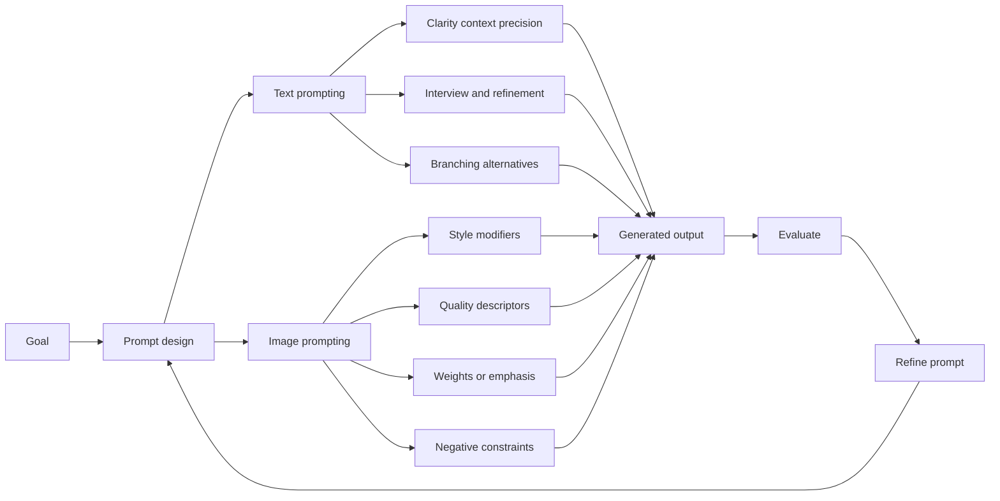

# Course Quiz, Project, and Wrap-Up

## Table of Contents

- [Status](#status)
- [Learning Objectives](#learning-objectives)
- [Concept Map](#concept-map)
- [Core Concepts](#core-concepts)
- [Practical Application](#practical-application)
- [Labs and Activities](#labs-and-activities)
- [Quiz Review](#quiz-review)
- [Questions to Revisit](#questions-to-revisit)
- [Final Summary](#final-summary)

## Status

- [ ] Complete
- [ ] Reviewed

## Learning Objectives

1. Apply text-to-image prompting techniques such as style modifiers, quality-oriented descriptors,
   repetition, weighting, and negative constraints as described in the recorded course.
2. Distinguish prompt engineering from the course's broader and less standardized use of the term
   "prompt hacks."
3. Apply prompt-engineering best practices to refine ambiguous requests into clearer, more precise
   prompts.
4. Reuse the Interview Pattern and Tree-of-Thought-style exploration in a final project while
   evaluating model output rather than treating generated reasoning as proof.
5. Review the major concepts from the full course through its glossary and final quiz.
6. Connect prompt engineering to a concrete real-world problem while separating course claims,
   learner examples, and current product capabilities.

## Concept Map



The module closes the course by applying earlier prompt-engineering ideas to image generation,
reviewing the vocabulary of the course, completing a final project and quiz, and reflecting on a
real-world AI use case. The common pattern remains: define the task, provide useful context and
constraints, inspect the result, and refine it.

## Core Concepts

### Module Context and Source Basis

This module contains five kinds of source material:

1. a recorded lesson and lab on text-to-image prompting;
2. the course glossary;
3. a reading titled "Prompt Hacks";
4. a podcast about the future of prompt engineering; and
5. the final project, final quiz, and course wrap-up.

The source also contains empty headings for **Congratulations and Next Steps** and **Team and
Acknowledgements**. No substantive text was supplied under those headings, so no content is invented
for them here.

Product names, model names, interfaces, prompt syntax, weighting behavior, and UI details in this
module describe the supplied course material. They are not treated as current capability or product
documentation unless separately verified.

Some source claims are stronger than the evidence shown. For example, the material sometimes links
higher visual quality with trustworthiness or implies that certain prompt terms inherently improve
image quality. These notes preserve the instructional intent while distinguishing appearance from
factual reliability and model-specific behavior from universal prompting rules.

### Text-to-Image Prompts

An **image prompt** is a text description used to guide an image-generation model toward a desired
visual result. According to the source, it may range from a short phrase to a detailed description
of the subject, composition, color, mood, style, and other visual properties.

The course presents five image-prompting techniques:

| Technique            | Recorded purpose                                               | Important qualification                                                                         |
| -------------------- | -------------------------------------------------------------- | ----------------------------------------------------------------------------------------------- |
| **Style modifiers**  | Influence artistic style or visual attributes.                 | Supported styles and interpretation vary by model and product.                                  |
| **Quality boosters** | Ask for sharper, more detailed, or visually polished output.   | Words such as `4k` or `hyper-detailed` do not guarantee actual resolution or objective quality. |
| **Repetition**       | Emphasize a concept by repeating descriptive words or phrases. | The effect is model-dependent and can also create awkward or exaggerated output.                |
| **Weighted terms**   | Increase or decrease emphasis on particular concepts.          | Weight syntax and whether numeric weights are supported depend on the image system.             |
| **Negative prompts** | Describe unwanted features to avoid or reduce.                 | Negative prompting is model-dependent and does not guarantee removal of defects.                |

These techniques influence generation; they do not validate whether an image is accurate, authentic,
or appropriate for a particular use.

### Style Modifiers

The source describes **style modifiers** as descriptors that influence visual presentation while
keeping the requested subject or composition.

Recorded examples include:

- photographic;
- animated;
- digital art;
- comic book;
- fantasy art;
- line art;
- analog film;
- neon punk;
- isometric;
- origami; and
- cinematic pixel art.

A generic prompt structure is:

```plaintext
[style modifier] image of [subject] with [scene or composition details].
```

The source also mentions imitating well-known artistic, historical, brand, or artist styles. Whether
a particular system accepts or interprets those requests depends on the current product and its
policies; these notes do not generalize that recorded statement into a universal capability.

### Quality-Oriented Descriptors

The course uses the term **quality boosters** for words or phrases intended to request more visually
polished output.

Recorded examples include:

- high resolution;
- 2k or 4k;
- hyper-detailed;
- intricate details;
- sharp focus;
- crisp details;
- fine lines;
- complementary colors; and
- blurred background.

For example:

```plaintext
Create a highly detailed and realistic painting of a cat.
```

These phrases express a visual preference. They should not be interpreted as technical proof that
the generated file has a particular pixel resolution, optical sharpness, or factual fidelity.

The source states that higher-quality images can appear more believable or trustworthy. Visual
polish, however, should not be used as evidence that generated content is true.

### Repetition

The source presents **repetition** as repeating descriptive terms to emphasize an idea or visual
property. Examples in the recorded lesson include repeating words such as `tiny`, `dense`,
`enormous`, `vast`, `serene`, `clear`, and `lush`.

The source also associates repetition with obtaining a wider range of image variations. That
relationship is model-dependent; repeated wording can alter emphasis, but generating multiple
variants may also depend on the tool's generation settings or interface.

### Weighted Terms

The source describes **weighted terms** as concepts that can receive positive or negative emphasis.
It gives examples such as:

- `warm` with a positive weight;
- `crackling` with a positive weight;
- `shimmering` and `neon-lit` with different positive weights; and
- `colorful` with a negative weight while `exotic` receives a positive weight.

The exact syntax for weights is not supplied in the source, and numeric weighting is not universal
across image-generation systems. Therefore the reusable lesson is:

> If the chosen image system supports prompt weighting, use its documented syntax to emphasize or
> de-emphasize concepts instead of assuming one weighting convention works everywhere.

The source also uses the phrase **weighted terms** for emotionally persuasive advertising words such
as `free`, `limited time offer`, `guaranteed`, `luxury`, `premium`, and `exclusive`. That use mixes
semantic persuasion with technical prompt weighting. The two ideas should be kept distinct when
applying the technique.

### Negative Prompts and Deformed Generations

The source says generated images can contain unwanted artifacts such as distorted body parts,
pixelation, or other visual defects. It recommends negative prompts or negative terms to reduce
unwanted features.

A general structure is:

```plaintext
Create [desired image].

Avoid:
- [unwanted feature 1]
- [unwanted feature 2]
- [unwanted feature 3]
```

Whether a model supports a separate negative-prompt field, inline negative wording, or weighted
negative terms depends on the product.

Negative prompting can help guide output, but it cannot guarantee anatomically correct,
artifact-free, or otherwise reliable images.

### Prompt Engineering Across Text and Images

The image-generation section reinforces ideas already established earlier in the course:

- specify the desired task;
- add useful context;
- state relevant visual or textual constraints;
- identify the desired output characteristics;
- generate a result;
- inspect the result; and
- refine the prompt.

The key difference is that visual prompts use attributes such as scene composition, color, mood,
style, subject placement, and unwanted artifacts in addition to the task and context used for text
generation.

### Course Glossary

The source provides a course-wide glossary. The definitions below preserve the source's intended
terminology while keeping product-specific entries clearly identified as course descriptions.

| Term                                                    | Course definition or meaning                                                                                                                                                                         |
| ------------------------------------------------------- | ---------------------------------------------------------------------------------------------------------------------------------------------------------------------------------------------------- |
| **Application programming interface (API) integration** | Connecting software systems through APIs so they can exchange data or functionality.                                                                                                                 |
| **Bias mitigation**                                     | In the course, explicit prompting intended to encourage more neutral responses.                                                                                                                      |
| **Chain-of-Thought**                                    | Breaking a complex task into smaller or more straightforward prompt steps.                                                                                                                           |
| **ChatGPT**                                             | Described by the source as a language model used for detailed natural-language responses.                                                                                                            |
| **Claude**                                              | Described by the source as an AI chatbot that assists with a variety of tasks.                                                                                                                       |
| **Comparison prompting**                                | Asking a model to compare multiple outputs side by side.                                                                                                                                             |
| **Contextual guidance**                                 | Supplying context-specific instructions to make an output more relevant.                                                                                                                             |
| **Cross-modal understanding**                           | Connecting information across input types, such as image information used in a text response.                                                                                                        |
| **DALL-E**                                              | Described by the source as a text-to-image model driven by natural-language descriptions.                                                                                                            |
| **Domain expertise**                                    | Using domain-specific framing or terminology in prompts for specialized subject areas.                                                                                                               |
| **Dust**                                                | Described by the source as a prompt-engineering interface for writing and chaining prompts.                                                                                                          |
| **Explainability**                                      | The degree to which a user can understand or interpret why a model produced an output; the glossary's wording should not be read as direct access to private internal reasoning.                     |
| **Few-shot prompting**                                  | Providing demonstrations in the prompt to guide in-context behavior.                                                                                                                                 |
| **Framing**                                             | Using prompt constraints to keep the response within desired boundaries.                                                                                                                             |
| **Generative AI**                                       | AI that can generate content such as text, images, audio, or video.                                                                                                                                  |
| **Generative AI models**                                | Models used to produce new content from supplied context or instructions.                                                                                                                            |
| **Generative pre-trained transformers (GPT)**           | A model family based on transformer architecture and pretraining.                                                                                                                                    |
| **IBM watsonx.ai**                                      | Described by the source as a platform for working with foundation models.                                                                                                                            |
| **Input data**                                          | Information supplied as part of a prompt.                                                                                                                                                            |
| **Integrated Development Environment (IDE)**            | The glossary uses this term for a software environment used to craft and execute prompts; this is a source-specific definition and narrower or different IDE meanings exist in software development. |
| **Interview Pattern Approach**                          | Prompting through a conversational interview that gathers information before producing a tailored result.                                                                                            |
| **LangChain**                                           | Described by the source as a Python library for building and chaining prompts and AI workflows.                                                                                                      |
| **Large language models (LLMs)**                        | Deep-learning models trained on large text corpora for language-related tasks.                                                                                                                       |
| **Midjourney**                                          | Described by the source as a text-to-image system driven by natural-language requests.                                                                                                               |
| **Multimodal models**                                   | Models that process or generate more than one type of data.                                                                                                                                          |
| **Multimodal prompts**                                  | Prompts containing more than one input modality, such as text plus an image or audio.                                                                                                                |
| **Naive prompting**                                     | Asking the model a query in a minimal or simple form.                                                                                                                                                |
| **Natural language processing (NLP)**                   | AI methods for working with human language.                                                                                                                                                          |
| **OpenAI Playground**                                   | Described by the source as a web interface for experimenting with prompts and OpenAI models.                                                                                                         |
| **Output indicator**                                    | A requested output characteristic or criterion such as format, tone, length, or another measurable property.                                                                                         |
| **Playoff Method**                                      | The source glossary spells this "Play-off method"; elsewhere the course uses "Playoff Method." It generates several outputs and compares them to select or refine a response.                        |
| **Prompt**                                              | An instruction, question, or other input used to guide generated output.                                                                                                                             |
| **Prompt engineering**                                  | Systematically designing and refining prompts to improve task alignment.                                                                                                                             |
| **Prompt Lab**                                          | Described by the source as an environment for experimenting with prompts across foundation models.                                                                                                   |
| **PromptBase**                                          | Described by the source as a marketplace for buying and selling prompts.                                                                                                                             |
| **PromptPerfect**                                       | Described by the source as a tool for optimizing prompts for language or image models.                                                                                                               |
| **Role-play / Persona Pattern**                         | Instructing a model to respond from a specified role or persona.                                                                                                                                     |
| **Scale AI**                                            | Described by the source as a technology company associated with data labeling and annotation.                                                                                                        |
| **Self-reflection prompting**                           | Instructing a model to review or critique its own output; the source says it is often paired with the Playoff Method.                                                                                |
| **Stable Diffusion**                                    | Described by the source as a text-to-image model.                                                                                                                                                    |
| **StableLM**                                            | Described by the source as an open-source language model trained on a very large dataset.                                                                                                            |
| **Tree-of-Thought**                                     | Structuring a task to explore multiple candidate reasoning paths or branches.                                                                                                                        |
| **User feedback loop**                                  | Refining prompts iteratively after reviewing model responses.                                                                                                                                        |
| **Zero-shot prompting**                                 | Asking for a task without demonstrations of that task in the current prompt.                                                                                                                         |

These glossary entries summarize the course's terminology. They do not independently verify current
vendor descriptions, licensing, model architecture, availability, or product functionality.

### The Course's "Prompt Hacks" Terminology

The source uses **prompt hacks** for experimental strategies that manipulate or creatively steer
model output. It contrasts this with **prompt engineering**, which it presents as more systematic
and disciplined.

The source's comparison is:

| Aspect          | Prompt hacks                                          | Prompt engineering                                                   |
| --------------- | ----------------------------------------------------- | -------------------------------------------------------------------- |
| **Purpose**     | Manipulate output in an unexpected or unintended way. | Improve model performance on a specific task.                        |
| **Approach**    | Experimental and creative.                            | Systematic and disciplined.                                          |
| **Application** | Creative or humorous outputs.                         | Task-oriented improvement such as translation or question answering. |

The reading itself acknowledges that the boundary is not clear-cut because techniques such as style
modifiers, examples, and additional context can serve either purpose.

The reading also claims that prompt hacks can improve output quality and accuracy, enable new or
innovative tasks by combining prompts with inputs such as images or code, and make LLMs easier to
use. Those are recorded instructional claims rather than guarantees: each effect depends on the
model, task, evidence, and evaluation method.

Its practical tips are to:

- experiment creatively with different prompts;
- keep instructions specific and clear;
- consult the model or product documentation for capabilities and limitations; and
- compare results to discover what works for the task.

**Terminology caution:** the supplied course uses _prompt hacks_ broadly for benign creative and
experimental prompting. Because the source does not establish how the term is used outside this
course, verify external or security-specific terminology separately before reusing the label in
another context.

### Prompt Hacks for Text Generation

The reading gives three recurring strategies:

1. **Special modifiers:** request a tone or style.
2. **Context and examples:** show the model what kind of result is desired.
3. **Other inputs:** combine text with images or code.

Its poem example begins with:

```plaintext
Write a poem about a cat.
```

and then adds a style modifier to produce a more distinctive version.

The transferable lesson is not that a particular modifier guarantees a better poem. It is that
changing the style, context, constraints, or examples can materially change the generated output.

### Prompt Hacks for Image Generation

The source describes a workflow in which a language model helps create or rewrite a prompt that is
then used with an image-generation model.

The process is:

```text
visual idea
    ↓
ask an LLM for a detailed image description
    ↓
ask the LLM to rewrite that description as an image prompt
    ↓
send the resulting prompt to an image-generation system
    ↓
inspect and refine the image
```

Examples in the reading include:

- a fluffy orange cat on a red couch; and
- a visual interpretation of "Twinkle Twinkle Little Star."

The source specifically names DALL-E 2 and Imagen. These are recorded examples, not a statement that
the same intermediary workflow is required by current image-generation systems.

### Future of Prompt Engineering: Recorded Podcast Viewpoint

The podcast presents a perspective on how prompting may evolve as models become easier to instruct.

Its narrative is:

- GPT-3.5 required more careful wording;
- GPT-4 followed instructions more effectively;
- GPT-5 is presented as making prompts feel more like ordinary conversation;
- rigid prompt formulas and so-called "magic prompts" may become less important;
- courses, eBooks, and prompt marketplaces may evolve as models change;
- clear communication, context, and task decomposition may remain useful;
- prompting may become a general workplace skill rather than a narrow specialist role; and
- easier natural-language interaction may broaden AI use among non-specialists such as teachers or
  small-business owners.

These are podcast viewpoints and forecasts, not independently verified historical measurements or
career-market predictions.

The podcast's durable practical claim is simpler:

> Clear communication remains useful even when a model requires less elaborate prompt syntax.

It also distinguishes task needs: precise work may require tighter constraints, while creative work
may benefit from more open-ended direction.

## Practical Application

### Refining an Ambiguous Career Prompt

The final project begins with a broad request from a computer-science student:

```plaintext
Please guide me on potential career paths in the field of computer science, considering my interests, skills, the evolving technology landscape, and the impact of AI, while also factoring in work-life balance and opportunities for personal growth.
```

The course treats this as too broad because it combines several goals without enough personal
information.

The project then separates the request into clearer questions.

For example:

```plaintext
I have a strong interest in machine learning and natural language processing.
How can I leverage these interests and my programming skills in a career?
```

```plaintext
With AI becoming increasingly important, how can I prepare for a career that is AI-focused?
```

```plaintext
I value work-life balance and flexible work arrangements.
What career paths can provide me with these benefits?
```

```plaintext
In the long term, I aspire to take on leadership roles.
What career steps should I consider to advance into leadership positions in the IT or tech industry?
```

The lesson is to separate **interests**, **skills**, **constraints**, and **long-term goals**
instead of asking one overloaded question.

### Learner Application: Business Continuity in Côte d'Ivoire

The course wrap-up contains a learner-generated example of a real-world AI problem: keeping small
retailers, distributors, and service businesses productive during unreliable electricity or internet
connectivity in Côte d'Ivoire.

The proposed concept is an AI-assisted business-continuity system connected to local business data.
During an outage it would:

- keep basic sales recording available locally;
- use cached inventory and sales data;
- warn about low-stock items;
- queue transactions and updates locally; and
- synchronize pending records when connectivity returns.

The example imagines a small retailer in Abidjan using a tablet during an internet outage.

The learner identifies measurable business outcomes such as:

- lower outage-related downtime;
- fewer failed or duplicate transactions;
- fewer stock discrepancies;
- a higher share of sales completed during disruptions; and
- reduced revenue loss from interrupted operations.

The source does not provide an implemented architecture, benchmark, offline model specification, or
measured result. It is a concrete learner proposal illustrating how prompt-engineering knowledge can
be connected to a business problem.

## Labs and Activities

### Lab: Effective Text Prompts for Image Generation

#### Objectives

The recorded lab asks learners to:

1. use the platform's image-generation capability; and
2. apply image-prompting techniques and compare outputs.

The source begins at **Step 2**; no substantive Step 1 content is present in the extracted material.
These notes therefore do not invent it.

#### Step 2: Generate an Image

The lab begins with a minimal prompt:

```plaintext
image of a cat
```

The learner then generates an image and can regenerate it to observe variation.

The source records several interface details:

- use a message box to enter the prompt;
- select **Start chat**;
- use **Regenerate response** for a new image;
- a plus icon creates a new chat;
- a refresh icon refreshes the page; and
- a floppy-disk-like icon duplicates the chat.

It also says generated images expire after two hours.

These are recorded-course UI claims. Interface labels, icons, retention, model selection, and image
availability may change, so they should not be treated as current product documentation without
verification.

#### Step 3: Style Modifiers

The learner refines the cat prompt using style words.

Examples include:

```plaintext
Comic art of a cat
```

```plaintext
Image of a cat with neon punk
```

The learner is encouraged to compare the visual changes produced by different style modifiers.

#### Step 4: Quality-Oriented Descriptors

The lab next adds quality-oriented language.

Examples include:

```plaintext
Create a highly detailed and realistic painting of a cat
```

```plaintext
A cat having complementary colors and charming body
```

The review question should be: **What visual differences appear after changing the descriptors?**
The prompt terms themselves do not prove that the generated file has a specific technical quality.

#### Step 5: Weighted Terms

The source labels this step **weighted terms**, but the actual examples progress from:

```plaintext
Scenic landscape
```

to:

```plaintext
Generate an Image of a scenic landscape with mountains and a lake
```

No explicit numeric weighting syntax appears in the lab step even though the preceding lesson
discusses positive and negative weights.

This is a source mismatch. The lab example demonstrates **adding specificity**, but it does not, by
itself, demonstrate technical prompt weighting.

#### Try-It-Yourself Tasks

The lab asks learners to experiment with combinations of:

##### Style modifiers

```plaintext
An animated, neon punk image of a cat
```

```plaintext
A lined, digital art image of a cat
```

```plaintext
A comic book-inspired, fantasy art portrayal of a cat
```

```plaintext
An origami-inspired, isometric view of a cat
```

##### Quality-oriented descriptions

```plaintext
A lifelike, exquisitely detailed, high-quality image of a cat
```

```plaintext
An exquisite, handcrafted mahogany dining table
```

```plaintext
A sensational, multi-layered chocolate cake
```

```plaintext
A breathtaking, panoramic view of a castle on a hill
```

##### Additional scenes

```plaintext
Tranquil beach with crystal-clear water and sands
```

```plaintext
Futuristic cityscape with sleek skyscrapers and illuminated streets
```

The useful activity is to change one or two prompt dimensions at a time and compare the resulting
images.

### Final Project: Prompt Engineering Best Practices

The final project has three exercises.

### Exercise 1: Clear and Precise Prompts

The source begins with a broad career-guidance prompt for a computer-science student:

```plaintext
Please guide me on potential career paths in the field of computer science, considering my interests, skills, the evolving technology landscape, and the impact of AI, while also factoring in work-life balance and opportunities for personal growth.
```

The project describes this prompt as ambiguous and complex because it combines several career
considerations without specifying the learner's interests, skills, or personal goals.

#### Recorded Prompt Instructions

The source places the following context in the Prompt Instructions field:

```plaintext
I am pursuing a degree in Computer Science and exploring career opportunities for myself after graduation.
```

It then separates the broad request into four more focused prompts.

#### Recorded Focused Prompts

##### Prompt 1 — Machine Learning and NLP

```plaintext
I have a strong interest in machine learning and natural language processing. How can I leverage these interests and my programming skills in a career?
```

##### Prompt 2 — AI-Focused Career Preparation

```plaintext
With AI becoming increasingly important, how can I prepare for a career that is AI-focused?
```

##### Prompt 3 — Work-Life Balance

```plaintext
I value work-life balance and flexible work arrangements. What career paths can provide me with these benefits?
```

##### Prompt 4 — Long-Term Leadership

```plaintext
In the long term, I aspire to take on leadership roles. What career steps should I consider to advance into leadership positions in the IT or tech industry?
```

These are recorded course examples, not personalized career recommendations or independently
verified labor-market guidance.

#### Review Checklist

A successful revised prompt should make it possible to identify:

1. the user's current situation;
2. the specific question being asked;
3. the most relevant constraints;
4. the desired type of answer; and
5. assumptions that still need verification.

### Exercise 2: Tree-of-Thought-Style Marketing Strategy

#### Scenario

Develop a launch strategy for a high-end smartphone.

The recorded project asks the model to simulate three marketing experts who:

1. give individual views;
2. discuss each stage;
3. refine their ideas; and
4. converge on a combined view.

The source prompt asks the model to show the experts' "reasoning process." For maintained notes, the
observable learning goal is better expressed as **stated rationales, alternatives, trade-offs, and
summaries**, not access to private internal reasoning.

A source-backed structure is:

```plaintext
Generate three distinct expert perspectives for each stage of the launch strategy.

For each perspective:
- state the proposed action;
- give a concise rationale;
- identify important trade-offs.

Then compare the three perspectives and summarize:
- where they agree;
- where they differ;
- the combined actions that best match the stated marketing goals.
```

The project then asks for:

```plaintext
For each expert, please provide two actionable tactics per step that you suggested.
```

It supplies these marketing goals:

- position the phone as a premium choice;
- drive consumer excitement;
- achieve significant market share; and
- use both online and offline channels.

Finally, it drills into one expert's market-research suggestions and asks which demographic
parameters should be studied.

The labels assigned to the simulated experts may vary.

### Exercise 3: Interview Pattern for a Blog

#### Scenario

The learner acts as an AI consultant preparing a blog about the impact of generative AI across
industries.

The conversation begins broadly:

```plaintext
Can you share your insights on the impact of generative AI on various industries?
```

It then narrows to healthcare:

```plaintext
How is generative AI being utilized in the healthcare industry?
Are there any specific examples of applications that have made a significant difference?
```

and adds responsible-use concerns:

```plaintext
What are the challenges and ethical considerations related to generative AI in healthcare?
```

The source describes this as an Interview Pattern exercise. Unlike the earlier pattern in which the
model interviews the user, this activity is structured as a sequence of learner follow-up questions
to the model. That is still iterative dialogue, but the direction of questioning differs from the
earlier "model asks the user for missing context" pattern.

For high-stakes topics such as healthcare, any factual examples generated by the model require
independent verification before publication.

### Reading Activity: Prompt Hacks

A useful exercise based on the reading is to compare one simple prompt with progressively more
specific versions.

For example:

```plaintext
Write a poem about a cat.
```

Then vary:

- style;
- intended audience;
- length;
- examples;
- tone; or
- another input modality.

The comparison should focus on **how the prompt changes the output**, not on labeling one version as
objectively superior without evaluation criteria.

## Quiz Review

### Final Quiz: Concepts Tested

The source supplies feedback for ten final-quiz questions.

1. **Purpose of prompt engineering:** guide model behavior through inputs rather than retraining the
   model.
2. **Ideal prompt characteristics:** concise and goal-oriented according to the course framing.
3. **Prompt-testing interface:** the source identifies OpenAI Playground.
4. **Chain-of-Thought:** the course associates it with reasoning and stepwise deduction.
5. **Tree-of-Thought:** the course distinguishes it by exploring multiple solution paths.
6. **Multimodal prompting:** combine visual and textual inputs.
7. **Product-content prompting:** use focused prompts to increase relevance to the requested task.
8. **IBM watsonx.ai Prompt Lab:** the source says sample prompts help users tailor prompts for tasks
   such as summarization and classification.
9. **Interview Pattern:** use logical, iterative conversation to build a more detailed response.
10. **Text-to-image prompting:** include clear subject, environment, mood, and visual details.

The source does not provide the complete answer-option sets, so the canonical notes preserve the
tested concepts rather than reconstructing missing choices.

### Course-Wide Review

The wrap-up revisits the following ideas from Modules 1 and 2:

- prompts contain instructions, context, input data, and output indicators;
- prompt engineering is iterative;
- effective prompts emphasize clarity, context, precision, examples, and appropriate roles;
- zero-shot prompting omits demonstrations;
- few-shot prompting supplies demonstrations;
- Interview Pattern prompting uses iterative dialogue;
- Chain-of-Thought-style prompting decomposes a task;
- Tree-of-Thought-style prompting explores multiple alternatives;
- multimodal prompts combine different input modalities; and
- the Playoff Method compares multiple candidate prompt-response pairs.

The wrap-up also repeats stronger claims that prompt engineering improves security, reliability,
bias, or model reasoning. Those statements reflect the course's framing; they should not be
converted into unqualified guarantees.

### Concept I Initially Misunderstood

A useful distinction from this module is:

> **A visually detailed prompt is not the same as a technically guaranteed image specification.**

Terms such as `4k`, `sharp`, `high-quality`, or numeric weights may influence some systems, but
their meaning and support are model-specific. The generated result still needs inspection against
the actual requirement.

## Questions to Revisit

1. **Image-model weighting syntax:** which current tools support explicit positive or negative
   numerical weights, and what syntax does each use?
2. **Quality boosters:** how reliably do terms such as `4k`, `high-resolution`, `hyper-detailed`, or
   `sharp focus` affect generated output across current models?
3. **Repetition:** the source associates repeated terms with emphasis and output variety; what
   evidence supports each effect?
4. **Negative prompting:** which current image systems support dedicated negative prompts versus
   ordinary natural-language exclusions?
5. **Image retention:** verify the recorded lab claim that generated images expire after two hours
   before relying on it operationally.
6. **Lab numbering:** the supplied text begins at Step 2; determine whether Step 1 existed elsewhere
   in the original lab.
7. **Weighted-terms lab mismatch:** Step 5 is labeled as weighting but demonstrates additional scene
   specificity rather than a visible weight syntax.
8. **Style imitation:** current product policies and behavior around named artists, brands, or other
   style references need separate verification.
9. **Prompt-hacks terminology:** verify how the term is used in current external and security
   literature before mapping the course's broad creative usage to other meanings.
10. **Prompt-hacks provenance:** determine whether the course's hacks-versus-engineering distinction
    is a course-specific teaching device or a broadly used taxonomy.
11. **Glossary product definitions:** verify current descriptions and availability of ChatGPT,
    Claude, DALL-E, Dust, watsonx.ai, LangChain, Midjourney, OpenAI Playground, PromptBase,
    PromptPerfect, Stable Diffusion, and StableLM before presenting them as current product facts.
12. **Future-of-prompting podcast:** treat statements about GPT-3.5, GPT-4, GPT-5, prompt-engineer
    jobs, prompt marketplaces, and future prompting practices as recorded viewpoints unless
    separately researched.
13. **Dave Hulbert attribution:** the final project attributes its three-expert
    Tree-of-Thought-style prompt to Dave Hulbert but supplies no reference to verify the original
    source.
14. **Tree-of-Thought final project:** translate requests for a model's full reasoning into concise
    stated rationales, alternatives, evaluation criteria, and conclusions.
15. **Healthcare interview exercise:** independently verify factual healthcare examples and ethical
    claims before publishing them.
16. **Empty closing sections:** no substantive source content was supplied under "Congratulations
    and Next Steps" or "Team and Acknowledgements."

## Final Summary

- Text-to-image prompts can specify subject, scene, composition, style, mood, color, and other
  visual attributes.
- The source teaches five image-prompting techniques: style modifiers, quality-oriented descriptors,
  repetition, weighted terms, and negative prompting for unwanted artifacts.
- These techniques are model-dependent; terms such as `4k`, numeric weights, or negative prompts do
  not have universal syntax or guaranteed effects.
- Visual polish should not be confused with factual accuracy or trustworthiness.
- The course glossary consolidates the major terms introduced across all three modules.
- The source uses "prompt hacks" broadly for experimental or creative prompt manipulation and
  contrasts this with more systematic prompt engineering; the terminology is not universal.
- The final project revisits clarity, context, precision, Tree-of-Thought-style exploration, and
  iterative interviewing.
- Requests for visible "reasoning processes" are best converted into checkable rationales,
  alternatives, criteria, intermediate results, and concise explanations.
- The final quiz reviews the course's central prompting approaches rather than introducing a new
  technique.
- The learner's Côte d'Ivoire business-continuity example shows how AI could support offline-first
  operations, but it remains a proposed use case rather than a measured deployment.
- Across the full course, the durable workflow is: define the goal, provide relevant context and
  constraints, choose an appropriate prompting technique, evaluate the output, verify important
  claims, and refine.
