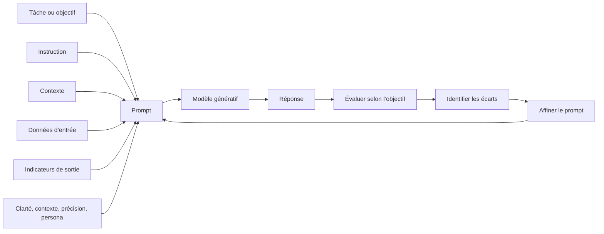

# Ingénierie des prompts pour l’IA générative

## Table des matières

- [Statut](#statut)
- [Objectifs d’apprentissage](#objectifs-dapprentissage)
- [Carte conceptuelle](#carte-conceptuelle)
- [Concepts clés](#concepts-clés)
- [Application pratique](#application-pratique)
- [Travaux pratiques et activités](#travaux-pratiques-et-activités)
- [Révision du quiz](#révision-du-quiz)
- [Questions à revoir](#questions-à-revoir)
- [Synthèse finale](#synthèse-finale)

## Statut

- [x] Adaptation française rédigée à partir des notes canoniques anglaises.
- [ ] Révision personnelle de l’adaptation terminée.

Le certificat documente séparément la réussite du cours. Les prompts littéraux restent en anglais pour conserver les exemples étudiés.

## Objectifs d’apprentissage

1. Définir un prompt et ses quatre composantes : instruction, contexte, données et indicateurs de sortie.
2. Expliquer l’itération sur les prompts sans réentraîner le modèle.
3. Appliquer clarté, contexte, précision et rôle ou persona.
4. Comparer demandes naïves et demandes structurées avec exemples, contraintes et formats.
5. Décrire les outils et les procédures de base des laboratoires enregistrés.

## Carte conceptuelle



L’objectif devient une demande structurée ; la réponse est comparée aux critères attendus ; les écarts orientent la révision. Les composantes décrivent tâche et résultat, tandis que les bonnes pratiques réduisent l’ambiguïté.

## Concepts clés

### Contexte et sources

Le cours enregistré s’adresse à des professionnels, étudiants, responsables et curieux sans exiger programmation ou diplôme particulier. Ses trois modules couvrent bases et outils, techniques et approches, puis projet, quiz, glossaire et sujets facultatifs sur l’image et watsonx.

Vidéos, lectures, laboratoires, experts, podcasts, jeux de rôle, échanges et quiz sont les sources. Les indications d’une à deux heures par module ou d’un module par semaine sont des estimations d’étude autonome. Produits, modèles et interfaces restituent l’enregistrement, sans enquête actuelle.

### Prompts et ingénierie des prompts

Un prompt est une entrée guidant un modèle vers une sortie : question, instruction, début de texte, contexte accompagné d’une tâche, exemples ou suite de demandes conversationnelles. L’ingénierie des prompts conçoit, teste et affine ces entrées selon un objectif.

Une demande vague sur une personne riche d’une petite ville laisse beaucoup de choix ouverts. Préciser un agriculteur, une transformation sur dix ans, ses difficultés, ses réussites et la forme d’une courte histoire rend le résultat attendu plus explicite. Cela ne garantit pas l’exactitude : toute réponse demande une évaluation adaptée à l’enjeu.

### Quatre composantes

| Composante            | Fonction                                   | Exemple du cours                                       |
| --------------------- | ------------------------------------------ | ------------------------------------------------------ |
| Instruction           | Indiquer l’opération                       | Analyser les effets du réchauffement sur la vie marine |
| Contexte              | Aider à interpréter                        | Décrire les changements récents du milieu marin        |
| Données d’entrée      | Fournir la matière à traiter               | Relevés de température et niveau marin du Pacifique    |
| Indicateurs de sortie | Fixer forme, ton, longueur et organisation | Texte de 600 mots, tableau, liste ou nombre d’éléments |

L’ordre n’est pas rigide. Il faut rendre compréhensibles le travail, la situation, la matière et les critères d’une réponse satisfaisante.

### De la demande naïve à la demande structurée

« Quel temps fait-il ? » ne suffit pas à un capitaine : trajet, zone, période, vent, vagues, visibilité, précipitations et tempêtes influencent la décision. Un tableau compact et un résumé des risques peuvent être des indicateurs de sortie. Le principe dépasse ce domaine : préciser contexte décisionnel et format utile.

### Affinage itératif

1. Définir le but.
2. Rédiger une demande initiale.
3. Générer une réponse.
4. Comparer au but.
5. Repérer omissions, ambiguïtés, portée excessive ou défauts de présentation.
6. Modifier les éléments concernés et retester.

L’exemple automobile enrichit progressivement une demande sur bénéfices et risques avec effets positifs et négatifs, éthique, conduite autonome, analyse du trafic, complexité, cybersécurité et sécurité routière. Le point central du dialogue est d’évaluer la réponse **avant** de réécrire le prompt.

### Clarté, contexte, précision et persona

La **clarté** préfère une demande directe à une formulation obscure : expliquer photosynthèse, chlorophylle, soleil, dioxyde de carbone et eau. Le **contexte** précise public, intention, lieu, période ou conditions. La **précision** ajoute thèmes, nombre, exemples, longueur, sections, ton, format et exclusions utiles.

Le **rôle** ou **persona** fournit une perspective professionnelle ou stylistique : expert fitness, chef de produit, conseiller client. Il oriente vocabulaire et priorités, mais ne confère ni qualification, ni connaissances actuelles, ni fiabilité professionnelle.

### Formes de prompts et contraintes

Les exemples comparent question, proposition et instruction :

```plaintext
What are the benefits of water reservoirs in a detailed paragraph?
```

```plaintext
Discuss the benefits of utilizing water reservoirs.
```

```plaintext
List the top five benefits of water reservoirs.
```

L’opération souhaitée doit être explicite ; aucune forme grammaticale n’est toujours supérieure. Une contrainte de longueur peut être formulée ainsi :

```plaintext
Create an announcement for starting a new job at ABCTech company as a lead data scientist in a tweet-length message.
```

Le support comprend aussi une limite de 280 caractères. Si longueur ou quantité définissent la réussite, elles appartiennent au prompt.

### Persona et demande naïve

Demande minimale :

```plaintext
What is the best way to get fit?
```

Version avec rôle :

```plaintext
Acting as a fitness expert, tell me the best way to get fit.
```

Instructions persistantes de l’exemple :

```plaintext
You will act as a fitness expert who is current with the latest research data and provide very detailed step-by-step instructions in reply to my queries.
```

L’application à un débutant reste générique sans contraintes pertinentes, par exemple mobilité, âge ou besoins spécifiques. Le motif est rôle, contexte utile, format puis tâche. Des personas contrastés montrent des cadrages différents ; ils ne représentent pas avec autorité une personne ou un groupe réel.

### Zero-shot, one-shot et few-shot

Zero-shot n’apporte aucun exemple ; one-shot en apporte un ; few-shot en apporte quelques-uns pour montrer structure ou style. L’affirmation d’un expert selon laquelle le format pourrait compter davantage que l’exactitude de certains exemples reste à discuter, sans en faire une règle pour les tâches factuelles. La chaîne de raisonnement est annoncée ici et développée au module suivant.

### Instructions persistantes et message courant

Le champ enregistré **Prompt Instructions** porte des consignes à l’échelle d’une conversation :

```plaintext
Sound extra cheerful in your replies.
```

Un message séparé fournit la tâche :

```plaintext
List 10 people who contributed to the development of LLMs.
```

Une consigne intégrée dans un message peut ne concerner que ce tour. Le support distingue réinitialisation, qui efface les échanges visibles en conservant les instructions, et suppression de conversation. Cette persistance doit être vérifiée dans l’interface actuelle avant démonstration.

### Outils d’ingénierie des prompts

Les fonctions étudiées comprennent suggestions, structure, contexte, itération, spécialisation métier, bibliothèques, indications sur les biais et comparaison de modèles ou paramètres.

| Nom enregistré    | Rôle décrit                                                                                            |
| ----------------- | ------------------------------------------------------------------------------------------------------ |
| IBM watsonx.ai    | Entraîner, ajuster, déployer et gérer des modèles de fondation                                         |
| Prompt Lab        | Expérimenter ; exemples de résumé, classement, génération et extraction                                |
| Spellbook         | Développer des prompts de génération, extraction, classement, questions-réponses, complétion et résumé |
| Dust              | Chaînes, versions, traitement de sorties et intégrations                                               |
| PromptPerfect     | Optimisation de prompts pour différentes familles de modèles                                           |
| Ressources GitHub | Guides, exemples et outils                                                                             |
| OpenAI Playground | Expérimentation avec des prompts                                                                       |
| LangChain         | Bibliothèque Python pour des processus impliquant des prompts                                          |
| PromptBase        | Marché de prompts                                                                                      |

Propriété, accès, tarifs, interfaces et capacités actuelles ne sont pas vérifiés par ces descriptions.

### Observations des experts

Définir la tâche, son usage, la forme de réponse et les contraintes ; varier longueur et formulation ; utiliser exemples et rôle si utiles ; fournir un retour ; respecter les conventions du modèle. Température, top-k et top-p sont mentionnés sans définition technique suffisante ici.

Les références à OpenAI, Microsoft Copilot, Llama2 et à la mémoire conversationnelle des nouveaux modèles restent propres aux supports. « Fusion learning » apparaît dans une transcription, sans relation expliquée avec one-shot/few-shot : ce n’est pas adopté comme terme formel.

## Application pratique

### Coopérative Cacao Nawa : structurer un suivi de traçabilité

Une demande comme « Demande l’information manquante » ne fournit ni les faits ni les contraintes
nécessaires. Un prompt plus précis les sépare :

```plaintext
Rôle : tu aides l’équipe de traçabilité de la coopérative.
Tâche : rédige un message en français à l’agent de terrain pour un dossier incomplet.
Faits confirmés :
- Le lot NC-014 possède un identifiant producteur et un poids enregistré.
- L’heure de réception à l’entrepôt est absente.
Exigences :
- Demande à l’agent de vérifier et fournir l’heure de réception.
- Limite la réponse à 70 mots et emploie un ton respectueux.
Contraintes :
- N’invente ni inspection, ni grade, ni certification, ni statut de paiement.
```

Le personnel autorisé évalue exactitude, ton, longueur et absence de détails inventés. Un affinage
ultérieur peut améliorer la clarté sans affaiblir les contraintes de preuve.

### Réponse au client : concevoir, évaluer, affiner

Le dialogue porte sur une livraison en retard de cinq jours :

```plaintext
Act as a customer service representative for a small online business. Write a professional and empathetic response to a customer whose shipment is five days late. Apologize for the delay, acknowledge their frustration, explain that the order is still in transit, and offer to provide updated tracking information. Keep the message concise, polite, and reassuring, and do not make promises about an exact delivery date unless confirmed. Format the response as a customer email of about 100–150 words.
```

Le prompt réunit rôle, petite entreprise, retard, excuses, reconnaissance de la frustration, suivi, ton professionnel et empathique, interdiction d’inventer une date et longueur de 100–150 mots. Si le courriel paraît robotique, identifier ce défaut puis demander une formulation chaleureuse, naturelle et attentionnée, sans style rigide ou scripté.

Le cycle est objectif, prompt, réponse, évaluation, défaut de ton, correction ciblée et nouvel essai.

### Réflexion sur un chatbot quotidien

L’exemple imaginé d’un support e-commerce propose des instructions pour rester poli, reconnaître la frustration, demander un numéro de commande et proposer une étape suivante sans inventer de date. C’est une application personnelle des concepts, pas la documentation d’un commerçant réel.

## Travaux pratiques et activités

### Laboratoire 1 : découvrir l’interface

Le support décrit titres modifiables, historique, choix du modèle, nouvelle conversation, réinitialisation, duplication, instructions et message courant. **GPT-5 Nano** apparaît dans l’exercice sans établir sa disponibilité actuelle.

1. Ajouter une instruction :

   ```plaintext
   Sound extra cheerful in your replies.
   ```

2. Envoyer une demande :

   ```plaintext
   List 10 people who contributed to the development of LLMs.
   ```

3. Observer l’effet du ton, puis comparer réinitialisation, suppression et nouvelle conversation selon le support.
4. Essayer une autre instruction :

   ```plaintext
   Talk to me like I'm a 5-year-old.
   ```

5. Poser une question plus difficile et comparer le style.

Le point d’apprentissage concerne la portée différente des instructions persistantes et du message.

### Laboratoire 2 : expérimenter

Choisir d’abord génération, résumé ou classification. Le patron proposé est :

```plaintext
[Description of task] [Data on which task needs to operate] [Optional-sample example of response]
```

Un exercice de traduction associe tâche, texte et exemple. Un autre affine le contexte marketing :

```plaintext
Explain the key applications of generative AI in the content marketing sector
```

Le prompt initial n’est pas conservé : seule cette révision est reproduite. Comparer ensuite les trois formulations sur les réservoirs et les contraintes de longueur des annonces. Évaluer les sorties réelles plutôt que présumer la supériorité d’une formulation.

### Laboratoire 3 : persona

Comparer question fitness naïve, rôle expert puis instructions persistantes détaillées ; appliquer à un programme pour débutant. L’exemple marketing ajoute un rôle à une demande de titres d’articles.

Examiner pertinence, ton, structure, contexte encore manquant, spécificité et exactitude, puis définir les contraintes utiles. Le persona ne dispense pas de vérifier le contenu.

## Révision du quiz

Le quiz d’entraînement couvre définition du prompt, affinage, bonnes pratiques, persona et outils. Le quiz noté ajoute idées marketing ciblées, exemples de style, structures métier, descriptions produits cohérentes, rôle du contexte, essai avant révision et demande au modèle d’une structure de réponse.

Tous les choix ne sont pas conservés : aucune clé de réponses manquante n’est reconstruite. Le malentendu identifié est qu’une réponse pertinente peut néanmoins être insuffisante. Il faut comparer au but et nommer l’écart avant de reformuler.

## Questions à revoir

1. Quels noms, propriétaires, accès et fonctions s’appliquent aujourd’hui aux outils cités ?
2. Quels contrôles et comportements persistent dans l’interface actuelle ?
3. Quelle était la portée exacte du choix GPT-5 Nano ?
4. Que désigne « fusion learning » dans la transcription ?
5. Dans quels cas un exemple incorrect dégrade-t-il la tâche ?
6. Comment diffèrent température, top-k et top-p, et quelles API les exposent ?
7. Quelles pratiques améliorent la cohérence sans promettre exactitude ou sécurité ?
8. Quelles conventions de prompt sont réellement requises par un modèle donné ?
9. Quelle portée donner aux affirmations sur la sécurité : un prompt seul ne fournit pas une garantie ?
10. Comment vérifier l’association enregistrée entre OpenAI Playground et Stable Diffusion avant de l’enseigner ?

## Synthèse finale

Un prompt guide le modèle avec instruction, contexte, données et indicateurs de sortie. L’ingénierie des prompts définit un objectif, teste, évalue, identifie les écarts et révise. Clarté, précision, rôle, exemples et contraintes rendent les attentes explicites.

Le persona oriente le cadrage sans créer une expertise réelle. Les outils facilitent l’expérimentation, mais leurs descriptions sont datées. La compétence centrale consiste à exprimer le besoin et à améliorer la demande à partir de ce que le modèle a effectivement produit.
