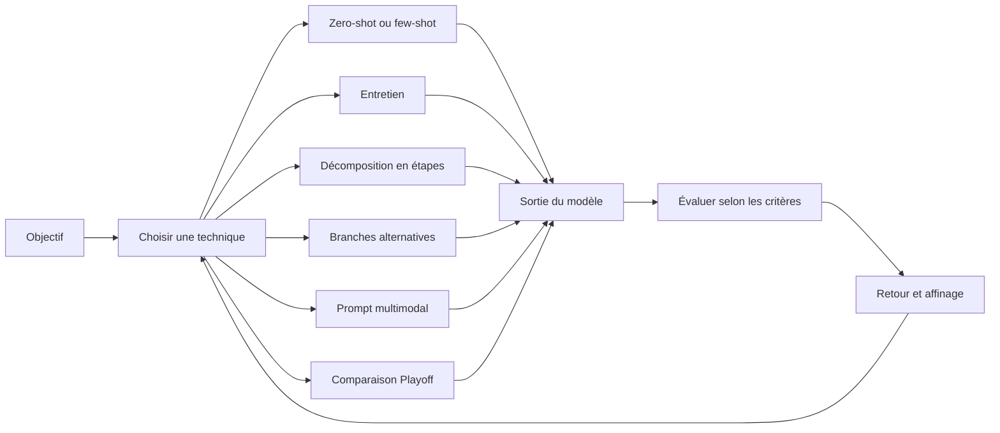

# Techniques et approches d’ingénierie des prompts

## Table des matières

- [Statut](#statut)
- [Objectifs d’apprentissage](#objectifs-dapprentissage)
- [Carte conceptuelle](#carte-conceptuelle)
- [Concepts clés](#concepts-clés)
- [Application pratique](#application-pratique)
- [Travaux pratiques et activités](#travaux-pratiques-et-activités)
- [Révision du quiz](#révision-du-quiz)
- [Questions à revoir](#questions-à-revoir)
- [Synthèse finale](#synthèse-finale)

## Statut

- [x] Adaptation française rédigée à partir des notes canoniques anglaises.
- [ ] Révision personnelle de l’adaptation terminée.

La réussite du cours est documentée séparément. Les exemples de prompts restent en anglais, comme dans les notes sources.

## Objectifs d’apprentissage

1. Appliquer spécification de tâche, contexte, cadrage, exemples et retour itératif.
2. Distinguer zero-shot et few-shot selon les démonstrations présentes dans le prompt.
3. Recueillir le contexte manquant par un entretien structuré.
4. Comparer décomposition en étapes et exploration de branches en reconnaissant leurs limites.
5. Combiner texte, images et documents dans une demande multimodale.
6. Comparer plusieurs réponses selon les critères explicites de la méthode Playoff étudiée.

## Carte conceptuelle



La technique découle du besoin : demande directe, exemples, entretien, étapes, alternatives, modalités ou comparaison. Dans tous les cas, évaluer puis affiner reste nécessaire.

## Concepts clés

### Contexte et sources

Le module rassemble vidéos, laboratoires, dialogue, experts, lectures, podcast, quiz, jeu de rôle et réponses personnelles. Noms de produits et modèles reflètent le cours enregistré. Les affirmations sur fiabilité, explicabilité, éthique, biais, sécurité et confiance sont qualifiées : un prompt influence la sortie sans garantir ces propriétés.

### Techniques textuelles

| Technique              | Finalité                          | Exemple étudié                                      |
| ---------------------- | --------------------------------- | --------------------------------------------------- |
| Spécifier la tâche     | Dire exactement quoi faire        | Traduire une phrase anglaise en français            |
| Guider par le contexte | Délimiter le sujet                | New York sous l’angle de ses monuments              |
| Perspective métier     | Indiquer le domaine               | Explication médicale de l’hypothyroïdie             |
| Demande d’équilibre    | Orienter le traitement d’un sujet | Exemples de leadership sans préférence de genre     |
| Cadrage et limites     | Contrôler longueur et structure   | Résumé de 100 mots sur résultats et recommandations |
| Boucle de retour       | Réviser après examen              | Rendre un poème plus humoristique                   |

La qualité dépend aussi du modèle. Demander une expertise ne crée pas une qualification ; demander la neutralité ne prouve pas l’absence de biais.

### Zero-shot et few-shot

Le zero-shot donne une tâche sans exemple de réponse :

```plaintext
Select the adjective in this sentence:
Anita bakes the best cakes in the neighborhood.
```

Il ne signifie pas absence de préentraînement. Le few-shot ajoute quelques démonstrations, comme les recommandations saisonnières de voyage du cours.

| Mode      | Démonstrations dans le prompt | Usage typique                                     |
| --------- | ----------------------------- | ------------------------------------------------- |
| Zero-shot | Non                           | Tâche directement formulable                      |
| Few-shot  | Oui                           | Structure ou correspondance plus facile à montrer |

Les exemples guident l’interaction, sans réentraîner le modèle : il s’agit d’apprentissage en contexte dans la terminologie du cours.

### Motif d’entretien

L’**Interview Pattern** recueille les détails d’une demande insuffisante : définir le rôle ou la tâche, demander les informations nécessaires, poser les questions successivement, y répondre, puis synthétiser.

```plaintext
Ask me a series of questions, one by one, to gather all the information you need to give a proper response.
```

Voyage, fitness, cadeau, dîner et article servent d’exemples. Le bénéfice vient du contexte recueilli ; des réponses pauvres ne deviennent pas précises par le seul recours à l’entretien.

### Choisir une approche

Partir de la sortie, des données requises, du contexte disponible, des exemples utiles, des questions manquantes, des alternatives et du format. Clarté, contexte et caractéristiques demandées sont récurrents. La précision n’empêche pas à elle seule les hallucinations.

| Situation                    | Approche candidate            |
| ---------------------------- | ----------------------------- |
| Tâche claire                 | Zero-shot ou prompt structuré |
| Format difficile à décrire   | Few-shot                      |
| Informations manquantes      | Entretien                     |
| Sous-problèmes ordonnés      | Décomposition                 |
| Options concurrentes         | Branches et comparaison       |
| Texte avec image ou document | Multimodal                    |
| Plusieurs sorties à classer  | Comparaison par paires        |

### Décomposition de type Chain-of-Thought

Le cours présente une séquence d’étapes, soit montrée par un exemple résolu, soit demandée directement. Il emploie promotions et achats sous budget. L’attribution à Kojima et ses collègues est conservée sans vérification indépendante :

```plaintext
Let's think step by step.
```

Une autre formulation du laboratoire est :

```plaintext
Let's work this out in a step-by-step way to be sure we have the right answer.
```

Ces phrases sont des exemples étudiés, pas des garanties. Le support rapporte lui-même un résultat erroné malgré la consigne. L’usage maintenu consiste à demander une explication structurée, des résultats intermédiaires ou une justification concise vérifiable. Une explication visible n’est pas un accès au raisonnement interne privé du modèle.

Les limites sont longueur, lenteur, complexité inutile, propagation des erreurs et pouvoir de persuasion d’une justification fausse.

### Décomposer un sujet large

La demande initiale de l’exercice est :

```plaintext
What is space exploration?
```

Le support propose ensuite des dimensions : missions historiques, Lune, satellites, Mars, vie extraterrestre, tourisme, débris, coopération internationale, fusées, voyage interstellaire et secteur privé. Définir ces dimensions suppose déjà une connaissance suffisante du sujet.

```plaintext
Address each of the following dimensions:
- [dimension 1]
- [dimension 2]
- [dimension 3]

For each dimension, explain the important points and connect them to the overall question.
Finish with a concise synthesis.
```

### Exploration de type Tree-of-Thought

La démarche produit plusieurs voies, évalue avantages, difficultés, risques et ressources avec les mêmes critères, puis choisit ou synthétise. Les exemples sont baisse des ventes, carrière, collecte de fonds, menus familiaux, intrigue, satisfaction client et année de césure.

```plaintext
Propose three distinct strategies.

For each strategy:
- list the main benefits;
- list the likely challenges;
- identify the resources required.

Compare the three strategies using the same criteria and recommend the strongest option.
```

L’observable utile est la présence d’options et de critères communs. Toutes les branches peuvent néanmoins reposer sur des hypothèses fragiles.

### Comparaison chaîne et arbre

| Dimension           | Décomposition en chaîne        | Exploration en arbre                |
| ------------------- | ------------------------------ | ----------------------------------- |
| Structure           | Une séquence principale        | Plusieurs branches                  |
| Usage dans le cours | Tâche ou explication en étapes | Choix entre options                 |
| Atout               | Ordre et décomposition         | Diversité et compromis              |
| Coût                | Plus d’étapes et de texte      | Plus de calcul et de comparaison    |
| Risque              | Erreur propagée                | Branches faibles mais convaincantes |

L’entrée sur un marché illustre partenariat, implantation directe ou acquisition, comparés selon ressources, risques, concurrence, réglementation et rendement attendu. Cela ne décrit pas l’accès à un raisonnement caché.

### Prompts multimodaux

Texte et image, ou texte et document visuel, fournissent plusieurs modalités. ChatGPT, Gemini, variantes GPT-4 et ImageBind sont des références enregistrées, sans vérification de capacités actuelles.

Les usages sont résumé de texte/tableaux/graphiques, extraction d’image, légendes, hashtags et création inspirée d’un visuel. Joindre une image ne précise pas la tâche :

```plaintext
Use the attached [image/document] together with the instructions below.

Task:
[what to extract, analyze, compare, or create]

Output:
[required structure, level of detail, constraints]

If information is unclear or absent from the supplied material, say so rather than inventing it.
```

Les modalités apportent des éléments supplémentaires mais aussi des risques d’extraction et d’interprétation. Le cours ne fournit pas d’évaluation prouvant une amélioration systématique de l’exactitude.

### Méthode Playoff

La lecture attribue à un article d’Andrew Best une comparaison en tournoi : produire plusieurs candidats, définir les critères, comparer par paires, retenir les plus adaptés puis poursuivre.

| Critère    | Question                                      |
| ---------- | --------------------------------------------- |
| Clarté     | Comprend-on facilement ?                      |
| Couverture | Toutes les exigences sont-elles satisfaites ? |
| Pertinence | La tâche reste-t-elle au centre ?             |
| Engagement | Le public et le but sont-ils pris en compte ? |

Le modèle qui génère et juge n’est pas un évaluateur indépendant. Les résultats dépendent des critères et demandent une révision humaine lorsque l’enjeu le justifie. PureEarth illustre quatre slogans ; le laboratoire applique le principe à une annonce B2B.

### Limites transversales

Expertise demandée, neutralité, explication longue, branches multiples ou autoévaluation ne garantissent ni faits exacts, ni équité, ni sécurité. L’entrée multimodale ne supprime pas les erreurs. Les descriptions de produits restent datées et les promesses fortes exigent une évaluation distincte.

## Application pratique

### Coopérative Cacao Nawa : choisir une technique pour planifier la collecte

« Aide la coopérative à planifier la collecte » reste trop large pour produire une réponse fiable.
La technique doit traiter les informations manquantes :

- **Motif d’entretien :** recueillir période, points de collecte participants, avis confirmés des
  producteurs, capacité d’entrepôt, véhicules disponibles et contraintes connues.
- **Few-shot :** fournir des exemples qui transforment des rapports de terrain en données
  structurées de statut et de suivi.
- **Décomposition en étapes :** vérifier la complétude avant de calculer un plan provisoire à valider
  par le responsable.
- **Prompt multimodal :** examiner la photo d’une étiquette de lot en marquant les valeurs illisibles
  comme inconnues.
- **Comparaison Playoff :** classer des avis aux producteurs selon exactitude, clarté, ton et longueur.

La technique la plus complexe n’est pas automatiquement la meilleure. Le choix dépend de
l’information manquante et de la méthode de vérification prévue par le personnel.

### Choisir selon le problème d’information

Cette synthèse originale des notes sources n’est pas un scénario du cours :

```plaintext
Help me choose a project-management tool for my team.
```

Un entretien peut recueillir taille de l’équipe, budget, intégrations, sécurité, processus et reporting. Si trois outils sont déjà retenus, comparer devient plus pertinent :

```plaintext
Compare Tool A, Tool B, and Tool C using:
- required integrations;
- pricing constraints;
- ease of onboarding;
- reporting;
- security requirements.

Identify missing information separately. Do not invent unsupported product capabilities.
```

Si plusieurs synthèses restent acceptables, un tournoi peut aider à les classer. Il faut choisir la méthode selon ce qui manque.

### SyncroTask : exactitude avant fluidité

Dans le jeu de rôle fictif, les faits confirmés sont public de petites et moyennes entreprises, ton professionnel et rassurant, essai de **14 jours**, **sans carte bancaire**, remboursements possibles sous **30 jours après le premier paiement**, et base de connaissances comme source de référence.

La première FAQ invente assistant d’intégration, accès à toutes les fonctions, remboursement intégral, rappel avant fin d’essai et intégrations Slack/Google Calendar. La révision sépare faits confirmés et inconnues :

```plaintext
Use only information explicitly provided in the Confirmed Facts section or in the supplied Knowledge Base.
Do not infer, assume, embellish, or invent product behavior.
```

Elle ajoute :

```plaintext
Accuracy is more important than making every answer sound complete.
```

Les réponses révisées renvoient les inconnues de facturation et d’intégration à la base fictive ou au support. Le bon ton ne compense pas des informations inventées.

## Travaux pratiques et activités

### Laboratoire 1 : entretien

L’exemple associe rôle et questions :

```plaintext
You will act as a fitness expert and provide detailed replies.
Interview me by asking the relevant questions you need before generating the final answer.
```

Puis tâche :

```plaintext
Create a gym workout program to lose weight and build strength.
```

L’enjeu pédagogique est le recueil d’informations, pas l’autorité du conseil fitness. Le second exemple commence par :

```plaintext
Craft a blog post to announce my new course, "Prompt Engineering for Everyone".
```

Ajouter ensuite une perspective marketing et un entretien question par question. Les exercices autonomes portent sur itinéraire, dîner et cadeau. Vérifier si les informations recueillies améliorent effectivement la réponse.

### Laboratoire 2 : décomposition

Un problème de menu résolu précède un problème apparenté de poissons d’aquarium :

```text
demonstration of a structured solution
    ↓
related new task
    ↓
model attempts to apply the demonstrated pattern
```

L’arithmétique et les hypothèses demandent une vérification indépendante. Comparer avec la consigne courte :

```plaintext
Let's think step by step.
```

Le cours rapporte qu’elle ne réussit pas toujours. L’exercice étend ensuite la décomposition à un sujet large, puis à la conservation des océans.

### Laboratoire 3 : branches alternatives

Pour une collecte de fonds scolaire :

```plaintext
You are planning a school fundraising event.

List three different types of events and label them A, B, and C.

For each event, list:
- key benefits;
- likely challenges;
- required resources.

Compare the three events and choose the most feasible one.
Explain why it is a better fit than the alternatives.
```

Générer avant de converger. L’autre exemple compare trois stratégies alimentaires pour une famille de quatre avec budget limité selon coût quotidien, nutrition et commodité. Pratiquer sur rebondissement policier, baisse de satisfaction et année de césure orientée voyage, bénévolat ou compétences.

### Laboratoire 4 : multimodal

Les documents et images sont décrits comme synthétiques dans la source. Le PDF porte sur l’usage quotidien de l’IA générative :

```plaintext
Briefly summarize the key findings of this PDF survey, including both the text and visual data such as charts or tables.
```

```plaintext
What are the most common day-to-day tasks where users report adopting GenAI, based on this document?
```

```plaintext
Based on the survey results in this PDF, what recommendations would you make to improve GenAI adoption in daily workflows?
```

Relier chaque réponse au document. Pour le ticket de courses fictif, extraire articles, quantités, prix et totaux, calculer les moyennes par catégorie puis proposer un budget de **80 dollars**. Vérifier les valeurs avant les calculs.

Pour la scène alpine, créer une histoire autour d’un feu de camp ou un poème inspiré du paysage. Évaluer correspondance au visuel et contraintes créatives, en distinguant création et extraction. La lecture contient un prompt PDF mal transcrit avec duplication ; le laboratoire fournit les formulations nettes conservées ci-dessus.

### Laboratoire 5 : Playoff

NeoTech Solutions, entreprise fictive, célèbre son **100e déploiement**. Le texte doit remercier l’équipe, montrer innovation et orientation client, rester professionnel et tenir en **moins de 100 mots**. Produire cinq prompts et réponses, puis comparer :

```plaintext
For each set of responses, perform a pairwise comparison using:
- clarity;
- coverage of the requirements;
- engagement potential.

State which response is stronger in each comparison, then summarize which response performs best overall.
```

Le classement est une aide, pas la preuve d’un optimum objectif. Dans la variante, le conférencier est nommé Anita Desai puis John Doe dans sa fiche. Ne pas choisir arbitrairement : l’identité doit être clarifiée avant exécution.

### Réflexion et jeu de rôle

La réflexion personnelle projette sur cinq ans davantage d’interactions naturelles, de consignes réutilisables, d’accessibilité par traduction, dictée et simplification, ainsi que de travail d’évaluation et de gouvernance. Ce sont des projections.

Le jeu de rôle propose FAQ, marketing ou formation ; l’échange fourni choisit la FAQ. Son cycle est recueillir les besoins, identifier la source, distinguer connu et inconnu, rédiger, inspecter les inventions, renforcer les limites, recommencer et évaluer.

## Révision du quiz

L’entraînement distingue étapes, entretien, branches, tournoi et multimodal. Le quiz noté les applique à choix automobile, information juridique, neutralité, logique, options de traitement, titres et graphiques. Les choix complets ne sont pas fournis et ne sont pas reconstruits.

Les mots « exactitude » et « équité » dans les retours expriment l’intention pédagogique, sans garantie. Le malentendu central est qu’un texte de raisonnement plus long serait nécessairement plus fiable : preuves, hypothèses, calculs et limites documentaires doivent être évalués séparément de l’élégance de l’explication.

## Questions à revoir

1. Distinguer explication visible et raisonnement interne privé.
2. Chercher des preuves pour les affirmations fortes sur fiabilité, explicabilité, éthique, sécurité et confiance.
3. Définir une évaluation des biais indépendante d’une consigne de neutralité.
4. Identifier les vérifications nécessaires pour les domaines à conséquences importantes.
5. Conserver l’échec rapporté avec « GPT 3.5 » comme observation datée, sans benchmark universel.
6. Vérifier modalités et chargements actuels des produits avant usage.
7. Clarifier la duplication du prompt PDF dans la lecture.
8. Vérifier l’article d’Andrew Best et la portée du terme Playoff.
9. Résoudre Anita Desai/John Doe.
10. Déterminer quand compléter le jugement du modèle par une personne ou une mesure externe.
11. La self-consistency est seulement évoquée : aucune définition ou démonstration n’est déduite ici.

## Synthèse finale

Spécification, contexte, exemples et retour rendent la tâche plus explicite. Zero-shot et few-shot diffèrent par les démonstrations ; l’entretien comble les informations manquantes ; étapes et branches organisent l’exploration ; le multimodal apporte plusieurs sources ; le tournoi compare selon des critères.

La méthode doit répondre au besoin d’information et d’évaluation. Aucune ne garantit vérité, équité ou sécurité. SyncroTask montre l’importance de préférer une limite explicite à un détail inventé.
