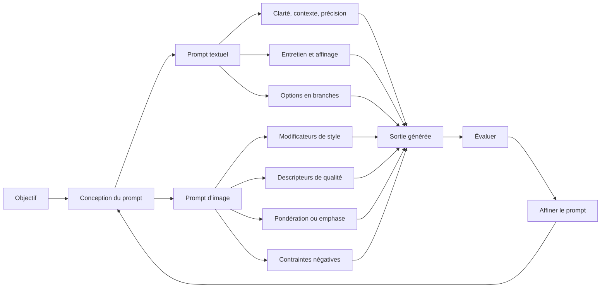

# Quiz, projet et bilan du cours

## Table des matières

- [Statut](#statut)
- [Objectifs d’apprentissage](#objectifs-dapprentissage)
- [Carte conceptuelle](#carte-conceptuelle)
- [Concepts clés](#concepts-clés)
- [Application pratique](#application-pratique)
- [Travaux pratiques et activités](#travaux-pratiques-et-activités)
- [Révision du quiz](#révision-du-quiz)
- [Questions à revoir](#questions-à-revoir)
- [Synthèse finale](#synthèse-finale)

## Statut

- [x] Adaptation française rédigée à partir des notes canoniques anglaises.
- [ ] Révision personnelle de l’adaptation terminée.

Le certificat documente séparément la réussite du cours. Les exemples littéraux restent en anglais ; les sorties absentes ne sont pas reconstituées.

## Objectifs d’apprentissage

1. Appliquer les techniques d’image présentées : style, qualité visuelle, répétition, pondération et exclusions.
2. Distinguer l’ingénierie des prompts du sens plus large et moins normalisé de « prompt hacks » dans le cours.
3. Clarifier et préciser des demandes ambiguës.
4. Réutiliser entretien et exploration en branches tout en évaluant les sorties.
5. Revoir les concepts dans le glossaire et le quiz final.
6. Relier les acquis à un problème concret en séparant source, proposition personnelle et capacités actuelles.

## Carte conceptuelle



Le module applique les acquis aux images, au projet et à la révision. Définir tâche, contexte et contraintes, puis inspecter et affiner reste le principe commun.

## Concepts clés

### Contexte et sources

Les supports comprennent leçon et laboratoire d’image, glossaire, lecture « Prompt Hacks », podcast prospectif, projet, quiz et bilan. « Congratulations and Next Steps » et « Team and Acknowledgements » n’ont pas de texte fourni. Aucun message de clôture n’est inventé.

Produits, modèles, interfaces, syntaxe et pondération reflètent les sources enregistrées. Une meilleure apparence n’est pas une preuve de fiabilité ; un comportement propre à un modèle n’est pas une règle universelle.

### Prompts d’image

Un prompt d’image décrit sujet, composition, couleurs, ambiance, style et autres propriétés souhaitées.

| Technique               | But enregistré                    | Limite                                     |
| ----------------------- | --------------------------------- | ------------------------------------------ |
| Modificateurs de style  | Orienter le rendu artistique      | Interprétation propre au modèle            |
| Descripteurs de qualité | Demander détail et netteté        | « 4k » ne garantit pas une résolution      |
| Répétition              | Renforcer une idée                | Peut exagérer ou déformer le résultat      |
| Termes pondérés         | Accentuer ou réduire un concept   | Syntaxe et prise en charge spécifiques     |
| Prompts négatifs        | Écarter des éléments indésirables | Ne garantit pas la disparition des défauts |

Ces techniques orientent, sans établir exactitude, authenticité ou adéquation.

### Modificateurs de style

Le cours cite photographie, animation, art numérique, bande dessinée, fantasy, dessin au trait, film analogique, neon punk, isométrie, origami et pixel art cinématographique.

```plaintext
[style modifier] image of [subject] with [scene or composition details].
```

Les demandes inspirées d’artistes, périodes, marques ou styles dépendent du produit et de ses règles actuelles ; l’enregistrement ne prouve pas une capacité universelle.

### Descripteurs de qualité visuelle

Les exemples sont haute résolution, 2k/4k, hyperdétail, détails complexes, netteté, lignes fines, couleurs complémentaires et arrière-plan flou.

```plaintext
Create a highly detailed and realistic painting of a cat.
```

Il s’agit de préférences, pas de preuves de dimensions en pixels, de netteté optique ou d’exactitude. Une image convaincante peut rester fictive.

### Répétition

Les mots `tiny`, `dense`, `enormous`, `vast`, `serene`, `clear` et `lush` illustrent l’emphase. Le lien annoncé avec davantage de variantes dépend du modèle et des paramètres de génération ; répéter un mot ne garantit pas cette diversité.

### Termes pondérés

Le support associe des poids positifs à `warm`, `crackling`, `shimmering`, `neon-lit` et `exotic`, et un poids négatif à `colorful`, sans donner de syntaxe exacte. Utiliser une pondération seulement selon la documentation du système choisi.

Il emploie aussi « weighted terms » pour des mots publicitaires tels que `free`, `limited time offer`, `guaranteed`, `luxury`, `premium` et `exclusive`. Il faut distinguer persuasion sémantique et pondération numérique.

### Exclusions et défauts

Les images peuvent présenter anatomie déformée, pixellisation ou autres artefacts. Le patron proposé est :

```plaintext
Create [desired image].

Avoid:
- [unwanted feature 1]
- [unwanted feature 2]
- [unwanted feature 3]
```

Champ négatif séparé, exclusion en langage naturel et poids négatif ne sont pas équivalents dans tous les produits. Aucun ne garantit une image sans défaut.

### Texte et image : une démarche commune

Définir la tâche, le contexte, les contraintes, les propriétés attendues, générer, examiner puis réviser. Les images ajoutent composition, placement, couleurs, ambiance et défauts à éviter.

### Glossaire du cours

| Terme                     | Sens dans le cours                                                                                        |
| ------------------------- | --------------------------------------------------------------------------------------------------------- |
| Intégration API           | Relier des logiciels pour échanger données ou fonctions                                                   |
| Réduction des biais       | Consignes encourageant des réponses plus équilibrées, sans preuve suffisante d’équité                     |
| Chain-of-Thought          | Décomposer une tâche en étapes ; ne révèle pas le raisonnement interne privé                              |
| ChatGPT                   | Décrit par le support comme un modèle donnant des réponses en langage naturel                             |
| Claude                    | Assistant conversationnel pour plusieurs tâches, selon la source                                          |
| Prompt comparatif         | Comparer plusieurs sorties côte à côte                                                                    |
| Guidage contextuel        | Ajouter des instructions propres à une situation                                                          |
| Compréhension intermodale | Relier des informations issues de modalités différentes                                                   |
| DALL-E                    | Modèle texte-image dans la description du cours                                                           |
| Expertise de domaine      | Cadrage et vocabulaire spécialisés                                                                        |
| Dust                      | Interface de rédaction et chaînage de prompts décrite dans le cours                                       |
| Explicabilité             | Possibilité d’interpréter une sortie, sans accès direct aux mécanismes privés                             |
| Few-shot                  | Démonstrations dans le contexte                                                                           |
| Cadrage                   | Contraintes fixant les limites attendues                                                                  |
| IA générative             | Génération de texte, image, audio ou vidéo                                                                |
| Modèles génératifs        | Modèles produisant du contenu guidé par contexte ou instructions                                          |
| GPT                       | Famille fondée sur Transformers et préentraînement                                                        |
| IBM watsonx.ai            | Plateforme de modèles de fondation décrite par la source                                                  |
| Données d’entrée          | Informations fournies avec la demande                                                                     |
| IDE                       | Le glossaire décrit un environnement pour rédiger et exécuter des prompts ; ce sens est propre au support |
| Motif d’entretien         | Questions permettant de recueillir les informations avant une réponse adaptée                             |
| LangChain                 | Bibliothèque Python de prompts et processus IA selon la source                                            |
| LLM                       | Modèles profonds entraînés sur de grands corpus textuels                                                  |
| Midjourney                | Système texte-image décrit dans le cours                                                                  |
| Modèles multimodaux       | Traitent ou génèrent plusieurs types de données                                                           |
| Prompts multimodaux       | Entrées combinant plusieurs modalités                                                                     |
| Prompt naïf               | Demande minimale                                                                                          |
| NLP                       | Méthodes de traitement du langage humain                                                                  |
| OpenAI Playground         | Interface d’expérimentation décrite par le cours                                                          |
| Indicateur de sortie      | Format, ton, longueur ou critère demandé                                                                  |
| Playoff Method            | Générer puis comparer des candidats ; aussi écrit « Play-off method » dans le glossaire                   |
| Prompt                    | Instruction, question ou entrée guidant une sortie                                                        |
| Ingénierie des prompts    | Conception et amélioration systématiques selon la tâche                                                   |
| Prompt Lab                | Environnement d’expérimentation sur modèles de fondation dans la source                                   |
| PromptBase                | Marché de prompts décrit dans le cours                                                                    |
| PromptPerfect             | Outil d’optimisation décrit dans le cours                                                                 |
| Rôle ou persona           | Demander une perspective définie                                                                          |
| Scale AI                  | Entreprise associée à l’étiquetage et l’annotation dans le support                                        |
| Autorévision              | Faire critiquer sa sortie au modèle, parfois associée au tournoi                                          |
| Stable Diffusion          | Modèle texte-image dans le glossaire                                                                      |
| StableLM                  | Modèle de langage ouvert décrit par le support                                                            |
| Tree-of-Thought           | Explorer plusieurs chemins ou options                                                                     |
| Boucle de retour          | Affiner après examen des réponses                                                                         |
| Zero-shot                 | Demander sans démonstration dans le prompt courant                                                        |

Les entrées de produits ne vérifient ni licences, ni disponibilité, ni architecture, ni fonctions actuelles.

### Terminologie « prompt hacks »

Le cours emploie ce terme pour des expérimentations créatives et le compare à une démarche systématique.

| Aspect      | « Prompt hacks » dans la lecture | Ingénierie des prompts                          |
| ----------- | -------------------------------- | ----------------------------------------------- |
| But         | Orienter de manière inattendue   | Améliorer une tâche définie                     |
| Approche    | Expérimentale et créative        | Systématique                                    |
| Application | Création ou humour               | Traduction, questions-réponses et autres tâches |

La frontière n’est pas nette : contexte, exemples et styles servent les deux. Les gains de qualité, exactitude, facilité ou nouveauté restent à évaluer selon modèle et tâche. Les conseils sont d’expérimenter, préciser, consulter la documentation et comparer. Le sens du terme dans d’autres domaines, notamment la sécurité, demande une vérification distincte.

### Expérimentation textuelle

Style, contexte, exemples et autres modalités peuvent changer la sortie. Le point de départ est :

```plaintext
Write a poem about a cat.
```

Un modificateur ne garantit pas un meilleur poème ; il change les critères ou le cadrage.

### Expérimentation visuelle

Le support fait rédiger une description puis un prompt d’image par un modèle de langage :

```text
visual idea
    ↓
ask an LLM for a detailed image description
    ↓
ask the LLM to rewrite that description as an image prompt
    ↓
send the resulting prompt to an image-generation system
    ↓
inspect and refine the image
```

Les exemples sont un chat orange duveteux sur un canapé rouge et une interprétation de « Twinkle Twinkle Little Star ». DALL-E 2 et Imagen sont cités, sans imposer ce processus intermédiaire aux systèmes actuels.

### Podcast prospectif

Le podcast décrit une progression de GPT-3.5 vers GPT-4 puis GPT-5 et prévoit moins de formules rigides, une évolution des cours et marchés de prompts, et une pratique plus générale dans les métiers. Ce sont des points de vue et prévisions, pas des mesures historiques ou du marché de l’emploi.

La communication claire reste utile ; une tâche précise peut demander des contraintes plus serrées qu’une exploration créative.

## Application pratique

### Coopérative Cacao Nawa : processus final pour un écart de traçabilité

La demande vague « Résous ce problème de traçabilité » peut être décomposée en livrables
vérifiables :

1. Une liste de contrôle pour comparer données de terrain, de réception et d’entrepôt d’un lot.
2. Un court message en français qui demande un fait manquant au membre du personnel responsable.
3. Un prompt text-to-image pour une affiche de formation sur la saisie lisible des identifiants.
4. Une synthèse de rapprochement qui sépare faits confirmés, contradictions et questions ouvertes.

Chaque prompt fournit les données connues, le public visé, le format de sortie et les hypothèses
interdites. Le personnel autorisé résout l’écart et approuve la communication. Les mesures proposées
sont dossiers incomplets, identifiants en double, temps de rapprochement et corrections du
personnel. Elles servent à l’évaluation et ne constituent pas des résultats obtenus.

### Clarifier une demande de carrière

La demande initiale cumule plusieurs considérations :

```plaintext
Please guide me on potential career paths in the field of computer science, considering my interests, skills, the evolving technology landscape, and the impact of AI, while also factoring in work-life balance and opportunities for personal growth.
```

Le projet sépare intérêts, compétences, contraintes et objectifs lointains :

```plaintext
I have a strong interest in machine learning and natural language processing.
How can I leverage these interests and my programming skills in a career?
```

```plaintext
With AI becoming increasingly important, how can I prepare for a career that is AI-focused?
```

```plaintext
I value work-life balance and flexible work arrangements.
What career paths can provide me with these benefits?
```

```plaintext
In the long term, I aspire to take on leadership roles.
What career steps should I consider to advance into leadership positions in the IT or tech industry?
```

Ces exemples sont pédagogiques et ne constituent pas des recommandations de carrière personnalisées.

### Proposition personnelle : continuité d’activité en Côte d’Ivoire

La réflexion finale propose d’aider petits commerces, distributeurs et prestataires pendant les coupures d’électricité ou de réseau. Le système envisagé conserverait ventes et stocks localement, signalerait les faibles stocks, mettrait les transactions en attente et les synchroniserait au retour de la connexion.

L’exemple imagine un commerçant d’Abidjan avec une tablette. Les indicateurs proposés sont durée d’interruption, transactions perdues ou dupliquées, écarts de stock, part des ventes maintenues et pertes de revenus. Aucun système réalisé, benchmark, modèle hors ligne ou résultat mesuré n’est fourni.

## Travaux pratiques et activités

### Laboratoire : prompts pour images

Les objectifs sont utiliser la génération et comparer les techniques. Le texte commence à **Step 2** ; aucune préparation manquante n’est inventée.

#### Générer

```plaintext
image of a cat
```

Le support décrit champ de message, **Start chat**, **Regenerate response**, nouvelle conversation par plus, rafraîchissement et duplication. Il affirme une expiration des images après deux heures. Ces détails doivent être vérifiés avant usage actuel.

#### Modifier le style

```plaintext
Comic art of a cat
```

```plaintext
Image of a cat with neon punk
```

Comparer les changements de rendu.

#### Décrire la qualité visuelle

```plaintext
Create a highly detailed and realistic painting of a cat
```

```plaintext
A cat having complementary colors and charming body
```

Observer les différences plutôt que déduire une qualité technique du vocabulaire.

#### Étape appelée « pondération »

```plaintext
Scenic landscape
```

```plaintext
Generate an Image of a scenic landscape with mountains and a lake
```

L’exemple ajoute des montagnes et un lac, sans poids numérique. Il démontre la spécificité, pas une syntaxe technique de pondération.

#### Combinaisons à essayer

Styles :

```plaintext
An animated, neon punk image of a cat
```

```plaintext
A lined, digital art image of a cat
```

```plaintext
A comic book-inspired, fantasy art portrayal of a cat
```

```plaintext
An origami-inspired, isometric view of a cat
```

Descriptions de qualité :

```plaintext
A lifelike, exquisitely detailed, high-quality image of a cat
```

```plaintext
An exquisite, handcrafted mahogany dining table
```

```plaintext
A sensational, multi-layered chocolate cake
```

```plaintext
A breathtaking, panoramic view of a castle on a hill
```

Scènes supplémentaires :

```plaintext
Tranquil beach with crystal-clear water and sands
```

```plaintext
Futuristic cityscape with sleek skyscrapers and illuminated streets
```

Changer une ou deux dimensions à la fois puis comparer.

### Projet final : bonnes pratiques

#### Exercice 1 : clarté et précision

Reprendre la demande trop large :

```plaintext
Please guide me on potential career paths in the field of computer science, considering my interests, skills, the evolving technology landscape, and the impact of AI, while also factoring in work-life balance and opportunities for personal growth.
```

Ajouter dans les instructions :

```plaintext
I am pursuing a degree in Computer Science and exploring career opportunities for myself after graduation.
```

Puis séparer les questions sur apprentissage automatique et NLP, préparation à l’IA, équilibre de vie et responsabilités futures :

```plaintext
I have a strong interest in machine learning and natural language processing. How can I leverage these interests and my programming skills in a career?
```

```plaintext
With AI becoming increasingly important, how can I prepare for a career that is AI-focused?
```

```plaintext
I value work-life balance and flexible work arrangements. What career paths can provide me with these benefits?
```

```plaintext
In the long term, I aspire to take on leadership roles. What career steps should I consider to advance into leadership positions in the IT or tech industry?
```

Évaluer si situation, question, contraintes, type de réponse et hypothèses à vérifier sont explicites.

#### Exercice 2 : stratégie marketing en branches

Le scénario est le lancement d’un téléphone haut de gamme. Trois experts simulés proposent, comparent, révisent et rapprochent leurs idées. Les demandes de « raisonnement » sont conservées sous forme de justifications concises, alternatives et compromis observables, sans prétendre dévoiler un processus privé.

```plaintext
Generate three distinct expert perspectives for each stage of the launch strategy.

For each perspective:
- state the proposed action;
- give a concise rationale;
- identify important trade-offs.

Then compare the three perspectives and summarize:
- where they agree;
- where they differ;
- the combined actions that best match the stated marketing goals.
```

La relance demande :

```plaintext
For each expert, please provide two actionable tactics per step that you suggested.
```

Les objectifs sont positionnement premium, enthousiasme, part de marché et canaux en ligne/hors ligne. Le projet approfondit ensuite les paramètres démographiques d’une étude de marché. Les noms d’experts simulés peuvent varier.

#### Exercice 3 : dialogue pour un article

Le consultant IA commence largement :

```plaintext
Can you share your insights on the impact of generative AI on various industries?
```

Puis cible la santé :

```plaintext
How is generative AI being utilized in the healthcare industry?
Are there any specific examples of applications that have made a significant difference?
```

Et les enjeux responsables :

```plaintext
What are the challenges and ethical considerations related to generative AI in healthcare?
```

Le support appelle cela un entretien, mais ici l’apprenant questionne le modèle, contrairement au motif précédent où le modèle recueille les besoins. Les exemples médicaux générés exigent une vérification indépendante avant publication.

### Activité de lecture : expérimenter

```plaintext
Write a poem about a cat.
```

Varier style, public, longueur, exemples, ton ou modalité. Comparer les effets selon des critères explicites au lieu de déclarer une version supérieure sans mesure.

## Révision du quiz

Les dix notions testées sont objectif de l’ingénierie sans réentraînement, prompt ciblé, interface d’essai OpenAI Playground dans la source, décomposition, alternatives, multimodal, contenu produit pertinent, exemples de Prompt Lab, dialogue itératif et descriptions d’images précises. Les choix complets ne sont pas reconstruits.

La révision globale rappelle instruction, contexte, données, sortie, itération, clarté, précision, rôle, zero-shot, few-shot, entretien, étapes, branches, modalités et comparaison. Les affirmations de sécurité, fiabilité ou réduction des biais ne deviennent pas des garanties.

Le malentendu central : un prompt visuellement détaillé n’est pas une spécification technique garantie. « 4k », « sharp », « high-quality » et les poids demandent une vérification du fichier et de leur prise en charge.

## Questions à revoir

1. Quels systèmes acceptent des poids numériques et selon quelle syntaxe ?
2. Quels effets mesurables ont les termes de qualité ?
3. Quelle preuve relie répétition, emphase et diversité ?
4. Quels outils distinguent champ négatif et exclusions ordinaires ?
5. L’expiration de deux heures s’applique-t-elle encore au laboratoire concerné ?
6. Où se trouve l’étape 1 manquante ?
7. Pourquoi l’étape 5 parle-t-elle de poids alors qu’elle ajoute du contexte ?
8. Quelles règles actuelles régissent les références de style ?
9. Quel sens a « prompt hacks » dans les autres contextes ?
10. La séparation hacks/ingénierie est-elle une taxonomie du seul cours ?
11. Quelles descriptions, licences et disponibilités actuelles correspondent aux produits du glossaire ?
12. Quelles preuves soutiennent les prévisions du podcast sur modèles, métiers et marchés ?
13. Quelle référence vérifie l’attribution du prompt à trois experts à Dave Hulbert ?
14. Comment demander justifications, options et critères vérifiables plutôt qu’un raisonnement interne complet ?
15. Quelles sources indépendantes valident les exemples de santé ?
16. Où retrouver les deux sections de clôture vides ?

## Synthèse finale

Les prompts d’image précisent sujet, scène, composition, ambiance et style. Descripteurs, répétition, poids et exclusions dépendent du système et ne garantissent ni qualité technique ni vérité. Le glossaire consolide les notions ; les « prompt hacks » restent un terme pédagogique large.

Le projet reprend précision, exploration d’alternatives et dialogue. La continuité d’activité en Côte d’Ivoire est une proposition personnelle, sans réalisation mesurée. Le processus durable reste : objectif, contexte, contraintes, méthode adaptée, évaluation, vérification des affirmations et affinage.
