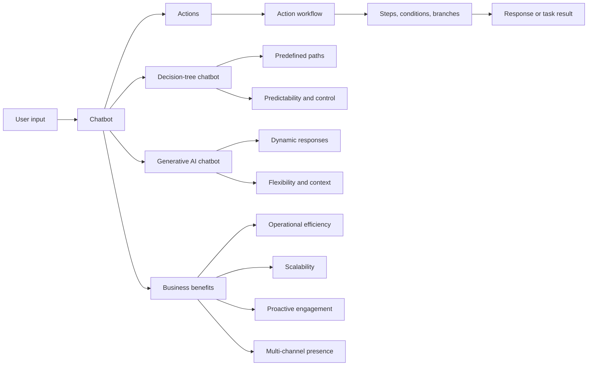

# Chatbot Fundamentals

## Table of Contents

- [Status](#status)
- [Learning Objectives](#learning-objectives)
- [Concept Map](#concept-map)
- [Core Concepts](#core-concepts)
- [Practical Application](#practical-application)
- [Labs and Activities](#labs-and-activities)
- [Quiz Review](#quiz-review)
- [Questions to Revisit](#questions-to-revisit)
- [Final Summary](#final-summary)

## Status

- [ ] Complete
- [ ] Reviewed

## Learning Objectives

1. Define chatbots and virtual assistants as presented in the course.
2. Explain the main business benefits of chatbot adoption.
3. Describe actions and action workflows in IBM watsonx Assistant.
4. Compare decision-tree and generative AI chatbots.
5. Explain default and custom actions in a flower-shop scenario.
6. Identify where structured control, conversational flexibility, or a hybrid approach is appropriate.

## Concept Map

## Core Concepts

### Course context and source basis

The supplied course material presents this as a beginner-level course for learners who want to build an AI-powered chatbot without programming. A basic understanding of computer science and information technology is described as helpful, but not required.

The running example is a fictitious online flower shop. Across the course, its chatbot is built to:

- retrieve and display store locations;
- provide opening and closing hours;
- recommend flower arrangements;
- handle greetings, thank-yous, and farewells;
- preserve context during the same session;
- deploy to a live environment and a WordPress site.

### What a chatbot is

The course defines **chatbots** as software applications that simulate human conversation and change how businesses interact with customers. They can communicate through text and voice and respond to user inputs.

The course also uses **chatbot** and **virtual assistant** interchangeably.

### Business benefits

#### Operational efficiency

Chatbots can answer common questions immediately and handle routine or repetitive work. This reduces waiting time and allows human employees to focus on more complex customer issues.

The supplied final-assessment feedback reinforces that the intended benefit is not to eliminate human service agents, but to handle large volumes of inquiries and free agents for complex tasks.

#### Availability

Chatbots can provide support outside normal business hours.

#### Scalability

A single chatbot can handle many customer interactions simultaneously. The course gives examples such as FAQs, website navigation, and common technical troubleshooting.

#### Proactive customer engagement

Chatbots can suggest products, provide personalized recommendations, and guide users through decisions based on the interaction context.

#### Multi-channel presence

The course describes chatbots as deployable across websites, messaging platforms, SMS, phone, and other channels.

#### Democratization of development

No-code tools such as IBM watsonx Assistant are presented as making chatbot development accessible to non-programmers through visual editors, templates, and guided workflows.

### Actions

An **action** is a task the chatbot performs in response to user input. Actions are triggered when input matches predefined conditions or intent examples.

In the flower-shop example, actions can:

- greet customers;
- detect trigger words;
- answer store-location questions;
- answer opening-hours questions;
- collect details;
- recommend flowers;
- handle unmatched input;
- prevent the conversation from ending in a dead end.

### Action workflows

An **action workflow** is a sequence of steps, conditions, and branches used to complete a more complex task.

A workflow may:

1. recognize what the user wants;
2. ask for missing information;
3. capture the answer;
4. evaluate conditions;
5. move to a branch;
6. return an appropriate response;
7. continue or end the action.

The course uses workflows for location lookup, opening hours, and flower recommendations.

### Default actions in watsonx Assistant

#### Greet customer

This action welcomes the user and explains what the assistant can help with.

#### Trigger Word Detected

This action responds to configured words or phrases. The course uses examples such as a customer asking for red roses.

#### No matches

If the assistant does not understand an input, No matches can acknowledge the limitation and redirect the user toward supported topics.

#### Fallback

Fallback is presented as a safety net when the interaction cannot reach a resolution after repeated failures, validation issues, or unmatched inputs.

### Custom actions

Custom actions handle business-specific scenarios.

The source uses same-day delivery as an example: a flower shop could configure a custom action to answer differently depending on whether the request still qualifies for same-day service.

The main distinction is:

- **default actions** handle common interaction patterns;
- **custom actions** implement business-specific behavior.

### Decision-tree chatbots

Decision-tree chatbots follow predefined conversational paths.

Key features shown in the course include:

- branching logic and conditions;
- predefined outcomes;
- multi-step processes;
- predictable behavior;
- consistent responses;
- strong control over the conversation.

The course associates this approach with structured settings such as customer service, banking, healthcare, and e-commerce, especially when compliance, accuracy, or predictable questioning matters.

### Generative AI chatbots

Generative AI chatbots dynamically generate responses rather than requiring every path to be scripted.

The source identifies:

- dynamic response generation;
- contextual understanding;
- handling unpredictable inputs;
- personalization.

The examples include customer engagement, content or recommendation scenarios, and broader virtual-assistant use cases.

### Risks of generative AI chatbots

The supplied course material explicitly discusses:

- hallucinations or plausible but incorrect information;
- biased outputs inherited from data;
- exposure of sensitive information;
- difficulty explaining how a response was produced.

### Control versus flexibility

Decision-tree chatbots emphasize control and predictability. Generative AI chatbots emphasize flexibility and conversational depth.

The course also presents a hybrid model: routine interactions can follow a decision tree while more open-ended questions can be delegated to generative AI.

## Practical Application

### A cocoa cooperative near Soubré: A Cooperative Operations Assistant

The repository's continuing fictional case study applies the chatbot concepts to the same cocoa
cooperative used in Courses 01–03. IBM's flower-shop example remains the source exercise; this
cooperative scenario is a separate practical adaptation.

A cooperative operations assistant could support structured, low-risk information tasks such as:

1. **Collection-point information** — help a member or staff user identify the relevant collection
   point from approved records.
2. **Receiving information** — return recorded receiving hours or instructions when those facts are
   available in the cooperative's approved data.
3. **Record-completeness guidance** — explain which supplied intake or traceability field is missing
   without inventing a value.
4. **Traceability follow-up** — draft a concise request for a missing fact or summarize confirmed
   information for staff review.
5. **Escalation** — redirect unresolved or consequential cases to authorized cooperative staff.

The assistant does not reject a cocoa lot, assign a quality grade, determine a producer payment,
diagnose crop disease, or submit an official certificate. Those decisions remain with authorized
people.

No real collection-point locations, receiving hours, or operational rules are asserted by this
scenario unless they are explicitly supplied as source data.

### Choosing a chatbot style

A source-aligned rule of thumb applied to the cooperative is:

- use a decision tree when the interaction must follow a known, verifiable procedure;
- use generative AI for open-ended explanation or drafting when staff can verify the result;
- combine both when controlled operational workflows need predictable branches but supporting
  communication benefits from greater flexibility.

## Labs and Activities

This module prepares the learner to create an IBM watsonx Assistant instance and build the flower-shop chatbot through visual actions.

The activities represented in the supplied material include:

- identifying chatbot benefits;
- describing the flower-shop use cases;
- distinguishing actions from workflows;
- comparing decision-tree and generative AI approaches;
- examining default actions;
- considering where custom actions are needed.

## Quiz Review

The assessment material reinforces that:

- chatbots improve efficiency by handling repetitive inquiries and freeing human agents for more complex work;
- decision-tree chatbots are appropriate when fixed questions and predefined outcomes are required;
- chatbots can scale to serve multiple customers at once;
- action workflows can retrieve and display store locations based on user input;
- Trigger Word Detected is the relevant default action for configured keywords;
- the action-based watsonx Assistant approach is presented as using AI and simplified workflows to streamline building, testing, and deployment.

## Questions to Revisit

- Which parts of a production support flow require deterministic control?
- Which parts would benefit from generative responses?
- Where should fallback behavior transition to human support?
- How much information should a chatbot gather before offering a result?

## Final Summary

Chatbots are software applications that simulate conversation and can support customer interactions through text or voice. The course emphasizes operational efficiency, availability, scalability, proactive engagement, and multi-channel delivery.

In watsonx Assistant, **actions** model tasks and **action workflows** connect steps, conditions, and branches. Decision-tree chatbots provide predictable, controlled flows, while generative AI chatbots provide dynamic, context-sensitive responses. The IBM flower-shop project uses these concepts as the foundation for the hands-on modules that follow. In the repository's separate practical thread, the same concepts begin a Cooperative Operations Assistant for the fictional cocoa cooperative near Soubré.
