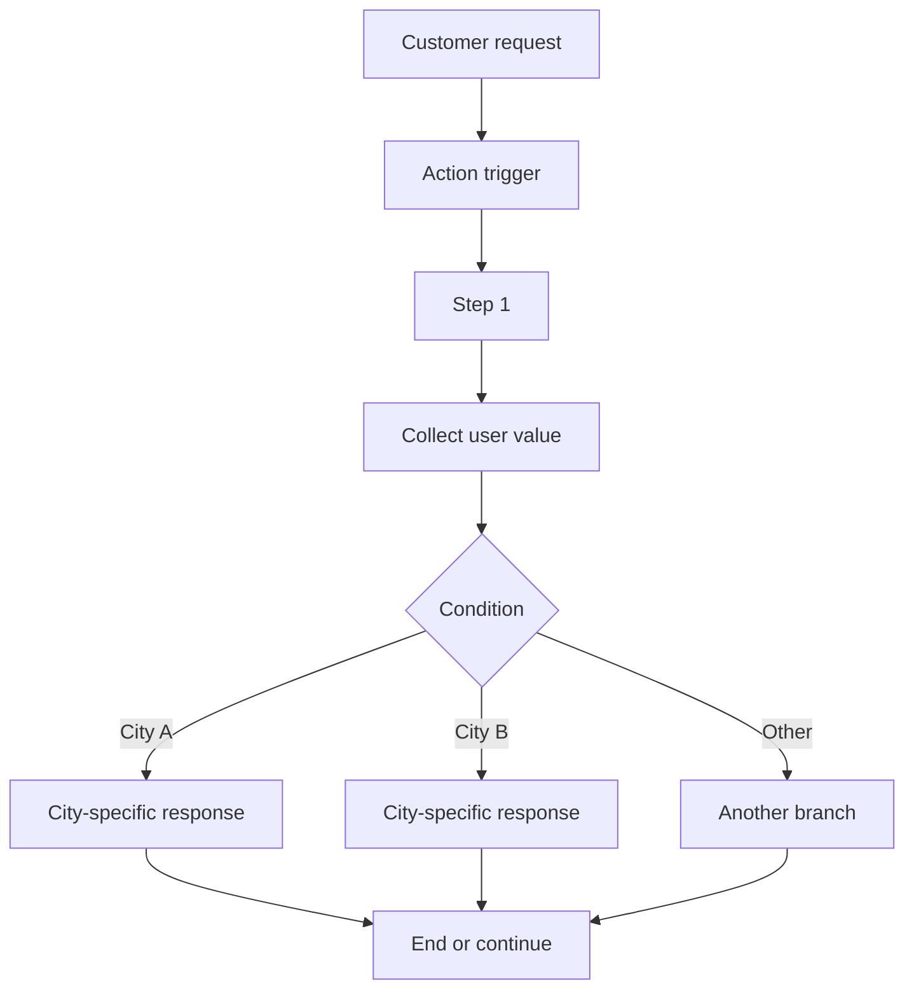

# Decision Tree Chatbot

## Table of Contents

- [Status](#status)
- [Learning Objectives](#learning-objectives)
- [Concept Map](#concept-map)
- [Core Concepts](#core-concepts)
- [Practical Application](#practical-application)
- [Labs and Activities](#labs-and-activities)
- [Quiz Review](#quiz-review)
- [Questions to Revisit](#questions-to-revisit)
- [Final Summary](#final-summary)

## Status

- [ ] Complete
- [ ] Reviewed

## Learning Objectives

1. Build a structured chatbot using IBM watsonx Assistant actions.
2. Create trigger examples that teach the assistant when an action should start.
3. Use steps, conditions, customer responses, and branching logic.
4. Build the flower-shop location workflow.
5. Reuse an existing action structure to create related functionality such as opening hours.
6. Test the assistant in Preview and refine the workflow when behavior does not match expectations.

## Concept Map

## Core Concepts

### Structured conversation design

A decision-tree chatbot turns a customer request into a controlled sequence of conversational steps.

The flower-shop location flow follows this pattern:

1. recognize that the user is asking about store locations;
2. ask which city the user is interested in when needed;
3. capture the selected city;
4. evaluate a city-specific condition;
5. return the matching location response.

### Training an action with examples

The course teaches that an action begins with examples of what a customer might say.

Examples are not meant to enumerate every possible sentence. They provide enough variety for the assistant to recognize different phrasings that express the same intent.

The same pattern is reused for:

- location requests;
- opening-hours requests;
- greetings;
- flower recommendations.

### Conversation steps

A step can:

- return an assistant response;
- collect a customer response;
- define selectable options;
- set variables;
- execute only when conditions are satisfied;
- continue to the next step;
- end the action.

The visual editor lets the learner build these flows without application code.

### Conditions

Conditions decide whether a step is taken.

The location action uses city-specific conditions. Once the user chooses a city, the matching conditional step returns that store's information.

Later modules reuse the same idea for:

- city-specific hours;
- recommendation branches;
- Yes/No follow-up paths.

### Customer responses

The course frequently uses structured responses rather than unrestricted free text.

The city-selection flow presents a predefined list of supported cities. Later modules use lists for occasions and a confirmation response for a Yes/No follow-up question.

### Flower-shop store locations

The supplied course material uses five store locations:

- Montreal;
- Toronto;
- Calgary;
- Kelowna;
- Vancouver.

The canonical pattern is `selected city -> matching conditional branch -> city-specific answer`.

### Reusing an action structure

The **Hours of operation** action is created by duplicating the existing location action and changing:

- the action name;
- the trigger examples;
- the city-specific responses.

This demonstrates a useful workflow pattern: duplicate a structurally similar action rather than rebuilding all branches from scratch.

### Action scope limitation

A value collected inside one action is local to that action unless promoted to broader scope.

This becomes visible when a user:

1. asks for the Vancouver location;
2. selects Vancouver;
3. receives the address;
4. asks, "And when is it open?"

The Hours of operation action does not automatically know that Vancouver was selected in the Location information action.

This limitation motivates session variables in the next module.

### Testing in Preview

The course repeatedly instructs the learner to reset Preview and test after changes.

Testing verifies:

- the correct action is recognized;
- the expected step runs;
- the correct option is captured;
- the matching response is returned;
- the action ends or continues as intended.

### Recorded flower-shop opening hours

The supplied IBM lab records the following hours:

| City      | Hours                                                                                           |
| --------- | ----------------------------------------------------------------------------------------------- |
| Montreal  | Every day, 10:00–17:00; closed on Quebec statutory holidays                                     |
| Toronto   | Monday–Saturday, 09:00–18:00; closed Sundays and Ontario statutory holidays                     |
| Calgary   | Monday–Saturday, 10:00–18:00; closed Sundays and Alberta statutory holidays                     |
| Kelowna   | Tuesday–Saturday, 10:00–17:45; closed Sundays, Mondays, and British Columbia statutory holidays |
| Vancouver | Every day, 10:00–17:00; closed on British Columbia statutory holidays and Boxing Day            |

These values belong to the recorded flower-shop exercise. They are not reused as facts about the
repository's cocoa-cooperative case study.

## Practical Application

### A cocoa cooperative near Soubré: Collection-Point Lookup

The repository case study reuses the decision-tree structure for cooperative logistics rather than
changing the IBM lab itself.

A controlled collection-point lookup could follow this pattern:

| Stage      | Purpose                                                          |
| ---------- | ---------------------------------------------------------------- |
| Trigger    | Recognize a request about where a cocoa lot can be received      |
| Step 1     | Ask which supported collection point the user means when needed  |
| Condition  | Match the selected collection point                              |
| Point step | Return approved location or receiving information for that point |
| End        | Complete the action                                              |

The assistant should only return collection points and location details supplied by an approved
cooperative data source. The case study does not invent real collection-point names or addresses.

### Receiving-hours workflow

The same branching structure can support a separate receiving-hours action:

1. recognize that the user is asking when a collection point receives lots;
2. identify the relevant collection point;
3. match it to a conditional branch;
4. return the recorded receiving schedule;
5. end the action or continue to another supported task.

This mirrors the IBM pattern of duplicating a structurally similar action, but the cooperative
version uses `collection point -> matching branch -> approved receiving information`.

No receiving schedule is asserted unless one has been explicitly supplied. If the required point or
schedule is absent, the assistant should report that the information is unavailable and route the
question for staff review rather than inventing an answer.

### Why this remains deterministic

Collection-point locations and receiving schedules are good candidates for decision-tree behavior
when the cooperative has a finite approved set of values. Predefined options reduce ambiguity,
while conditional branches keep the returned operational information tied to the selected point.

The next module can then preserve the selected collection point across actions so that a follow-up
such as "When can I deliver there?" does not require the user to select it again.

## Labs and Activities

### Location information action

The supplied lab workflow is:

1. create or open the assistant;
2. create a Location information action;
3. add trigger examples;
4. ask the user which city they want;
5. define the supported city options;
6. create one conditional step per city;
7. add the city-specific response;
8. save;
9. test in Preview.

### Hours of operation action

The course then duplicates the location action and changes it into **Hours of operation**, preserving the same city-based branching structure.

## Quiz Review

The course reinforces that:

- decision-tree chatbots guide users through predefined paths;
- branching logic evaluates input and chooses a specific path;
- predefined outcomes improve consistency;
- multi-step processes gather required information before returning a result;
- structured chatbots are suitable where repeatability and compliance matter;
- action workflows can retrieve and display store locations based on the user query.

## Questions to Revisit

- Which action inputs should be restricted to predefined options?
- Which steps should end an action immediately?
- Where would No matches or fallback improve the flow?
- Which values need to survive beyond the action that collected them?

## Final Summary

The decision-tree portion of the course turns business questions into visual action workflows. Trigger examples start the right action, steps collect information, conditions choose branches, and predefined responses produce consistent outcomes.

The location and hours actions also expose an important limitation: action-level data does not automatically carry into another action. That leads directly to the use of session variables.
