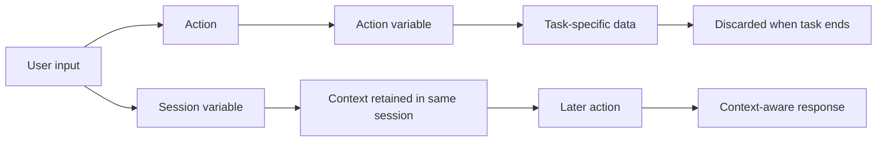

# Variables in Chatbot Interactions

## Table of Contents

- [Status](#status)
- [Learning Objectives](#learning-objectives)
- [Concept Map](#concept-map)
- [Core Concepts](#core-concepts)
- [Practical Application](#practical-application)
- [Labs and Activities](#labs-and-activities)
- [Quiz Review](#quiz-review)
- [Questions to Revisit](#questions-to-revisit)
- [Final Summary](#final-summary)

## Status

- [ ] Complete
- [ ] Reviewed

## Learning Objectives

1. Distinguish action variables from session variables.
2. Explain why action variables are temporary and task-specific.
3. Explain how session variables preserve context during the same user session.
4. Create and use a City session variable in the flower-shop chatbot.
5. Prevent a session variable from being accidentally overwritten.
6. Add conversational actions for greetings, thank-yous, and farewells.
7. Use response variations to make repeated interactions feel less robotic.
8. Test multi-action conversations in Preview.

## Concept Map

## Core Concepts

### Action variables

The course describes **action variables** as temporary values used within a specific action.

They can hold information such as:

- a selected option;
- order details;
- search details;
- a confirmation answer.

Once the action is complete, the action variable is discarded because it is no longer needed.

### Session variables

**Session variables** retain state and context across multiple interactions within the same user session.

The course emphasizes their use for:

- contextual details;
- user preferences;
- continuity between actions;
- more relevant follow-up answers.

They are not presented as permanent cross-session storage.

### Why context is lost between actions

The flower-shop chatbot has separate actions for location information and opening hours.

A user can:

1. ask where stores are located;
2. select Vancouver;
3. receive the Vancouver address;
4. ask, "And when is it open?"

Without a session variable, the Hours of operation action does not know that Vancouver was selected earlier because the city value existed only in the previous action.

### The City session variable

The course solves this by creating a **City** session variable.

A new intermediate step:

1. receives the city selected in Step 1;
2. assigns that value to City;
3. lets later actions read City.

City-specific conditions then reference the session variable instead of the original action-step variable.

### Defensive conditions

The first session-variable implementation still has two possible problems:

- Step 1 can ask for a city even when City is already known.
- the Set city step can overwrite City with an empty value when Step 1 did not collect a new city.

The course fixes both.

#### Step 1 condition

Run Step 1 only when **City is not defined**.

#### Set city condition

Run Set city only when the Step 1 action variable **is defined**.

This prevents a valid session value from being replaced by an empty value.

### Sharing City across actions

The same City session variable is used by both:

- Location information;
- Hours of operation.

Either action can establish the city, and the other can reuse it.

This supports:

- location -> hours;
- hours -> location;
- an explicit city mentioned directly in the user's request.

### Saved responses

The source notes that customer response sets, such as the list of cities, can be saved for reuse under **Saved responses**.

The lab does not require this because the action structure was duplicated, but the feature is presented as useful when multiple actions share the same response set.

### Small-talk actions

The course then adds custom actions that make the assistant more conversational.

#### Hellos

Trigger examples include:

- Hello
- Hey
- Good morning
- Good evening
- How is it going?
- What's up?

The recorded response is:

> Hello! How can I help you? I can give you instructions on how to find our stores, our hours of operation, and flower recommendations.

The action ends after responding.

#### Thank you

The course starts from the prebuilt **Thank you!** template and adds response variations.

The source examples are:

- You're welcome! Let me know if I can help with anything else.
- My pleasure! Let me know if you have other questions.
- You're very welcome! Let me know if I can assist further.

The variation type is set to Random.

#### Goodbyes

The Goodbyes action uses City when available.

With a city:

> Thank you for chatting. We hope you visit our [City] store.

Without a city:

> Thank you for chatting. We hope you visit our store.

## Practical Application

### A cocoa cooperative near Soubré: Session Context Across Actions

In the repository case study, the same state-management pattern can connect the collection-point and
receiving-hours workflows introduced in the previous module.

The IBM lab uses the session variable `City`. The cooperative adaptation uses the conceptual name
`CollectionPoint` to make the equivalent role explicit. `CollectionPoint` is a repository
case-study variable, not a variable recorded in the IBM lab.

A conversation could work like this:

1. a member or staff user asks where a cocoa lot can be delivered;
2. the assistant asks for a supported collection point when necessary;
3. the selected value is stored in `CollectionPoint` for the current session;
4. the user then asks, "When can I deliver there?";
5. the receiving-hours action reuses `CollectionPoint`;
6. the assistant returns only receiving information supplied by an approved cooperative source.

This avoids asking for the same context twice while keeping the interaction tied to explicit,
reviewable operational data.

### CollectionPoint session-state pattern

| Need                                                                     | Variable type    |
| ------------------------------------------------------------------------ | ---------------- |
| Hold a value needed only while completing one action                     | Action variable  |
| Reuse the selected collection point in later actions in the same session | Session variable |
| Capture a temporary confirmation needed only by the current branch       | Action variable  |
| Preserve approved context such as the current collection point           | Session variable |

A defensive implementation follows the same pattern demonstrated by the IBM `City` variable:

1. collect the collection point only when it is not already known;
2. write `CollectionPoint` only when a new valid value was actually collected;
3. do not overwrite an existing session value with an empty value;
4. let related actions read the same session variable;
5. reset session-scoped context when an independent conversation begins.

The variable preserves context, not authority. Knowing the selected collection point does not allow
the assistant to infer an address, receiving schedule, lot status, quality result, payment status,
or any other fact that was not supplied by an approved source.

## Labs and Activities

### Working with session variables

The supplied workflow is:

1. open Location information;
2. add a second step;
3. rename it **Set city**;
4. create a session variable named **City** with Free text type;
5. set City to the action-step value collected in Step 1;
6. change city-specific conditions to use City;
7. repeat the same pattern in Hours of operation;
8. add the defensive conditions;
9. save and test.

### Test scenario A: Location to Hours

1. Reset Preview.
2. Ask: **Where are your stores located?**
3. Select **Vancouver**.
4. Ask: **And when is it open?**
5. The assistant should reuse Vancouver.

### Test scenario B: Hours to Location

1. Reset Preview.
2. Ask: **What are your hours?**
3. Select **Toronto**.
4. Ask: **And where is it?**
5. The assistant should reuse Toronto.

### Test scenario C: Explicit city

1. Reset Preview.
2. Ask: **Where is your Calgary store?**
3. Ask: **And when is it open?**
4. The City session variable should support the follow-up.

### Enhancing user experience

The learner creates:

- Hellos;
- Thank you!;
- Goodbyes.

A supplied test sequence includes:

- Hello
- Where are you located?
- Calgary
- thank you
- and when is it open?
- thanks again
- goodbye

## Quiz Review

The supplied graded-quiz feedback establishes that:

- action variables temporarily hold information for specific tasks;
- action variables are discarded after the task completes;
- session variables retain context across interactions during the same session;
- a session variable can store the user's city so later questions receive city-specific answers;
- session variables support continuity and personalization;
- remembering a selected laptop model later in the same session is a session-variable use case.

One supplied quiz attempt selected **persistent variable** for a same-session store-location scenario and received no point. The surrounding course material supports **session variable** for that behavior.

## Questions to Revisit

- Which values in a production assistant should live only for one action?
- Which values should persist for the session?
- How should session variables be reset between independent conversations?
- Which writes need guards against empty or stale values?

## Final Summary

Action variables and session variables solve different state-management problems.

- **Action variables** are temporary and task-specific.
- **Session variables** preserve context across multiple interactions in the same session.

The IBM `City` example shows why scope matters: a value collected in one action must move to
session scope before another action can reuse it. In the repository's cocoa-cooperative thread, the
same principle is applied conceptually with `CollectionPoint` across collection-point and
receiving-hours actions.

The module also shows that conversational quality depends on more than task logic. Greetings,
response variations, farewells, testing, and context-aware wording all improve the user experience.
