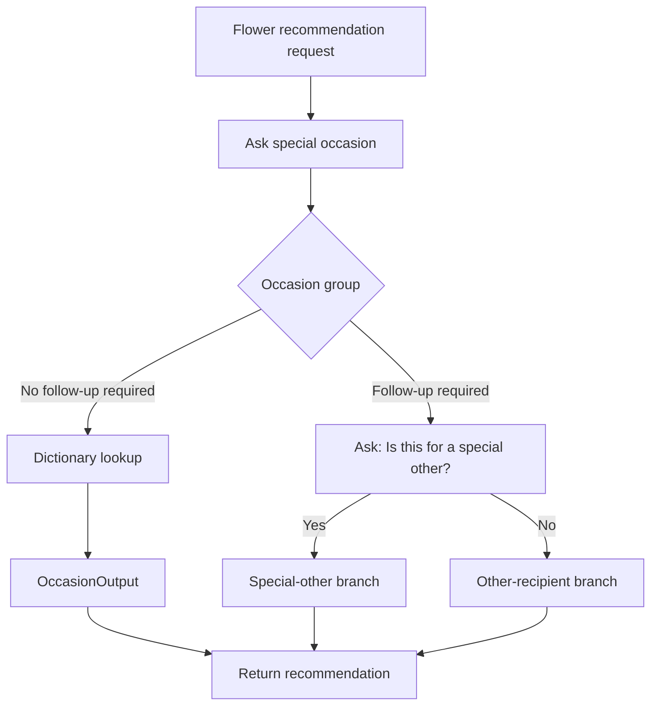

# Enhancing Chatbot Functionality

## Table of Contents

- [Status](#status)
- [Learning Objectives](#learning-objectives)
- [Concept Map](#concept-map)
- [Core Concepts](#core-concepts)
- [Practical Application](#practical-application)
- [Labs and Activities](#labs-and-activities)
- [Quiz Review](#quiz-review)
- [Questions to Revisit](#questions-to-revisit)
- [Final Summary](#final-summary)

## Status

- [ ] Complete
- [ ] Reviewed

## Learning Objectives

1. Design a recommendation system inside a chatbot.
2. Build a complex action with conditional branches.
3. Use a structured response mapping before implementation.
4. Use expressions and dictionaries to generate responses dynamically.
5. Configure follow-up questions to gather additional context.
6. Embed images in responses.
7. Test complex workflows across several conversational paths.
8. Explain how no-code visual tools support advanced chatbot behavior.

## Concept Map



## Core Concepts

### Recommendation systems in the course

The course expands the flower-shop assistant from standard information retrieval into personalized recommendations.

The recommendation logic is based on business criteria. The supplied material identifies:

1. the special occasion;
2. the relationship between the customer and recipient;
3. recipient gender.

The course explicitly includes a disclaimer that these choices are simplified for pedagogical purposes and are not intended as real-world assumptions about gender or flower preferences.

### Structured response mapping

Before implementing the workflow, the course recommends creating a response table that maps user criteria to a recommendation.

The listed occasions include:

- Anniversary
- Birthday
- Christmas day
- Get well
- Graduation
- Mother's Day
- New Baby
- Romance
- Thank You
- Valentine's Day
- Wedding
- Other/Just because

The important design principle is to define business logic before encoding it in the assistant.

### Occasion groups

#### Follow-up question required

The supplied material uses:

- Birthday
- Thank You
- Other/Just because

These trigger the question:

> Is this for a special other?

The customer answers Yes or No.

#### No follow-up question required

The other occasions can be answered directly.

Some have one recommendation for everyone, such as the examples for:

- Christmas day;
- Mother's Day;
- Wedding.

Others include recipient-specific alternatives directly in the response, such as:

- Anniversary;
- Get well;
- Graduation;
- New Baby;
- Romance;
- Valentine's Day.

### Flower Recommendations action

The action is trained with example requests such as:

- I'd like flower recommendations
- Flower suggestions
- Flowers for birthday
- Flower recommendations for girlfriend
- Bouquet for wife
- Flowers for Christmas
- Plant for friend

The first step asks:

> What's the special occasion?

The customer response is configured as a predefined list.

### Why not create a branch for every occasion?

The course first illustrates how each occasion could become a separate conditional step.

That becomes difficult to maintain when many scenarios exist, especially once follow-up questions are added.

The lab therefore introduces:

- session variables;
- an expression;
- a dictionary;
- dynamic lookup.

### Session variables in the recommendation workflow

#### Occasion

Stores the occasion selected in Step 1.

#### OccasionResponses

Stores a dictionary whose keys are occasions and whose values are recommendation strings.

#### OccasionOutput

Stores the final recommendation selected from OccasionResponses.

The supplied expression is:

```text
$OccasionResponses[$Occasion]
```

This looks up the current Occasion key and assigns the matching response to OccasionOutput.

### Dictionary pattern

Conceptually:

```json
{
  "Anniversary": "Recommendation text...",
  "Christmas day": "Recommendation text...",
  "Get well": "Recommendation text...",
  "Mother's Day": "Recommendation text...",
  "Wedding": "Recommendation text..."
}
```

The supplied lab later replaces placeholder values with full flower-shop recommendations.

Recorded examples include:

- Anniversary: **Long Stem Roses Bouquet** / **His Anniversary Bouquet**.
- Christmas day: **Large Red Poinsettia**.
- Mother's Day: recommendation to browse a Mother's Day bouquet page.
- Romance: **Love is in the Air** / **All You Need is Love**.
- Valentine's Day: **Long Stem Roses Bouquet** / **His Valentine's Day Bouquet**.
- Wedding: recommendation to browse Wedding Day Florals.

The canonical lesson is the data structure: **key -> response**.

### Expressions

The course presents expressions as a way to specify or derive values from data collected in steps or stored in variables.

Here, the expression performs a dictionary lookup. It reduces duplicated branches while keeping the recommendation logic explicit.

### Follow-up questions

For Birthday, Thank You, and Other/Just because, the assistant asks whether the flowers are for a special other.

The response type is **Confirmation**, producing Yes/No options.

That answer is stored as an action-step variable and combined with Occasion to choose the next branch.

### Six special-scenario branches

| Branch             | Occasion           | Confirmation |
| ------------------ | ------------------ | ------------ |
| SO Birthday        | Birthday           | Yes          |
| Other Birthday     | Birthday           | No           |
| SO Thank You       | Thank You          | Yes          |
| Other Thank You    | Thank You          | No           |
| SO Just Because    | Other/Just Because | Yes          |
| Other Just Because | Other/Just Because | No           |

Recorded examples include:

- Birthday Romance / Birthday Cheers;
- Birth of Paradise / Prickly Pear Cactus;
- Elegant Gratitude / Bold Thanks;
- Graceful Appreciation / Gratitude Cheers;
- Just For Her / Just Because Charm;
- Happy Blossoms / Just Because Vibrance.

Each final branch ends the action after returning the recommendation.

### Images

The course demonstrates adding flower-arrangement images to responses.

The graded assessment identifies the **media library** as the feature used to link images to specific responses. The lab also shows inserting an image URL in the response editor.

### No-code does not mean no logic

The learner still designs:

- triggers;
- variables;
- mappings;
- conditions;
- branches;
- expressions;
- tests.

The visual editor removes the need to build the surrounding application code, but the logical design remains essential.

## Practical Application

### A cocoa cooperative near Soubré: Structured Traceability Support

The repository case study applies the same workflow techniques to controlled traceability-support
guidance. IBM's flower-recommendation workflow remains the recorded source exercise; the variables
and categories below are conceptual adaptations for the cooperative thread.

A cooperative assistant could begin by classifying the kind of support requested into an approved
`IssueType`. Examples already established in the repository case study include:

- a missing intake field;
- an unreadable lot identifier;
- a duplicate-identifier alert;
- a mismatch between field and intake records;
- a warehouse-movement mismatch;
- another case that requires staff review.

The workflow could then use three conceptual values:

- `IssueType` — the selected category of traceability-support request;
- `IssueResponses` — a dictionary that maps an approved issue category to controlled guidance;
- `IssueOutput` — the guidance selected for the current issue.

Conceptually, the lookup follows the same pattern as the IBM exercise:

```text
$IssueResponses[$IssueType]
```

This expression is a repository adaptation of the course's dictionary pattern. It is not a recorded
IBM variable or expression.

An illustrative mapping could be:

| Issue type                  | Controlled assistant behavior                                      |
| --------------------------- | ------------------------------------------------------------------ |
| Missing intake field        | Identify the supplied missing field and request verification       |
| Unreadable lot identifier   | Ask for a clearer source record or manual staff check              |
| Duplicate-identifier alert  | Separate the conflicting records and route them for reconciliation |
| Field/intake mismatch       | Summarize confirmed facts, conflicts, and unresolved questions     |
| Warehouse-movement mismatch | Present the supplied records and request staff review              |
| Other / needs review        | Escalate without inventing a resolution                            |

The assistant does not determine which record is legally authoritative, reject a lot, assign a
quality grade, approve a payment, or issue a certificate. Those decisions remain with authorized
cooperative staff.

### Business logic before implementation logic

The same separation emphasized by the IBM recommendation exercise becomes:

- **What guidance is the cooperative authorized to provide for each defined issue type?**
- **How should the chatbot select and present that guidance?**

A controlled implementation would:

1. define approved issue categories and response text before building branches;
2. use a dictionary lookup for stable mappings that do not need extra clarification;
3. use explicit branches when an issue requires a follow-up question or staff escalation;
4. use only supplied source records when describing the current case;
5. mark unavailable facts as unknown instead of generating them;
6. keep consequential decisions outside the assistant;
7. test each supported path and each escalation path.

This preserves the course's core design lesson: model the business rules first, then choose the
simplest workflow structure that implements them without unnecessary duplication.

## Labs and Activities

### Working With Complex Actions, Part 1

The learner:

1. creates the Flower recommendations action;
2. adds trigger examples;
3. defines the special-occasion list;
4. creates a second step;
5. creates Occasion;
6. creates OccasionResponses;
7. assigns a dictionary with an expression;
8. creates OccasionOutput;
9. assigns OccasionOutput using the dictionary lookup expression;
10. inserts OccasionOutput into the assistant response;
11. tests a standard occasion such as New Baby;
12. replaces placeholder recommendations with the final recorded responses.

### Working With Complex Actions, Part 2

The learner:

1. renames the original second step to **Standard Occasions**;
2. adds a new conditional step above it;
3. sets **Any** of Birthday, Thank You, or Other/Just Because as the condition group;
4. stores the occasion in Occasion;
5. asks "Is this for a special other?";
6. uses Confirmation for the customer response;
7. adds six Yes/No branches;
8. ends the action after each recommendation;
9. adds images where appropriate;
10. runs end-to-end tests.

### Recorded test scenarios

#### Test 1

- Where are your stores located?
- Select Toronto.
- When is it open?
- I'd like some flower recommendations.
- Select Valentine's Day.

#### Test 2

- I'd like some flower recommendations.
- Select Birthday.
- Select Yes.

#### Test 3

- I'd like some flower recommendations.
- Select Birthday.
- Select No.

#### Test 4

- I'd like some flower recommendations.
- Select Other/Just Because.
- Select No.

The course instructs the learner to reset Preview before and after independent tests.

## Quiz Review

The graded-assessment feedback reinforces that:

- follow-up questions refine user input for personalized responses;
- a structured response table maps input to recommendations;
- embedding images improves visual engagement;
- expressions support dynamic interpretation without application code;
- watsonx Assistant supports no-code development through visual editors and prebuilt templates;
- the building-action step establishes trigger, input variables, and logic flow;
- the media library can connect images to responses.

## Questions to Revisit

- When is a dictionary lookup preferable to explicit conditional steps?
- Which recommendation criteria should be predefined options versus free text?
- How should the workflow change if recipient categories become more nuanced?
- Which parts of the recorded business logic should be redesigned for a real production flower shop?

## Final Summary

This module turns the assistant into a structured recommendation system.

The central techniques are:

- define business logic with a response table;
- collect only the additional information needed;
- use session variables for reusable state;
- use dictionaries and expressions for dynamic response selection;
- reserve explicit branches for cases that need follow-up logic;
- embed images for richer responses;
- test every important path.

In the repository's cocoa-cooperative thread, the same techniques can structure traceability-support
guidance while keeping consequential decisions with authorized staff. The IBM source exercise
remains the flower-recommendation system documented above.
