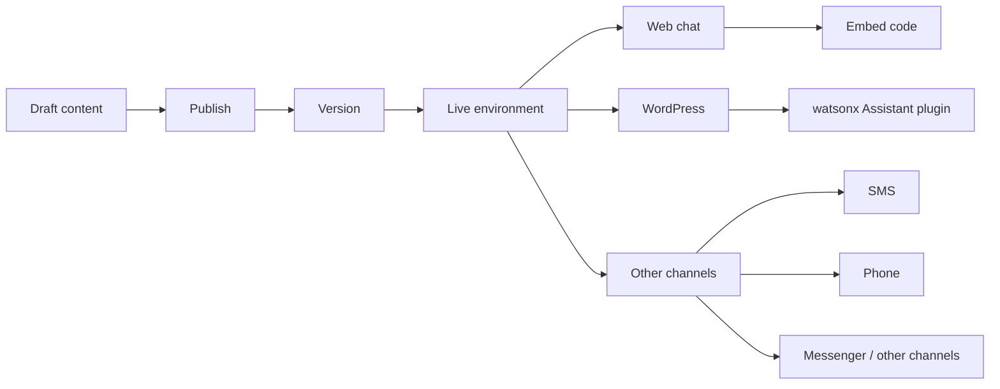

# Chatbot Deployment Essentials

## Table of Contents

- [Status](#status)
- [Learning Objectives](#learning-objectives)
- [Concept Map](#concept-map)
- [Core Concepts](#core-concepts)
- [Practical Application](#practical-application)
- [Labs and Activities](#labs-and-activities)
- [Quiz Review](#quiz-review)
- [Questions to Revisit](#questions-to-revisit)
- [Final Summary](#final-summary)

## Status

- [ ] Complete
- [ ] Reviewed

## Learning Objectives

1. Explain the deployment process used in IBM watsonx Assistant.
2. Distinguish Draft and Live environments.
3. Publish a version of the chatbot to Live.
4. Explore Web chat deployment and generated embed code.
5. Identify additional channels and extensions.
6. Connect the assistant to a WordPress site using the recorded plugin workflow.
7. Customize the deployed chatbot's behavior and appearance.
8. Test a complete live conversation.

## Concept Map

## Core Concepts

### Deployment

The course defines deployment as taking the chatbot that was created and making it publicly available so it can serve users.

The recorded workflow covers:

- environments;
- publishing;
- Web chat;
- generated embed code;
- WordPress;
- additional channels;
- extensions.

### Draft and Live

IBM watsonx Assistant is shown with two default environments:

- **Draft**
- **Live**

The course compares this separation to development and production.

#### Draft

Draft contains work-in-progress and unpublished content. It is used for editing, previewing, and testing without immediately changing the live assistant.

#### Live

Live contains published content intended for users.

The supplied material also notes that some paid plans can provide additional environments, such as staging, for more complex deployment workflows.

### Publishing content

The lab opens the Publish view and shows unpublished content.

The learner:

1. clicks Publish;
2. enters a version description such as **Initial release.**;
3. selects the **Live** environment;
4. publishes the content.

The recorded result is shown as **V1 Live**.

The course also demonstrates downloading the published version as a backup.

### Web chat channel

The Live environment includes a Web chat channel.

The learner can explore:

- appearance and behavior;
- human-agent or escalation options;
- the Embed tab;
- the JavaScript snippet used to place the chatbot on a website.

The key concept is that watsonx Assistant can expose a ready-to-embed chat channel without requiring the learner to build a chat interface from scratch.

### Other channels

The course directs the learner to **Browse Catalog** and inspect additional deployment options.

Examples shown in the supplied material include:

- Phone;
- SMS;
- Slack;
- Messenger.

Availability can depend on the subscription plan.

### Extensions

Extensions expand the assistant beyond the basic scripted workflow.

The course highlights a search capability that can use an existing knowledge base or document to answer a wider range of domain-specific questions.

The graded assessment reinforces extensions as a way to expand the chatbot's capabilities and support more advanced tasks.

### WordPress deployment

The second deployment lab uses a generated WordPress site with a **Chatbot with IBM watsonx Assistant** plugin.

The plugin setup requires:

- Service instance URL;
- Environment ID;
- API key.

The course instructs the learner to use the **Live Environment ID** so the website connects to the published chatbot instead of the draft.

### Credential handling

The supplied screenshots blur account and credential values. These notes intentionally do not reproduce those secrets.

The canonical content is the credential flow, not the literal values.

### WordPress plugin customization

The recorded plugin exposes three main customization areas.

#### Behaviour

Options shown include:

- delay before pop-up;
- whether chat is cleared on a new page;
- whether the chat box appears on all pages or selected pages.

#### Chat Box

Options shown include:

- full-screen behavior;
- minimized state;
- screen position;
- send-message button;
- typing animation;
- error message;
- chat-box title;
- clear-messages tooltip;
- type-message prompt;
- font size;
- color;
- window size;
- chatbot logo.

The screenshots use a bottom-right placement.

#### Chat Button

Options shown include:

- icon position;
- text label;
- icon size;
- text size.

### Advanced plugin features

The recorded plugin also includes tabs for:

- Usage Management;
- Voice Calling;
- Context Variables;
- Chat History;
- Notification;
- Mail Settings.

The course notes that these advanced features are optional for the exercise.

The Voice Calling page references Twilio for browser-based calling.

## Practical Application

### A cocoa cooperative near Soubré: Controlled Assistant Deployment

The repository case study applies the deployment principles to the Cooperative Operations Assistant
developed across the previous modules. IBM's recorded WordPress deployment remains the source
exercise; the cooperative deployment below is a conceptual repository adaptation.

The assistant now combines several controlled capabilities:

- collection-point lookup from approved data;
- receiving-hours lookup from approved data;
- same-session context through `CollectionPoint`;
- structured traceability-support guidance;
- follow-up questions where clarification is required;
- escalation when a supported workflow cannot resolve the request safely.

For the cooperative, the Draft/Live separation becomes an operational control. A change to
collection-point guidance, traceability-support text, branching logic, or escalation behavior should
not reach users merely because it was edited.

A controlled release flow could be:

1. build or modify the assistant in Draft;
2. test each supported workflow with known inputs;
3. test missing-data, unsupported, and escalation paths;
4. review operational wording against approved cooperative procedures and source records;
5. publish a named version only after review;
6. verify the published behavior in Live;
7. connect Live to the intended approved channel;
8. run an end-to-end deployment test before broader use.

### Staff-facing deployment boundary

A staff-facing web experience is a natural conceptual deployment for this case study because the
assistant handles operational and traceability-related context.

The deployment boundary should distinguish between information that may be exposed through the
selected channel and information that requires restricted access. Member identities, payment
details, quality results, unpublished inspection information, credentials, and other sensitive
records should not be exposed merely because a Web chat integration is technically available.

A public-facing channel could still provide approved low-risk information, but access to internal
records or consequential workflows would require appropriate authentication, authorization, and
human review. This case study does not assert that such controls have been implemented.

### Version, backup, and rollback discipline

The IBM lab's **Initial release.** message and downloaded backup demonstrate basic release
discipline. Applied to the cooperative, each release should make it possible to identify what
operational logic changed and which version is currently serving users.

A practical release record could capture:

- version identifier;
- approved change summary;
- reviewer;
- deployment date;
- workflows tested;
- known limitations;
- rollback or backup reference.

These fields describe a useful repository design pattern, not an IBM lab requirement.

### Deployment test scenario

A cooperative deployment test could verify a complete low-risk conversation such as:

1. ask for supported collection-point information;
2. select a collection point supplied in the test data;
3. ask for its recorded receiving hours;
4. confirm that `CollectionPoint` is reused within the session;
5. present a supplied traceability issue such as a missing intake field;
6. verify that the assistant returns only the approved guidance;
7. present an unsupported or consequential case;
8. verify that the assistant escalates rather than inventing a resolution.

The expected result is not that the assistant makes an operational decision. The test verifies that
the deployed version preserves approved information, session continuity, workflow boundaries, and
human escalation.

## Labs and Activities

### Exploring Your Deployment Options

The learner:

1. opens Environments;
2. inspects Draft;
3. opens Live;
4. reviews unpublished content;
5. publishes V1 to Live;
6. downloads the live version as a backup;
7. opens the Web chat channel;
8. inspects the Embed tab;
9. explores Browse Catalog;
10. reviews additional channels and extensions.

### Deploying Your Chatbot to WordPress

The learner:

1. generates the provided WordPress test site;
2. saves the generated site credentials;
3. opens the WordPress dashboard;
4. opens watsonx Assistant in the sidebar;
5. enters the Service instance URL, Live Environment ID, and API key;
6. enables the chatbot;
7. saves the configuration;
8. visits the site;
9. customizes the plugin;
10. tests the live conversation.

### Complete conversation test

The recorded final WordPress test sequence is:

- Hello
- Where are your stores?
- Toronto
- What are its hours?
- I want to gift some flowers
- Thank You
- Yes
- Thank you
- Bye

This verifies several earlier concepts in a single deployed conversation.

## Quiz Review

The deployment assessment reinforces that:

- WordPress is practical because it is a widely used website and blog platform;
- environments help prevent accidental deployment of a chatbot that is still under development;
- extensions can let the assistant search an existing knowledge base or document;
- deployment testing should verify that the chatbot understands user input and responds accurately;
- chatbots can be deployed on websites, phones, SMS, and messenger-style platforms;
- deploying across multiple environments supports reliability and consistency;
- extensions expand the chatbot's capabilities beyond basic interactions.

## Questions to Revisit

- Which credentials should be managed as production secrets rather than entered manually in a plugin UI?
- What release checks should occur before publishing Draft content to Live?
- Which channel-specific constraints need separate testing?
- When should a knowledge extension be used instead of adding more decision-tree branches?

## Final Summary

Deployment turns the chatbot from an internal exercise into a user-facing service.

The recorded watsonx Assistant workflow separates Draft from Live, publishes versioned content, exposes Web chat and embed options, and supports additional channels and extensions.

The WordPress lab then demonstrates a complete integration path: connect the Live environment
with service credentials, customize the chat interface, and test a realistic multi-step conversation
end to end.

In the repository's cocoa-cooperative thread, those deployment principles become a controlled
release path for the Cooperative Operations Assistant. The adaptation emphasizes approved data,
channel boundaries, sensitive-information handling, version discipline, deployment testing, and
human escalation while preserving IBM's recorded WordPress workflow as the source exercise.
