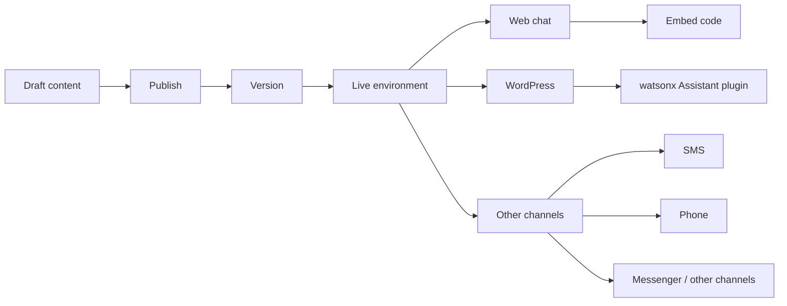

# Chatbot Deployment Essentials

## Table of Contents

- [Status](#status)
- [Learning Objectives](#learning-objectives)
- [Concept Map](#concept-map)
- [Core Concepts](#core-concepts)
- [Practical Application](#practical-application)
- [Labs and Activities](#labs-and-activities)
- [Quiz Review](#quiz-review)
- [Questions to Revisit](#questions-to-revisit)
- [Final Summary](#final-summary)

## Status

- [ ] Complete
- [ ] Reviewed

## Learning Objectives

1. Explain the deployment process used in IBM watsonx Assistant.
2. Distinguish Draft and Live environments.
3. Publish a version of the chatbot to Live.
4. Explore Web chat deployment and generated embed code.
5. Identify additional channels and extensions.
6. Connect the assistant to a WordPress site using the recorded plugin workflow.
7. Customize the deployed chatbot's behavior and appearance.
8. Test a complete live conversation.

## Concept Map

## Core Concepts

### Deployment

The course defines deployment as taking the chatbot that was created and making it publicly available so it can serve users.

The recorded workflow covers:

- environments;
- publishing;
- Web chat;
- generated embed code;
- WordPress;
- additional channels;
- extensions.

### Draft and Live

IBM watsonx Assistant is shown with two default environments:

- **Draft**
- **Live**

The course compares this separation to development and production.

#### Draft

Draft contains work-in-progress and unpublished content. It is used for editing, previewing, and testing without immediately changing the live assistant.

#### Live

Live contains published content intended for users.

The supplied material also notes that some paid plans can provide additional environments, such as staging, for more complex deployment workflows.

### Publishing content

The lab opens the Publish view and shows unpublished content.

The learner:

1. clicks Publish;
2. enters a version description such as **Initial release.**;
3. selects the **Live** environment;
4. publishes the content.

The recorded result is shown as **V1 Live**.

The course also demonstrates downloading the published version as a backup.

### Web chat channel

The Live environment includes a Web chat channel.

The learner can explore:

- appearance and behavior;
- human-agent or escalation options;
- the Embed tab;
- the JavaScript snippet used to place the chatbot on a website.

The key concept is that watsonx Assistant can expose a ready-to-embed chat channel without requiring the learner to build a chat interface from scratch.

### Other channels

The course directs the learner to **Browse Catalog** and inspect additional deployment options.

Examples shown in the supplied material include:

- Phone;
- SMS;
- Slack;
- Messenger.

Availability can depend on the subscription plan.

### Extensions

Extensions expand the assistant beyond the basic scripted workflow.

The course highlights a search capability that can use an existing knowledge base or document to answer a wider range of domain-specific questions.

The graded assessment reinforces extensions as a way to expand the chatbot's capabilities and support more advanced tasks.

### WordPress deployment

The second deployment lab uses a generated WordPress site with a **Chatbot with IBM watsonx Assistant** plugin.

The plugin setup requires:

- Service instance URL;
- Environment ID;
- API key.

The course instructs the learner to use the **Live Environment ID** so the website connects to the published chatbot instead of the draft.

### Credential handling

The supplied screenshots blur account and credential values. These notes intentionally do not reproduce those secrets.

The canonical content is the credential flow, not the literal values.

### WordPress plugin customization

The recorded plugin exposes three main customization areas.

#### Behaviour

Options shown include:

- delay before pop-up;
- whether chat is cleared on a new page;
- whether the chat box appears on all pages or selected pages.

#### Chat Box

Options shown include:

- full-screen behavior;
- minimized state;
- screen position;
- send-message button;
- typing animation;
- error message;
- chat-box title;
- clear-messages tooltip;
- type-message prompt;
- font size;
- color;
- window size;
- chatbot logo.

The screenshots use a bottom-right placement.

#### Chat Button

Options shown include:

- icon position;
- text label;
- icon size;
- text size.

### Advanced plugin features

The recorded plugin also includes tabs for:

- Usage Management;
- Voice Calling;
- Context Variables;
- Chat History;
- Notification;
- Mail Settings.

The course notes that these advanced features are optional for the exercise.

The Voice Calling page references Twilio for browser-based calling.

## Practical Application

### Deployment safety

The Draft/Live separation solves an operational problem: work-in-progress changes should not automatically reach end users.

A source-aligned release flow is:

1. build and test in Draft;
2. inspect unpublished content;
3. publish a version;
4. verify it in Live;
5. connect the live environment to a channel;
6. test the deployed experience.

### Version and backup discipline

The **Initial release.** version message and downloaded backup demonstrate basic release discipline in a no-code workflow.

## Labs and Activities

### Exploring Your Deployment Options

The learner:

1. opens Environments;
2. inspects Draft;
3. opens Live;
4. reviews unpublished content;
5. publishes V1 to Live;
6. downloads the live version as a backup;
7. opens the Web chat channel;
8. inspects the Embed tab;
9. explores Browse Catalog;
10. reviews additional channels and extensions.

### Deploying Your Chatbot to WordPress

The learner:

1. generates the provided WordPress test site;
2. saves the generated site credentials;
3. opens the WordPress dashboard;
4. opens watsonx Assistant in the sidebar;
5. enters the Service instance URL, Live Environment ID, and API key;
6. enables the chatbot;
7. saves the configuration;
8. visits the site;
9. customizes the plugin;
10. tests the live conversation.

### Complete conversation test

The recorded final WordPress test sequence is:

- Hello
- Where are your stores?
- Toronto
- What are its hours?
- I want to gift some flowers
- Thank You
- Yes
- Thank you
- Bye

This verifies several earlier concepts in a single deployed conversation.

## Quiz Review

The deployment assessment reinforces that:

- WordPress is practical because it is a widely used website and blog platform;
- environments help prevent accidental deployment of a chatbot that is still under development;
- extensions can let the assistant search an existing knowledge base or document;
- deployment testing should verify that the chatbot understands user input and responds accurately;
- chatbots can be deployed on websites, phones, SMS, and messenger-style platforms;
- deploying across multiple environments supports reliability and consistency;
- extensions expand the chatbot's capabilities beyond basic interactions.

## Questions to Revisit

- Which credentials should be managed as production secrets rather than entered manually in a plugin UI?
- What release checks should occur before publishing Draft content to Live?
- Which channel-specific constraints need separate testing?
- When should a knowledge extension be used instead of adding more decision-tree branches?

## Final Summary

Deployment turns the chatbot from an internal exercise into a user-facing service.

The recorded watsonx Assistant workflow separates Draft from Live, publishes versioned content, exposes Web chat and embed options, and supports additional channels and extensions.

The WordPress lab then demonstrates a complete integration path: connect the Live environment with service credentials, customize the chat interface, and test a realistic multi-step conversation end to end.
