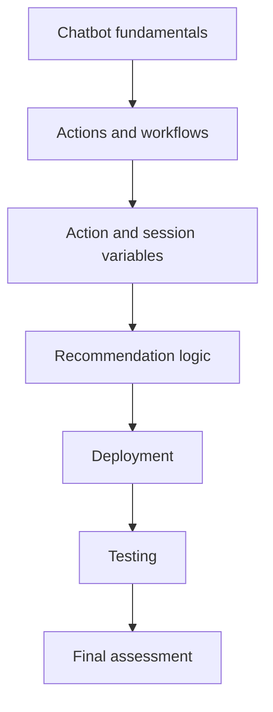

# Final Exam and Course Wrap-Up

## Table of Contents

- [Status](#status)
- [Learning Objectives](#learning-objectives)
- [Concept Map](#concept-map)
- [Core Concepts](#core-concepts)
- [Practical Application](#practical-application)
- [Labs and Activities](#labs-and-activities)
- [Quiz Review](#quiz-review)
- [Questions to Revisit](#questions-to-revisit)
- [Final Summary](#final-summary)

## Status

- [ ] Complete
- [ ] Reviewed

## Learning Objectives

1. Consolidate the major chatbot concepts covered across the course.
2. Connect chatbot benefits to business use cases.
3. Distinguish decision-tree, generative AI, action-based, and variable-driven behavior.
4. Review deployment and extension concepts.
5. Interpret the final-assessment feedback.
6. Preserve the course glossary as a compact conceptual reference.

## Concept Map

## Core Concepts

### Course-level synthesis

The course develops the flower-shop chatbot in layers.

1. **Fundamentals:** what chatbots are and why businesses use them.
2. **Structured workflows:** actions, steps, conditions, branches, and predefined outcomes.
3. **State:** action variables for temporary task data and session variables for conversational continuity.
4. **User experience:** greetings, thank-yous, farewells, and response variations.
5. **Recommendations:** response tables, follow-up questions, dictionaries, expressions, images, and conditional branches.
6. **Deployment:** Draft, Live, Web chat, WordPress, channels, and extensions.
7. **Testing:** Preview and live end-to-end conversations.

### Final exam result

The supplied Coursera result screen records:

- **latest score:** 70%;
- **highest score:** 70%;
- **passing threshold:** 70%.

The supplied course certificate is dated **2026-09-30**.

### Concepts reinforced by the final exam

#### Efficiency

A chatbot can handle large volumes of repetitive inquiries while allowing human agents to focus on complex tasks.

#### Action-based workflows

The action-based approach is used to perform tasks based on user input through organized workflows.

The exam feedback also reinforces the course's description of the action-based watsonx Assistant experience as using AI and simplified workflows to streamline building, testing, and deployment.

#### Personalized interaction

Compared with a static FAQ page, a chatbot can react to the conversation and offer recommendations based on user input and context.

#### Context-aware location responses

The flower-shop assistant can retrieve and display store locations based on the user's query.

#### Scalability

A chatbot can manage multiple customer interactions at the same time.

#### Decision trees for controlled scenarios

When a system must follow a specific sequence of questions and responses, the course identifies a **decision-tree chatbot** as the appropriate type.

#### Trigger words

When the assistant should react to configured keywords, **Trigger Word Detected** is the relevant default action.

#### Session context

When information such as a selected product must be remembered later during the same session, the course identifies a **session variable**.

### Review of incorrect attempts

The supplied final-exam screenshots preserve several incorrect first choices. These clarify the intended course concepts.

#### Customer-service efficiency question

The selected answer claimed that a chatbot provides personalized service more effectively than human agents.

The intended course answer is that the chatbot can handle large volumes of repetitive inquiries and free human agents for complex tasks.

#### IBM Cloud trial activation question

The screenshot shows an incorrect selection for the "Something went wrong" activation scenario and directs the learner back to the IBM Cloud account-creation lab.

The available choices include causes such as a code already being applied to an email or an account restriction. The supplied feedback does not expose the correct option directly, so these notes do not infer it.

#### Action-based versus legacy approach

The selected answer focused on cost.

The intended distinction is that the action-based approach uses AI and simplified workflows to streamline building, testing, and deployment.

## Practical Application

### A cocoa cooperative near Soubré: The Specialization Thread

The repository's fictional cocoa cooperative now provides one continuous practical case across all
four courses. The IBM flower-shop project remains the recorded Course 04 exercise; this section
connects the repository adaptations into a single specialization-level system narrative.

| Course                                                | Cooperative case-study progression                                                                                                          |
| ----------------------------------------------------- | ------------------------------------------------------------------------------------------------------------------------------------------- |
| 01 — Introduction to Artificial Intelligence          | Establish AI concepts, augmented intelligence, traceability support, operational risks, responsible use, and human decision authority       |
| 02 — Generative AI: Introduction and Applications     | Apply text, image, audio, and code generation to controlled communication, training, and operational-support outputs                        |
| 03 — Generative AI: Prompt Engineering Basics         | Add explicit facts, constraints, missing-information handling, structured prompting, decomposition, and verification                        |
| 04 — Building AI Powered Chatbots Without Programming | Turn those principles into conversational actions, session context, structured traceability guidance, escalation, and controlled deployment |

The case therefore evolves from **understanding AI** to **using generative AI**, then to
**controlling model interactions**, and finally to **organizing those capabilities inside a
conversational application**.

### Integrated Cooperative Operations Assistant

At the end of the repository thread, the conceptual Cooperative Operations Assistant combines the
following capabilities:

- answer approved collection-point questions;
- return approved receiving information;
- preserve the selected collection point within the same session through `CollectionPoint`;
- identify a supplied category of traceability-support request;
- select controlled guidance through mappings such as `IssueType`, `IssueResponses`, and
  `IssueOutput`;
- ask for missing information when a supported workflow requires clarification;
- summarize confirmed facts without silently filling gaps;
- draft low-risk follow-up communication for staff review;
- escalate unsupported, sensitive, or consequential situations to authorized people;
- move tested conversational logic through a Draft-to-Live release process.

These names and workflows are repository adaptations. They do not replace or rewrite the IBM
flower-shop lab.

### End-to-end cooperative mental model

A controlled interaction can be reasoned about as follows:

1. identify the user's supported request;
2. determine whether the task should follow a deterministic workflow or needs bounded generative
   assistance;
3. collect only information that is required and explicitly available;
4. retain same-session context only when another action needs it;
5. use approved mappings or conditions for known operational guidance;
6. keep unavailable facts marked as unknown;
7. generate explanatory or follow-up text only within supplied constraints;
8. route unresolved or consequential cases to authorized staff;
9. publish only reviewed and tested conversational logic;
10. verify the deployed behavior against known test cases.

### Boundaries carried across all four courses

The case study keeps the same human-oversight boundary established in Course 01.

The assistant does not:

- reject or accept a cocoa lot;
- assign an official quality grade;
- determine or approve a producer payment;
- diagnose crop disease;
- decide which conflicting record is legally authoritative;
- invent missing traceability facts;
- issue or submit an official certificate.

Those actions remain with authorized people and approved cooperative processes.

The case also preserves the earlier privacy and operational constraints. Member identities, farm
locations, payment details, quality records, unpublished inspection information, credentials, and
other sensitive data require appropriate handling. A deployment channel does not remove those
requirements.

### Production-oriented lessons visible across the thread

The four-course case study reinforces several recurring design principles:

- separate evidence from generated output;
- collect only the information needed for a defined task;
- preserve unknowns instead of fabricating values;
- use deterministic paths where predictable operational behavior matters;
- use generative capabilities only where their flexibility adds value and outputs can be reviewed;
- preserve relevant context without treating remembered state as new evidence;
- model business rules before implementation details;
- keep consequential decisions with accountable people;
- test normal, missing-data, unsupported, and escalation paths;
- separate draft work from live releases;
- protect sensitive information and credentials;
- verify deployed behavior against approved procedures and source records.

The result is not a claim that a production cooperative system has been implemented. It is a
consistent repository case study showing how concepts from the specialization can accumulate into
one controlled system design.

## Labs and Activities

The final module centers on the final assessment and review.

The completed course project combines:

- store-location lookup;
- opening hours;
- session-aware follow-ups;
- greetings, thank-yous, and farewells;
- flower recommendations;
- images;
- complex branches;
- deployment to a live website.

## Quiz Review

### Final exam topics captured in the supplied results

1. chatbot efficiency in high-volume customer service;
2. purpose of action-based workflows;
3. IBM Cloud trial-account troubleshooting;
4. action-based watsonx Assistant versus the legacy approach;
5. chatbot advantages over a static FAQ page;
6. location retrieval through action workflows;
7. scalability across many simultaneous users;
8. decision-tree chatbots for controlled question sequences;
9. Trigger Word Detected for configured keywords;
10. session variables for remembering a selected item during the same session.

### Glossary review

#### Action step variables

Dynamic values used inside action steps to store, retrieve, or manipulate information during a conversation.

#### Action variables

Temporary variables used for data that belongs to a specific task or action.

#### Action workflow

A sequence of steps, conditions, and branches used to complete a more complex task.

#### Actions

Tasks performed by the chatbot when relevant triggers or conditions are met.

#### Assistant variables

Dynamic placeholders used to store, retrieve, and manage data during conversations.

#### Branching logic and conditions

Rules that evaluate user responses and select a conversational path.

#### Chatbots / Virtual assistants

Software applications that simulate human conversation through text or voice.

#### Contextual understanding

The ability, emphasized for generative AI chatbots, to maintain conversational context across turns.

#### Custom actions

Business-specific actions created to handle scenarios beyond the default actions.

#### Customize plugin

The WordPress integration area used in the recorded lab to tailor chatbot behavior and appearance.

#### Decision-tree chatbots

Chatbots that guide users through predefined paths and outcomes.

#### Democratization of development

The course's description of no-code tools making chatbot development accessible to non-programmers.

#### Dynamic response generation

Real-time generation of responses based on user input rather than a fixed branch for every query.

#### Expressions

Logic used to derive, manipulate, or evaluate values during a conversation.

#### Fallback

A safety-net action used when the conversation cannot reach a clear resolution.

#### Generative AI chatbot

A chatbot that dynamically generates responses and can handle broader, open-ended input.

#### Greet customer

The default action that welcomes a user at the beginning of a conversation.

#### IBM watsonx Assistant

The conversational platform used throughout the course to build, deploy, and manage the chatbot.

#### Input variables

Variables used to collect user input for later processing.

#### Integration variables

Variables used to exchange information between the assistant and external systems or APIs.

#### Logic flow

The decision structure that maps user input to predefined responses and branches.

#### Multi-channel presence

Availability across more than one customer channel, such as web, messaging, SMS, or voice.

#### Multi-step processes

Conversation flows that ask targeted questions until enough information is available to produce a result.

#### No matches

The default action used when the assistant does not understand the user's query.

#### Operational efficiency

The ability to answer common questions quickly and reduce repetitive workload.

#### Personalization

Tailoring responses or recommendations to a user's current needs, context, or preferences.

#### Predefined outcomes

Known responses or results associated with decision-tree branches.

#### Proactive customer engagement

Suggesting products, recommendations, or guidance rather than waiting only for direct questions.

#### Response variation

Providing multiple valid responses for the same intent, with selection rules such as Random or Sequential.

#### Scalability

The ability to serve many customer interactions at the same time.

#### Table of responses

A structured mapping from criteria such as occasion and recipient type to a recommendation.

#### Trigger

The examples, keywords, or conditions that start an action.

#### Trigger Word Detected

A default action that responds to configured words or phrases.

#### Unpredictable inputs

Open-ended inputs that are not represented as predefined branches.

#### Visual editor

The interface used to build and modify chatbot actions without writing the surrounding application code.

#### WordPress

The website platform used in the deployment lab.

## Questions to Revisit

- Which recorded watsonx Assistant behaviors should be revalidated before a current real-world deployment?
- Which recommendation rules in the flower-shop example should be redesigned for a production system?
- Which pieces of state should persist beyond one session?
- Where should a production assistant escalate to a human agent?

## Final Summary

The course demonstrates that no-code chatbot development still requires deliberate systems thinking.

A useful chatbot combines:

- clear task definitions;
- structured workflows;
- deliberate state management;
- contextual responses;
- controlled branching;
- dynamic mappings;
- testing;
- release discipline;
- channel integration.

The IBM flower-shop project progresses from a simple structured assistant into a session-aware
recommendation chatbot deployed to a live website. The supplied final-assessment result and
certificate establish successful course completion.

Separately, the repository's cocoa-cooperative thread now remains continuous from Course 01 through
Course 04: AI foundations and responsible use lead into generative capabilities, prompt controls,
conversational workflows, session state, structured traceability support, human escalation, and
controlled deployment.
