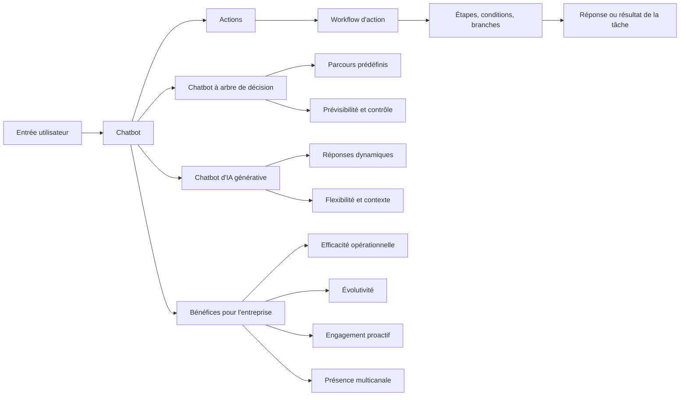

# Principes fondamentaux des chatbots

## Table des matières

- [Statut](#statut)
- [Objectifs d’apprentissage](#objectifs-dapprentissage)
- [Carte conceptuelle](#carte-conceptuelle)
- [Concepts clés](#concepts-clés)
- [Application pratique](#application-pratique)
- [Travaux pratiques et activités](#travaux-pratiques-et-activités)
- [Révision du quiz](#révision-du-quiz)
- [Questions à revoir](#questions-à-revoir)
- [Synthèse finale](#synthèse-finale)

## Statut

- [x] Adaptation française rédigée à partir des notes canoniques anglaises.
- [ ] Révision personnelle de l’adaptation terminée.

Le certificat documente séparément la réussite du cours. Les noms de produits et les intitulés d’actions provenant de l’interface sont conservés lorsque cela aide à rester fidèle aux supports enregistrés.

## Objectifs d’apprentissage

1. Définir les chatbots et les assistants virtuels tels qu’ils sont présentés dans le cours.
2. Expliquer les principaux bénéfices de l’adoption des chatbots pour les entreprises.
3. Décrire les actions et les workflows d’action dans IBM watsonx Assistant.
4. Comparer les chatbots à arbre de décision et les chatbots d’IA générative.
5. Expliquer les actions par défaut et les actions personnalisées dans le scénario de la boutique de fleurs.
6. Identifier les situations où un contrôle structuré, une plus grande flexibilité conversationnelle ou une approche hybride est approprié.

## Carte conceptuelle

## Concepts clés

### Contexte du cours et base documentaire

Les supports fournis présentent ce cours comme un enseignement de niveau débutant destiné aux personnes souhaitant construire un chatbot alimenté par l’IA sans programmation. Une compréhension élémentaire de l’informatique et des technologies de l’information est décrite comme utile, mais non obligatoire.

L’exemple fil conducteur est une boutique de fleurs fictive en ligne. Au fil du cours, son chatbot est construit afin de :

- rechercher et afficher les emplacements des magasins ;
- fournir les heures d’ouverture et de fermeture ;
- recommander des compositions florales ;
- gérer les salutations, les remerciements et les formules de départ ;
- conserver le contexte pendant une même session ;
- être déployé dans un environnement Live et sur un site WordPress.

### Qu’est-ce qu’un chatbot ?

Le cours définit les **chatbots** comme des applications logicielles qui simulent une conversation humaine et modifient la manière dont les entreprises interagissent avec leurs clients. Ils peuvent communiquer par texte ou par voix et répondre aux entrées des utilisateurs.

Le cours emploie également les termes **chatbot** et **assistant virtuel** de manière interchangeable.

### Bénéfices pour l’entreprise

#### Efficacité opérationnelle

Les chatbots peuvent répondre immédiatement aux questions courantes et traiter des tâches routinières ou répétitives. Cela réduit le temps d’attente et permet aux employés humains de se concentrer sur des problèmes clients plus complexes.

Le retour fourni avec l’évaluation finale confirme que le bénéfice attendu n’est pas d’éliminer les agents humains, mais de traiter de grands volumes de demandes et de libérer les agents pour les tâches plus complexes.

#### Disponibilité

Les chatbots peuvent fournir une assistance en dehors des horaires habituels d’ouverture.

#### Évolutivité

Un même chatbot peut gérer simultanément de nombreuses interactions clients. Le cours cite des exemples tels que les FAQ, la navigation sur un site web et le dépannage technique courant.

#### Engagement client proactif

Les chatbots peuvent suggérer des produits, proposer des recommandations personnalisées et guider les utilisateurs dans leurs décisions selon le contexte de l’interaction.

#### Présence multicanale

Le cours décrit les chatbots comme pouvant être déployés sur des sites web, des plateformes de messagerie, par SMS, par téléphone et sur d’autres canaux.

#### Démocratisation du développement

Les outils sans code tels qu’IBM watsonx Assistant sont présentés comme rendant le développement de chatbots accessible aux non-programmeurs grâce à des éditeurs visuels, des modèles et des workflows guidés.

### Actions

Une **action** est une tâche exécutée par le chatbot en réponse à une entrée utilisateur. Les actions sont déclenchées lorsqu’une entrée correspond à des conditions prédéfinies ou à des exemples d’intention.

Dans l’exemple de la boutique de fleurs, les actions peuvent :

- accueillir les clients ;
- détecter des mots déclencheurs ;
- répondre aux questions sur les emplacements des magasins ;
- répondre aux questions sur les heures d’ouverture ;
- recueillir des informations ;
- recommander des fleurs ;
- gérer les entrées non reconnues ;
- empêcher qu’une conversation se termine dans une impasse.

### Workflows d’action

Un **workflow d’action** est une séquence d’étapes, de conditions et de branches utilisée pour accomplir une tâche plus complexe.

Un workflow peut :

1. reconnaître ce que souhaite l’utilisateur ;
2. demander les informations manquantes ;
3. enregistrer la réponse ;
4. évaluer des conditions ;
5. suivre une branche ;
6. retourner une réponse appropriée ;
7. poursuivre ou terminer l’action.

Le cours utilise des workflows pour la recherche d’emplacements, les heures d’ouverture et les recommandations de fleurs.

### Actions par défaut dans watsonx Assistant

#### Greet customer

Cette action accueille l’utilisateur et explique les types d’aide que l’assistant peut fournir.

#### Trigger Word Detected

Cette action réagit à des mots ou expressions configurés. Le cours utilise notamment l’exemple d’un client demandant des roses rouges.

#### No matches

Lorsque l’assistant ne comprend pas une entrée, No matches peut reconnaître cette limite et rediriger l’utilisateur vers les sujets pris en charge.

#### Fallback

Fallback est présenté comme un mécanisme de sécurité lorsque l’interaction ne parvient pas à une résolution après des échecs répétés, des problèmes de validation ou des entrées non reconnues.

### Actions personnalisées

Les actions personnalisées traitent des scénarios propres à l’entreprise.

La source utilise la livraison le jour même comme exemple : une boutique de fleurs pourrait configurer une action personnalisée afin de répondre différemment selon que la demande remplit encore ou non les conditions d’une livraison le jour même.

La distinction principale est la suivante :

- les **actions par défaut** gèrent des schémas d’interaction courants ;
- les **actions personnalisées** implémentent un comportement propre à l’entreprise.

### Chatbots à arbre de décision

Les chatbots à arbre de décision suivent des parcours conversationnels prédéfinis.

Les principales caractéristiques présentées dans le cours comprennent :

- la logique de branchement et les conditions ;
- des résultats prédéfinis ;
- des processus en plusieurs étapes ;
- un comportement prévisible ;
- des réponses cohérentes ;
- un contrôle important sur la conversation.

Le cours associe cette approche à des environnements structurés tels que le service client, la banque, la santé et le commerce électronique, en particulier lorsque la conformité, l’exactitude ou un questionnement prévisible sont importants.

### Chatbots d’IA générative

Les chatbots d’IA générative produisent dynamiquement leurs réponses au lieu d’exiger que chaque parcours soit entièrement scripté.

La source met en avant :

- la génération dynamique de réponses ;
- la compréhension du contexte ;
- la gestion d’entrées imprévisibles ;
- la personnalisation.

Les exemples concernent l’engagement client, les scénarios de contenu ou de recommandation et des cas d’usage plus larges d’assistants virtuels.

### Risques des chatbots d’IA générative

Les supports fournis abordent explicitement :

- les hallucinations ou informations plausibles mais incorrectes ;
- les réponses biaisées héritées des données ;
- l’exposition d’informations sensibles ;
- la difficulté à expliquer comment une réponse a été produite.

### Contrôle et flexibilité

Les chatbots à arbre de décision privilégient le contrôle et la prévisibilité. Les chatbots d’IA générative privilégient la flexibilité et la profondeur conversationnelle.

Le cours présente également un modèle hybride : les interactions routinières peuvent suivre un arbre de décision tandis que les questions plus ouvertes peuvent être confiées à l’IA générative.

## Application pratique

### Une coopérative cacaoyère près de Soubré : un assistant opérationnel de coopérative

Le fil conducteur fictif du dépôt applique les concepts de chatbot à la même coopérative cacaoyère
utilisée dans les cours 01 à 03. L'exemple de la boutique de fleurs d'IBM reste l'exercice source ;
ce scénario de coopérative constitue une application pratique distincte.

Un assistant opérationnel de coopérative pourrait prendre en charge des tâches d'information
structurées et à faible risque, par exemple :

1. **Informations sur les points de collecte** — aider un membre ou un agent à identifier le point
   de collecte pertinent à partir de données approuvées.
2. **Informations de réception** — retourner les horaires ou instructions de réception enregistrés
   lorsque ces faits sont disponibles dans les données approuvées de la coopérative.
3. **Aide à la complétude des dossiers** — expliquer quel champ fourni d'un dossier de réception ou
   de traçabilité manque sans inventer de valeur.
4. **Suivi de traçabilité** — rédiger une demande concise concernant un fait manquant ou résumer les
   informations confirmées pour vérification par un agent.
5. **Escalade** — transférer les cas non résolus ou à conséquence importante vers le personnel
   autorisé de la coopérative.

L'assistant ne rejette pas un lot de cacao, n'attribue pas de grade de qualité, ne détermine pas le
paiement d'un producteur, ne diagnostique pas de maladie des cultures et ne soumet pas de certificat
officiel. Ces décisions restent sous la responsabilité des personnes autorisées.

Ce scénario n'affirme aucun emplacement réel de point de collecte, aucun horaire de réception ni
aucune règle opérationnelle qui n'aurait pas été explicitement fournie comme donnée source.

### Choisir un style de chatbot

Une règle pratique conforme aux supports, appliquée à la coopérative, est la suivante :

- utiliser un arbre de décision lorsque l'interaction doit suivre une procédure connue et
  vérifiable ;
- utiliser l'IA générative pour une explication ou une rédaction ouverte lorsque le personnel peut
  vérifier le résultat ;
- combiner les deux lorsque des workflows opérationnels contrôlés exigent des branches prévisibles
  mais que les communications d'accompagnement bénéficient de davantage de flexibilité.

## Travaux pratiques et activités

Ce module prépare l’apprenant à créer une instance IBM watsonx Assistant et à construire le chatbot de la boutique de fleurs au moyen d’actions visuelles.

Les activités représentées dans les supports fournis comprennent :

- identifier les bénéfices des chatbots ;
- décrire les cas d’usage de la boutique de fleurs ;
- distinguer les actions des workflows ;
- comparer les approches par arbre de décision et par IA générative ;
- examiner les actions par défaut ;
- déterminer les situations nécessitant des actions personnalisées.

## Révision du quiz

Les supports d’évaluation renforcent les points suivants :

- les chatbots améliorent l’efficacité en traitant les demandes répétitives et en libérant les agents humains pour des tâches plus complexes ;
- les chatbots à arbre de décision conviennent lorsque des questions fixes et des résultats prédéfinis sont nécessaires ;
- les chatbots peuvent évoluer afin de servir plusieurs clients simultanément ;
- les workflows d’action peuvent rechercher et afficher les emplacements des magasins selon l’entrée utilisateur ;
- Trigger Word Detected est l’action par défaut pertinente pour des mots-clés configurés ;
- l’approche de watsonx Assistant basée sur les actions est présentée comme utilisant l’IA et des workflows simplifiés afin de rationaliser la construction, les tests et le déploiement.

## Questions à revoir

- Quelles parties d’un processus d’assistance en production exigent un contrôle déterministe ?
- Quelles parties bénéficieraient de réponses génératives ?
- À quel moment le comportement de fallback devrait-il transférer l’utilisateur vers une assistance humaine ?
- Quelle quantité d’informations un chatbot devrait-il recueillir avant de proposer un résultat ?

## Synthèse finale

Les chatbots sont des applications logicielles qui simulent une conversation et peuvent prendre en charge les interactions clients par texte ou par voix. Le cours met l’accent sur l’efficacité opérationnelle, la disponibilité, l’évolutivité, l’engagement proactif et la diffusion multicanale.

Dans watsonx Assistant, les **actions** représentent des tâches et les **workflows d’action** relient étapes, conditions et branches. Les chatbots à arbre de décision fournissent des parcours prévisibles et contrôlés, tandis que les chatbots d’IA générative fournissent des réponses dynamiques et sensibles au contexte. Le projet IBM de boutique de fleurs utilise ces concepts comme fondation des modules pratiques suivants. Dans le fil pratique distinct du dépôt, ces mêmes concepts amorcent un assistant opérationnel pour la coopérative cacaoyère fictive près de Soubré.
