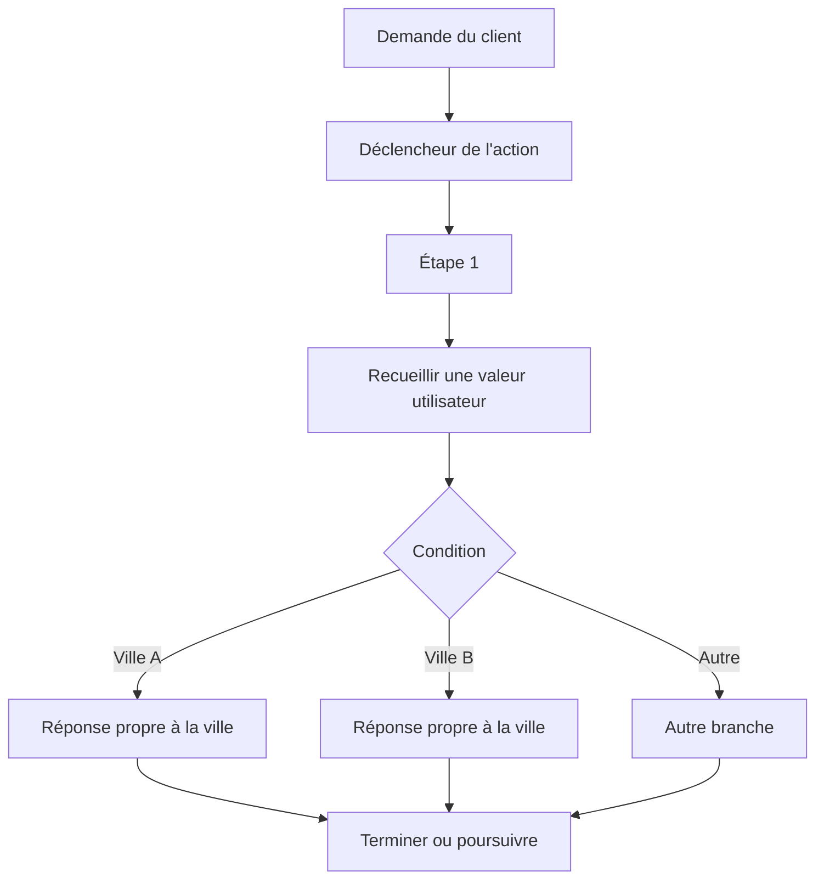

# Chatbot à arbre de décision

## Table des matières

- [Statut](#statut)
- [Objectifs d’apprentissage](#objectifs-dapprentissage)
- [Carte conceptuelle](#carte-conceptuelle)
- [Concepts clés](#concepts-clés)
- [Application pratique](#application-pratique)
- [Travaux pratiques et activités](#travaux-pratiques-et-activités)
- [Révision du quiz](#révision-du-quiz)
- [Questions à revoir](#questions-à-revoir)
- [Synthèse finale](#synthèse-finale)

## Statut

- [x] Adaptation française rédigée à partir des notes canoniques anglaises.
- [ ] Révision personnelle de l’adaptation terminée.

Le certificat documente séparément la réussite du cours. Les intitulés provenant de l’interface IBM watsonx Assistant sont conservés lorsqu’ils sont utiles pour correspondre aux supports enregistrés.

## Objectifs d’apprentissage

1. Construire un chatbot structuré à l’aide des actions d’IBM watsonx Assistant.
2. Créer des exemples de déclenchement qui apprennent à l’assistant quand une action doit commencer.
3. Utiliser des étapes, des conditions, des réponses client et une logique de branchement.
4. Construire le workflow de recherche d’emplacement de la boutique de fleurs.
5. Réutiliser la structure d’une action existante pour créer une fonctionnalité associée telle que les heures d’ouverture.
6. Tester l’assistant dans Preview et ajuster le workflow lorsque son comportement ne correspond pas aux attentes.

## Carte conceptuelle

## Concepts clés

### Conception d’une conversation structurée

Un chatbot à arbre de décision transforme une demande client en une séquence contrôlée d’étapes conversationnelles.

Le flux de recherche d’emplacement de la boutique de fleurs suit ce modèle :

1. reconnaître que l’utilisateur demande l’emplacement des magasins ;
2. demander, lorsque nécessaire, quelle ville l’intéresse ;
3. enregistrer la ville sélectionnée ;
4. évaluer une condition propre à cette ville ;
5. retourner la réponse correspondant à l’emplacement.

### Entraîner une action avec des exemples

Le cours enseigne qu’une action commence par des exemples de ce qu’un client pourrait dire.

Ces exemples ne servent pas à énumérer toutes les formulations possibles. Ils apportent suffisamment de variété pour que l’assistant reconnaisse différentes manières d’exprimer la même intention.

Le même principe est réutilisé pour :

- les demandes d’emplacement ;
- les demandes d’heures d’ouverture ;
- les salutations ;
- les recommandations de fleurs.

### Étapes conversationnelles

Une étape peut :

- retourner une réponse de l’assistant ;
- recueillir une réponse du client ;
- définir des options sélectionnables ;
- définir des variables ;
- s’exécuter uniquement lorsque certaines conditions sont satisfaites ;
- passer à l’étape suivante ;
- terminer l’action.

L’éditeur visuel permet à l’apprenant de construire ces flux sans écrire le code de l’application.

### Conditions

Les conditions déterminent si une étape doit être exécutée.

L’action d’emplacement utilise des conditions propres à chaque ville. Lorsque l’utilisateur choisit une ville, l’étape conditionnelle correspondante retourne les informations de ce magasin.

Les modules suivants réutilisent la même idée pour :

- les horaires propres à chaque ville ;
- les branches de recommandation ;
- les parcours de suivi Oui/Non.

### Réponses du client

Le cours utilise fréquemment des réponses structurées plutôt qu’un texte libre sans contrainte.

Le flux de sélection d’une ville présente une liste prédéfinie de villes prises en charge. Les modules suivants utilisent également des listes pour les occasions et une réponse de confirmation pour une question de suivi Oui/Non.

### Emplacements des magasins de la boutique de fleurs

Les supports fournis utilisent cinq emplacements :

- Montreal ;
- Toronto ;
- Calgary ;
- Kelowna ;
- Vancouver.

Le modèle canonique est `ville sélectionnée -> branche conditionnelle correspondante -> réponse propre à la ville`.

### Réutiliser la structure d’une action

L’action **Hours of operation** est créée en dupliquant l’action existante d’emplacement puis en modifiant :

- le nom de l’action ;
- les exemples de déclenchement ;
- les réponses propres à chaque ville.

Cela illustre un principe utile : dupliquer une action dont la structure est similaire plutôt que reconstruire toutes les branches depuis zéro.

### Limitation de la portée d’une action

Une valeur recueillie dans une action reste locale à cette action, sauf si elle est enregistrée avec une portée plus large.

Cette limite apparaît lorsqu’un utilisateur :

1. demande l’emplacement de Vancouver ;
2. sélectionne Vancouver ;
3. reçoit l’adresse ;
4. demande ensuite : « And when is it open? »

L’action **Hours of operation** ne sait pas automatiquement que Vancouver a été sélectionnée dans l’action **Location information**.

Cette limitation introduit le besoin de variables de session dans le module suivant.

### Tests dans Preview

Le cours demande régulièrement à l’apprenant de réinitialiser Preview et de tester après les modifications.

Les tests permettent de vérifier :

- que la bonne action est reconnue ;
- que l’étape attendue s’exécute ;
- que la bonne option est enregistrée ;
- que la réponse correspondante est retournée ;
- que l’action se termine ou se poursuit comme prévu.

## Application pratique

### Recherche déterministe d’un magasin

| Étape     | Rôle                                          |
| --------- | --------------------------------------------- |
| Trigger   | Reconnaître une demande d’emplacement         |
| Étape 1   | Demander la ville lorsque cela est nécessaire |
| Condition | Faire correspondre la ville sélectionnée      |
| Ville     | Retourner les informations propres à la ville |
| Fin       | Terminer l’action                             |

La même structure peut être adaptée à n’importe quelle information propre à un magasin.

### Heures d’ouverture enregistrées

Le laboratoire fourni enregistre les horaires suivants :

| Ville     | Horaires                                                                                                               |
| --------- | ---------------------------------------------------------------------------------------------------------------------- |
| Montreal  | Tous les jours, 10:00–17:00 ; fermé les jours fériés officiels du Québec                                               |
| Toronto   | Du lundi au samedi, 09:00–18:00 ; fermé le dimanche et les jours fériés officiels de l’Ontario                         |
| Calgary   | Du lundi au samedi, 10:00–18:00 ; fermé le dimanche et les jours fériés officiels de l’Alberta                         |
| Kelowna   | Du mardi au samedi, 10:00–17:45 ; fermé le dimanche, le lundi et les jours fériés officiels de la Colombie-Britannique |
| Vancouver | Tous les jours, 10:00–17:00 ; fermé les jours fériés officiels de la Colombie-Britannique et le Boxing Day             |

## Travaux pratiques et activités

### Action Location information

Le workflow fourni suit les étapes suivantes :

1. créer ou ouvrir l’assistant ;
2. créer une action **Location information** ;
3. ajouter des exemples de déclenchement ;
4. demander à l’utilisateur quelle ville l’intéresse ;
5. définir les options de villes prises en charge ;
6. créer une étape conditionnelle pour chaque ville ;
7. ajouter la réponse propre à la ville ;
8. enregistrer ;
9. tester dans Preview.

### Action Hours of operation

Le cours duplique ensuite l’action d’emplacement et la transforme en **Hours of operation**, tout en conservant la même structure de branchement fondée sur les villes.

## Révision du quiz

Le cours renforce les points suivants :

- les chatbots à arbre de décision guident les utilisateurs à travers des parcours prédéfinis ;
- la logique de branchement évalue les entrées et sélectionne un parcours précis ;
- les résultats prédéfinis améliorent la cohérence ;
- les processus en plusieurs étapes recueillent les informations nécessaires avant de retourner un résultat ;
- les chatbots structurés conviennent aux situations où répétabilité et conformité sont importantes ;
- les workflows d’action peuvent rechercher et afficher des emplacements de magasins à partir de la demande utilisateur.

## Questions à revoir

- Quelles entrées d’une action devraient être limitées à des options prédéfinies ?
- Quelles étapes devraient terminer immédiatement une action ?
- À quels endroits No matches ou Fallback amélioreraient-ils le flux ?
- Quelles valeurs doivent survivre au-delà de l’action qui les a recueillies ?

## Synthèse finale

La partie du cours consacrée aux arbres de décision transforme les questions métier en workflows d’action visuels. Les exemples de déclenchement démarrent la bonne action, les étapes recueillent les informations, les conditions sélectionnent les branches et les réponses prédéfinies produisent des résultats cohérents.

Les actions d’emplacement et d’heures d’ouverture révèlent également une limitation importante : les données propres à une action ne sont pas automatiquement transférées vers une autre action. Cette limitation conduit directement à l’utilisation des variables de session.
