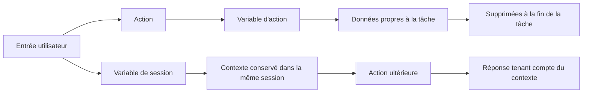

# Variables dans les interactions d’un chatbot

## Table des matières

- [Statut](#statut)
- [Objectifs d’apprentissage](#objectifs-dapprentissage)
- [Carte conceptuelle](#carte-conceptuelle)
- [Concepts clés](#concepts-clés)
- [Application pratique](#application-pratique)
- [Travaux pratiques et activités](#travaux-pratiques-et-activités)
- [Révision du quiz](#révision-du-quiz)
- [Questions à revoir](#questions-à-revoir)
- [Synthèse finale](#synthèse-finale)

## Statut

- [x] Adaptation française rédigée à partir des notes canoniques anglaises.
- [ ] Révision personnelle de l’adaptation terminée.

Le certificat documente séparément la réussite du cours. Les noms d’actions, de variables et d’éléments d’interface restent en anglais lorsqu’ils correspondent directement au workflow enregistré.

## Objectifs d’apprentissage

1. Distinguer les variables d’action des variables de session.
2. Expliquer pourquoi les variables d’action sont temporaires et propres à une tâche.
3. Expliquer comment les variables de session préservent le contexte pendant une même session utilisateur.
4. Créer et utiliser une variable de session `City` dans le chatbot de la boutique de fleurs.
5. Empêcher qu’une variable de session soit remplacée accidentellement.
6. Ajouter des actions conversationnelles pour les salutations, les remerciements et les formules de départ.
7. Utiliser des variations de réponse afin de rendre les interactions répétées moins robotiques.
8. Tester dans Preview des conversations faisant intervenir plusieurs actions.

## Carte conceptuelle

## Concepts clés

### Variables d’action

Le cours décrit les **variables d’action** comme des valeurs temporaires utilisées dans une action précise.

Elles peuvent contenir des informations telles que :

- une option sélectionnée ;
- des détails de commande ;
- des critères de recherche ;
- une réponse de confirmation.

Lorsque l’action est terminée, la variable d’action est supprimée puisqu’elle n’est plus nécessaire.

### Variables de session

Les **variables de session** conservent un état et un contexte à travers plusieurs interactions pendant une même session utilisateur.

Le cours met en avant leur utilisation pour :

- les informations contextuelles ;
- les préférences de l’utilisateur ;
- la continuité entre les actions ;
- des réponses de suivi plus pertinentes.

Elles ne sont pas présentées comme un stockage permanent entre plusieurs sessions.

### Pourquoi le contexte est perdu entre les actions

Le chatbot de la boutique de fleurs possède des actions distinctes pour les informations d’emplacement et les heures d’ouverture.

Un utilisateur peut :

1. demander où se trouvent les magasins ;
2. sélectionner Vancouver ;
3. recevoir l’adresse de Vancouver ;
4. demander ensuite : **And when is it open?**

Sans variable de session, l’action **Hours of operation** ne sait pas que Vancouver a été sélectionnée précédemment, car la valeur de la ville n’existait que dans l’action précédente.

### Variable de session City

Le cours résout ce problème en créant une variable de session **City**.

Une nouvelle étape intermédiaire :

1. reçoit la ville sélectionnée à l’étape 1 ;
2. affecte cette valeur à `City` ;
3. permet aux actions suivantes de lire `City`.

Les conditions propres à chaque ville font alors référence à la variable de session plutôt qu’à la variable de l’étape d’action d’origine.

### Conditions défensives

La première implémentation de la variable de session présente encore deux problèmes possibles :

- l’étape 1 peut demander une ville alors que `City` est déjà connue ;
- l’étape **Set city** peut remplacer `City` par une valeur vide lorsque l’étape 1 n’a recueilli aucune nouvelle ville.

Le cours corrige ces deux situations.

#### Condition de l’étape 1

Exécuter l’étape 1 uniquement lorsque **City is not defined**.

#### Condition de Set city

Exécuter **Set city** uniquement lorsque la variable d’action de l’étape 1 **is defined**.

Cela empêche qu’une valeur de session valide soit remplacée par une valeur vide.

### Partage de City entre les actions

La même variable de session `City` est utilisée par les deux actions :

- **Location information** ;
- **Hours of operation**.

L’une ou l’autre peut définir la ville et l’autre peut ensuite la réutiliser.

Cela permet les enchaînements suivants :

- emplacement -> horaires ;
- horaires -> emplacement ;
- ville indiquée explicitement dans la demande de l’utilisateur.

### Saved responses

La source indique que des ensembles de réponses client, comme la liste des villes, peuvent être enregistrés pour être réutilisés dans **Saved responses**.

Le laboratoire ne l’exige pas, car la structure de l’action a été dupliquée, mais cette fonctionnalité est présentée comme utile lorsque plusieurs actions partagent le même ensemble de réponses.

### Actions de conversation informelle

Le cours ajoute ensuite des actions personnalisées destinées à rendre l’assistant plus conversationnel.

#### Hellos

Les exemples de déclenchement comprennent :

- Hello
- Hey
- Good morning
- Good evening
- How is it going?
- What’s up?

La réponse enregistrée est :

> Hello! How can I help you? I can give you instructions on how to find our stores, our hours of operation, and flower recommendations.

L’action se termine après cette réponse.

#### Thank you

Le cours part du modèle prédéfini **Thank you!** et ajoute des variations de réponse.

Les exemples de la source sont :

- You’re welcome! Let me know if I can help with anything else.
- My pleasure! Let me know if you have other questions.
- You’re very welcome! Let me know if I can assist further.

Le type de variation est défini sur **Random**.

#### Goodbyes

L’action **Goodbyes** utilise `City` lorsqu’elle est disponible.

Avec une ville :

> Thank you for chatting. We hope you visit our [City] store.

Sans ville :

> Thank you for chatting. We hope you visit our store.

## Application pratique

### Une coopérative cacaoyère près de Soubré : contexte de session entre plusieurs actions

Dans le cas pratique du dépôt, le même modèle de gestion de l’état peut relier les workflows de
point de collecte et d’horaires de réception introduits dans le module précédent.

Le laboratoire IBM utilise la variable de session `City`. L’adaptation à la coopérative utilise le
nom conceptuel `CollectionPoint` afin de rendre explicite le rôle équivalent. `CollectionPoint` est
une variable du cas pratique du dépôt et non une variable enregistrée dans le laboratoire IBM.

Une conversation pourrait fonctionner ainsi :

1. un membre ou un agent demande où un lot de cacao peut être livré ;
2. l’assistant demande, si nécessaire, quel point de collecte pris en charge est concerné ;
3. la valeur sélectionnée est stockée dans `CollectionPoint` pour la session en cours ;
4. l’utilisateur demande ensuite : « Quand puis-je y livrer mon lot ? » ;
5. l’action consacrée aux horaires de réception réutilise `CollectionPoint` ;
6. l’assistant retourne uniquement les informations de réception fournies par une source approuvée
   de la coopérative.

Cela évite de demander deux fois le même contexte tout en maintenant l’interaction liée à des
données opérationnelles explicites et vérifiables.

### Modèle d’état de session avec CollectionPoint

| Besoin                                                                          | Type de variable    |
| ------------------------------------------------------------------------------- | ------------------- |
| Conserver une valeur nécessaire uniquement pendant l’exécution d’une action     | Variable d’action   |
| Réutiliser le point de collecte dans des actions ultérieures de la même session | Variable de session |
| Enregistrer une confirmation temporaire propre à la branche actuelle            | Variable d’action   |
| Préserver un contexte approuvé tel que le point de collecte courant             | Variable de session |

Une implémentation défensive suit le même modèle que celui démontré avec la variable IBM `City` :

1. recueillir le point de collecte uniquement lorsqu’il n’est pas déjà connu ;
2. écrire `CollectionPoint` uniquement lorsqu’une nouvelle valeur valide a réellement été recueillie ;
3. ne pas remplacer une valeur de session existante par une valeur vide ;
4. permettre aux actions associées de lire la même variable de session ;
5. réinitialiser le contexte de session lorsqu’une conversation indépendante commence.

La variable préserve le contexte, mais ne confère aucune autorité. La connaissance du point de
collecte sélectionné ne permet pas à l’assistant d’inférer une adresse, un horaire de réception, un
statut de lot, un résultat de qualité, un statut de paiement ou tout autre fait qui n’aurait pas été
fourni par une source approuvée.

## Travaux pratiques et activités

### Utilisation des variables de session

Le workflow fourni est le suivant :

1. ouvrir **Location information** ;
2. ajouter une deuxième étape ;
3. la renommer **Set city** ;
4. créer une variable de session nommée **City** avec le type **Free text** ;
5. affecter à `City` la valeur de l’étape d’action recueillie à l’étape 1 ;
6. modifier les conditions propres aux villes afin qu’elles utilisent `City` ;
7. répéter le même modèle dans **Hours of operation** ;
8. ajouter les conditions défensives ;
9. enregistrer et tester.

### Scénario de test A : Location vers Hours

1. Réinitialiser Preview.
2. Demander : **Where are your stores located?**
3. Sélectionner **Vancouver**.
4. Demander : **And when is it open?**
5. L’assistant doit réutiliser Vancouver.

### Scénario de test B : Hours vers Location

1. Réinitialiser Preview.
2. Demander : **What are your hours?**
3. Sélectionner **Toronto**.
4. Demander : **And where is it?**
5. L’assistant doit réutiliser Toronto.

### Scénario de test C : ville explicite

1. Réinitialiser Preview.
2. Demander : **Where is your Calgary store?**
3. Demander : **And when is it open?**
4. La variable de session `City` doit permettre le suivi.

### Amélioration de l’expérience utilisateur

L’apprenant crée :

- **Hellos** ;
- **Thank you!** ;
- **Goodbyes**.

Une séquence de test fournie comprend :

- Hello
- Where are you located?
- Calgary
- thank you
- and when is it open?
- thanks again
- goodbye

## Révision du quiz

Les retours du quiz noté fournis établissent que :

- les variables d’action conservent temporairement des informations destinées à des tâches précises ;
- les variables d’action sont supprimées une fois la tâche terminée ;
- les variables de session conservent le contexte entre plusieurs interactions d’une même session ;
- une variable de session peut stocker la ville de l’utilisateur afin que les questions ultérieures reçoivent des réponses propres à cette ville ;
- les variables de session favorisent la continuité et la personnalisation ;
- mémoriser un modèle d’ordinateur portable sélectionné plus tôt dans la même session constitue un cas d’usage d’une variable de session.

Dans une tentative de quiz fournie, **persistent variable** a été sélectionné pour un scénario de localisation au cours de la même session et n’a rapporté aucun point. Les supports environnants indiquent qu’une **session variable** correspond au comportement attendu.

## Questions à revoir

- Quelles valeurs d’un assistant en production devraient n’exister que pendant une action ?
- Quelles valeurs devraient persister pendant toute la session ?
- Comment les variables de session devraient-elles être réinitialisées entre des conversations indépendantes ?
- Quelles écritures doivent être protégées contre les valeurs vides ou obsolètes ?

## Synthèse finale

Les variables d’action et les variables de session répondent à deux problèmes différents de gestion de l’état.

- Les **variables d’action** sont temporaires et propres à une tâche.
- Les **variables de session** préservent le contexte à travers plusieurs interactions d’une même session.

L’exemple IBM `City` montre pourquoi la portée est importante : une valeur recueillie dans une
action doit passer au niveau de la session avant de pouvoir être réutilisée par une autre action.
Dans le fil conducteur de la coopérative cacaoyère du dépôt, le même principe est appliqué
conceptuellement avec `CollectionPoint` entre les actions de point de collecte et d’horaires de
réception.

Le module montre également que la qualité conversationnelle ne dépend pas uniquement de la logique
des tâches. Les salutations, les variations de réponse, les formules de départ, les tests et les
formulations tenant compte du contexte améliorent tous l’expérience utilisateur.
