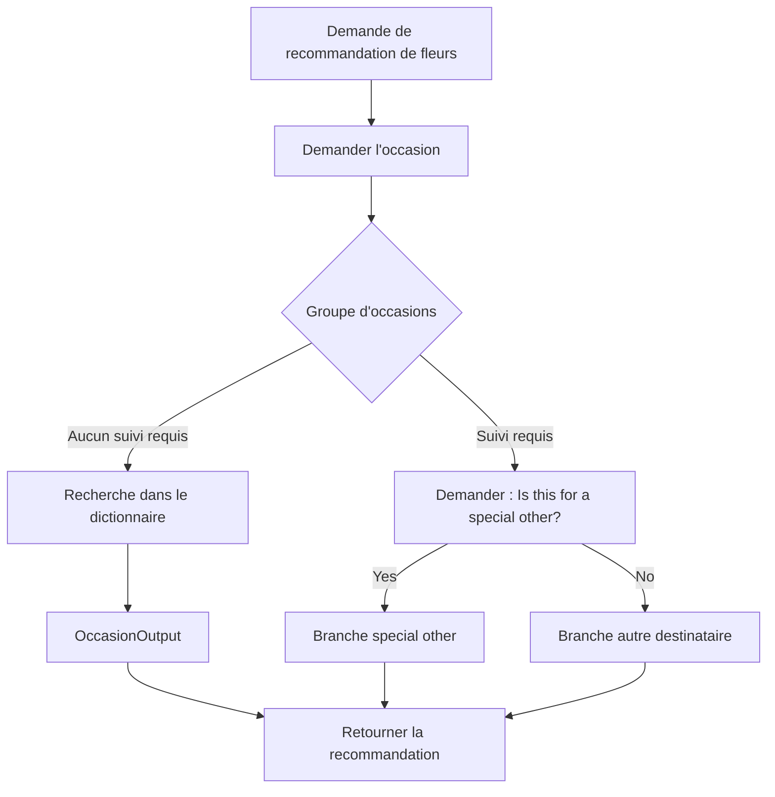

# Amélioration des fonctionnalités du chatbot

## Table des matières

- [Statut](#statut)
- [Objectifs d’apprentissage](#objectifs-dapprentissage)
- [Carte conceptuelle](#carte-conceptuelle)
- [Concepts clés](#concepts-clés)
- [Application pratique](#application-pratique)
- [Travaux pratiques et activités](#travaux-pratiques-et-activités)
- [Révision du quiz](#révision-du-quiz)
- [Questions à revoir](#questions-à-revoir)
- [Synthèse finale](#synthèse-finale)

## Statut

- [x] Adaptation française rédigée à partir des notes canoniques anglaises.
- [ ] Révision personnelle de l’adaptation terminée.

Le certificat documente séparément la réussite du cours. Les noms d’actions, de variables, de branches et les expressions littérales sont conservés lorsqu’ils correspondent directement au workflow enregistré.

## Objectifs d’apprentissage

1. Concevoir un système de recommandation dans un chatbot.
2. Construire une action complexe comportant des branches conditionnelles.
3. Utiliser une correspondance structurée de réponses avant l’implémentation.
4. Utiliser des expressions et des dictionnaires afin de générer des réponses dynamiquement.
5. Configurer des questions de suivi pour recueillir du contexte supplémentaire.
6. Intégrer des images dans les réponses.
7. Tester des workflows complexes à travers plusieurs parcours conversationnels.
8. Expliquer comment les outils visuels sans code permettent de construire des comportements avancés de chatbot.

## Carte conceptuelle



## Concepts clés

### Systèmes de recommandation dans le cours

Le cours fait évoluer l’assistant de la boutique de fleurs d’un système standard de recherche d’informations vers des recommandations personnalisées.

La logique de recommandation repose sur des critères métier. Les supports fournis identifient :

1. l’occasion spéciale ;
2. la relation entre le client et le destinataire ;
3. le genre du destinataire.

Le cours inclut explicitement un avertissement indiquant que ces choix sont simplifiés à des fins pédagogiques et ne doivent pas être considérés comme des hypothèses réelles concernant le genre ou les préférences florales.

### Correspondance structurée des réponses

Avant d’implémenter le workflow, le cours recommande de créer un tableau de réponses faisant correspondre les critères de l’utilisateur à une recommandation.

Les occasions répertoriées comprennent :

- Anniversary
- Birthday
- Christmas day
- Get well
- Graduation
- Mother’s Day
- New Baby
- Romance
- Thank You
- Valentine’s Day
- Wedding
- Other/Just because

Le principe de conception important consiste à définir la logique métier avant de l’encoder dans l’assistant.

### Groupes d’occasions

#### Question de suivi requise

Les supports fournis utilisent :

- Birthday
- Thank You
- Other/Just because

Ces occasions déclenchent la question :

> Is this for a special other?

Le client répond **Yes** ou **No**.

#### Aucune question de suivi requise

Les autres occasions peuvent recevoir directement une réponse.

Certaines possèdent une recommandation unique pour tout le monde, comme les exemples pour :

- Christmas day ;
- Mother’s Day ;
- Wedding.

D’autres incluent directement dans la réponse des alternatives propres au destinataire, notamment :

- Anniversary ;
- Get well ;
- Graduation ;
- New Baby ;
- Romance ;
- Valentine’s Day.

### Action Flower Recommendations

L’action est entraînée avec des exemples de demandes tels que :

- I’d like flower recommendations
- Flower suggestions
- Flowers for birthday
- Flower recommendations for girlfriend
- Bouquet for wife
- Flowers for Christmas
- Plant for friend

La première étape demande :

> What’s the special occasion?

La réponse du client est configurée sous la forme d’une liste prédéfinie.

### Pourquoi ne pas créer une branche pour chaque occasion ?

Le cours montre d’abord comment chaque occasion pourrait être représentée par une étape conditionnelle distincte.

Cette approche devient difficile à maintenir lorsqu’un grand nombre de scénarios existe, en particulier une fois que des questions de suivi sont ajoutées.

Le laboratoire introduit donc :

- des variables de session ;
- une expression ;
- un dictionnaire ;
- une recherche dynamique.

### Variables de session dans le workflow de recommandation

#### Occasion

Stocke l’occasion sélectionnée à l’étape 1.

#### OccasionResponses

Stocke un dictionnaire dont les clés sont des occasions et dont les valeurs sont des chaînes de recommandation.

#### OccasionOutput

Stocke la recommandation finale sélectionnée dans `OccasionResponses`.

L’expression fournie est :

```text
$OccasionResponses[$Occasion]
```

Elle recherche la clé correspondant à la valeur actuelle de `Occasion` et affecte la réponse correspondante à `OccasionOutput`.

### Modèle fondé sur un dictionnaire

Conceptuellement :

```json
{
  "Anniversary": "Recommendation text...",
  "Christmas day": "Recommendation text...",
  "Get well": "Recommendation text...",
  "Mother's Day": "Recommendation text...",
  "Wedding": "Recommendation text..."
}
```

Le laboratoire fourni remplace ensuite les valeurs temporaires par les recommandations complètes de la boutique de fleurs.

Parmi les exemples enregistrés figurent :

- Anniversary : **Long Stem Roses Bouquet** / **His Anniversary Bouquet**.
- Christmas day : **Large Red Poinsettia**.
- Mother’s Day : recommandation de consulter une page consacrée aux bouquets de Mother’s Day.
- Romance : **Love is in the Air** / **All You Need is Love**.
- Valentine’s Day : **Long Stem Roses Bouquet** / **His Valentine’s Day Bouquet**.
- Wedding : recommandation de consulter **Wedding Day Florals**.

La leçon canonique porte sur la structure de données : **clé -> réponse**.

### Expressions

Le cours présente les expressions comme un moyen de spécifier ou de dériver des valeurs à partir de données recueillies dans des étapes ou stockées dans des variables.

Ici, l’expression effectue une recherche dans un dictionnaire. Elle réduit le nombre de branches dupliquées tout en gardant la logique de recommandation explicite.

### Questions de suivi

Pour Birthday, Thank You et Other/Just because, l’assistant demande si les fleurs sont destinées à une personne spéciale.

Le type de réponse est **Confirmation**, ce qui génère les options **Yes/No**.

Cette réponse est stockée dans une variable d’étape d’action et combinée avec `Occasion` afin de sélectionner la branche suivante.

### Six branches pour les scénarios particuliers

| Branche            | Occasion           | Confirmation |
| ------------------ | ------------------ | ------------ |
| SO Birthday        | Birthday           | Yes          |
| Other Birthday     | Birthday           | No           |
| SO Thank You       | Thank You          | Yes          |
| Other Thank You    | Thank You          | No           |
| SO Just Because    | Other/Just Because | Yes          |
| Other Just Because | Other/Just Because | No           |

Parmi les exemples enregistrés figurent :

- Birthday Romance / Birthday Cheers ;
- Birth of Paradise / Prickly Pear Cactus ;
- Elegant Gratitude / Bold Thanks ;
- Graceful Appreciation / Gratitude Cheers ;
- Just For Her / Just Because Charm ;
- Happy Blossoms / Just Because Vibrance.

Chaque branche finale termine l’action après avoir retourné la recommandation.

### Images

Le cours montre comment ajouter des images de compositions florales aux réponses.

L’évaluation notée identifie la **media library** comme la fonctionnalité utilisée pour associer des images à des réponses précises. Le laboratoire montre également l’insertion d’une URL d’image dans l’éditeur de réponse.

### Sans code ne signifie pas sans logique

L’apprenant doit toujours concevoir :

- les déclencheurs ;
- les variables ;
- les correspondances ;
- les conditions ;
- les branches ;
- les expressions ;
- les tests.

L’éditeur visuel évite de devoir construire le code applicatif environnant, mais la conception logique reste essentielle.

## Application pratique

### Une coopérative cacaoyère près de Soubré : assistance structurée à la traçabilité

Le cas pratique du dépôt applique les mêmes techniques de workflow à une assistance contrôlée en
matière de traçabilité. Le workflow IBM de recommandation de fleurs reste l’exercice source
enregistré ; les variables et catégories ci-dessous constituent des adaptations conceptuelles pour
le fil conducteur de la coopérative.

Un assistant de coopérative pourrait commencer par classer le type d’assistance demandé dans un
`IssueType` approuvé. Les exemples déjà établis dans le cas pratique du dépôt comprennent :

- un champ de réception manquant ;
- un identifiant de lot illisible ;
- une alerte d’identifiant dupliqué ;
- une incohérence entre les dossiers de terrain et de réception ;
- une incohérence de mouvement d’entrepôt ;
- un autre cas nécessitant une vérification par le personnel.

Le workflow pourrait ensuite utiliser trois valeurs conceptuelles :

- `IssueType` — la catégorie sélectionnée de demande d’assistance à la traçabilité ;
- `IssueResponses` — un dictionnaire qui associe une catégorie approuvée à une consigne contrôlée ;
- `IssueOutput` — la consigne sélectionnée pour le problème courant.

Conceptuellement, la recherche suit le même modèle que l’exercice IBM :

```text
$IssueResponses[$IssueType]
```

Cette expression est une adaptation propre au dépôt du modèle de dictionnaire enseigné dans le
cours. Il ne s’agit ni d’une variable ni d’une expression enregistrée dans le laboratoire IBM.

Une correspondance illustrative pourrait être :

| Type de problème                    | Comportement contrôlé de l’assistant                                    |
| ----------------------------------- | ----------------------------------------------------------------------- |
| Champ de réception manquant         | Identifier le champ fourni comme manquant et demander sa vérification   |
| Identifiant de lot illisible        | Demander une source plus lisible ou une vérification manuelle           |
| Alerte d’identifiant dupliqué       | Séparer les dossiers en conflit et les transmettre pour rapprochement   |
| Incohérence terrain/réception       | Résumer les faits confirmés, les conflits et les questions non résolues |
| Incohérence de mouvement d’entrepôt | Présenter les dossiers fournis et demander une vérification             |
| Autre / vérification nécessaire     | Escalader sans inventer de résolution                                   |

L’assistant ne détermine pas quel dossier fait juridiquement autorité, ne rejette pas de lot,
n’attribue pas de grade de qualité, n’approuve pas de paiement et n’émet pas de certificat. Ces
décisions restent sous la responsabilité du personnel autorisé de la coopérative.

### Logique métier avant logique d’implémentation

La même séparation mise en avant dans l’exercice IBM de recommandation devient :

- **Quelle consigne la coopérative est-elle autorisée à fournir pour chaque type de problème défini ?**
- **Comment le chatbot doit-il sélectionner et présenter cette consigne ?**

Une implémentation contrôlée pourrait :

1. définir les catégories de problèmes et les textes de réponse approuvés avant de construire les
   branches ;
2. utiliser une recherche dans un dictionnaire pour les correspondances stables qui ne nécessitent
   pas de clarification supplémentaire ;
3. utiliser des branches explicites lorsqu’un problème exige une question de suivi ou une
   escalade vers le personnel ;
4. utiliser uniquement les dossiers sources fournis pour décrire le cas courant ;
5. marquer comme inconnus les faits indisponibles au lieu de les générer ;
6. maintenir les décisions à conséquence importante hors de l’assistant ;
7. tester chaque parcours pris en charge ainsi que chaque parcours d’escalade.

Cela préserve la leçon de conception centrale du cours : modéliser d’abord les règles métier, puis
choisir la structure de workflow la plus simple permettant de les implémenter sans duplication
inutile.

## Travaux pratiques et activités

### Working With Complex Actions, Part 1

L’apprenant :

1. crée l’action **Flower recommendations** ;
2. ajoute des exemples de déclenchement ;
3. définit la liste des occasions spéciales ;
4. crée une deuxième étape ;
5. crée `Occasion` ;
6. crée `OccasionResponses` ;
7. affecte un dictionnaire avec une expression ;
8. crée `OccasionOutput` ;
9. affecte `OccasionOutput` en utilisant l’expression de recherche dans le dictionnaire ;
10. insère `OccasionOutput` dans la réponse de l’assistant ;
11. teste une occasion standard telle que New Baby ;
12. remplace les recommandations temporaires par les réponses finales enregistrées.

### Working With Complex Actions, Part 2

L’apprenant :

1. renomme la deuxième étape d’origine **Standard Occasions** ;
2. ajoute une nouvelle étape conditionnelle au-dessus ;
3. définit **Any** parmi Birthday, Thank You ou Other/Just Because comme groupe de conditions ;
4. stocke l’occasion dans `Occasion` ;
5. demande **Is this for a special other?** ;
6. utilise **Confirmation** comme type de réponse client ;
7. ajoute six branches Yes/No ;
8. termine l’action après chaque recommandation ;
9. ajoute des images lorsque cela est approprié ;
10. exécute des tests de bout en bout.

### Scénarios de test enregistrés

#### Test 1

- Where are your stores located?
- Sélectionner Toronto.
- When is it open?
- I’d like some flower recommendations.
- Sélectionner Valentine’s Day.

#### Test 2

- I’d like some flower recommendations.
- Sélectionner Birthday.
- Sélectionner Yes.

#### Test 3

- I’d like some flower recommendations.
- Sélectionner Birthday.
- Sélectionner No.

#### Test 4

- I’d like some flower recommendations.
- Sélectionner Other/Just Because.
- Sélectionner No.

Le cours demande à l’apprenant de réinitialiser Preview avant et après les tests indépendants.

## Révision du quiz

Les retours de l’évaluation notée renforcent les points suivants :

- les questions de suivi affinent l’entrée utilisateur afin de produire des réponses personnalisées ;
- un tableau structuré de réponses associe les entrées à des recommandations ;
- l’intégration d’images améliore l’engagement visuel ;
- les expressions permettent une interprétation dynamique sans code applicatif ;
- watsonx Assistant permet le développement sans code grâce à des éditeurs visuels et à des modèles prédéfinis ;
- l’étape de construction d’une action définit le déclencheur, les variables d’entrée et le flux logique ;
- la media library permet d’associer des images aux réponses.

## Questions à revoir

- Quand une recherche dans un dictionnaire est-elle préférable à des étapes conditionnelles explicites ?
- Quels critères de recommandation devraient utiliser des options prédéfinies plutôt qu’un texte libre ?
- Comment le workflow devrait-il évoluer si les catégories de destinataires devenaient plus nuancées ?
- Quelles parties de la logique métier enregistrée devraient être repensées pour une véritable boutique de fleurs en production ?

## Synthèse finale

Ce module transforme l’assistant en un système structuré de recommandation.

Les techniques centrales consistent à :

- définir la logique métier à l’aide d’un tableau de réponses ;
- recueillir uniquement les informations supplémentaires nécessaires ;
- utiliser des variables de session pour l’état réutilisable ;
- utiliser des dictionnaires et des expressions pour sélectionner dynamiquement les réponses ;
- réserver les branches explicites aux cas qui nécessitent une logique de suivi ;
- intégrer des images afin d’enrichir les réponses ;
- tester chaque parcours important.

Dans le fil conducteur de la coopérative cacaoyère du dépôt, ces mêmes techniques peuvent structurer
une assistance à la traçabilité tout en maintenant les décisions à conséquence importante sous la
responsabilité du personnel autorisé. L’exercice source IBM reste le système de recommandation de
fleurs documenté ci-dessus.
