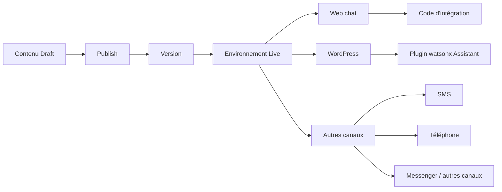

# Principes essentiels du déploiement d’un chatbot

## Table des matières

- [Statut](#statut)
- [Objectifs d’apprentissage](#objectifs-dapprentissage)
- [Carte conceptuelle](#carte-conceptuelle)
- [Concepts clés](#concepts-clés)
- [Application pratique](#application-pratique)
- [Travaux pratiques et activités](#travaux-pratiques-et-activités)
- [Révision du quiz](#révision-du-quiz)
- [Questions à revoir](#questions-à-revoir)
- [Synthèse finale](#synthèse-finale)

## Statut

- [x] Adaptation française rédigée à partir des notes canoniques anglaises.
- [ ] Révision personnelle de l’adaptation terminée.

Le certificat documente séparément la réussite du cours. Les noms d’environnements, de canaux, de vues, de champs et d’extensions provenant des interfaces sont conservés lorsqu’ils correspondent directement au workflow enregistré.

## Objectifs d’apprentissage

1. Expliquer le processus de déploiement utilisé dans IBM watsonx Assistant.
2. Distinguer les environnements Draft et Live.
3. Publier une version du chatbot dans Live.
4. Explorer le déploiement Web chat et le code d’intégration généré.
5. Identifier des canaux et des extensions supplémentaires.
6. Connecter l’assistant à un site WordPress à l’aide du workflow de plugin enregistré.
7. Personnaliser le comportement et l’apparence du chatbot déployé.
8. Tester une conversation complète dans l’environnement Live.

## Carte conceptuelle

## Concepts clés

### Déploiement

Le cours définit le déploiement comme le fait de rendre publiquement disponible le chatbot qui a été créé afin qu’il puisse servir les utilisateurs.

Le workflow enregistré couvre :

- les environnements ;
- la publication ;
- Web chat ;
- le code d’intégration généré ;
- WordPress ;
- des canaux supplémentaires ;
- les extensions.

### Draft et Live

IBM watsonx Assistant est présenté avec deux environnements par défaut :

- **Draft**
- **Live**

Le cours compare cette séparation aux environnements de développement et de production.

#### Draft

Draft contient le travail en cours et le contenu non publié. Il sert à modifier, prévisualiser et tester sans changer immédiatement l’assistant destiné aux utilisateurs.

#### Live

Live contient le contenu publié destiné aux utilisateurs.

Les supports fournis indiquent également que certaines offres payantes peuvent proposer des environnements supplémentaires, comme un environnement de staging, pour des workflows de déploiement plus complexes.

### Publication du contenu

Le laboratoire ouvre la vue **Publish** et affiche le contenu non publié.

L’apprenant :

1. clique sur **Publish** ;
2. saisit une description de version telle que **Initial release.** ;
3. sélectionne l’environnement **Live** ;
4. publie le contenu.

Le résultat enregistré apparaît sous la forme **V1 Live**.

Le cours montre également comment télécharger la version publiée comme sauvegarde.

### Canal Web chat

L’environnement Live contient un canal **Web chat**.

L’apprenant peut explorer :

- l’apparence et le comportement ;
- les options liées à un agent humain ou à l’escalade ;
- l’onglet **Embed** ;
- l’extrait JavaScript permettant d’intégrer le chatbot à un site web.

Le concept principal est que watsonx Assistant peut fournir un canal de chat prêt à intégrer sans demander à l’apprenant de construire lui-même une interface de chat.

### Autres canaux

Le cours demande à l’apprenant d’ouvrir **Browse Catalog** et d’examiner d’autres options de déploiement.

Les exemples présents dans les supports fournis comprennent :

- Phone ;
- SMS ;
- Slack ;
- Messenger.

La disponibilité peut dépendre de l’offre souscrite.

### Extensions

Les extensions étendent les capacités de l’assistant au-delà du workflow scripté de base.

Le cours met en avant une fonctionnalité de recherche pouvant utiliser une base de connaissances ou un document existant afin de répondre à un plus large éventail de questions propres à un domaine.

L’évaluation notée renforce l’idée que les extensions permettent d’étendre les capacités du chatbot et de prendre en charge des tâches plus avancées.

### Déploiement WordPress

Le deuxième laboratoire de déploiement utilise un site WordPress généré avec le plugin **Chatbot with IBM watsonx Assistant**.

La configuration du plugin nécessite :

- Service instance URL ;
- Environment ID ;
- API key.

Le cours demande d’utiliser le **Live Environment ID** afin que le site web se connecte au chatbot publié plutôt qu’à la version Draft.

### Gestion des identifiants

Les captures d’écran fournies masquent les valeurs de compte et les identifiants. Ces notes ne reproduisent volontairement pas ces secrets.

Le contenu canonique est le workflow de gestion des identifiants, et non leurs valeurs littérales.

### Personnalisation du plugin WordPress

Le plugin enregistré présente trois principales zones de personnalisation.

#### Behaviour

Les options affichées comprennent :

- le délai avant l’apparition de la fenêtre ;
- l’effacement ou non du chat lors du chargement d’une nouvelle page ;
- l’affichage du chat sur toutes les pages ou uniquement sur certaines pages.

#### Chat Box

Les options affichées comprennent :

- le comportement en plein écran ;
- l’état réduit ;
- la position à l’écran ;
- le bouton d’envoi du message ;
- l’animation de saisie ;
- le message d’erreur ;
- le titre de la fenêtre de chat ;
- l’infobulle pour effacer les messages ;
- le texte invitant à saisir un message ;
- la taille de police ;
- la couleur ;
- la taille de la fenêtre ;
- le logo du chatbot.

Les captures d’écran utilisent un positionnement en bas à droite.

#### Chat Button

Les options affichées comprennent :

- la position de l’icône ;
- le libellé textuel ;
- la taille de l’icône ;
- la taille du texte.

### Fonctionnalités avancées du plugin

Le plugin enregistré contient également des onglets pour :

- Usage Management ;
- Voice Calling ;
- Context Variables ;
- Chat History ;
- Notification ;
- Mail Settings.

Le cours indique que ces fonctionnalités avancées sont facultatives pour l’exercice.

La page **Voice Calling** fait référence à Twilio pour les appels depuis le navigateur.

## Application pratique

### Une coopérative cacaoyère près de Soubré : déploiement contrôlé de l’assistant

Le cas pratique du dépôt applique les principes de déploiement à l’assistant opérationnel de
coopérative développé dans les modules précédents. Le déploiement WordPress enregistré par IBM
reste l’exercice source ; le déploiement de la coopérative ci-dessous constitue une adaptation
conceptuelle propre au dépôt.

L’assistant regroupe désormais plusieurs capacités contrôlées :

- recherche de points de collecte à partir de données approuvées ;
- recherche d’horaires de réception à partir de données approuvées ;
- conservation du contexte pendant la session avec `CollectionPoint` ;
- assistance structurée à la traçabilité ;
- questions de suivi lorsqu’une clarification est nécessaire ;
- escalade lorsqu’un workflow pris en charge ne permet pas de résoudre la demande de manière sûre.

Pour la coopérative, la séparation Draft/Live devient un contrôle opérationnel. Une modification
portant sur les consignes de point de collecte, les textes d’assistance à la traçabilité, la logique
de branchement ou le comportement d’escalade ne devrait pas atteindre les utilisateurs simplement
parce qu’elle a été modifiée.

Un processus de publication contrôlé pourrait être :

1. construire ou modifier l’assistant dans Draft ;
2. tester chaque workflow pris en charge avec des entrées connues ;
3. tester les parcours avec données manquantes, cas non pris en charge et escalades ;
4. vérifier les formulations opérationnelles par rapport aux procédures et dossiers approuvés de la
   coopérative ;
5. publier une version nommée uniquement après vérification ;
6. vérifier le comportement publié dans Live ;
7. connecter Live au canal approuvé prévu ;
8. exécuter un test de déploiement de bout en bout avant une utilisation plus large.

### Périmètre d’un déploiement destiné au personnel

Une expérience web destinée au personnel constitue un déploiement conceptuel naturel pour ce cas
pratique, puisque l’assistant manipule un contexte opérationnel et lié à la traçabilité.

Le périmètre de déploiement devrait distinguer les informations pouvant être exposées sur le canal
sélectionné de celles qui nécessitent un accès restreint. Les identités des membres, les détails de
paiement, les résultats de qualité, les informations d’inspection non publiées, les identifiants et
les autres dossiers sensibles ne devraient pas être exposés simplement parce qu’une intégration
Web chat est techniquement disponible.

Un canal public pourrait tout de même fournir des informations approuvées à faible risque, mais
l’accès aux dossiers internes ou aux workflows à conséquence importante nécessiterait des contrôles
appropriés d’authentification, d’autorisation et de vérification humaine. Ce cas pratique n’affirme
pas que de tels contrôles ont été implémentés.

### Discipline de version, de sauvegarde et de retour arrière

Le message **Initial release.** et la sauvegarde téléchargée dans le laboratoire IBM illustrent une
discipline élémentaire de publication. Appliquée à la coopérative, chaque version devrait permettre
d’identifier la logique opérationnelle modifiée et la version actuellement mise à disposition des
utilisateurs.

Un enregistrement pratique de publication pourrait contenir :

- l’identifiant de version ;
- un résumé approuvé des modifications ;
- la personne ayant effectué la vérification ;
- la date de déploiement ;
- les workflows testés ;
- les limites connues ;
- une référence de sauvegarde ou de retour arrière.

Ces champs décrivent un modèle de conception utile pour le dépôt et non une exigence du laboratoire
IBM.

### Scénario de test du déploiement

Un test de déploiement de la coopérative pourrait vérifier une conversation complète à faible
risque :

1. demander des informations sur les points de collecte pris en charge ;
2. sélectionner un point de collecte fourni dans les données de test ;
3. demander ses horaires de réception enregistrés ;
4. vérifier que `CollectionPoint` est réutilisé pendant la session ;
5. présenter un problème de traçabilité fourni, tel qu’un champ de réception manquant ;
6. vérifier que l’assistant retourne uniquement la consigne approuvée ;
7. présenter un cas non pris en charge ou à conséquence importante ;
8. vérifier que l’assistant escalade le cas au lieu d’inventer une résolution.

Le résultat attendu n’est pas que l’assistant prenne une décision opérationnelle. Le test vérifie que
la version déployée respecte les informations approuvées, la continuité de session, les limites du
workflow et l’escalade humaine.

## Travaux pratiques et activités

### Exploring Your Deployment Options

L’apprenant :

1. ouvre **Environments** ;
2. examine Draft ;
3. ouvre Live ;
4. examine le contenu non publié ;
5. publie V1 dans Live ;
6. télécharge la version Live comme sauvegarde ;
7. ouvre le canal Web chat ;
8. examine l’onglet Embed ;
9. explore Browse Catalog ;
10. examine les canaux et extensions supplémentaires.

### Deploying Your Chatbot to WordPress

L’apprenant :

1. génère le site WordPress de test fourni ;
2. enregistre les identifiants générés pour le site ;
3. ouvre le tableau de bord WordPress ;
4. ouvre watsonx Assistant dans la barre latérale ;
5. saisit le Service instance URL, le Live Environment ID et l’API key ;
6. active le chatbot ;
7. enregistre la configuration ;
8. visite le site ;
9. personnalise le plugin ;
10. teste la conversation Live.

### Test d’une conversation complète

La séquence finale enregistrée dans WordPress est :

- Hello
- Where are your stores?
- Toronto
- What are its hours?
- I want to gift some flowers
- Thank You
- Yes
- Thank you
- Bye

Cette séquence vérifie plusieurs concepts précédents dans une seule conversation déployée.

## Révision du quiz

L’évaluation sur le déploiement renforce les points suivants :

- WordPress est pratique parce qu’il s’agit d’une plateforme largement utilisée pour les sites web et les blogs ;
- les environnements permettent d’éviter le déploiement accidentel d’un chatbot encore en développement ;
- les extensions peuvent permettre à l’assistant de rechercher dans une base de connaissances ou un document existant ;
- les tests de déploiement doivent vérifier que le chatbot comprend les entrées utilisateur et répond correctement ;
- les chatbots peuvent être déployés sur des sites web, par téléphone, par SMS et sur des plateformes de type messagerie ;
- le déploiement à travers plusieurs environnements favorise la fiabilité et la cohérence ;
- les extensions augmentent les capacités du chatbot au-delà des interactions de base.

## Questions à revoir

- Quels identifiants devraient être gérés comme des secrets de production plutôt que saisis manuellement dans l’interface d’un plugin ?
- Quelles vérifications de publication devraient avoir lieu avant de publier du contenu Draft dans Live ?
- Quelles contraintes propres à chaque canal nécessitent des tests distincts ?
- Quand une extension de connaissances devrait-elle être utilisée plutôt que d’ajouter davantage de branches à un arbre de décision ?

## Synthèse finale

Le déploiement transforme le chatbot d’un exercice interne en un service accessible aux utilisateurs.

Le workflow enregistré de watsonx Assistant sépare Draft de Live, publie du contenu versionné, fournit Web chat et des options d’intégration, et prend en charge des canaux et extensions supplémentaires.

Le laboratoire WordPress montre ensuite un parcours complet d’intégration : connecter
l’environnement Live à l’aide des identifiants de service, personnaliser l’interface de chat et
tester de bout en bout une conversation réaliste en plusieurs étapes.

Dans le fil conducteur de la coopérative cacaoyère du dépôt, ces principes de déploiement deviennent
un processus de publication contrôlé pour l’assistant opérationnel de coopérative. L’adaptation met
l’accent sur les données approuvées, les limites des canaux, la gestion des informations sensibles,
la discipline de version, les tests de déploiement et l’escalade humaine, tout en conservant le
workflow WordPress enregistré par IBM comme exercice source.
