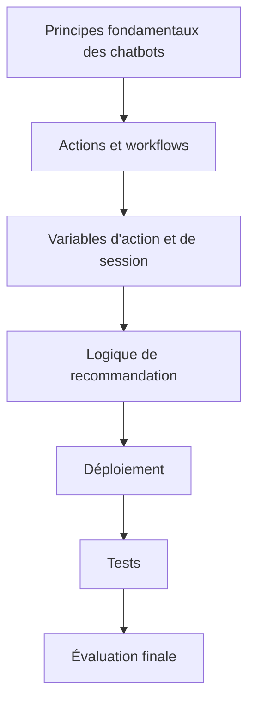

# Examen final et bilan du cours

## Table des matières

- [Statut](#statut)
- [Objectifs d’apprentissage](#objectifs-dapprentissage)
- [Carte conceptuelle](#carte-conceptuelle)
- [Concepts clés](#concepts-clés)
- [Application pratique](#application-pratique)
- [Travaux pratiques et activités](#travaux-pratiques-et-activités)
- [Révision du quiz](#révision-du-quiz)
- [Questions à revoir](#questions-à-revoir)
- [Synthèse finale](#synthèse-finale)

## Statut

- [x] Adaptation française rédigée à partir des notes canoniques anglaises.
- [ ] Révision personnelle de l’adaptation terminée.

Le certificat documente séparément la réussite du cours. Les noms d’actions, de fonctionnalités et d’éléments d’interface restent en anglais lorsqu’ils correspondent directement aux supports enregistrés.

## Objectifs d’apprentissage

1. Consolider les principaux concepts de chatbot abordés dans l’ensemble du cours.
2. Relier les bénéfices des chatbots à des cas d’usage métier.
3. Distinguer les comportements fondés sur les arbres de décision, l’IA générative, les actions et les variables.
4. Réviser les concepts de déploiement et d’extensions.
5. Interpréter les retours de l’évaluation finale.
6. Conserver le glossaire du cours sous la forme d’une référence conceptuelle compacte.

## Carte conceptuelle

## Concepts clés

### Synthèse du cours

Le cours développe le chatbot de la boutique de fleurs par couches successives.

1. **Principes fondamentaux :** ce que sont les chatbots et pourquoi les entreprises les utilisent.
2. **Workflows structurés :** actions, étapes, conditions, branches et résultats prédéfinis.
3. **État :** variables d’action pour les données temporaires propres à une tâche et variables de session pour la continuité conversationnelle.
4. **Expérience utilisateur :** salutations, remerciements, formules de départ et variations de réponse.
5. **Recommandations :** tableaux de réponses, questions de suivi, dictionnaires, expressions, images et branches conditionnelles.
6. **Déploiement :** Draft, Live, Web chat, WordPress, canaux et extensions.
7. **Tests :** Preview et conversations de bout en bout dans l’environnement Live.

### Résultat de l’examen final

L’écran de résultat Coursera fourni enregistre :

- **dernier score :** 70 % ;
- **meilleur score :** 70 % ;
- **seuil de réussite :** 70 %.

Le certificat du cours fourni est daté du **2026-09-30**.

### Concepts renforcés par l’examen final

#### Efficacité

Un chatbot peut gérer de grands volumes de demandes répétitives tout en permettant aux agents humains de se concentrer sur les tâches complexes.

#### Workflows fondés sur les actions

L’approche fondée sur les actions permet d’exécuter des tâches à partir des entrées utilisateur au moyen de workflows organisés.

Les retours de l’examen renforcent également la description donnée par le cours de l’expérience watsonx Assistant fondée sur les actions : elle utilise l’IA et des workflows simplifiés afin de rationaliser la construction, les tests et le déploiement.

#### Interaction personnalisée

Par rapport à une page FAQ statique, un chatbot peut réagir à la conversation et proposer des recommandations à partir des entrées et du contexte de l’utilisateur.

#### Réponses d’emplacement tenant compte du contexte

L’assistant de la boutique de fleurs peut rechercher et afficher les emplacements des magasins selon la demande de l’utilisateur.

#### Évolutivité

Un chatbot peut gérer plusieurs interactions clients simultanément.

#### Arbres de décision pour les scénarios contrôlés

Lorsqu’un système doit suivre une séquence précise de questions et de réponses, le cours identifie un **chatbot à arbre de décision** comme le type approprié.

#### Mots déclencheurs

Lorsque l’assistant doit réagir à des mots-clés configurés, **Trigger Word Detected** est l’action par défaut pertinente.

#### Contexte de session

Lorsqu’une information telle qu’un produit sélectionné doit être mémorisée plus tard pendant la même session, le cours identifie une **variable de session**.

### Révision des tentatives incorrectes

Les captures d’écran de l’examen final fournies conservent plusieurs premiers choix incorrects. Elles permettent de préciser les concepts visés par le cours.

#### Question sur l’efficacité du service client

La réponse sélectionnée affirmait qu’un chatbot fournit un service personnalisé plus efficacement que les agents humains.

La réponse attendue dans le cours est qu’un chatbot peut traiter de grands volumes de demandes répétitives et libérer les agents humains pour les tâches complexes.

#### Question sur l’activation de l’essai IBM Cloud

La capture d’écran montre une sélection incorrecte pour le scénario d’activation **Something went wrong** et renvoie l’apprenant au laboratoire de création du compte IBM Cloud.

Les choix disponibles comprennent des causes telles qu’un code déjà appliqué à une adresse e-mail ou une restriction du compte. Les retours fournis n’exposent pas directement la bonne réponse ; ces notes ne l’infèrent donc pas.

#### Approche fondée sur les actions et approche historique

La réponse sélectionnée mettait l’accent sur le coût.

La distinction attendue est que l’approche fondée sur les actions utilise l’IA et des workflows simplifiés afin de rationaliser la construction, les tests et le déploiement.

## Application pratique

### Modèle mental de bout en bout

Une manière conforme aux sources de raisonner sur le chatbot terminé consiste à :

1. reconnaître l’intention de l’utilisateur ;
2. déclencher l’action pertinente ;
3. recueillir uniquement les informations manquantes ;
4. stocker localement les données propres à la tâche ;
5. stocker au niveau de la session le contexte réutilisable pendant cette même session ;
6. évaluer les conditions ;
7. produire une réponse directe ou sélectionnée dynamiquement ;
8. terminer ou poursuivre l’action ;
9. ne publier que du contenu testé ;
10. tester le déploiement Live.

### Enseignements orientés production visibles dans le cours

Même si le cours est sans code, plusieurs principes de conception logicielle apparaissent tout au long du parcours :

- séparer le travail Draft des versions Live ;
- réutiliser les structures communes ;
- éviter d’écraser un état valide ;
- modéliser la logique métier avant d’implémenter les branches ;
- réduire la duplication à l’aide de correspondances et d’expressions ;
- tester plusieurs parcours ;
- ne pas conserver de secrets dans des notes partagées ;
- vérifier l’expérience Live après le déploiement.

## Travaux pratiques et activités

Le dernier module est centré sur l’évaluation finale et la révision.

Le projet terminé du cours combine :

- la recherche d’emplacements de magasins ;
- les heures d’ouverture ;
- les suivis tenant compte de la session ;
- les salutations, remerciements et formules de départ ;
- les recommandations de fleurs ;
- les images ;
- les branches complexes ;
- le déploiement sur un site web Live.

## Révision du quiz

### Sujets de l’examen final présents dans les résultats fournis

1. efficacité des chatbots dans un service client à fort volume ;
2. objectif des workflows fondés sur les actions ;
3. dépannage du compte d’essai IBM Cloud ;
4. watsonx Assistant fondé sur les actions par rapport à l’approche historique ;
5. avantages d’un chatbot par rapport à une page FAQ statique ;
6. recherche d’emplacements au moyen de workflows d’action ;
7. évolutivité pour de nombreux utilisateurs simultanés ;
8. chatbots à arbre de décision pour des séquences de questions contrôlées ;
9. Trigger Word Detected pour des mots-clés configurés ;
10. variables de session pour mémoriser un élément sélectionné pendant la même session.

### Révision du glossaire

#### Variables d’étape d’action

Valeurs dynamiques utilisées dans les étapes d’une action pour stocker, rechercher ou manipuler des informations pendant une conversation.

#### Variables d’action

Variables temporaires utilisées pour des données appartenant à une tâche ou à une action précise.

#### Workflow d’action

Séquence d’étapes, de conditions et de branches utilisée pour accomplir une tâche plus complexe.

#### Actions

Tâches effectuées par le chatbot lorsque les déclencheurs ou les conditions pertinents sont satisfaits.

#### Variables de l’assistant

Espaces réservés dynamiques utilisés pour stocker, rechercher et gérer des données pendant les conversations.

#### Logique de branchement et conditions

Règles qui évaluent les réponses utilisateur et sélectionnent un parcours conversationnel.

#### Chatbots / assistants virtuels

Applications logicielles qui simulent une conversation humaine par texte ou par voix.

#### Compréhension contextuelle

Capacité, mise en avant pour les chatbots d’IA générative, à maintenir le contexte conversationnel entre plusieurs tours.

#### Actions personnalisées

Actions propres à l’entreprise créées pour gérer des scénarios qui dépassent les actions par défaut.

#### Customize plugin

Zone d’intégration WordPress utilisée dans le laboratoire enregistré afin de personnaliser le comportement et l’apparence du chatbot.

#### Chatbots à arbre de décision

Chatbots qui guident les utilisateurs à travers des parcours et des résultats prédéfinis.

#### Démocratisation du développement

Description donnée par le cours des outils sans code qui rendent le développement de chatbots accessible aux non-programmeurs.

#### Génération dynamique de réponses

Génération de réponses en temps réel à partir de l’entrée utilisateur plutôt que par une branche fixe pour chaque demande.

#### Expressions

Logique utilisée pour dériver, manipuler ou évaluer des valeurs pendant une conversation.

#### Fallback

Action de sécurité utilisée lorsque la conversation ne parvient pas à une résolution claire.

#### Chatbot d’IA générative

Chatbot qui génère dynamiquement ses réponses et peut traiter des entrées plus larges et ouvertes.

#### Greet customer

Action par défaut qui accueille un utilisateur au début d’une conversation.

#### IBM watsonx Assistant

Plateforme conversationnelle utilisée tout au long du cours pour construire, déployer et gérer le chatbot.

#### Variables d’entrée

Variables utilisées pour recueillir les entrées utilisateur afin de les traiter ultérieurement.

#### Variables d’intégration

Variables utilisées pour échanger des informations entre l’assistant et des systèmes ou API externes.

#### Flux logique

Structure de décision qui fait correspondre les entrées utilisateur à des réponses et branches prédéfinies.

#### Présence multicanale

Disponibilité sur plusieurs canaux clients, tels que le web, la messagerie, les SMS ou la voix.

#### Processus en plusieurs étapes

Flux conversationnels qui posent des questions ciblées jusqu’à ce qu’un nombre suffisant d’informations soit disponible pour produire un résultat.

#### No matches

Action par défaut utilisée lorsque l’assistant ne comprend pas la demande de l’utilisateur.

#### Efficacité opérationnelle

Capacité à répondre rapidement aux questions courantes et à réduire la charge de travail répétitive.

#### Personnalisation

Adaptation des réponses ou recommandations aux besoins, au contexte ou aux préférences actuelles de l’utilisateur.

#### Résultats prédéfinis

Réponses ou résultats connus associés aux branches d’un arbre de décision.

#### Engagement client proactif

Proposition de produits, de recommandations ou d’orientations plutôt que simple attente de questions directes.

#### Variation de réponse

Fourniture de plusieurs réponses valides pour une même intention, avec des règles de sélection telles que Random ou Sequential.

#### Évolutivité

Capacité à servir simultanément de nombreuses interactions clients.

#### Tableau de réponses

Correspondance structurée entre des critères tels que l’occasion et le type de destinataire et une recommandation.

#### Trigger

Exemples, mots-clés ou conditions qui démarrent une action.

#### Trigger Word Detected

Action par défaut qui réagit à des mots ou expressions configurés.

#### Entrées imprévisibles

Entrées ouvertes qui ne sont pas représentées sous la forme de branches prédéfinies.

#### Éditeur visuel

Interface utilisée pour construire et modifier les actions du chatbot sans écrire le code applicatif environnant.

#### WordPress

Plateforme de site web utilisée dans le laboratoire de déploiement.

## Questions à revoir

- Quels comportements enregistrés de watsonx Assistant devraient être revalidés avant un déploiement réel actuel ?
- Quelles règles de recommandation de l’exemple de la boutique de fleurs devraient être repensées pour un système de production ?
- Quelles parties de l’état devraient persister au-delà d’une seule session ?
- À quels endroits un assistant de production devrait-il transférer l’utilisateur vers un agent humain ?

## Synthèse finale

Le cours montre que le développement sans code d’un chatbot exige malgré tout une conception système délibérée.

Un chatbot utile combine :

- des définitions claires des tâches ;
- des workflows structurés ;
- une gestion réfléchie de l’état ;
- des réponses tenant compte du contexte ;
- un branchement contrôlé ;
- des correspondances dynamiques ;
- des tests ;
- une discipline de publication ;
- une intégration aux différents canaux.

Le projet de boutique de fleurs évolue d’un assistant structuré simple vers un chatbot de recommandation tenant compte de la session et déployé sur un site web Live. Le résultat fourni de l’évaluation finale et le certificat établissent la réussite du cours.
