# Prompt Engineering Learning Roadmap

This document is a high-level study representation adapted from the
[roadmap.sh Prompt Engineering Roadmap](https://roadmap.sh/prompt-engineering).

It is an independent repository learning aid. It is not a reproduction of the
original roadmap, is not official roadmap.sh material, and is not part of the
IBM/Coursera specialization.

## Learning map

```mermaid
flowchart TD
    A["Prompt Engineering"]

    A --> B["1. Foundations"]
    B --> B1["How LLMs work"]
    B --> B2["Prompts"]
    B --> B3["Prompt engineering"]

    B --> C["2. Core terminology"]
    C --> C1["LLMs and tokens"]
    C --> C2["Context windows"]
    C --> C3["Hallucinations"]
    C --> C4["Agents"]
    C --> C5["Prompt injection"]
    C --> C6["Model parameters"]
    C --> C7["Fine-tuning vs prompting"]
    C --> C8["AI vs AGI"]
    C --> C9["RAG"]

    C --> D["3. Model ecosystem"]
    D --> D1["OpenAI"]
    D --> D2["Google"]
    D --> D3["Anthropic"]
    D --> D4["Meta"]
    D --> D5["xAI"]

    D --> E["4. LLM configuration"]
    E --> E1["Sampling"]
    E1 --> E11["Temperature"]
    E1 --> E12["Top-K"]
    E1 --> E13["Top-P"]

    E --> E2["Output control"]
    E2 --> E21["Maximum tokens"]
    E2 --> E22["Stop sequences"]

    E --> E3["Repetition control"]
    E3 --> E31["Frequency penalty"]
    E3 --> E32["Presence penalty"]

    E --> F["5. Prompting techniques"]
    F --> F1["Zero-shot"]
    F --> F2["One-shot and few-shot"]
    F --> F3["System prompting"]
    F --> F4["Role prompting"]
    F --> F5["Contextual prompting"]
    F --> F6["Step-back prompting"]
    F --> F7["Chain-of-thought prompting"]
    F --> F8["Self-consistency"]
    F --> F9["Tree of Thoughts"]
    F --> F10["ReAct"]

    F --> G["6. Structured outputs"]
    G --> G1["JSON and XML"]
    G --> G2["Markdown and CSV"]
    G --> G3["Schemas and constraints"]

    G --> H["7. Automatic prompt engineering"]
    H --> H1["Use LLMs to generate or improve prompts"]

    H --> I["8. Prompting best practices"]
    I --> I1["Clear and concise instructions"]
    I --> I2["Examples for structure or style"]
    I --> I3["Variables and placeholders"]
    I --> I4["Delimit sections"]
    I --> I5["Control output length"]
    I --> I6["Experiment with formats"]
    I --> I7["Tune sampling"]
    I --> I8["Defend against prompt injection"]
    I --> I9["Automate evaluation"]
    I --> I10["Version prompts"]
    I --> I11["Optimize latency and cost"]
    I --> I12["Document decisions and failures"]

    I --> J["9. Improve reliability"]
    J --> J1["Prompt debiasing"]
    J --> J2["Prompt ensembling"]
    J --> J3["LLM self-evaluation"]
    J --> J4["Calibration"]

    J --> K["10. AI red teaming"]
    K --> K1["Adversarial and security evaluation"]

    K --> L["11. Continue learning"]
    L --> L1["AI Engineer"]
    L --> L2["AI Agents"]
```

## How to use this roadmap

Use the diagram as a study sequence rather than a strict dependency graph:

1. establish the terminology and model fundamentals;
2. understand the parameters that influence generation;
3. practice increasingly advanced prompting techniques;
4. learn to constrain and evaluate outputs;
5. add reliability, security, testing, and production concerns;
6. continue into broader AI engineering or agent development.

## Relationship to Course 03

Course 03 of this repository covers a subset of this larger learning path, particularly:

- prompt structure and contextual guidance;
- zero-shot and example-based prompting;
- iterative refinement;
- interviews and decomposition;
- alternative exploration;
- evaluation and evidence boundaries.

The roadmap therefore serves as a complementary path for continuing beyond the IBM/Coursera
course material.

## Source

- [roadmap.sh Prompt Engineering Roadmap](https://roadmap.sh/prompt-engineering)
